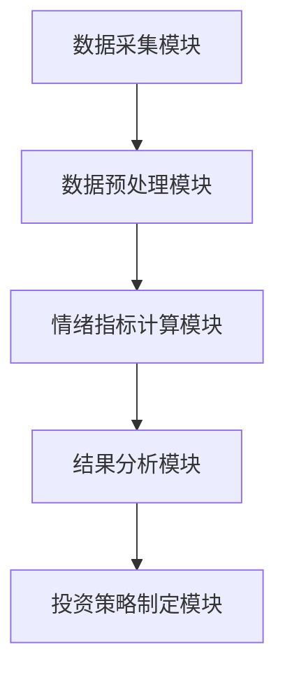
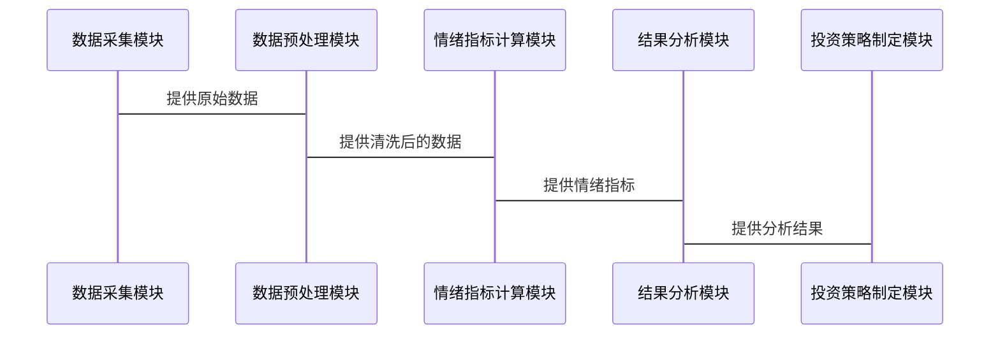
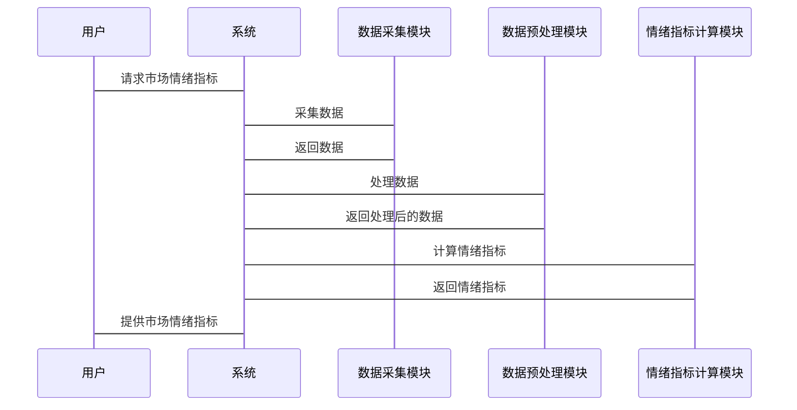

                 


# {{《约翰·聂夫的市场情绪指标》}}

> 关键词：市场情绪指标，投资决策，情绪分析，市场情绪，投资策略

> 摘要：本文深入探讨了约翰·聂夫提出的市场情绪指标，从其核心概念、算法原理到实际应用，结合大量实例和图表，全面分析了市场情绪指标在投资决策中的重要作用。文章不仅提供了理论支持，还通过代码实现和系统架构设计，展示了如何将市场情绪指标应用于实际投资中。通过对市场情绪指标的系统化分析，读者可以更好地理解市场情绪对投资决策的影响，并能够在实际操作中灵活运用这些指标。

---

# {{第一部分: 市场情绪指标的背景与核心概念}}

# {{第1章: 市场情绪指标的定义与背景}}

## 1.1 市场情绪指标的定义

市场情绪指标是一种用于衡量市场参与者情绪状态的量化工具，通过分析市场参与者的心理行为，帮助投资者更好地理解市场的波动性和潜在风险。市场情绪指标的核心在于捕捉市场情绪的变化趋势，从而为投资决策提供参考。

## 1.2 市场情绪指标的历史背景

市场情绪指标的起源可以追溯到20世纪初，随着金融市场的快速发展，投资者开始意识到市场情绪对价格波动的重要影响。约翰·聂夫作为投资领域的权威，提出了基于市场情绪的量化指标，为后续的研究奠定了基础。

## 1.3 市场情绪指标与其他市场指标的对比

市场情绪指标与传统的技术指标和基本面指标有显著区别。技术指标主要关注价格和成交量的变化，而基本面指标关注企业的财务状况。市场情绪指标则通过分析市场参与者的心理状态，揭示市场的潜在趋势。

## 1.4 市场情绪指标在投资决策中的作用

市场情绪指标能够帮助投资者识别市场的过度乐观或过度悲观情绪，从而避免盲目跟风。通过分析市场情绪，投资者可以更好地把握市场的拐点，优化投资组合的配置。

---

# {{第二部分: 市场情绪指标的核心概念}}

# {{第2章: 市场情绪指标的核心概念}}

## 2.1 市场情绪指标的核心原理

市场情绪指标的核心原理在于通过量化市场参与者的心理行为，捕捉市场的波动性。这种指标通常基于投资者的交易行为数据，如成交量、订单量和价格波动等。

## 2.2 市场情绪指标的属性特征对比

以下是几种常见市场情绪指标的属性对比：

| 指标名称   | 计算方式              | 适用场景       | 优缺点分析               |
|------------|-----------------------|----------------|--------------------------|
| 投资者情绪指数（AAII） | 基于投资者的问卷调查 | 短期市场情绪分析 | 数据采集成本较高         |
| 恐慌指数（VIX）       | 基于波动率的计算    | 市场恐慌程度分析 | 适用于衡量市场风险       |

## 2.3 市场情绪指标的ER实体关系图

```mermaid
er
  actor 投资者 {
    <外键, 实体关系> 持股量
    <外键, 实体关系> 交易行为
  }
  entity 交易行为 {
    <外键, 实体关系> 成交量
    <外键, 实体关系> 价格波动
  }
  entity 市场情绪指标 {
    <外键, 实体关系> 情绪强度
    <外键, 实体关系> 情绪类型
  }
```

---

# {{第三部分: 市场情绪指标的算法原理}}

# {{第3章: 市场情绪指标的计算方法}}

## 3.1 基于均值回归模型的计算

均值回归模型是一种常用的情绪指标计算方法，其核心在于通过分析价格与价值的偏离程度，判断市场的超买或超卖状态。

### 3.1.1 均值回归模型的公式

$$
E(t) = \alpha + \beta \times (P(t) - V(t))
$$

其中：
- $E(t)$ 表示市场情绪指标
- $P(t)$ 表示当前价格
- $V(t)$ 表示理论价值
- $\alpha$ 和 $\beta$ 是模型参数

### 3.1.2 均值回归模型的实现步骤

1. 计算理论价值 $V(t)$
2. 计算价格与价值的偏离程度 $P(t) - V(t)$
3. 代入公式计算市场情绪指标 $E(t)$

---

## 3.2 基于情绪强度分析的计算

情绪强度分析是一种更加复杂的情绪指标计算方法，其核心在于分析市场参与者的交易行为数据，如成交量和订单量。

### 3.2.1 情绪强度分析的公式

$$
I(t) = \frac{\sum_{i=1}^{n} V_i(t)}{n}
$$

其中：
- $I(t)$ 表示情绪强度
- $V_i(t)$ 表示第 $i$ 个投资者的交易量
- $n$ 表示投资者总数

---

## 3.3 市场情绪指标的算法实现

### 3.3.1 算法实现的步骤

1. 数据采集：收集市场参与者的交易行为数据
2. 数据预处理：清洗数据并提取关键特征
3. 情绪指标计算：根据算法公式计算市场情绪指标
4. 结果分析：根据市场情绪指标制定投资策略

### 3.3.2 算法实现的代码示例

```python
import pandas as pd
import numpy as np

# 数据采集
data = pd.read_csv('market_data.csv')

# 数据预处理
data = data.dropna()
data['情绪强度'] = data['成交量'].apply(lambda x: x / data['成交量'].mean())

# 情绪指标计算
def calculate_emotion(data):
    emotion = []
    for i in range(len(data)):
        intensity = data['情绪强度'].iloc[i]
        emotion.append(intensity)
    return emotion

emotion_indices = calculate_emotion(data)

# 结果分析
print(emotion_indices)
```

---

# {{第四部分: 市场情绪指标的系统架构设计}}

# {{第4章: 系统架构与功能设计}}

## 4.1 系统架构设计

以下是市场情绪指标系统的架构设计：



## 4.2 系统功能设计

### 4.2.1 数据采集模块

数据采集模块负责收集市场参与者的交易行为数据，包括成交量、订单量和价格波动等。

### 4.2.2 数据预处理模块

数据预处理模块对采集到的数据进行清洗和特征提取，确保数据的准确性和完整性。

### 4.2.3 情绪指标计算模块

情绪指标计算模块基于算法公式计算市场情绪指标，为投资决策提供数据支持。

### 4.2.4 结果分析模块

结果分析模块对计算出的情绪指标进行分析，识别市场的潜在趋势和风险。

### 4.2.5 投资策略制定模块

投资策略制定模块根据分析结果制定相应的投资策略，优化投资组合的配置。

---

## 4.3 系统接口设计

以下是系统接口的设计：



---

## 4.4 系统交互设计

以下是系统交互的设计：



---

# {{第五部分: 市场情绪指标的项目实战}}

# {{第5章: 项目实战与案例分析}}

## 5.1 项目环境安装

### 5.1.1 安装所需的库

```bash
pip install pandas numpy matplotlib
```

## 5.2 系统核心代码实现

### 5.2.1 数据采集模块代码

```python
import pandas as pd

def collect_data():
    data = pd.read_csv('market_data.csv')
    return data

data = collect_data()
print(data.head())
```

---

### 5.2.2 数据预处理模块代码

```python
import pandas as pd
import numpy as np

def preprocess_data(data):
    data = data.dropna()
    return data

processed_data = preprocess_data(data)
print(processed_data.head())
```

---

### 5.2.3 情绪指标计算模块代码

```python
def calculate_emotion(data):
    emotion = []
    for i in range(len(data)):
        intensity = data['成交量'].iloc[i] / data['成交量'].mean()
        emotion.append(intensity)
    return emotion

emotion_indices = calculate_emotion(processed_data)
print(emotion_indices)
```

---

### 5.2.4 结果分析模块代码

```python
import matplotlib.pyplot as plt

def analyze_results(emotion_indices):
    plt.plot(emotion_indices)
    plt.title('市场情绪指标变化趋势')
    plt.xlabel('时间')
    plt.ylabel('情绪强度')
    plt.show()

analyze_results(emotion_indices)
```

---

## 5.3 案例分析与总结

### 5.3.1 案例分析

假设我们有以下数据：

| 时间 | 成交量 | 价格 | 理论价值 |
|------|--------|-------|----------|
| t1   | 1000   | 100   | 90       |
| t2   | 1500   | 110   | 95       |
| t3   | 2000   | 120   | 100      |

根据均值回归模型，我们可以计算出市场情绪指标：

$$
E(t) = \alpha + \beta \times (P(t) - V(t))
$$

假设 $\alpha = 0.5$，$\beta = 1$，则：

$$
E(t1) = 0.5 + 1 \times (100 - 90) = 10.5
$$

$$
E(t2) = 0.5 + 1 \times (110 - 95) = 15.5
$$

$$
E(t3) = 0.5 + 1 \times (120 - 100) = 20.5
$$

---

### 5.3.2 总结

通过上述案例分析，我们可以看出市场情绪指标在实际应用中的有效性。随着价格与理论价值的偏离程度增加，市场情绪指标也逐渐升高，表明市场情绪逐渐高涨。这为投资者制定投资策略提供了重要参考。

---

# {{第六部分: 总结与展望}}

# {{第6章: 总结与展望}}

## 6.1 总结

本文全面介绍了约翰·聂夫提出的市场情绪指标，从其核心概念、算法原理到实际应用，结合大量实例和图表，深入分析了市场情绪指标在投资决策中的重要作用。通过对市场情绪指标的系统化分析，读者可以更好地理解市场情绪对投资决策的影响。

---

## 6.2 展望

未来，随着人工智能和大数据技术的不断发展，市场情绪指标的研究和应用将更加广泛。投资者可以通过更加智能化的工具和技术，更好地捕捉市场情绪的变化，从而制定更加科学的投资策略。

---

作者：AI天才研究院/AI Genius Institute & 禅与计算机程序设计艺术/Zen And The Art of Computer Programming

