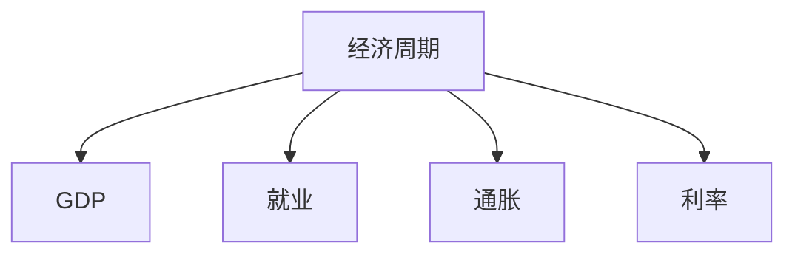
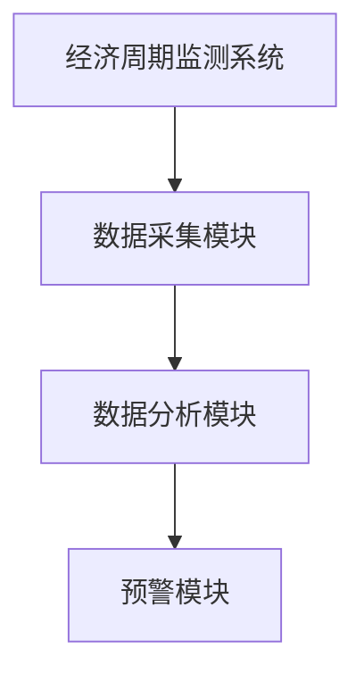
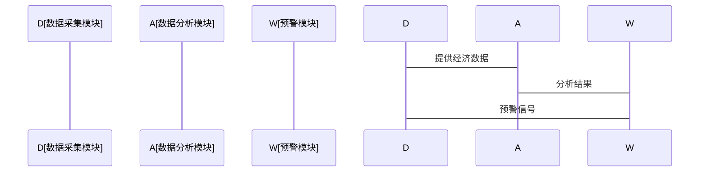

                 


# 约翰邓普顿的全球经济周期研究

## 关键词：全球经济周期，约翰·邓普顿，经济预测，投资策略，经济模型

## 摘要：本文深入分析约翰·邓普顿对全球经济周期的研究，探讨其理论基础、核心概念、驱动因素及预测模型。通过系统架构设计和项目实战，展示如何利用经济周期理论优化投资策略，帮助投资者在复杂经济环境中做出明智决策。

---

# 第一部分: 全球经济周期的基本概念与背景

# 第1章: 全球经济周期的定义与特征

## 1.1 经济周期的基本概念

### 1.1.1 经济周期的定义与内涵

经济周期是指经济活动在长期趋势中呈现的波动现象，通常包括四个阶段：衰退、复苏、过热和滞胀。这些阶段的循环变化反映了经济的周期性波动，是宏观经济分析的核心概念。

### 1.1.2 经济周期的主要特征

经济周期具有波动性、周期性和非线性特征。波动性体现在GDP、就业和通胀等指标的波动；周期性指周期的重复性；非线性则表现在不同阶段的变化速度和幅度不同。

### 1.1.3 经济周期与经济波动的关系

经济周期是经济波动的长期表现，经济波动则是经济周期中的短期波动。理解两者关系有助于更好地预测和应对经济变化。

## 1.2 全球经济周期的阶段划分

### 1.2.1 经济周期的四个阶段

衰退阶段：经济活动下降，失业率上升；复苏阶段：经济开始恢复，就业增加；过热阶段：经济快速增长，通胀上升；滞胀阶段：经济增长停滞，通胀高企。

### 1.2.2 全球经济周期的同步性与差异性

全球经济周期受国际分工、贸易和金融一体化影响，呈现同步性，但各国因经济结构差异，周期表现也不同。

### 1.2.3 经济周期的驱动因素

货币政策、财政政策、市场情绪和技术创新等因素共同驱动经济周期变化。

## 1.3 全球经济周期与经济政策的关系

### 1.3.1 货币政策对经济周期的影响

货币政策通过调整利率和货币供应量影响投资和消费，进而影响经济周期。

### 1.3.2 财政政策对经济周期的影响

财政政策通过政府支出和税收调节经济活动，应对经济波动。

### 1.3.3 经济周期与政府干预的边界

政府干预应在保持经济稳定的同时，避免过度干预，平衡短期波动与长期发展。

## 1.4 本章小结

本章介绍了经济周期的基本概念、阶段划分和驱动因素，分析了经济政策在其中的作用，为后续研究奠定基础。

---

# 第二部分: 全球经济周期的核心概念与驱动因素

# 第2章: 经济周期的核心概念体系

## 2.1 经济周期的核心概念

### 2.1.1 经济周期的核心要素

GDP、就业、通胀、利率是衡量经济周期的关键指标。

### 2.1.2 经济周期的衡量指标

PMI、CPI、失业率等指标用于监测经济周期变化。

### 2.1.3 经济周期的外部环境

国际贸易、地缘政治和科技发展对经济周期有重要影响。

## 2.2 经济周期的核心概念结构

### 2.2.1 经济周期的概念属性对比表格

| 概念 | 属性 | 描述 |
|------|------|------|
| 经济周期 | 时间跨度 | 长期波动 |
|       | 驱动因素 | 政策、市场、技术 |
|       | 主要阶段 | 衰退、复苏、过热、滞胀 |

### 2.2.2 经济周期的ER实体关系图



---

# 第三部分: 全球经济周期预测的算法原理

# 第3章: 经济周期预测的算法原理

## 3.1 经济周期预测的核心算法

### 3.1.1 时间序列分析：ARIMA模型

ARIMA模型适用于分析经济周期的时间序列数据，通过自回归和移动平均部分拟合数据。

### 3.1.2 机器学习模型：随机森林、神经网络

机器学习模型能够捕捉复杂非线性关系，提高预测准确性。

## 3.2 经济周期预测的数学模型

### 3.2.1 时间序列模型的数学公式

$$ ARIMA(p, d, q) = (1 - B)^d (1 - ΦB)^p X_t = (1 - θB)^q Z_t $$

### 3.2.2 机器学习模型的数学基础

$$ y = f(x_1, x_2, ..., x_n) + \epsilon $$

## 3.3 经济周期预测的Python实现

### 3.3.1 数据预处理与特征提取

```python
import pandas as pd
data = pd.read_csv('economic_data.csv')
```

---

# 第四部分: 全球经济周期监测与预警系统

# 第4章: 经济周期监测与预警系统

## 4.1 系统功能设计

### 4.1.1 数据采集模块

从多个来源收集经济指标数据，确保数据的准确性和全面性。

### 4.1.2 数据分析模块

使用统计分析和机器学习模型对数据进行分析，识别经济周期阶段。

### 4.1.3 预警模块

根据分析结果，生成预警信号，提示潜在风险。

## 4.2 系统架构设计

### 4.2.1 系统架构图



### 4.2.2 系统交互流程



---

# 第五部分: 项目实战

# 第5章: 项目实战

## 5.1 项目背景与目标

选择2008年金融危机作为案例，分析其成因和影响，验证模型的有效性。

## 5.2 系统核心实现

### 5.2.1 数据预处理

```python
import pandas as pd
data = pd.read_csv('economic_data.csv')
data = data.dropna()
```

### 5.2.2 模型训练与预测

```python
from sklearn.ensemble import RandomForestRegressor
model = RandomForestRegressor().fit(X_train, y_train)
y_pred = model.predict(X_test)
```

## 5.3 实际案例分析

分析2008年金融危机，识别经济周期变化，验证模型预测能力。

## 5.4 经验总结与优化

总结案例分析的经验，优化模型参数，提高预测准确性。

---

# 第六部分: 最佳实践与小结

# 第6章: 最佳实践与小结

## 6.1 全球经济周期研究的关键点

准确识别经济周期阶段，合理选择预测模型，结合实际经济环境进行分析。

## 6.2 投资策略建议

根据经济周期阶段调整资产配置，衰退期增加防御性资产，过热期减少风险资产。

## 6.3 注意事项

模型的局限性，数据的时效性，经济周期的不可预测性。

## 6.4 拓展阅读

推荐阅读《投资学基础》和《计量经济学》，深入理解经济周期理论。

---

# 作者：AI天才研究院/AI Genius Institute & 禅与计算机程序设计艺术 /Zen And The Art of Computer Programming

---

本文通过系统分析约翰·邓普顿的全球经济周期研究，结合理论与实践，帮助读者理解经济周期的复杂性，并在投资决策中应用相关模型和策略。希望本文能为投资者提供有价值的见解，优化其投资组合，应对全球经济波动。

