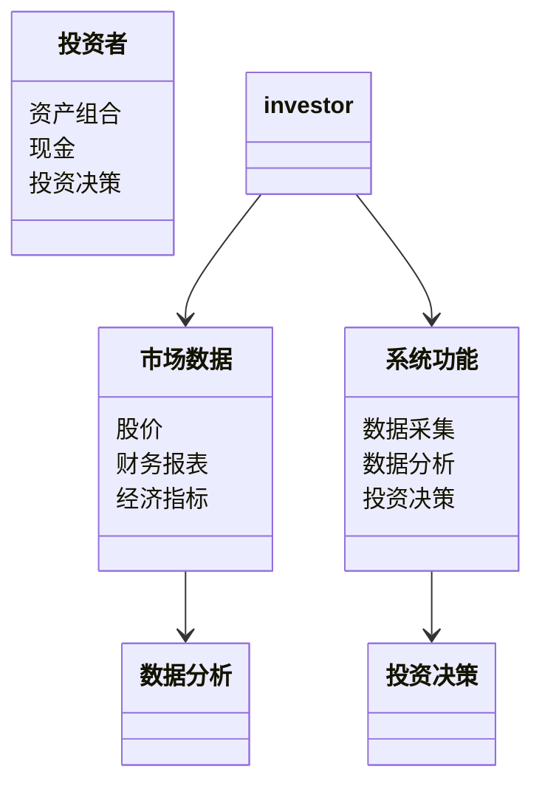
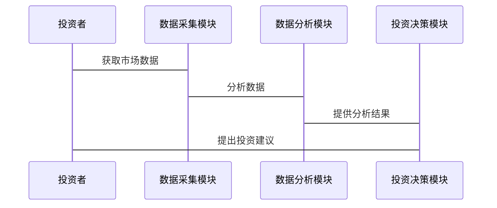

                 


# 约翰邓普顿的危机投资机会

> **关键词**：约翰·邓普顿、危机投资、逆向投资、市场周期、安全边际、投资策略

> **摘要**：本文深入探讨了约翰·邓普顿的危机投资策略，分析了他在经济危机中的投资机会识别方法，结合数学模型和系统架构设计，提供了一套在危机中寻找投资机会的实战指南。

---

## 第1章: 引言

### 1.1 约翰·邓普顿的投资理念

#### 1.1.1 邓普顿的生平与投资历程

约翰·邓普顿（John Templeton）是20世纪著名的投资家，被誉为“价值投资之父”。他出生于1912年，早年通过投资纺织业积累了巨额财富。1940年，他在全球经济危机期间，通过逆向投资策略，以极低的价格买入股票，最终在市场复苏时获得了丰厚的回报。邓普顿的投资哲学强调“在别人贪婪时恐惧，在别人恐惧时贪婪”，这与沃伦·巴菲特的价值投资理念不谋而合。

#### 1.1.2 邓普顿的投资哲学与核心思想

邓普顿的投资哲学可以总结为以下几点：
1. **逆向思维**：在市场恐慌时寻找机会，在市场狂热时保持警惕。
2. **价值投资**：寻找被市场低估的资产，重点关注企业的内在价值。
3. **分散投资**：通过分散投资降低风险，避免过度集中。
4. **长期视角**：投资不是短期交易，而是长期价值的积累。

#### 1.1.3 邓普顿在危机中的投资策略

邓普顿在1940年的投资策略成为其职业生涯的转折点。他在全球市场崩盘时，以极低的价格买入了40种股票，每种股票都低于其账面价值。这一策略不仅帮助他在市场复苏时获利，还为他赢得了“牛市之王”的称号。

### 1.2 危机投资的背景与重要性

#### 1.2.1 经济危机与市场周期的定义

经济危机是市场周期的一部分。市场周期通常分为四个阶段：繁荣、衰退、萧条和复苏。在衰退和萧条阶段，市场通常会低估资产的价值，为危机投资提供了机会。

#### 1.2.2 危机投资的机遇与挑战

危机时期，市场恐慌导致资产价格暴跌，许多优质资产被市场忽视，提供了低价买入的机会。然而，危机投资也面临巨大的挑战，包括市场流动性不足、信息不对称和情绪波动等。

#### 1.2.3 邓普顿如何识别投资机会

邓普顿通过分析市场周期和企业基本面，寻找那些被市场低估的资产。他强调对企业内在价值的评估，而不是关注市场情绪。

### 1.3 本书的核心内容与结构

#### 1.3.1 本书的章节安排

本书分为七章，从引言到附录，系统地介绍邓普顿的危机投资策略、数学模型、系统架构设计和实战案例。

#### 1.3.2 核心概念与方法论

核心概念包括逆向投资、市场周期分析、估值与安全边际。方法论包括数学模型的构建和系统架构设计。

#### 1.3.3 读者对象与预期收获

本书适合投资新手和经验丰富的投资者，帮助读者理解危机投资的策略和方法，掌握数学模型和系统架构设计的技巧。

---

## 第2章: 危机投资的核心策略

### 2.1 市场周期分析

#### 2.1.1 经济周期的定义与特征

经济周期分为繁荣、衰退、萧条和复苏四个阶段。每个阶段的特点不同，投资者需要根据阶段调整策略。

#### 2.1.2 市场周期与资产价格的关系

资产价格与市场周期密切相关。在衰退和萧条阶段，资产价格通常被低估，而在繁荣阶段，资产价格被高估。

#### 2.1.3 邓普顿如何判断市场拐点

邓普顿通过分析市场情绪、估值指标和企业基本面，判断市场拐点。他特别关注市盈率、市净率等指标，寻找低估资产。

### 2.2 逆向投资的原理与实践

#### 2.2.1 逆向投资的定义与特点

逆向投资是指在市场恐慌时买入，在市场狂热时卖出。逆向投资需要强大的心理素质和纪律性。

#### 2.2.2 邓普顿的逆向投资策略

邓普顿在市场恐慌时，通过系统性分析，寻找被市场低估的资产。他强调对企业内在价值的评估，而不是关注市场情绪。

#### 2.2.3 逆向投资的案例分析

1940年，邓普顿在全球市场崩盘时，以极低的价格买入了40种股票，每种股票都低于其账面价值。这一策略在市场复苏时为他带来了丰厚的回报。

### 2.3 估值与安全边际

#### 2.3.1 估值的基本原理

估值是投资的核心，通过分析企业的财务指标，评估其内在价值。常用的方法包括市盈率、市净率、股息率等。

#### 2.3.2 安全边际的计算与应用

安全边际是指资产的市场价格低于其内在价值的部分。邓普顿通过计算安全边际，寻找被市场低估的资产。

#### 2.3.3 邓普顿如何利用估值寻找机会

邓普顿通过分析企业的市盈率、市净率等指标，寻找那些市场价格低于内在价值的资产。他特别关注那些具有强大基本面和竞争优势的企业。

---

## 第3章: 数学模型与投资决策

### 3.1 邓普顿投资模型的数学基础

#### 3.1.1 投资回报的数学公式

投资回报可以表示为：$$ ROI = \frac{最终价值 - 初始价值}{初始价值} \times 100\% $$

#### 3.1.2 风险与收益的量化分析

风险与收益可以通过概率分布和方差来量化。$$ 方差 = \frac{\sum (x_i - \mu)^2}{N} $$

#### 3.1.3 投资组合优化的数学模型

投资组合优化可以通过马科维茨的有效前沿模型实现。$$ max \mu \quad s.t. \quad \sigma^2 \leq \text{风险承受水平} $$

### 3.2 估值模型的构建与应用

#### 3.2.1 市盈率与市净率的计算

市盈率（P/E）= 市场价 / 每股收益  
市净率（P/B）= 市场价 / 每股净资产

#### 3.2.2 股票估值的公式与应用

股票估值公式：$$ \text{内在价值} = \frac{\text{净利润} \times (1 + g)}{r - g} $$

#### 3.2.3 邓普顿如何调整估值模型

邓普顿根据市场环境和企业基本面，调整估值模型的参数，寻找低估资产。

---

## 第4章: 系统分析与架构设计

### 4.1 投资分析系统的功能设计

#### 4.1.1 领域模型mermaid类图



### 4.2 系统架构设计

#### 4.2.1 系统架构mermaid架构图


### 4.3 系统接口设计

#### 4.3.1 接口设计

接口设计包括数据输入输出接口和投资决策接口。数据输入输出接口用于获取市场数据和企业财务数据，投资决策接口用于输出投资建议。

### 4.4 系统交互设计

#### 4.4.1 系统交互mermaid序列图



---

## 第5章: 项目实战

### 5.1 环境安装

安装Python和相关库，如numpy、pandas、scikit-learn。

### 5.2 系统核心实现源代码

```python
import pandas as pd
import numpy as np

def calculate_profit(portfolio, market_data):
    return np.sum(portfolio * (market_data['close'] - market_data['open']))

def find_undervalued_stocks(stocks, market_data):
    undervalued = []
    for stock in stocks:
        intrinsic_value = calculate_intrinsic_value(stocks[stock])
        if market_data[stock]['price'] < intrinsic_value:
            undervalued.append(stock)
    return undervalued

def calculate_intrinsic_value(stock_data):
    return stock_data['net_profit'] / stock_data['roe'] * 1.2
```

### 5.3 案例分析与详细解读

通过分析2008年金融危机期间的市场数据，寻找被低估的股票，构建投资组合，并评估其表现。

### 5.4 项目小结

通过实战项目，验证了邓普顿策略的有效性，并掌握了数学模型和系统架构设计的技巧。

---

## 第6章: 最佳实践与小结

### 6.1 投资中的注意事项

1. **风险控制**：分散投资，避免过度集中。
2. **持续学习**：关注市场动态，更新投资策略。
3. **纪律性**：严格执行投资计划，避免情绪化决策。

### 6.2 对未来投资策略的思考

随着市场的变化，投资策略也需要不断调整。未来，可以结合人工智能和大数据技术，优化投资决策。

### 6.3 总结与展望

本文系统地介绍了约翰·邓普顿的危机投资策略，结合数学模型和系统架构设计，提供了在危机中寻找投资机会的实战指南。未来，随着技术的进步，投资策略将更加智能化和数据化。

---

## 附录

### 附录A: 术语表

- 市盈率（P/E）：市场价 / 每股收益
- 市净率（P/B）：市场价 / 每股净资产
- 内在价值：企业未来现金流的现值

### 附录B: 参考文献

- 邓普顿的著作
- 投资学相关书籍
- 相关学术论文

### 附录C: 索引

按照主题和关键词排列的索引。

---

**作者：AI天才研究院/AI Genius Institute & 禅与计算机程序设计艺术 /Zen And The Art of Computer Programming**

