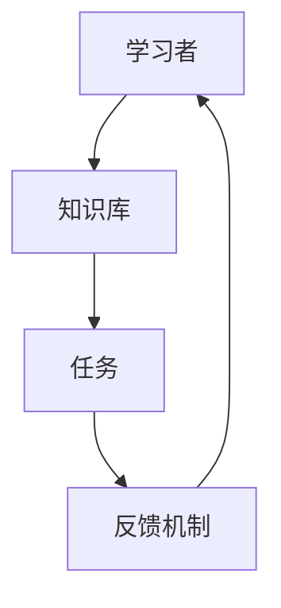
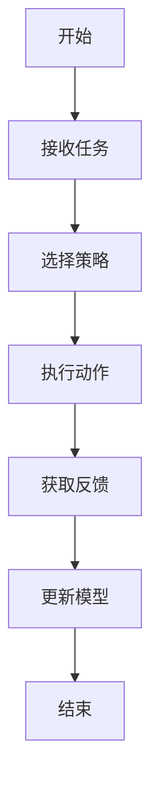
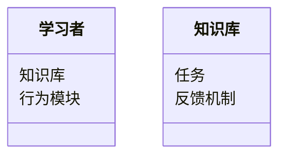
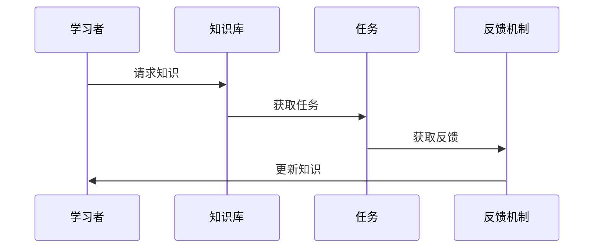

                 


# 终身学习：构建能持续进化的AI Agent

> 关键词：终身学习、AI Agent、机器学习、持续进化、智能系统

> 摘要：本文将探讨如何构建一个能够持续进化的AI Agent，重点分析终身学习的核心概念、算法原理、系统架构设计以及实际应用案例。通过详细阐述理论基础和实践方法，帮助读者理解如何让AI Agent在不断变化的环境中自我优化和适应。

---

# 第1章: 终身学习与AI Agent概述

## 1.1 问题背景

### 1.1.1 人工智能的现状与挑战
人工智能（AI）技术近年来取得了显著进展，但现有的AI系统大多依赖于静态训练数据，无法有效应对动态变化的环境。这种局限性使得AI系统在实际应用中面临诸多挑战，例如数据过时、模型固定以及难以适应新任务等问题。

### 1.1.2 终身学习的必要性
终身学习（Lifelong Learning）是一种机器学习范式，旨在让模型能够持续从经验中学习，并在新任务中保持良好的表现。对于AI Agent而言，终身学习是实现持续进化的核心能力，能够帮助其在复杂多变的环境中不断优化自身行为。

### 1.1.3 AI Agent的核心问题
AI Agent是一种能够感知环境、自主决策并执行任务的智能实体。其核心问题在于如何在动态环境中实现知识的持续更新和行为的自主优化。终身学习为AI Agent提供了理论和技术支持，使其能够不断适应新环境和新任务。

## 1.2 问题描述

### 1.2.1 终身学习的定义
终身学习是指机器学习模型在没有监督的情况下，能够在连续的任务中逐步学习并提升性能。与传统的批量学习不同，终身学习强调知识的持续积累和更新。

### 1.2.2 AI Agent的定义与特点
AI Agent是一种具有感知、决策和执行能力的智能系统。其特点是能够与环境交互、自主学习并优化自身行为。AI Agent的核心能力包括感知能力、推理能力、学习能力和执行能力。

### 1.2.3 问题的边界与外延
终身学习的边界在于如何在不忘记旧知识的前提下，快速学习新知识。AI Agent的外延则包括从简单任务到复杂任务的广泛应用场景。

## 1.3 问题解决

### 1.3.1 终身学习的解决方案
通过设计高效的算法，使AI Agent能够在线学习并更新知识。关键在于如何平衡新旧任务之间的关系，避免遗忘旧知识。

### 1.3.2 AI Agent的构建方法
构建AI Agent需要结合感知、决策和学习模块，设计高效的算法来实现自主学习和优化。

### 1.3.3 技术路线与实现路径
技术路线包括感知模块、学习模块和决策模块的设计与实现。实现路径涉及算法设计、系统集成和性能优化。

## 1.4 概念结构与核心要素

### 1.4.1 终身学习的核心要素
终身学习的核心要素包括学习策略、记忆机制和评估机制。

### 1.4.2 AI Agent的组成结构
AI Agent的组成结构包括感知模块、推理模块、学习模块和执行模块。

### 1.4.3 核心概念之间的关系
终身学习与AI Agent的关系是相互依存的，终身学习为AI Agent提供持续进化的能力，而AI Agent为终身学习提供应用场景和反馈机制。

## 1.5 本章小结
本章从问题背景、问题描述和问题解决三个方面，详细阐述了终身学习与AI Agent的核心概念和基本原理。

---

# 第2章: AI Agent的核心概念

## 2.1 核心概念原理

### 2.1.1 终身学习的数学模型
终身学习的数学模型包括经验重放、参数共享和任务归纳等方法。

### 2.1.2 AI Agent的算法原理
AI Agent的算法原理包括强化学习、监督学习和无监督学习。

### 2.1.3 知识表示与更新机制
知识表示与更新机制包括符号表示、分布表示和神经网络表示。

## 2.2 核心概念属性对比

### 2.2.1 终身学习与传统学习的对比
| 对比维度 | 终身学习 | 传统学习 |
|----------|----------|----------|
| 数据使用 | 在线学习 | 批量学习 |
| 知识更新 | 动态更新 | 静态 |

### 2.2.2 AI Agent与传统AI的区别
| 对比维度 | AI Agent | 传统AI |
|----------|----------|---------|
| 自主性   | 高       | 低      |
| 适应性   | 强       | 弱      |

### 2.2.3 不同学习策略的优缺点
| 学习策略 | 优点       | 缺点       |
|----------|------------|------------|
| 强化学习 | 高效性     | 收敛慢     |
| 监督学习 | 稳定性     | 依赖标注数据 |

## 2.3 ER实体关系图


## 2.4 本章小结
本章通过核心概念原理、属性对比和ER实体关系图，详细分析了终身学习与AI Agent的核心要素及其相互关系。

---

# 第3章: 终身学习算法原理

## 3.1 算法原理

### 3.1.1 强化学习的基本原理
强化学习通过智能体与环境的交互，学习最优策略。其核心是通过奖惩机制，使智能体不断优化自身行为。

### 3.1.2 监督学习的应用
监督学习通过标记数据进行训练，适用于分类和回归任务。在终身学习中，监督学习可以用于任务归纳。

### 3.1.3 迁移学习的实现
迁移学习通过将已学知识迁移到新任务中，减少新任务的学习成本。在终身学习中，迁移学习是实现知识复用的关键。

## 3.2 算法流程图


## 3.3 算法实现代码

### 3.3.1 强化学习代码示例
```python
import numpy as np

class Agent:
    def __init__(self, state_space, action_space):
        self.state_space = state_space
        self.action_space = action_space
        self.q_table = np.zeros((state_space, action_space))
    
    def choose_action(self, state):
        return np.argmax(self.q_table[state])
    
    def learn(self, state, action, reward):
        self.q_table[state][action] += reward

# 示例应用
agent = Agent(5, 2)
agent.learn(0, 1, 1)
```

### 3.3.2 监督学习代码示例
```python
from sklearn.linear_model import LinearRegression

model = LinearRegression()
X = [[1], [2], [3]]
y = [2, 4, 6]
model.fit(X, y)
print(model.predict([[4]]))  # 输出 [8]
```

### 3.3.3 迁移学习代码示例
```python
from sklearn.svm import SVC

# 训练旧任务模型
model_old = SVC().fit(X_old, y_old)

# 迁移到新任务
model_new = SVC().fit(X_new, y_new)
```

## 3.4 算法数学模型

### 3.4.1 强化学习的数学模型
$$ Q(s, a) = Q(s, a) + \alpha (r + \max Q(s', a') - Q(s, a)) $$

### 3.4.2 监督学习的数学模型
$$ y = \theta^T x $$

### 3.4.3 迁移学习的数学模型
$$ f_{\text{target}}(x) = f_{\text{source}}(x) + \Delta f $$

## 3.5 本章小结
本章详细介绍了终身学习的算法原理，包括强化学习、监督学习和迁移学习的实现方法及其数学模型。

---

# 第4章: 系统分析与架构设计方案

## 4.1 问题场景介绍

### 4.1.1 应用场景描述
本文将构建一个能够持续进化AI Agent的系统，应用于智能客服、自动驾驶和智能家居等领域。

### 4.1.2 系统目标
系统的总体目标是实现AI Agent的终身学习能力，使其能够在复杂环境中自主优化行为。

## 4.2 系统功能设计

### 4.2.1 领域模型


### 4.2.2 系统架构


### 4.2.3 系统接口设计
系统接口包括感知接口、学习接口和执行接口。

### 4.2.4 系统交互


## 4.3 本章小结
本章从问题场景出发，详细设计了系统的功能模块、架构和交互流程。

---

# 第5章: 项目实战

## 5.1 环境安装

### 5.1.1 Python环境
安装Python 3.8及以上版本。

### 5.1.2 库的安装
安装必要的库：
```bash
pip install numpy scikit-learn matplotlib
```

## 5.2 核心代码实现

### 5.2.1 终身学习实现
```python
import numpy as np
from sklearn.linear_model import LinearRegression

class LifelongLearner:
    def __init__(self):
        self.models = []
    
    def add_task(self, X, y):
        model = LinearRegression().fit(X, y)
        self.models.append(model)
    
    def predict(self, X):
        return np.mean([model.predict(X) for model in self.models], axis=0)
```

### 5.2.2 AI Agent实现
```python
class AIAgent:
    def __init__(self):
        self.knowledge_base = {}
    
    def perceive(self, environment):
        self.knowledge_base.update(environment)
    
    def decide(self, task):
        return self.knowledge_base.get(task, None)
    
    def learn(self, feedback):
        pass  # 根据反馈更新知识库
```

## 5.3 代码解读与分析

### 5.3.1 终身学习代码解读
上述代码实现了一个简单的终身学习系统，通过线性回归模型处理多个任务，并通过平均预测值来实现任务间的知识复用。

### 5.3.2 AI Agent代码解读
上述代码实现了AI Agent的基本功能，包括感知、决策和学习模块。

## 5.4 实际案例分析

### 5.4.1 案例背景
假设我们正在开发一个智能客服系统，需要处理多种客户咨询任务。

### 5.4.2 实施步骤
1. 收集不同任务的数据。
2. 使用LifelongLearner进行训练。
3. 部署AIAgent进行实时咨询。

## 5.5 本章小结
本章通过具体实现和案例分析，展示了如何将终身学习与AI Agent结合起来，实现持续进化的智能系统。

---

# 第6章: 最佳实践与总结

## 6.1 最佳实践

### 6.1.1 技术路线选择
建议选择强化学习作为核心算法。

### 6.1.2 系统设计建议
模块化设计是实现高效系统的关键。

### 6.1.3 开发注意事项
注重系统的可扩展性和可维护性。

## 6.2 小结

### 6.2.1 核心知识点回顾
本文的核心知识点包括终身学习、AI Agent、算法原理和系统架构设计。

### 6.2.2 重要注意事项
在实际应用中，要注意模型的泛化能力和鲁棒性。

## 6.3 展望与未来方向

### 6.3.1 未来发展方向
未来的研究方向包括更高效的终身学习算法和更智能的系统架构。

### 6.3.2 挑战与机遇
终身学习与AI Agent的结合将为人工智能领域带来更多的挑战与机遇。

## 6.4 本章小结
本文总结了终身学习与AI Agent的核心内容，并提出了实际应用中的注意事项和未来发展方向。

---

# 作者：AI天才研究院/AI Genius Institute & 禅与计算机程序设计艺术 /Zen And The Art of Computer Programming

---

以上是《终身学习：构建能持续进化的AI Agent》的技术博客文章的完整大纲和内容框架。通过以上思考过程，我们可以系统地构建一篇结构清晰、内容详实的技术博客文章，帮助读者深入理解如何构建能够持续进化的AI Agent。

