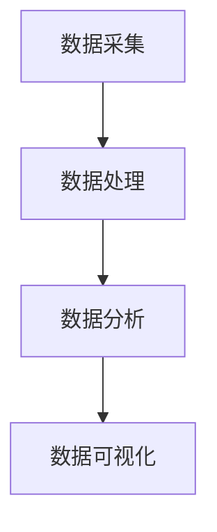
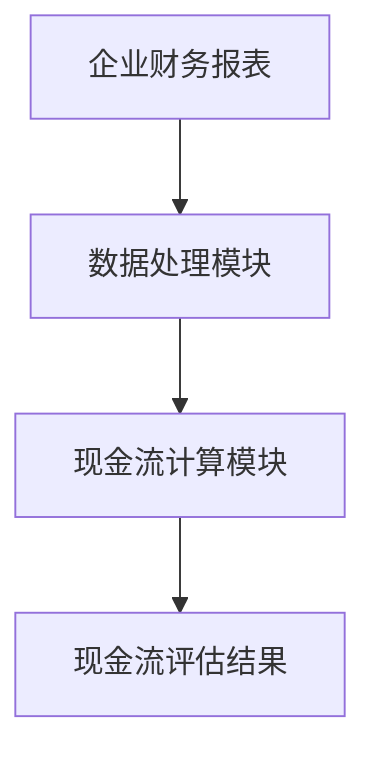

                 


# 经营现金流对特价股票选择的影响

> 关键词：现金流分析，股票选择，财务指标，数据分析，投资策略

> 摘要：本文探讨经营现金流对特价股票选择的影响，从现金流的基本概念、分析方法到实际应用，系统介绍如何通过现金流分析评估企业财务状况，选择优质特价股票，实现稳健投资。

---

## 第1章 现金流的基本概念与重要性

### 1.1 现金流的定义与特点

现金流是企业在一定时期内，由于经营活动、投资活动和筹资活动而产生的现金流入和流出。现金流分为经营活动现金流、投资活动现金流和筹资活动现金流，其中经营活动现金流是企业核心业务产生的现金流，直接反映企业造血能力。

### 1.2 现金流在股票选择中的作用

现金流是评估企业财务健康状况的重要指标。健康的现金流意味着企业能够维持日常运营、偿还债务、进行投资，从而为股东创造价值。在选择特价股票时，现金流充裕的企业更能抵御市场波动，具备更大的增值潜力。

### 1.3 现金流与股票价值的关系

现金流充裕的企业通常具有较高的市场价值，因为它们能够持续创造价值，吸引投资者。自由现金流（FCFF）是衡量企业创造现金流能力的关键指标，高自由现金流意味着企业具备扩张和分红的能力，从而提升股票价值。

---

## 第2章 现金流分析的理论基础

### 2.1 现金流分析的框架

现金流分析框架包括数据采集、处理、分析和可视化四个步骤。数据采集涉及获取企业的财务报表和市场数据，处理阶段需要清洗和转换数据，分析阶段使用统计方法和模型评估现金流质量，可视化阶段通过图表展示分析结果。

### 2.2 现金流分析的核心指标

1. **自由现金流（FCFF）**：企业经营活动产生的现金流减去资本支出，衡量企业创造现金流的能力。
   $$ FCFF = \text{经营现金流} - \text{资本支出} $$

2. **现金流质量**：衡量企业现金流与净利润的匹配程度，高质量现金流意味着企业盈利能力强，现金转化效率高。
   $$ \text{现金流质量} = \frac{\text{经营现金流}}{\text{净利润}} $$

3. **现金流比率**：包括流动比率、速动比率等，评估企业短期偿债能力。

### 2.3 现金流分析的误区与注意事项

现金流分析的常见误区包括过度依赖历史数据、忽略行业特性、忽视宏观经济影响等。投资者需综合考虑企业所处行业、发展阶段和外部环境，避免单一维度的分析。

---

## 第3章 现金流分析的系统架构

### 3.1 系统模块设计

现金流分析系统分为数据采集、处理、分析和可视化四个模块。数据采集模块负责获取企业财务数据和市场数据，处理模块对数据进行清洗和转换，分析模块应用统计方法和模型进行评估，可视化模块将结果以图表形式展示。

### 3.2 系统架构图



### 3.3 数据流图



---

## 第4章 现金流分析的算法实现

### 4.1 数据预处理

对获取的财务数据进行清洗，处理缺失值和异常值，确保数据的准确性和完整性。

### 4.2 特征提取

从财务报表中提取现金流相关特征，如经营现金流、资本支出、自由现金流等。

### 4.3 模型训练

使用回归模型预测现金流变化，评估企业现金流的可持续性和稳定性。以下是线性回归模型的数学公式：

$$ y = \beta_0 + \beta_1 x_1 + \beta_2 x_2 + \epsilon $$

其中，$y$ 是目标变量（现金流），$x_1, x_2$ 是自变量（如收入、成本），$\beta$ 是回归系数，$\epsilon$ 是误差项。

### 4.4 结果分析

通过模型预测结果，评估企业现金流的健康状况，判断是否适合投资。

---

## 第5章 实战案例：现金流分析在特价股票选择中的应用

### 5.1 数据来源

选取某行业内的几家企业，收集过去5年的财务报表数据，重点关注经营现金流和自由现金流。

### 5.2 特征工程

构建现金流相关的特征，如经营现金流、资本支出、现金流质量等。

### 5.3 模型实现

使用Python代码实现现金流预测模型，以下是代码示例：

```python
import pandas as pd
import numpy as np
from sklearn.linear_model import LinearRegression

# 数据加载
data = pd.read_csv('financial_data.csv')

# 特征提取
X = data[['收入', '成本']]
y = data['经营现金流']

# 模型训练
model = LinearRegression()
model.fit(X, y)

# 预测结果
y_pred = model.predict(X)
print("预测现金流:", y_pred)
```

### 5.4 结果解读

通过模型预测结果，评估企业的现金流健康状况，选择现金流充裕且具备增长潜力的企业作为投资标的。

---

## 第6章 总结与展望

### 6.1 本章总结

本文系统地介绍了现金流分析的核心概念、理论基础、系统架构和算法实现，并通过实战案例展示了如何利用现金流分析选择特价股票。现金流是评估企业财务健康状况的重要指标，直接影响股票的价值和投资决策。

### 6.2 应用中的注意事项

投资者在实际应用中需注意以下几点：
1. **行业特性**：不同行业的现金流特点不同，需结合行业背景进行分析。
2. **宏观经济影响**：宏观经济环境会影响企业现金流，需关注外部因素。
3. **数据质量**：数据的准确性和完整性直接影响分析结果。

### 6.3 未来研究方向

未来可以进一步研究以下方向：
1. **多模型结合**：结合机器学习和传统统计方法，提高现金流预测的准确性。
2. **实时分析**：开发实时现金流监控系统，及时捕捉市场变化。
3. **多维度分析**：结合其他财务指标和非财务因素，全面评估企业价值。

---

## 作者

作者：AI天才研究院/AI Genius Institute & 禅与计算机程序设计艺术 /Zen And The Art of Computer Programming

---

这篇文章系统地介绍了现金流分析的核心概念、理论基础、系统架构和算法实现，并通过实战案例展示了如何利用现金流分析选择特价股票。通过本文，读者可以全面理解现金流对股票选择的影响，并掌握实际应用的方法。

