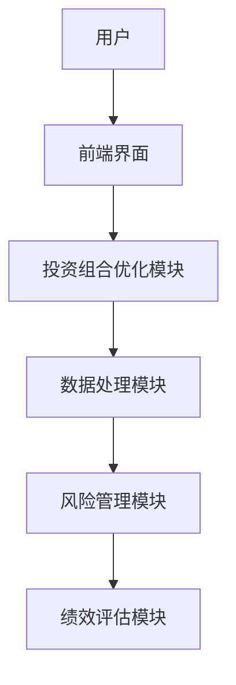

                 


# 综合四大师智慧：构建现代投资组合

---

## 关键词：投资组合，投资学，现代投资组合理论，巴菲特，彼得·林奇，格雷厄姆，费雪，风险管理

---

## 摘要：  
本文通过综合投资学四位大师（巴菲特、彼得·林奇、格雷厄姆、费雪）的智慧，结合现代投资组合理论，系统地讲解如何构建一个科学、稳健且具备长期收益的投资组合。文章从投资组合的核心概念、数学模型、优化算法、系统架构到实际项目实现，层层深入，为读者提供从理论到实践的完整指南。

---

# 第一部分: 综合理财投资与投资组合概述

## 第1章: 投资学四大师智慧概述

### 1.1 投资学四大师及其智慧

#### 1.1.1 巴菲特的价值投资理念
- **核心思想**：买入优秀的公司，以合理的价格买入，长期持有。
- **特点**：注重企业的基本面分析，寻找具有持续竞争优势和良好管理团队的企业。
- **投资策略**：长期持有，避免频繁交易，追求企业价值的长期增长。

#### 1.1.2 彼得·林奇的选股策略
- **核心思想**：寻找基本面良好、管理优秀、财务健康的企业。
- **特点**：注重企业的成长性和估值的合理性，强调深入研究和长期跟踪。
- **投资策略**：分散投资，避免过度集中，注重风险控制。

#### 1.1.3 格雷厄姆的安全边际理论
- **核心思想**：以低于内在价值的价格买入优质资产，确保投资的安全性。
- **特点**：注重资产的安全性，强调安全边际的重要性，避免过度冒险。
- **投资策略**：价值投资，寻找市场价格低于内在价值的资产。

#### 1.1.4 费雪的长期投资思维
- **核心思想**：长期投资优质企业，注重企业的成长性和管理团队的优秀性。
- **特点**：强调长期持有，避免短期波动的影响，注重企业的长期价值。
- **投资策略**：分散投资，注重资产的多样化配置，降低风险。

### 1.2 现代投资组合理论的背景
- **起源与发展**：现代投资组合理论（MPT）由哈里·马科维茨在1952年提出，奠定了投资组合理论的基础。
- **应用**：广泛应用于资产配置、风险管理和投资组合优化等领域。
- **核心思想**：通过分散投资降低风险，追求风险调整后的最大收益。

### 1.3 投资组合的基本概念与分类
- **定义与特征**：投资组合是将资金分配到不同资产或资产类别中，以实现收益和风险的平衡。
- **分类**：
  - 根据风险偏好：保守型、平衡型、激进型。
  - 根据资产类别：股票型、债券型、混合型。
  - 根据投资策略：主动型、被动型。

---

## 第2章: 投资组合理论的数学模型与公式

### 2.1 投资组合的期望收益与方差计算
- **期望收益**：投资组合的期望收益是各资产期望收益的加权平均。
  $$ E(r_p) = \sum_{i=1}^n w_i E(r_i) $$
  其中，\( w_i \) 是资产 \( i \) 的权重，\( E(r_i) \) 是资产 \( i \) 的期望收益。

- **方差**：投资组合的方差衡量收益的波动性。
  $$ \text{Var}(r_p) = \sum_{i=1}^n \sum_{j=1}^n w_i w_j \sigma_i \sigma_j \rho_{ij} $$
  其中，\( \sigma_i \) 和 \( \sigma_j \) 是资产 \( i \) 和 \( j \) 的标准差，\( \rho_{ij} \) 是它们的相关系数。

### 2.2 现代投资组合优化的数学模型
- **均值-方差优化模型**：
  目标函数：
  $$ \min \text{Var}(r_p) $$
  约束条件：
  $$ \sum_{i=1}^n w_i = 1 $$
  $$ w_i \geq 0 \quad \forall i $$

- **有效前沿**：在给定风险水平下，提供最大收益的投资组合形成的曲线。
  $$ E(r_p) = \max \quad \text{在给定风险下的收益} $$

### 2.3 投资组合优化算法
- **步骤与流程**：
  1. 确定投资目标和约束条件。
  2. 收集各资产的历史收益和风险数据。
  3. 建立优化模型，选择优化算法。
  4. 解决优化问题，得到最优权重。
  5. 验证和调整投资组合。

---

## 第3章: 投资组合优化的算法实现

### 3.1 现代投资组合优化算法概述
- **均值-方差优化算法**：通过最小化方差来优化投资组合。
- **风险中性化优化算法**：在给定风险下，最大化收益。
- **最小方差优化算法**：在给定收益下，最小化风险。

### 3.2 投资组合优化算法

#### 3.2.1 均值-方差优化算法
```python
import numpy as np
from scipy.optimize import minimize

def portfolio_optimization(returns, cov_matrix, target_return):
    n = len(cov_matrix)
    # 定义目标函数
    def objective(w):
        return np.dot(w.T, np.dot(cov_matrix, w))
    # 约束条件
    constraints = [
        {'type': 'eq', 'fun': lambda w: np.sum(w) - 1.0},
        {'type': 'eq', 'fun': lambda w: np.dot(w.T, returns) - target_return}
    ]
    # 解决优化问题
    result = minimize(objective, np.ones(n)/n, method='SLSQP', 
                      bounds=({'type': 'ineq', 'fun': lambda w: w - 0}), 
                      constraints=constraints)
    return result.x
```

#### 3.2.2 有效前沿计算
```python
# 示例数据
n = 5
returns = np.random.randn(n) * 0.1 + 0.05
cov_matrix = np.random.randn(n, n) * 0.1 + np.eye(n) * 0.05

frontier = []
for target_return in np.linspace(0.05, 0.15, 100):
    w = portfolio_optimization(returns, cov_matrix, target_return)
    frontier.append((np.dot(w.T, returns), np.dot(w.T, np.dot(cov_matrix, w))))

plt.plot(frontier[0], frontier[1])
```

---

## 第4章: 系统分析与架构设计

### 4.1 项目介绍
- **目标**：构建一个投资组合管理系统，实现投资组合优化和风险管理。
- **功能模块**：
  - 数据采集与处理
  - 投资组合优化
  - 风险管理与监控
  - 投资组合绩效评估

### 4.2 系统架构设计


---

## 第5章: 项目实战

### 5.1 环境配置
- **工具**：Python、NumPy、Pandas、Scipy、Matplotlib
- **数据源**：股票价格数据、经济指标数据

### 5.2 投资组合实现
```python
# 环境配置
import numpy as np
import pandas as pd
from scipy.optimize import minimize

# 示例数据
returns = pd.read_csv('returns.csv').values

# 优化函数
def optimize_portfolio(weights, returns):
    # 计算方差
    variance = np.dot(weights.T, np.dot(returns.cov(), weights))
    return variance

# 约束条件
constraints = [
    {'type': 'eq', 'fun': lambda w: np.sum(w) - 1},
    {'type': 'eq', 'fun': lambda w: np.dot(w.T, returns.mean(axis=0)) - 0.1}
]

# 解决优化问题
result = minimize(optimize_portfolio, np.ones(len(weights))/len(weights), method='SLSQP',
                 constraints=constraints, bounds=({'type': 'ineq', 'fun': lambda w: w - 0}))
```

---

## 第6章: 总结与未来展望

### 6.1 最佳实践 tips
- **分散投资**：避免过度集中，降低风险。
- **长期投资**：注重企业的长期价值，避免短期波动。
- **风险管理**：定期评估和调整投资组合，确保安全。

### 6.2 小结
通过综合四位投资大师的智慧，结合现代投资组合理论和优化算法，我们可以构建一个科学、稳健的投资组合，实现长期稳定的收益。

### 6.3 注意事项
- 定期评估投资组合的表现，根据市场变化进行调整。
- 保持对市场的敏感性，及时捕捉投资机会和风险。

### 6.4 拓展阅读
- 《投资学》——约翰·C·汉森
- 《证券分析》——本杰明·格雷厄姆
- 《彼得·林奇的成功投资法则》——彼得·林奇

---

## 作者：AI天才研究院 & 禅与计算机程序设计艺术

---

希望这篇文章能够为您提供清晰的思路和实践指导，帮助您构建一个科学、稳健的投资组合。

