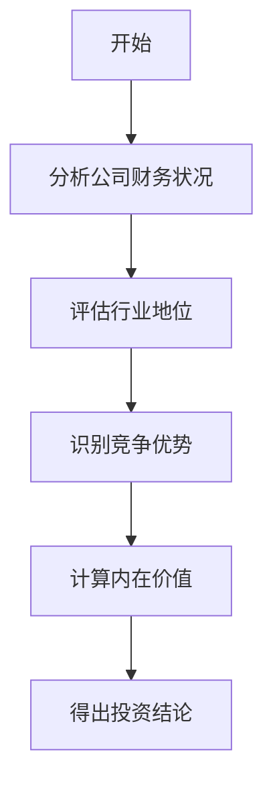
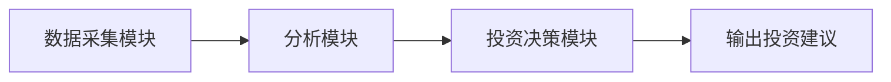
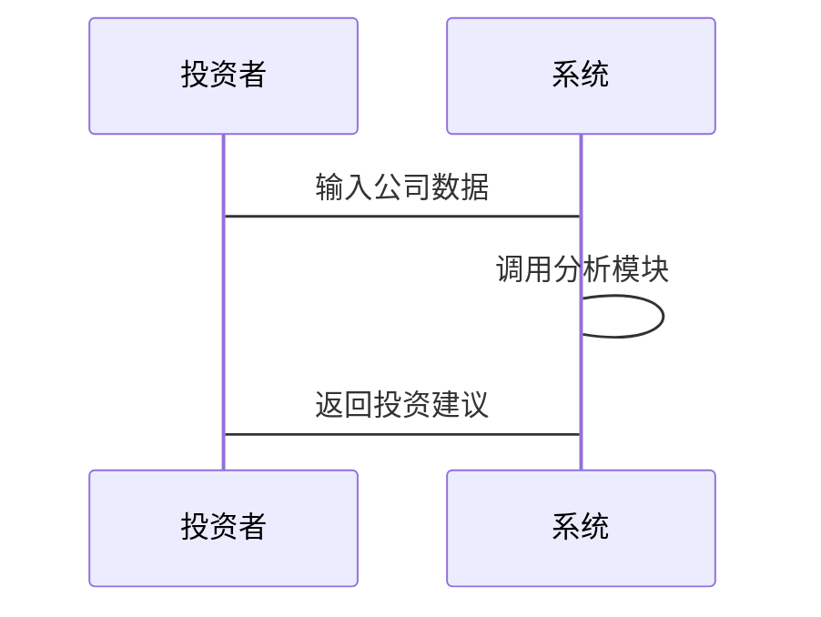

                 


# 罗伯特·哈格斯特罗姆的专注型价值投资：深入了解少数公司

## 关键词：价值投资，专注型投资，竞争优势，护城河，投资模型，数学模型，系统架构

## 摘要：  
本文深入探讨了罗伯特·哈格斯特罗姆的专注型价值投资方法，分析了其核心理念、竞争优势评估模型、数学算法以及系统架构设计。通过详细案例分析，展示了如何通过深入研究少数公司来实现长期稳健的投资回报。文章还提供了实际的投资策略和最佳实践建议。

---

## 第1章 价值投资的起源与理念

### 1.1 价值投资的定义与起源  
价值投资是一种以基本面分析为基础的投资策略，强调以低于内在价值的价格买入优质资产。其核心理念是寻找市场低估的公司，并长期持有以实现复利增长。罗伯特·哈格斯特罗姆作为价值投资领域的权威，提出了一种专注于深入研究少数优质公司的投资方法。

---

## 第2章 竞争优势与护城河

### 2.1 竞争优势的定义与分类  
竞争优势是公司长期盈利的核心驱动力，常见的类型包括成本优势、品牌优势、技术优势和网络效应等。通过分析这些优势，投资者可以识别出具有持续盈利能力的公司。

### 2.2 护城河的构建与分析  
护城河是指公司抵御竞争的能力。例如，可口可乐的全球品牌影响力和强大的分销网络就是其强大的护城河。通过分析护城河的深度和广度，投资者可以评估公司的长期竞争优势。

---

## 第3章 专注型投资的核心模型

### 3.1 价值投资模型的构建  
价值投资模型通过分析公司的财务状况、行业地位和竞争优势，评估其内在价值。以下是模型的简化流程：



### 3.2 竞争优势评估模型  
竞争优势评估模型通过量化指标（如市场份额、利润率）和定性分析（如品牌影响力）来评估公司的竞争优势。

### 3.3 投资组合构建模型  
投资组合构建模型基于对公司内在价值和竞争优势的评估，筛选出少数优质公司，并进行长期持有。

---

## 第4章 专注型投资的数学模型与算法

### 4.1 价值评估的数学模型  
现金流折现模型（DCF）是常用的估值工具，公式如下：

$$
\text{内在价值} = \sum_{t=1}^{n} \frac{\text{现金流}}{(1 + r)^t} + \frac{\text{残值}}{(1 + r)^n}
$$

其中，\( r \) 是折现率，\( n \) 是预测期数。

### 4.2 竞争优势的量化评估  
竞争优势评分系统通过加权平均法对公司的竞争优势进行量化评估，例如：

$$
\text{竞争优势评分} = \sum (\text{权重}_i \times \text{评分}_i)
$$

### 4.3 投资组合优化算法  
投资组合优化算法通过最大化预期回报和最小化风险来优化投资组合。例如，使用均值-方差优化模型：

$$
\text{优化目标} = \min \sigma^2 \quad \text{subject to} \quad \mathbb{E}[r] \geq \text{目标回报率}
$$

---

## 第5章 专注型投资的系统架构与实现

### 5.1 系统架构设计  
系统架构包括数据采集模块、分析模块和投资决策模块。以下是系统架构图：



### 5.2 核心算法实现  
核心算法包括价值评估、竞争优势评估和投资组合优化算法。以下是Python代码实现DCF模型：

```python
def calculate_intrinsic_value(fcf, discount_rate, horizon, residual_value):
    pv = 0
    for t in range(1, horizon + 1):
        pv += fcf[t] / (1 + discount_rate) ** t
    pv += residual_value / (1 + discount_rate) ** horizon
    return pv

# 示例数据
fcf = {1: 100, 2: 120, 3: 150}
discount_rate = 0.1
horizon = 3
residual_value = 200

intrinsic_value = calculate_intrinsic_value(fcf, discount_rate, horizon, residual_value)
print(f"内在价值：{intrinsic_value}")
```

### 5.3 系统接口设计  
系统接口包括数据输入、模型调用和结果输出。以下是接口设计示例：



---

## 第6章 专注型投资的实战案例分析

### 6.1 实战案例的选择与分析  
以苹果公司为例，分析其竞争优势和内在价值。以下是苹果公司的竞争优势分析：

1. **品牌影响力**：全球领先的品牌，具有强大的客户忠诚度。
2. **技术优势**：持续创新的芯片技术和生态系统。
3. **护城河**：强大的研发能力和知识产权。

### 6.2 投资组合的构建与优化  
基于竞争优势分析和价值评估，构建投资组合并进行动态优化。以下是投资组合优化的步骤：

1. **筛选优质公司**：根据竞争优势评分和内在价值筛选出优质公司。
2. **配置权重**：根据风险承受能力和预期回报率配置投资比例。
3. **定期调整**：定期重新评估公司价值和市场环境，进行必要的调整。

---

## 总结与最佳实践

### 总结  
专注型价值投资强调深入研究少数优质公司，通过分析竞争优势和内在价值，构建长期稳健的投资组合。本文通过理论分析、数学模型和实战案例，全面展示了这一投资方法的精髓。

### 最佳实践 Tips  
1. **长期持有**：避免频繁交易，享受复利效应。
2. **深入研究**：专注于少数公司，深入分析其竞争优势。
3. **风险管理**：定期评估投资组合，控制风险。

---

## 作者：AI天才研究院 & 禅与计算机程序设计艺术

---

通过本文的分析，读者可以全面理解罗伯特·哈格斯特罗姆的专注型价值投资方法，并将其应用于实际投资中。希望本文能为投资者提供有价值的见解和指导。

