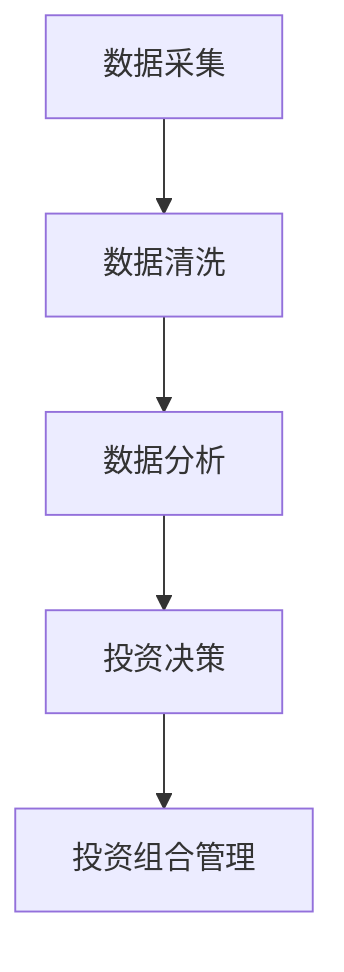
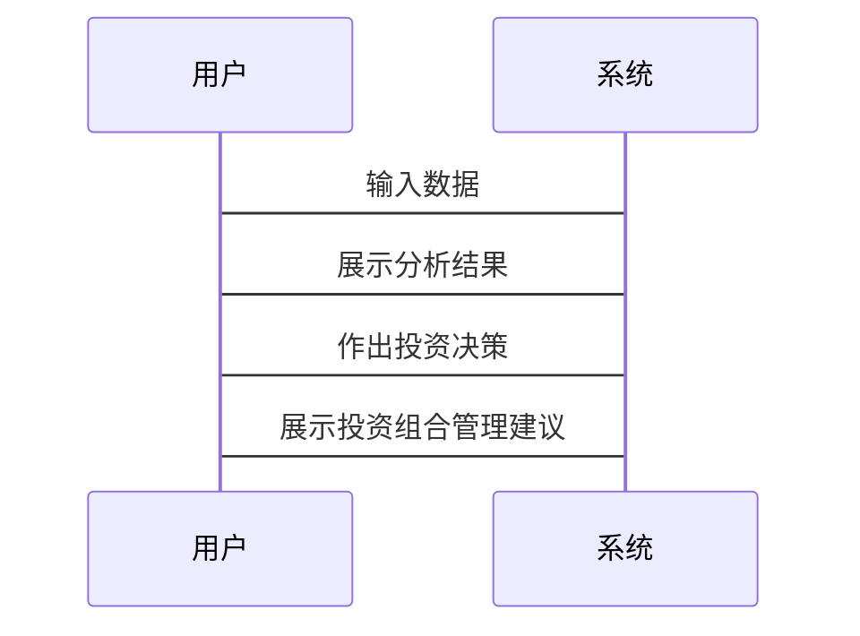

                 


# 罗伯特·哈格斯特罗姆的集中型价值投资：深入研究少数公司

## 关键词：集中型投资，价值投资，罗伯特·哈格斯特罗姆，安全边际，竞争优势，投资策略

## 摘要：集中型价值投资是一种以深入研究少数公司为核心的投资策略，通过长期持有和安全边际分析，寻找具有竞争优势且价格低于内在价值的公司。本文将从背景、理论基础、分析方法、系统设计、项目实战等多方面深入探讨这一投资策略，并结合实际案例进行详细解读，为投资者提供有价值的参考和启发。

---

## 第一部分: 引言

## 第1章: 集中型价值投资的起源与特点

### 1.1 集中型价值投资的定义与背景

集中型价值投资是一种以集中投资少数优质公司为核心的投资策略，强调通过深入研究和长期持有，寻找具有持续竞争优势且市场价格低于内在价值的公司。这一策略的核心在于通过研究少数公司，集中资源，挖掘其长期竞争优势，从而在市场波动中实现超额收益。

#### 1.1.1 价值投资的起源
价值投资作为一种投资策略，起源于20世纪初，由本杰明·格雷厄姆和戴维·多德提出。他们强调以低于内在价值的价格买入优质资产，通过长期持有实现收益。罗伯特·哈格斯特罗姆在这一基础上进一步发展，提出了集中型价值投资的概念，强调专注于少数公司，深入研究其竞争优势和内在价值。

#### 1.1.2 集中型投资的策略特点
- **集中投资**：将大部分资金集中在少数优质公司上，减少投资组合的复杂性，提高收益的确定性。
- **长期持有**：通过长期持有优质资产，避免短期市场波动的干扰，充分利用复利效应。
- **安全边际**：买入价格低于内在价值，确保投资的安全性，降低亏损风险。

#### 1.1.3 罗伯特·哈格斯特罗姆的贡献
罗伯特·哈格斯特罗姆是集中型价值投资的重要倡导者，他通过深入研究少数公司，提出了“竞争优势”的概念，并强调在投资决策中优先考虑公司的竞争优势和价格的安全边际。他的理论为现代价值投资提供了重要参考。

### 1.2 集中型价值投资与其他投资策略的区别

#### 1.2.1 集中型投资与分散型投资的对比
- **分散型投资**：通过投资多个资产或行业分散风险，但难以集中资源深入研究每个标的。
- **集中型投资**：专注于少数优质公司，深入研究其基本面，提高投资决策的准确性。

#### 1.2.2 价值投资与成长投资的差异
- **价值投资**：关注市场价格与内在价值的差异，寻找被市场低估的公司。
- **成长投资**：关注公司未来的增长潜力，愿意为高成长性支付较高价格。

#### 1.2.3 集中型投资的风险与收益分析
- **收益**：通过集中投资优质公司，可能获得更高的超额收益。
- **风险**：集中投资意味着更高的风险，特别是当所选公司出现问题时，投资组合可能大幅亏损。

### 1.3 集中型价值投资的核心理念

#### 1.3.1 长期持有的重要性
长期持有优质资产，避免频繁交易，减少交易成本和税收负担，同时充分利用复利效应。

#### 1.3.2 深入研究少数公司的必要性
通过深入研究少数公司，了解其竞争优势、财务状况和管理层能力，提高投资决策的准确性。

#### 1.3.3 安全边际的概念与应用
安全边际是指买入价格低于公司内在价值的部分，确保在市场价格波动时，投资依然具有较高的安全性和盈利能力。

---

## 第二部分: 理论基础

## 第2章: 价值投资的核心理论

### 2.1 价值投资的基本原理

#### 2.1.1 股票的内在价值计算
股票的内在价值是公司未来现金流的现值，可以通过 discounted cash flow (DCF) 模型计算。公式如下：

$$
\text{内在价值} = \sum_{t=1}^{n} \frac{\text{现金流}_t}{(1 + r)^t} + \frac{\text{残值}}{(1 + r)^n}
$$

其中，\( r \) 是折现率，\( \text{现金流}_t \) 是第 \( t \) 年的现金流，\( \text{残值} \) 是终值。

#### 2.1.2 市场价格与内在价值的关系
市场价格围绕内在价值波动，当市场价格低于内在价值时，是买入的良机。

#### 2.1.3 安全边际的数学模型
安全边际 = 内在价值 - 市场价格

通过计算安全边际，投资者可以评估投资的安全性。例如，如果内在价值为100，市场价格为80，安全边际为20，表示投资的安全性较高。

### 2.2 竞争优势的分析框架

#### 2.2.1 经济护城河的定义
经济护城河是指公司在行业内长期保持竞争优势的能力，可以通过成本优势、品牌优势、技术优势等因素体现。

#### 2.2.2 不同行业竞争优势的对比
不同行业的竞争优势不同，例如：
- **科技行业**：技术创新是核心竞争优势。
- **消费品行业**：品牌影响力是核心竞争优势。
- **制造业**：成本控制是核心竞争优势。

#### 2.2.3 竞争优势的量化评估
可以通过财务指标（如ROE、ROA）和市场指标（如市场份额）量化竞争优势。例如，使用以下公式评估公司的竞争优势：

$$
\text{竞争优势指数} = \frac{\text{公司市场份额}}{\text{行业平均市场份额}} \times \frac{\text{公司ROE}}{\text{行业平均ROE}}
$$

---

## 第3章: 集中型投资的数学模型

### 3.1 安全边际的计算公式

#### 3.1.1 内在价值的公式推导
内在价值的计算公式如前所述，可以通过DCF模型计算。

#### 3.1.2 安全边际的计算方法
$$
\text{安全边际} = \text{内在价值} - \text{市场价格}
$$

#### 3.1.3 安全边际与投资风险的关系
安全边际越高，投资风险越小。例如，安全边际为20%的投资比安全边际为10%的投资风险更低。

### 3.2 股票组合的优化模型

#### 3.2.1 马科维茨的现代投资组合理论
马科维茨的现代投资组合理论（MPT）通过优化投资组合的风险和收益，找到最优投资组合。公式如下：

$$
\text{最优组合} = \argmin_w \sigma^2(w) \quad \text{subject to} \quad w^T \mu = \mu_p, \quad w^T \mathbf{1} = 1
$$

其中，\( \sigma^2(w) \) 是投资组合的方差，\( \mu_p \) 是目标收益，\( w \) 是投资权重，\( \mu \) 是资产收益均值，\( \mathbf{1} \) 是单位向量。

#### 3.2.2 集中型投资组合的构建方法
集中型投资组合的构建方法与MPT有所不同，更注重集中投资优质资产。

---

## 第三部分: 分析方法

## 第4章: 选择少数公司的分析方法

### 4.1 基本面分析

#### 4.1.1 财务指标筛选
通过财务指标（如ROE、ROA、净利率等）筛选优质公司。例如，使用以下公式评估公司盈利能力：

$$
\text{净利率} = \frac{\text{净利润}}{\text{营业收入}}
$$

#### 4.1.2 估值分析
通过估值指标（如市盈率、市净率）评估市场价格与内在价值的差异。例如，使用以下公式计算市盈率：

$$
\text{市盈率} = \frac{\text{股价}}{\text{每股收益}}
$$

#### 4.1.3 竞争优势评估
通过分析公司的经济护城河和竞争优势，评估其长期盈利能力。

### 4.2 竞争优势分析

#### 4.2.1 经济护城河的评估
通过分析公司的成本优势、品牌优势和技术优势，评估其经济护城河的深度。

#### 4.2.2 可持续竞争优势的判断
通过分析公司的市场地位、管理层能力和财务状况，判断其竞争优势是否可持续。

### 4.3 安全边际分析

#### 4.3.1 安全边际的计算
通过计算安全边际，评估投资的安全性。例如，安全边际为20%的投资比安全边际为10%的投资更安全。

#### 4.3.2 市场波动中的安全边际变化
市场价格波动会影响安全边际，投资者需要定期重新评估安全边际。

---

## 第四部分: 系统分析

## 第5章: 投资决策系统的构建

### 5.1 数据采集与处理

#### 5.1.1 数据来源
数据来源包括公司财务报表、行业报告和市场数据等。例如，可以通过以下步骤获取数据：
1. 从公司财报中获取财务数据。
2. 从行业报告中获取行业数据。
3. 从市场数据中获取股价和市盈率等指标。

#### 5.1.2 数据清洗与预处理
通过数据清洗和预处理，确保数据的准确性和完整性。例如，使用Python代码清洗数据：

```python
import pandas as pd
data = pd.read_csv('data.csv')
data_clean = data.dropna()
```

### 5.2 系统架构设计

#### 5.2.1 系统功能模块
系统功能模块包括数据采集、分析模块、决策引擎和投资组合管理模块。

#### 5.2.2 系统流程图
以下是一个系统流程图的mermaid示意图：



### 5.3 系统交互设计

#### 5.3.1 用户界面设计
用户界面包括数据输入、分析结果展示和投资决策建议等部分。

#### 5.3.2 系统交互流程
以下是一个系统交互流程的mermaid序列图：



---

## 第五部分: 项目实战

## 第6章: 项目实战与案例分析

### 6.1 案例分析

#### 6.1.1 公司基本面分析
以苹果公司为例，分析其财务状况和竞争优势。例如，计算其净利率：

$$
\text{净利率} = \frac{\text{净利润}}{\text{营业收入}} = \frac{100}{500} = 20\%
$$

#### 6.1.2 安全边际计算
假设苹果公司的内在价值为100美元，市场价格为80美元，安全边际为20美元。

#### 6.1.3 投资决策建议
基于分析结果，建议投资者买入苹果公司股票。

### 6.2 投资组合管理

#### 6.2.1 投资组合构建
根据分析结果，构建集中型投资组合，例如投资苹果、微软等优质公司。

#### 6.2.2 风险管理策略
通过定期重新评估安全边际和竞争优势，调整投资组合。

---

## 第六部分: 总结与展望

## 第7章: 总结与展望

### 7.1 集中型价值投资的核心要点

#### 7.1.1 长期持有的重要性
长期持有优质资产，避免短期波动干扰。

#### 7.1.2 深入研究少数公司的必要性
通过深入研究少数公司，提高投资决策的准确性。

#### 7.1.3 安全边际的应用
通过计算安全边际，确保投资的安全性。

### 7.2 价值投资的优缺点

#### 7.2.1 优点
- **收益潜力高**：通过集中投资优质公司，可能获得超额收益。
- **安全性高**：通过安全边际分析，降低投资风险。

#### 7.2.2 缺点
- **风险高**：集中投资意味着更高的风险。
- **研究成本高**：需要投入大量时间和资源进行深入研究。

### 7.3 未来的发展趋势

#### 7.3.1 数字化投资工具的应用
随着技术的发展，投资者可以利用数字化工具进行更高效的投资分析和决策。

#### 7.3.2 人工智能在投资中的应用
人工智能可以通过大数据分析和机器学习算法，辅助投资者进行更精准的投资决策。

---

## 作者：AI天才研究院/AI Genius Institute & 禅与计算机程序设计艺术 /Zen And The Art of Computer Programming

---

通过以上内容，我们深入探讨了罗伯特·哈格斯特罗姆的集中型价值投资策略，从理论基础到实际应用，为投资者提供了有价值的参考和启发。

