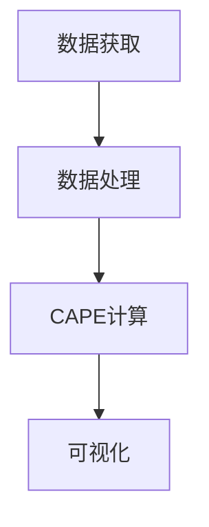
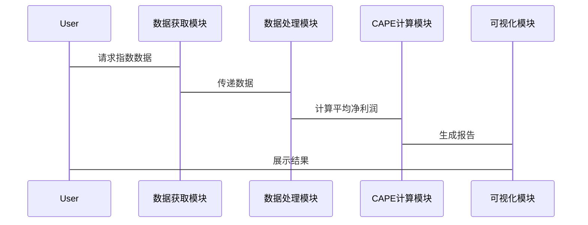

                 


# 罗伯特·希勒的周期性调整市盈率(CAPE)分析

---

## 关键词：
- 市场估值、股票分析、周期性调整市盈率、罗伯特·希勒、投资指标

---

## 摘要：
本文深入分析了罗伯特·希勒提出的周期性调整市盈率（CAPE）指标，探讨其理论基础、计算方法及其在投资分析中的应用。通过逐步推理和实际案例，揭示CAPE如何帮助投资者评估市场估值，预测市场趋势，并制定有效的投资策略。

---

## 第一部分: 罗伯特·希勒周期性调整市盈率（CAPE）的背景与概念

### 第1章: 罗伯特·希勒周期性调整市盈率（CAPE）的起源与发展

#### 1.1 市场估值指标的演进
市场的估值方法经历了长期的演变。传统市盈率（P/E）仅考虑当前净利润，存在周期性波动的问题。为解决这一缺陷，罗伯特·希勒提出了CAPE，利用过去10年的平均净利润来计算，以减少短期波动的影响。

#### 1.2 市场估值的核心问题
市场估值的核心在于找到合理的市盈率水平，CAPE通过长期平均净利润，提供了更为稳定和可靠的估值基准。这种方法帮助投资者避免短期波动的干扰，更准确地评估市场价值。

#### 1.3 市场周期性波动的影响
股票市场的波动性导致传统市盈率的局限性。CAPE通过平滑长期数据，帮助识别市场的长期趋势，从而在市场波动中提供更稳定的估值指标。

#### 1.4 CAPE指标的提出与应用
CAPE的提出解决了传统市盈率的局限性，广泛应用于学术研究和投资实践。本文将详细探讨其理论基础、计算方法及其实际应用。

---

## 第二部分: 罗伯特·希勒周期性调整市盈率（CAPE）的核心概念与数学模型

### 第2章: CAPE的核心概念与计算方法

#### 2.1 市场估值指标的定义
CAPE（周期性调整市盈率）定义为市场指数的当前价格与过去10年平均净利润的比率。它通过长期平均净利润，克服了传统市盈率的短期波动问题。

#### 2.2 CAPE的计算步骤
1. 计算过去10年的净利润总和。
2. 计算平均净利润。
3. 将市场指数当前价格除以平均净利润，得到CAPE值。

#### 2.3 CAPE的数学模型
CAPE的公式为：
$$
CAPE = \frac{P}{\text{Average Earnings of Past 10 Years}}
$$
其中，P为市场指数的当前价格，Average Earnings为过去10年的平均净利润。

#### 2.4 CAPE与传统市盈率的对比
通过对比CAPE与传统市盈率，可以发现CAPE在长期趋势分析中的优势。具体对比表格如下：

| 指标         | 基础数据       | 优缺点             |
|--------------|----------------|--------------------|
| 传统市盈率    | 当前净利润       | 易受短期波动影响     |
| CAPE         | 过去10年平均净利润 | 平滑周期性波动       |

---

## 第三部分: 罗伯特·希勒周期性调整市盈率（CAPE）的算法原理

### 第3章: CAPE算法的实现与优化

#### 3.1 CAPE算法的实现流程
1. 获取市场指数的历史数据。
2. 计算过去10年的平均净利润。
3. 计算当前市场指数的CAPE值。
4. 对比CAPE与历史平均水平，分析市场估值。

#### 3.2 CAPE算法的优化策略
1. 数据清洗：处理缺失值和异常值。
2. 计算优化：使用滑动窗口技术计算过去10年的平均净利润。
3. 系统设计：构建数据获取、计算、分析和可视化的模块化系统。

#### 3.3 CAPE算法的Python实现
以下是一个简单的CAPE计算示例代码：

```python
import pandas as pd
import yfinance as yf

# 获取指数历史数据
index_ticker = 'SPY'  # 以标普500为例
data = yf.download(index_ticker, start='2000-01-01', end='2023-12-31')

# 计算过去10年的平均净利润
def calculate_average_earnings(data, period=10):
    earnings = data['净利润']  # 假设数据中包含'净利润'列
    average_earnings = earnings.rolling(period).mean()
    return average_earnings

# 计算当前价格
current_price = data.iloc[-1]['收盘价']

# 计算CAPE
average_earnings = calculate_average_earnings(data)
cape = current_price / average_earnings.iloc[-1]

print(f"当前CAPE值为：{cape}")
```

#### 3.4 CAPE算法的数学模型
CAPE的计算公式可以表示为：
$$
CAPE_t = \frac{P_t}{\frac{1}{10}\sum_{i=1}^{10} E_i}
$$
其中，\( P_t \) 为当前市场指数价格，\( E_i \) 为过去10年的净利润。

---

## 第四部分: 罗伯特·希勒周期性调整市盈率（CAPE）的系统分析与架构设计

### 第4章: 基于CAPE的投资分析系统

#### 4.1 系统功能设计
- 数据获取模块：从金融数据源获取指数历史数据。
- 数据处理模块：清洗和计算过去10年的平均净利润。
- CAPE计算模块：计算当前CAPE值并生成报告。
- 可视化模块：绘制CAPE历史趋势图，对比当前CAPE与历史平均水平。

#### 4.2 系统架构设计
使用Mermaid图展示系统架构：



#### 4.3 系统接口设计
- 数据获取接口：从Yahoo Finance获取指数数据。
- CAPE计算接口：接收数据并返回CAPE值。
- 可视化接口：生成趋势图并展示结果。

#### 4.4 系统交互设计
使用Mermaid序列图展示系统交互流程：



---

## 第五部分: 罗伯特·希勒周期性调整市盈率（CAPE）的项目实战

### 第5章: 项目实战：基于CAPE的投资分析系统实现

#### 5.1 环境安装与配置
- 安装Python环境。
- 安装所需库：pandas、yfinance、matplotlib。

#### 5.2 系统核心实现
- 数据获取：使用yfinance获取指数数据。
- 数据处理：清洗和计算过去10年的平均净利润。
- CAPE计算：实现CAPE算法并生成报告。
- 可视化：绘制趋势图并展示结果。

#### 5.3 项目代码实现
```python
import pandas as pd
import yfinance as yf
import matplotlib.pyplot as plt

# 数据获取模块
index_ticker = 'SPY'
data = yf.download(index_ticker, start='2000-01-01', end='2023-12-31')

# 数据处理模块
def calculate_average_earnings(data, period=10):
    # 假设数据中包含'净利润'列
    earnings = data['净利润']
    average_earnings = earnings.rolling(period).mean()
    return average_earnings

average_earnings = calculate_average_earnings(data)

# CAPE计算模块
current_price = data.iloc[-1]['收盘价']
cape = current_price / average_earnings.iloc[-1]

# 可视化模块
plt.figure(figsize=(10, 6))
plt.plot(data.index, average_earnings, label='平均净利润')
plt.xlabel('日期')
plt.ylabel('平均净利润')
plt.legend()
plt.show()

print(f"当前CAPE值为：{cape}")
```

#### 5.4 实际案例分析
以标普500指数为例，计算当前CAPE值并与历史平均水平对比，分析市场估值。

---

## 第六部分: 罗伯特·希勒周期性调整市盈率（CAPE）的最佳实践与总结

### 第6章: 最佳实践与注意事项

#### 6.1 数据来源的可靠性
确保数据来源可靠，选择权威的金融数据供应商。

#### 6.2 计算周期的选择
根据市场特点调整计算周期，避免偏差。

#### 6.3 定期更新与维护
定期更新数据和模型，确保分析结果的准确性。

#### 6.4 结合其他指标
将CAPE与其他市场估值指标结合，提高分析的全面性。

---

## 小结
罗伯特·希勒的CAPE指标为市场估值提供了一个稳定可靠的工具，帮助投资者更好地理解市场趋势。通过本文的详细分析和实际案例，读者可以掌握CAPE的计算方法，并将其应用于投资分析。

---

## 注意事项
在使用CAPE时，需注意数据的准确性和模型的适用性，避免单一指标的局限性。同时，建议结合其他分析工具进行综合判断。

---

## 拓展阅读
- 罗伯特·希勒的《叙事经济学》
- 其他市场估值指标的研究与应用

---

## 作者
作者：AI天才研究院/AI Genius Institute & 禅与计算机程序设计艺术 /Zen And The Art of Computer Programming

---

本文通过详细分析罗伯特·希勒的周期性调整市盈率（CAPE）指标，探讨其在市场估值中的应用。通过逐步推理和实际案例，揭示CAPE如何帮助投资者评估市场价值，制定有效的投资策略。希望本文能为读者提供有价值的见解和实践指导。

