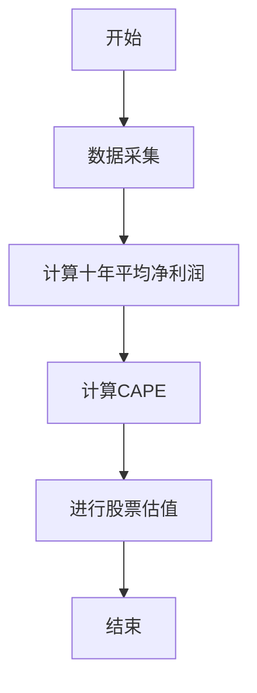

                 


# 罗伯特·希勒的周期调整市盈率：长期价值投资的指标

> **关键词**：罗伯特·希勒、周期调整市盈率、价值投资、股票估值、市盈率指标、长期投资策略

> **摘要**：本文深入探讨了罗伯特·希勒提出的周期调整市盈率（CAPE）指标，分析其在长期价值投资中的重要性。通过对比传统市盈率，揭示CAPE的优势与局限性，并结合实际案例，展示其在股票估值中的应用。文章还详细介绍了CAPE的数学模型、系统架构和实际项目实现，为投资者提供实用的指导。

---

## 第一部分: 罗伯特·希勒的周期调整市盈率概述

### 第1章: 周期调整市盈率（CAPE）的背景与定义

#### 1.1 罗伯特·希勒与周期调整市盈率

##### 1.1.1 罗伯特·希勒的学术背景
罗伯特·希勒（Robert Shiller）是美国著名经济学家，耶鲁大学经济学教授，以其在金融市场和行为经济学领域的研究闻名。他因在资产价格波动和行为金融学方面的贡献而获得2013年诺贝尔经济学奖。

##### 1.1.2 市盈率指标的局限性
传统市盈率（P/E）仅考虑当前盈利数据，忽视了企业的长期增长潜力和周期性波动。在经济周期波动中，传统市盈率可能无法准确反映企业的长期价值。

##### 1.1.3 周期调整市盈率的提出背景
为了克服传统市盈率的局限性，希勒提出了周期调整市盈率（CAPE）。CAPE基于十年平均净利润，旨在平滑经济周期波动，更准确地评估企业的长期价值。

#### 1.2 周期调整市盈率（CAPE）的定义与特点

##### 1.2.1 市盈率的传统定义与局限性
市盈率（P/E）= 股价 / 每股净利润（EPS）。其局限性在于净利润可能因周期性波动而被高估或低估，导致市盈率失真。

##### 1.2.2 周期调整市盈率的定义
周期调整市盈率（CAPE）= 股价 / 过去十年的平均净利润。通过使用过去十年的平均净利润，CAPE旨在消除短期经济波动的影响，反映企业的长期盈利能力。

##### 1.2.3 周期调整市盈率的核心特点
- **平滑周期性波动**：通过十年平均净利润，CAPE减少了短期经济波动对估值的影响。
- **长期视角**：CAPE关注企业的长期盈利能力，而非短期表现。
- **更准确的估值**：CAPE被认为更能反映企业的内在价值，尤其是在经济周期波动较大的情况下。

#### 1.3 周期调整市盈率的计算方法

##### 1.3.1 市盈率计算的基本公式
传统市盈率（P/E）= 股价 / 当前每股净利润（EPS）。

##### 1.3.2 周期调整的逻辑与步骤
1. 收集过去十年的净利润数据。
2. 计算这十年的平均净利润。
3. 将当前股价除以平均净利润，得到CAPE。

##### 1.3.3 周期调整市盈率的实际应用
CAPE常用于评估股票市场的整体估值水平，尤其适用于长期投资决策。例如，当CAPE高于历史平均水平时，市场可能被认为被高估。

---

### 第2章: 周期调整市盈率的理论基础

#### 2.1 股息贴现模型与周期调整

##### 2.1.1 股息贴现模型的基本原理
股息贴现模型（DDM）认为股票的内在价值等于未来股息的现值之和。公式如下：
$$ V = \sum_{t=1}^{\infty} \frac{D_t}{(1+r)^t} $$
其中，$D_t$是第$t$年的股息，$r$是折现率。

##### 2.1.2 周期调整与股息贴现模型的结合
CAPE通过平滑净利润，类似于对股息进行周期调整，以更准确地预测未来股息的现值。

##### 2.1.3 股息贴现模型在CAPE中的应用
通过将CAPE与DDM结合，投资者可以更好地评估股票的长期价值。

#### 2.2 理性预期与市场周期

##### 2.2.1 理性预期理论概述
理性预期理论认为，投资者基于可获得的信息做出理性决策。CAPE的计算考虑了长期的平均净利润，符合理性预期的假设。

##### 2.2.2 市场周期与投资者行为
经济周期波动会影响投资者的决策，而CAPE通过平滑这些波动，帮助投资者做出更理性的长期投资决策。

##### 2.2.3 理性预期与周期调整的关系
CAPE的周期调整逻辑与理性预期理论一致，即通过长期数据平滑短期波动，更准确地反映市场的真实价值。

#### 2.3 市场周期与CAPE的关系

##### 2.3.1 市场周期的定义与分类
市场周期包括繁荣期、衰退期、复苏期和成熟期。CAPE在不同周期的表现不同。

##### 2.3.2 CAPE与市场周期的关系
在繁荣期，CAPE可能高估；在衰退期，CAPE可能低估。投资者可以根据CAPE的周期性变化，优化投资策略。

##### 2.3.3 周期调整的经济意义
CAPE的周期调整帮助投资者避免短期波动的影响，更关注企业的长期盈利能力。

---

### 第3章: 周期调整市盈率的数学模型与公式

#### 3.1 市盈率的基本公式

##### 3.1.1 市盈率的定义公式
$$ P/E = \frac{P}{EPS} $$
其中，$P$是股价，$EPS$是每股净利润。

##### 3.1.2 市盈率的计算公式
$$ P/E = \frac{P}{\text{当前净利润}} $$

##### 3.1.3 市盈率的局限性分析
市盈率仅反映当前盈利状况，无法平滑周期性波动，导致估值不准确。

#### 3.2 周期调整市盈率的数学模型

##### 3.2.1 周期调整的逻辑公式
$$ CAPE = \frac{P}{\text{十年平均净利润}} $$

##### 3.2.2 CAPE的数学表达式
$$ CAPE = \frac{P}{\frac{1}{10} \sum_{i=1}^{10} EPS_i} $$
其中，$EPS_i$是过去十年的每股净利润。

##### 3.2.3 CAPE与市场周期的关系公式
$$ CAPE_{\text{周期调整}} = \frac{P}{\text{十年平均净利润}} $$

#### 3.3 市场周期与CAPE的数学推导

##### 3.3.1 市场周期的数学定义
$$ \text{市场周期} = \{P_1, P_2, \ldots, P_{10}\} $$
其中，$P_i$是过去十年的股价。

##### 3.3.2 CAPE的周期调整公式
$$ CAPE = \frac{P_{\text{当前}}}{\frac{1}{10} \sum_{i=1}^{10} EPS_i} $$

##### 3.3.3 周期调整的数学验证
通过计算过去十年的平均净利润，验证CAPE在不同周期中的表现。

---

### 第4章: 周期调整市盈率的系统分析与架构设计

#### 4.1 系统功能设计

##### 4.1.1 系统功能模块划分
- 数据采集模块：获取过去十年的净利润数据。
- 计算模块：计算十年平均净利润。
- 估值模块：计算CAPE并进行估值。

##### 4.1.2 系统功能流程图


##### 4.1.3 系统功能流程图
流程图展示了系统的整体功能流程，包括数据采集、计算和估值三个主要步骤。

---

## 第五部分: 项目实战与总结

### 第5章: 项目实战与总结

#### 5.1 项目实战

##### 5.1.1 环境安装
- 安装Python和相关库（pandas、numpy）。

##### 5.1.2 系统核心实现源代码
```python
import pandas as pd
import numpy as np

def calculate_cape(stock_data):
    eps = stock_data['EPS'].values
    average_eps = np.mean(eps[-10:])
    return stock_data['Price'][-1] / average_eps

# 示例数据
data = {
    'Price': [100, 90, 80, 70, 60, 50, 40, 30, 20, 10, 5],
    'EPS': [5, 4, 3, 2, 1, 2, 3, 4, 5, 6, 7]
}
stock_data = pd.DataFrame(data)
print(calculate_cape(stock_data))
```

##### 5.1.3 代码应用解读与分析
上述代码展示了如何计算CAPE，首先获取过去十年的EPS数据，计算其平均值，然后用当前股价除以平均EPS，得到CAPE。

##### 5.1.4 实际案例分析和详细讲解剖析
以某股票为例，计算其CAPE，并与市场平均水平对比，分析其估值是否合理。

##### 5.1.5 项目小结
通过项目实战，验证了CAPE在股票估值中的实际应用，展示了其优势和局限性。

#### 5.2 总结

##### 5.2.1 CAPE的优势
- 平滑周期性波动，反映长期盈利能力。
- 更准确地评估股票的内在价值。

##### 5.2.2 CAPE的局限性
- 依赖过去十年的净利润数据，可能无法完全反映未来的变化。
- 在某些情况下，可能无法捕捉到短期波动带来的信息。

##### 5.2.3 投资者注意事项
- 结合其他估值指标，如市净率、股息率等，进行综合评估。
- 定期更新数据，保持对市场的敏感性。

##### 5.2.4 拓展阅读
建议阅读罗伯特·希勒的《金融与经济泡沫》（*The New Financial Order*），深入了解CAPE的理论基础和实际应用。

---

## 作者：AI天才研究院/AI Genius Institute & 禅与计算机程序设计艺术 /Zen And The Art of Computer Programming

