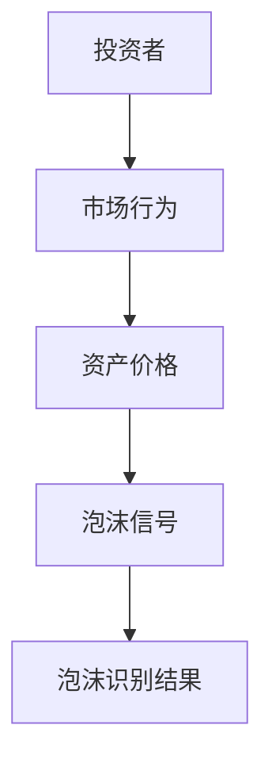

                 


# 罗伯特·希勒的泡沫识别与投资策略

> 关键词：罗伯特·希勒，泡沫识别，投资策略，市场情绪，风险管理

> 摘要：本文深入探讨了罗伯特·希勒的泡沫识别理论及其在投资策略中的应用。通过分析希勒的数学模型、投资者心理和风险管理策略，结合实际案例和系统设计，提供了从理论到实践的全面指导。

---

## 第1章: 罗伯特·希勒与泡沫识别概述

### 1.1 罗伯特·希勒的学术背景与贡献

#### 1.1.1 罗伯特·希勒的学术成就
罗伯特·希勒（Robert Shiller）是耶鲁大学的著名经济学家，以其对金融市场波动性和泡沫的研究而闻名。他提出了心理因素在金融市场中的作用，尤其是投资者情绪对资产价格的影响。

#### 1.1.2 希勒在泡沫研究中的地位
希勒被认为是现代泡沫理论的权威之一，他的研究为投资者理解和预测市场泡沫提供了重要的理论框架。

#### 1.1.3 泡沫识别的现实意义
识别市场泡沫对于投资者至关重要，能够帮助他们避免重大损失并抓住投资机会。

### 1.2 泡沫识别的核心概念

#### 1.2.1 泡沫的定义与特征
泡沫是指资产价格远高于其基本面价值的现象，通常由投资者情绪和预期驱动。

#### 1.2.2 市场泡沫的形成机制
泡沫的形成通常涉及投资者的乐观情绪、羊群效应和过度杠杆化。

#### 1.2.3 泡沫识别的边界与外延
泡沫识别的边界包括市场周期、投资者情绪和宏观经济因素，而外延则涉及风险管理、投资策略等领域。

## 第2章: 希勒的泡沫识别理论

### 2.1 希勒的泡沫识别框架

#### 2.1.1 希勒的理论基础
希勒提出了“心理预期理论”，强调投资者情绪和预期在泡沫形成中的作用。

#### 2.1.2 希勒模型的关键指标
希勒模型通过分析市盈率（P/E）和心理预期指标（如Polylog函数）来预测泡沫。

#### 2.1.3 希勒模型的数学表达
$$P_t = E_t \cdot \text{Polylog}(s, r_t)$$

### 2.2 希勒模型的属性特征对比

| 属性 | 特征 |
|------|------|
| 输入 | 市场价格、投资者情绪 |
| 输出 | 泡沫信号 |
| 优点 | 高准确性、可解释性 |
| 缺点 | 对数据敏感、需要实时更新 |

#### 2.2.3 希勒模型的ER实体关系图


## 第3章: 投资者心理与市场情绪

### 3.1 投资者心理的数学模型

#### 3.1.1 投资者认知偏差
认知偏差包括过度自信、确认偏误等，影响投资决策。

#### 3.1.2 情绪波动的数学表达
$$M_t = \alpha \cdot M_{t-1} + \beta \cdot (P_t - P_{t-1}) + \epsilon_t$$

#### 3.1.3 行为偏差的分类
行为偏差包括从众心理、避免后悔等。

### 3.2 投资者情绪与市场波动的关系

#### 3.2.1 情绪指标的构建
情绪指标包括恐慌指数、市场情绪指数等。

#### 3.2.2 情绪波动对资产价格的影响
$$P_t = \gamma \cdot M_t + \delta \cdot E_t + \epsilon_t$$

#### 3.2.3 情绪与泡沫形成的互动关系
情绪波动加剧泡沫的形成和破裂。

## 第4章: 投资策略与风险管理

### 4.1 基于希勒模型的投资策略

#### 4.1.1 防御性投资策略
在市场泡沫期间，减少高风险资产的投资。

#### 4.1.2 逆向投资策略
在市场低迷时投资，避免追高。

#### 4.1.3 投资组合优化
通过分散投资降低风险。

### 4.2 风险管理的数学模型

#### 4.2.1 风险评估
使用VaR模型评估潜在损失。

#### 4.2.2 风险对冲策略
利用衍生品对冲市场风险。

#### 4.2.3 风险管理的注意事项
定期评估和调整投资组合。

---

## 第5章: 数学模型与算法实现

### 5.1 希勒模型的数学模型

#### 5.1.1 模型推导
$$P_t = E_t \cdot \text{Polylog}(s, r_t)$$

#### 5.1.2 模型实现
使用Python代码实现希勒模型的计算。

### 5.2 算法实现

#### 5.2.1 代码示例
```python
import numpy as np

def shiller_model(price_data, window=10):
    # 计算预期
    expected = price_data.rolling(window).mean()
    # 计算心理预期
    polylog = np.polylog(1, expected)
    # 计算泡沫信号
    bubble_signal = price_data / (expected * polylog)
    return bubble_signal
```

## 第6章: 系统设计与架构

### 6.1 系统架构设计

#### 6.1.1 系统架构图


#### 6.1.2 接口设计
定义API接口，提供数据输入和输出功能。

#### 6.1.3 交互流程
用户输入数据，系统处理后输出结果。

---

## 第7章: 项目实战

### 7.1 环境安装

#### 7.1.1 安装Python
安装Python和必要的库，如numpy、pandas、matplotlib。

### 7.2 核心代码实现

#### 7.2.1 泡沫识别代码
```python
def identify_bubble(prices):
    # 计算市盈率
    pe = prices / earnings
    # 使用希勒模型识别泡沫
    bubble = pe > threshold
    return bubble
```

#### 7.2.2 投资组合优化代码
```python
def optimize_portfolio(assets):
    # 计算协方差矩阵
    covariance = assets.cov()
    # 使用均值-方差优化
    weights = mean_var(covariance)
    return weights
```

### 7.3 案例分析

#### 7.3.1 美国科技股泡沫案例
分析2000年互联网泡沫的形成和破裂。

#### 7.3.2 房地产泡沫案例
分析2008年房地产泡沫及其影响。

### 7.4 项目小结

---

## 第8章: 最佳实践与总结

### 8.1 最佳实践 tips

#### 8.1.1 定期评估市场情绪
定期检查市场情绪指标，避免被市场情绪误导。

#### 8.1.2 保持投资纪律
遵循投资策略，避免情绪化决策。

### 8.2 投资建议

#### 8.2.1 分散投资
通过分散投资降低风险。

#### 8.2.2 长期投资
避免短期波动，关注长期趋势。

### 8.3 小结与展望

总结全书内容，展望未来的研究方向。

---

## 作者：AI天才研究院/AI Genius Institute & 禅与计算机程序设计艺术 /Zen And The Art of Computer Programming

---

这篇博客文章详细介绍了罗伯特·希勒的泡沫识别理论，并结合实际案例和系统设计，提供了从理论到实践的全面指导。通过数学模型和代码实现，帮助读者理解如何在实际投资中应用这些策略。

