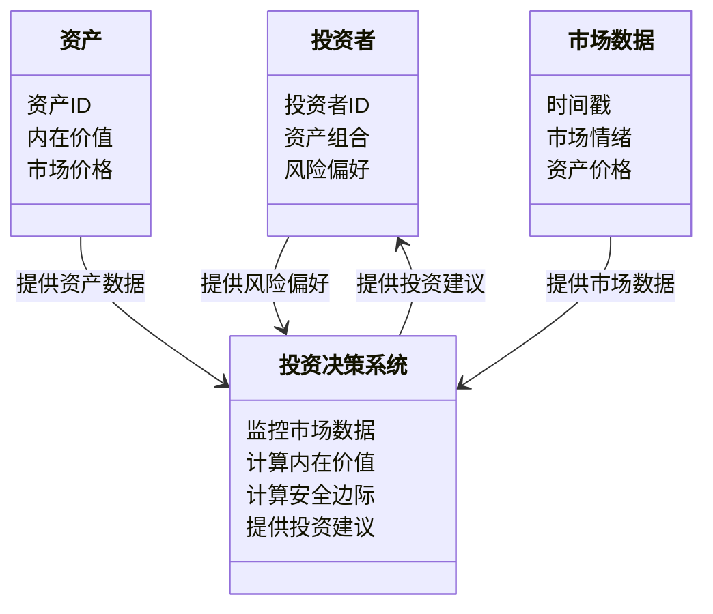
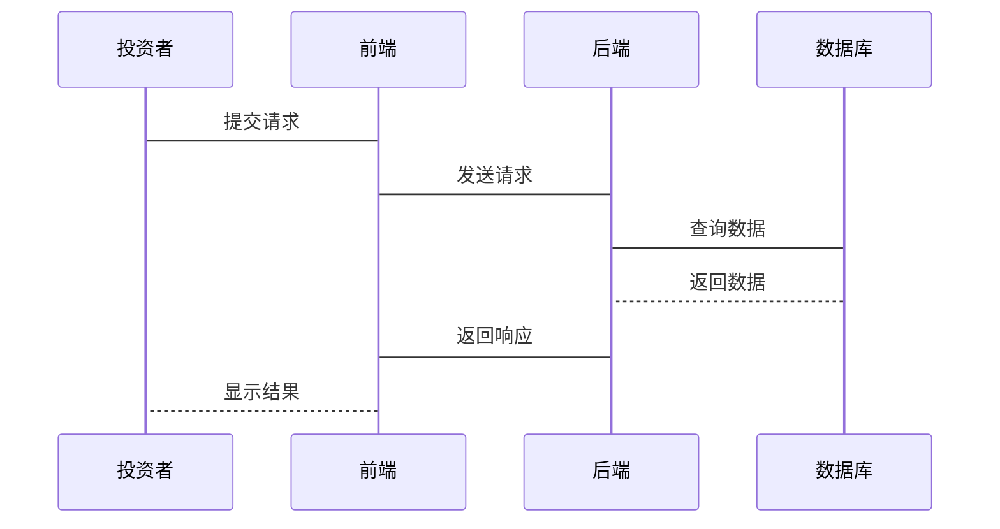

                 


# 罗伯特·席勒的行为金融学与价值投资

## 关键词：行为金融学，价值投资，罗伯特·席勒，市场情绪，资产定价，安全边际

## 摘要：  
罗伯特·席勒是行为金融学领域的领军人物，他通过将心理学原理引入金融学，挑战了传统有效市场假说，提出了市场情绪和行为偏差对资产定价的重要影响。本文将从行为金融学的核心概念出发，结合价值投资的哲学基础，深入分析席勒的理论贡献，并通过实际案例和系统设计，展示如何将这些理论应用于投资实践。通过本文，读者将理解市场情绪对投资决策的影响，掌握基于行为金融学的价值投资方法，并能够设计和实现一个基于这些理论的投资系统。

---

# 第一部分：行为金融学的背景与发展

## 第1章：行为金融学的定义与核心概念

### 1.1 行为金融学的定义与核心概念

#### 1.1.1 行为金融学的定义  
行为金融学（Behavioral Finance）是研究投资者心理和行为偏差对金融市场和资产定价影响的学科。与传统金融学不同，行为金融学强调人类决策的非理性特征，认为市场参与者的情绪、认知偏差和群体行为会影响资产价格。

#### 1.1.2 行为金融学的核心概念  
- **市场情绪（Market Sentiment）**：投资者群体对市场的总体看法和情绪，通常是乐观或悲观的。  
- **行为偏差（Behavioral Biases）**：投资者在决策过程中常见的心理偏差，如过度自信、从众心理、损失厌恶等。  
- **有效市场假说（Efficient Market Hypothesis, EMH）**：传统金融学的核心假设，认为市场价格反映了所有可获取的信息，因此市场是不可预测的。  

#### 1.1.3 行为金融学与传统金融学的区别  
行为金融学挑战了有效市场假说，认为市场并不总是理性的，价格波动可以由投资者的心理因素解释。  

### 1.2 罗伯特·席勒的学术贡献  

#### 1.2.1 罗伯特·席勒的学术背景  
罗伯特·席勒是美国经济学家，耶鲁大学教授，因其在行为金融学领域的贡献而荣获2013年诺贝尔经济学奖。  

#### 1.2.2 席勒对行为金融学的贡献  
席勒提出了“市场情绪指数”（Momentum Hypothesis）和“市场预期的非理性”理论，强调市场参与者的情绪和预期对资产价格的影响。  

#### 1.2.3 席勒的诺贝尔经济学奖  
席勒的研究表明，股票市场具有显著的非理性特征，传统的有效市场假说无法解释市场的波动性。  

---

## 第2章：价值投资的基本原理  

### 2.1 价值投资的定义与特点  

#### 2.1.1 价值投资的定义  
价值投资是一种投资策略，强调以低于内在价值的价格买入优质资产，长期持有，等待市场价格回归内在价值。  

#### 2.1.2 价值投资的核心原则  
- **安全边际（Margin of Safety）**：买入价格与内在价值之间的差距，用以降低投资风险。  
- **长期视角（Long-term Perspective）**：关注企业的基本面，而非短期市场波动。  
- **独立思考（Independent Thinking）**：不随市场情绪盲目操作。  

#### 2.1.3 价值投资与成长投资的区别  
- 价值投资注重低估值，成长投资注重高增长。  
- 价值投资者倾向于购买价格被低估的股票，成长投资者倾向于投资高增长但可能高估值的公司。  

### 2.2 价值投资的哲学基础  

#### 2.2.1 价值投资的长期视角  
价值投资者相信市场短期波动不可预测，但长期趋势是向均值回归的。  

#### 2.2.2 安全边际的概念  
安全边际是价值投资的核心，它通过买入低于内在价值的资产，降低投资风险。  

#### 2.2.3 市场先生的比喻  
本杰明·格雷厄姆提出了“市场先生”的概念，认为市场先生的情绪波动会影响市场价格，但聪明的投资者应该忽略短期波动，专注于长期价值。  

---

## 第3章：行为金融学与价值投资的核心概念  

### 3.1 行为金融学的核心概念  

#### 3.1.1 有效市场假说的挑战  
席勒通过实证研究发现，股票市场的波动性无法完全用理性的因素解释，市场情绪和行为偏差起着重要作用。  

#### 3.1.2 行为偏差与投资者决策  
投资者常见的行为偏差包括：  
- **过度自信**：认为自己能够预测市场走势。  
- **从众心理**：盲目跟随市场潮流，导致市场泡沫。  
- **损失厌恶**：对损失的厌恶程度高于对收益的追求。  

#### 3.1.3 市场情绪与资产定价  
市场情绪通过影响投资者预期，进而影响资产价格。席勒提出了“情绪周期”理论，认为市场情绪会周期性波动，导致资产价格偏离内在价值。  

### 3.2 价值投资的核心概念  

#### 3.2.1 股票的内在价值  
内在价值是基于公司基本面的评估，包括盈利能力、成长性、财务状况等因素。  

#### 3.2.2 市场价格与内在价值的差异  
市场价格受情绪影响，可能高于或低于内在价值。  

#### 3.2.3 安全边际的计算方法  
安全边际 = 内在价值 - 市场价格  

---

## 第4章：行为金融学的数学模型与公式  

### 4.1 行为金融学的预期形成模型  

#### 4.1.1 席勒的预期形成模型  
席勒认为，投资者的预期受市场情绪和行为偏差的影响，可以用以下公式表示：  
$$ E_t = \alpha + \beta \times S_t + \epsilon_t $$  
其中，\( E_t \) 是第 \( t \) 期的预期，\( S_t \) 是市场情绪指数，\( \alpha \) 和 \( \beta \) 是参数，\( \epsilon_t \) 是随机误差项。  

#### 4.1.2 市场情绪对预期的影响  
市场情绪指数 \( S_t \) 可以通过投资者的行为数据和市场指标（如成交量、波动率）来衡量。  

#### 4.1.3 预期与资产价格的关系  
预期通过影响投资者行为，进而影响资产价格。  

### 4.2 资产定价模型  

#### 4.2.1 CAPM模型的局限性  
CAPM模型假设市场是理性的，忽略了行为偏差的影响。  

#### 4.2.2 行为CAPM模型  
行为CAPM模型引入了市场情绪和行为偏差，扩展了传统CAPM模型：  
$$ E(r_i) = r_f + \beta_i \times (E(r_m) - r_f) + \gamma \times S_t $$  
其中，\( \gamma \) 是情绪风险溢价系数。  

#### 4.2.3 资产定价中的行为偏差  
行为偏差会导致资产价格偏离理性定价，影响资产定价模型的准确性。  

---

## 第5章：系统分析与架构设计  

### 5.1 投资决策系统的架构设计  

#### 5.1.1 系统需求分析  
- 实时监控市场情绪。  
- 评估资产的内在价值。  
- 计算安全边际。  
- 提供投资建议。  

#### 5.1.2 系统功能设计（领域模型）  


#### 5.1.3 系统架构设计（Mermaid架构图）  


### 5.2 系统接口设计与交互流程  

#### 5.2.1 系统接口设计  
- API接口：提供市场数据、资产信息和投资建议。  
- 数据格式：JSON格式。  

#### 5.2.2 系统交互流程（Mermaid序列图）  


---

## 第6章：项目实战——基于席勒理论的投资策略开发  

### 6.1 环境安装与配置  

#### 6.1.1 Python环境的安装  
安装Python 3.x版本，确保已安装pip。  

#### 6.1.2 数据分析库的安装  
```bash
pip install pandas numpy matplotlib
```

### 6.2 投资策略的核心实现  

#### 6.2.1 股票数据的获取与处理  
使用Pandas库读取股票数据，计算市场情绪指数和内在价值。  

#### 6.2.2 内在价值的计算方法  
$$ \text{内在价值} = \text{现金流折现值} + \text{资产重估价值} $$  

#### 6.2.3 安全边际的实现代码  
```python
import pandas as pd
import numpy as np

# 假设股票数据已加载到 DataFrame df
df['内在价值'] = df['现金流折现值'] + df['资产重估价值']
df['安全边际'] = df['内在价值'] - df['市场价格']
```

### 6.3 代码应用与案例分析  

#### 6.3.1 投资策略的代码实现  
```python
def 计算市场情绪指数(数据):
    # 数据为包含市场指标的DataFrame
    市场情绪指数 = 数据['成交量'].rolling(20).mean() / 数据['成交量'].mean()
    return 市场情绪指数

def 计算内在价值(公司基本面):
    # 公司基本面为包含财务数据的DataFrame
    内在价值 = company_data['净利润'].sum() / company_data['市盈率'].mean()
    return 内在价值
```

#### 6.3.2 实际案例分析与结果解读  
以苹果公司为例，计算其内在价值和安全边际，判断是否值得投资。  

#### 6.3.3 策略的优缺点分析  
优点：  
- 能够捕捉市场低估的机会。  
- 长期回报稳定。  
缺点：  
- 需要大量数据支持。  
- 短期内可能跑输市场。  

---

## 第7章：最佳实践与小结  

### 7.1 投资中的注意事项  

#### 7.1.1 风险管理的重要性  
设定止损点，控制仓位，分散投资。  

#### 7.1.2 长期投资与短期波动的平衡  
坚持长期视角，但也要关注短期市场情绪变化。  

#### 7.1.3 行为偏差的自我控制  
定期回顾投资决策，避免从众心理和过度自信。  

### 7.2 项目总结与未来展望  

#### 7.2.1 本书的核心内容总结  
行为金融学与价值投资相结合，能够帮助投资者更好地理解市场波动和投资决策。  

#### 7.2.2 未来研究方向  
研究更复杂的行为模型，结合人工智能技术进行投资决策优化。  

#### 7.2.3 读者的思考与实践建议  
鼓励读者结合实际市场数据，验证理论的有效性，并不断优化投资策略。  

### 7.3 拓展阅读与资源推荐  

#### 7.3.1 推荐书籍  
- 《Fooled by Randomness》—— Nassim Taleb  
- 《The Intelligent Investor》—— Benjamin Graham  

#### 7.3.2 推荐博客与网站  
- 罗伯特·席勒的官方网站：[https://www robert.shiller.com](https://www.robert.shiller.com)  
- 行为金融学论坛：[https://www.behavioralfinanceforum.com](https://www.behavioralfinanceforum.com)  

---

## 作者：AI天才研究院/AI Genius Institute & 禅与计算机程序设计艺术/Zen And The Art of Computer Programming  

---

以上是关于《罗伯特·席勒的行为金融学与价值投资》的完整文章大纲和内容，涵盖了从理论到实践的各个方面，旨在帮助读者全面理解行为金融学与价值投资的核心思想，并能够将其应用于实际投资决策中。

