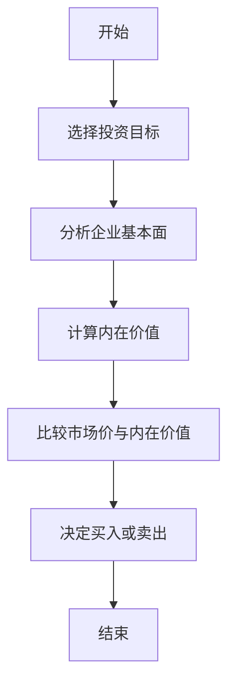
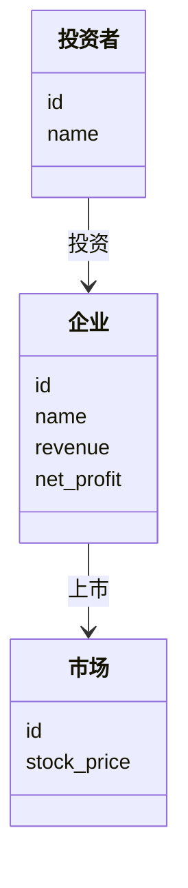
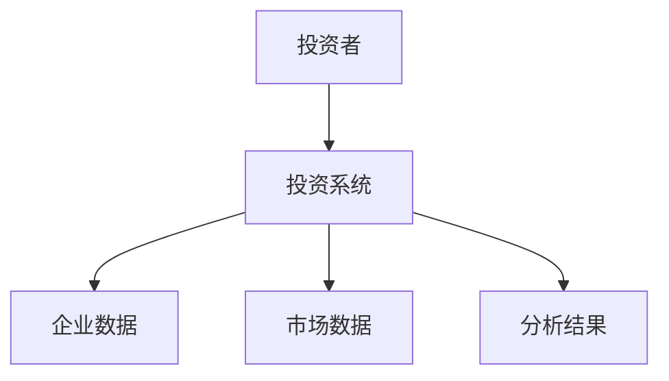

                 


# 罗伯特哈格斯特朗的成长型价值投资

---

## 关键词：
- 罗伯特·哈格斯特朗
- 成长型价值投资
- 股票估值
- 投资策略
- 风险管理

---

## 摘要：
本文深入探讨了罗伯特·哈格斯特朗的成长型价值投资理念，分析了其核心概念、投资策略、风险管理方法，并结合实际案例进行详细解读。文章从理论到实践，系统地阐述了如何通过长期投资优质企业实现财富增长。

---

## 第一部分: 罗伯特·哈格斯特朗的成长型价值投资概述

### 第1章: 成长型价值投资的背景与核心理念

#### 1.1 成长型投资的定义与特点
- **定义**：成长型投资是指投资于那些具有持续增长潜力的企业，注重企业的未来盈利能力而非当前估值。
- **特点**：
  - 长期导向
  - 重视企业基本面
  - 忍受短期波动

#### 1.2 罗伯特·哈格斯特朗的投资理念
- **核心思想**：选择那些能够持续创造价值的企业，而非关注短期市场波动。
- **长期投资的重要性**：通过持有优质企业股票，分享其长期增长的成果。
- **选择优质企业的标准**：高ROE、持续增长的净利润、强大的竞争优势。

---

### 第2章: 成长型价值投资的核心概念与联系

#### 2.1 核心概念原理
- **企业内在价值**：通过现金流折现模型计算企业的真实价值。
- **股东权益与盈利能力**：股东权益的增长反映了企业的价值创造能力。
- **市场波动与投资机会**：市场波动为长期投资者提供了买入优质资产的机会。

#### 2.2 核心概念属性对比表格
| **属性**       | **成长型投资**                | **价值型投资**                |
|----------------|-----------------------------|-----------------------------|
| 投资目标       | 寻找高成长企业                | 寻找低估值企业                |
| 关注点         | 未来的盈利能力                | 当前的估值                    |
| 投资期限       | 长期                         | 中短期                      |

#### 2.3 ER实体关系图
```mermaid
er
actor 投资者 {
  id 投资者ID
  name 投资者姓名
}
actor 企业 {
  id 企业ID
  name 企业名称
  revenue 营业收入
  net_profit 净利润
}
actor 市场 {
  id 市场ID
  stock_price 股票价格
}
```

---

### 第3章: 成长型价值投资的算法原理

#### 3.1 算法原理概述
- **现金流折现模型**：通过预测企业未来现金流，计算其现值以确定内在价值。
- **股东权益增长率模型**：通过ROE和再投资比率预测股东权益的增长。

#### 3.2 算法流程图


---

### 第4章: 数学模型与公式详细讲解

#### 4.1 现金流折现模型
- **公式**：
  $$ V = \sum_{t=1}^{n} \frac{CF_t}{(1 + r)^t} $$
  其中，CF_t为第t年的现金流，r为折现率。

#### 4.2 股东权益增长率模型
- **公式**：
  $$ g = \frac{ROE \times r}{1 - ROE \times r} $$
  其中，ROE为净资产收益率，r为再投资比率。

#### 4.3 实例分析
- 某公司ROE为15%，再投资比率为60%，则股东权益增长率为：
  $$ g = \frac{0.15 \times 0.6}{1 - 0.15 \times 0.6} = 0.10526 \text{ 或 } 10.526\% $$

---

### 第5章: 系统分析与架构设计方案

#### 5.1 问题场景介绍
- **问题**：投资者如何选择成长型企业？
- **目标**：构建一个基于成长型价值投资的分析系统。

#### 5.2 系统功能设计


#### 5.3 系统架构设计


---

### 第6章: 项目实战

#### 6.1 环境安装与配置
- **工具**：Python、Pandas、NumPy。
- **数据源**：股票历史数据、财务报表数据。

#### 6.2 核心实现源代码
```python
import pandas as pd
import numpy as np

def calculate_intrinsic_value(cash_flows, discount_rate):
    return np.sum(cash_flows / (1 + discount_rate)**np.arange(len(cash_flows)))

# 示例数据
cash_flows = [100, 120, 140, 160, 180]
discount_rate = 0.10

intrinsic_value = calculate_intrinsic_value(cash_flows, discount_rate)
print(f"内在价值：{intrinsic_value}")
```

#### 6.3 实际案例分析
- **案例**：某科技公司未来5年的现金流分别为100、120、140、160、180万元，折现率为10%。
- **计算**：
  $$ V = 100/(1.1) + 120/(1.1)^2 + 140/(1.1)^3 + 160/(1.1)^4 + 180/(1.1)^5 = 477.94 \text{万元} $$

---

### 第7章: 最佳实践与总结

#### 7.1 投资策略中的注意事项
- **风险管理**：分散投资，定期评估。
- **长期投资**：保持纪律，避免频繁交易。

#### 7.2 小结与展望
- **核心要点**：成长型价值投资强调长期持有优质企业，通过基本面分析和合理估值选择标的。
- **进一步学习**：深入研究财务报表分析、投资组合管理。

#### 7.3 拓展阅读推荐
- 《The Intelligent Investor》
- 《价值投资实战策略》

---

## 作者：AI天才研究院/AI Genius Institute & 禅与计算机程序设计艺术 /Zen And The Art of Computer Programming

