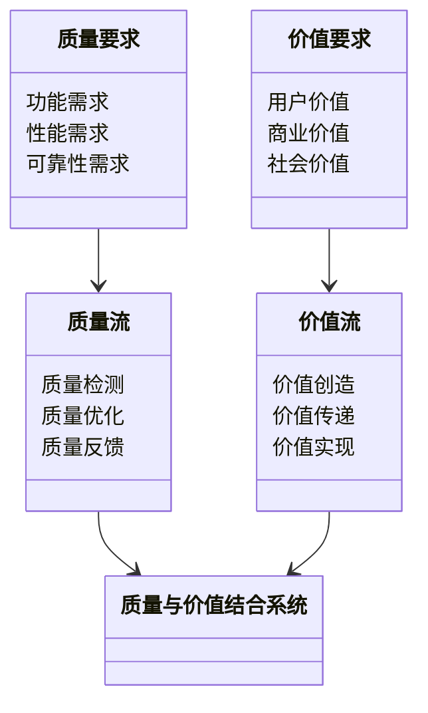
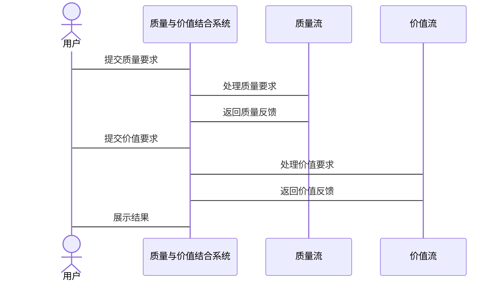
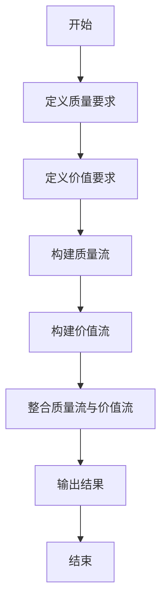

                 


# 罗伯特哈格斯特朗的质量价值结合

## 关键词：质量、价值、系统架构、算法实现、项目实战

## 摘要：本文深入探讨了罗伯特哈格斯特朗的质量价值结合理论，从背景介绍、核心概念、系统架构到算法实现和项目实战，全面分析了质量与价值结合的重要性与实现方法。通过详细讲解系统设计、流程优化和实际案例，本文为读者提供了清晰的理论指导和实践指南。

---

## 第一部分: 质量与价值的概述

### 第1章: 质量与价值的背景介绍

#### 1.1 质量与价值的核心概念
- 1.1.1 质量的定义与属性
  - 质量是产品或服务满足需求的程度。
  - 质量属性包括功能性、可靠性、可维护性、可扩展性等。
- 1.1.2 价值的定义与属性
  - 价值是产品或服务为用户创造的利益或效用。
  - 价值属性包括功能价值、成本价值、时间价值等。
- 1.1.3 质量与价值的关系
  - 质量是实现价值的基础，价值是质量的最终目标。

#### 1.2 质量与价值的背景与问题描述
- 1.2.1 当前质量管理的挑战
  - 传统质量管理注重检测，忽视价值创造。
- 1.2.2 价值流的缺失问题
  - 价值流的不清晰导致资源浪费和效率低下。
- 1.2.3 质量与价值结合的必要性
  - 通过结合质量与价值，实现效率与效益的双赢。

#### 1.3 质量与价值结合的解决方案
- 1.3.1 质量流的构建
  - 质量流是将质量要求转化为具体操作的过程。
- 1.3.2 价值流的构建
  - 价值流是将价值创造转化为具体流程的过程。
- 1.3.3 质量与价值结合的实现路径
  - 通过整合质量流与价值流，实现质量与价值的统一。

---

## 第二部分: 质量与价值的核心概念与联系

### 第2章: 质量与价值的核心概念原理

#### 2.1 质量与价值的属性对比
- 质量属性与价值属性的对比表格：

| 属性       | 质量属性               | 价值属性               |
|------------|-----------------------|-----------------------|
| 功能       | 是否满足功能要求       | 是否创造用户价值       |
| 可靠性      | 系统的稳定性           | 产品是否值得信赖       |
| 成本       | 生产过程的成本控制     | 产品的性价比           |
| 时间       | 产品的开发周期         | 用户获得价值的时间     |

#### 2.2 质量与价值的ER实体关系图
- 实体关系图的构建与分析：

```mermaid
erd
actor 质量与价值结合系统;
entity 质量要求;
entity 价值要求;
entity 质量流;
entity 价值流;
actor 质量与价值结合系统 --> entity 质量要求
actor 质量与价值结合系统 --> entity 价值要求
entity 质量要求 --> entity 质量流
entity 价值要求 --> entity 价值流
entity 质量流 --> entity 质量与价值结合系统
entity 价值流 --> entity 质量与价值结合系统
```

---

## 第三部分: 质量与价值结合的系统分析与架构设计

### 第3章: 系统分析与架构设计方案

#### 3.1 问题场景介绍
- 问题场景：一个企业希望在产品开发过程中实现质量与价值的结合。
- 系统目标：设计一个能够整合质量与价值的系统，提升产品开发效率和用户满意度。
- 系统范围：涵盖产品开发的全过程，包括需求分析、设计、开发、测试和交付。

#### 3.2 系统功能设计
- 领域模型Mermaid类图：



#### 3.3 系统架构设计
- Mermaid架构图：


- 系统架构的实现方式：
  - 使用分层架构，确保各层职责分明。
  - 数据访问层负责与数据库交互。
  - 业务逻辑层负责处理质量与价值的结合逻辑。
  - 用户界面层负责展示结果。

#### 3.4 系统接口设计
- 接口定义与交互流程：
  - 质量流与价值流的交互接口。
  - 接口实现的技术选型：使用RESTful API进行通信。

#### 3.5 系统交互设计
- Mermaid序列图：



---

## 第四部分: 质量与价值结合的算法实现

### 第4章: 算法原理与实现

#### 4.1 质量与价值结合的算法流程
- Mermaid流程图：



#### 4.2 算法实现的Python代码

```python
def quality_value_integration(quality_requirements, value_requirements):
    # 质量流的处理
    quality_flow = process_quality(quality_requirements)
    # 价值流的处理
    value_flow = process_value(value_requirements)
    # 整合质量流与价值流
    integrated_flow = integrate_flows(quality_flow, value_flow)
    return integrated_flow

def process_quality(quality_requirements):
    # 示例：对质量要求进行处理
    processed = []
    for req in quality_requirements:
        processed.append(req)
    return processed

def process_value(value_requirements):
    # 示例：对价值要求进行处理
    processed = []
    for req in value_requirements:
        processed.append(req)
    return processed

def integrate_flows(quality_flow, value_flow):
    # 示例：整合质量流与价值流
    integrated = []
    for q, v in zip(quality_flow, value_flow):
        integrated.append((q, v))
    return integrated

# 示例输入
quality_requirements = ["功能需求", "性能需求", "可靠性需求"]
value_requirements = ["用户价值", "商业价值", "社会价值"]
# 示例输出
result = quality_value_integration(quality_requirements, value_requirements)
print(result)
```

#### 4.3 算法的数学模型和公式
- 质量与价值的加权和公式：
  $$ \text{总价值} = \sum_{i=1}^{n} w_i \times v_i $$
  其中，$w_i$ 是第 $i$ 个质量要求的权重，$v_i$ 是对应的实现价值。

---

## 第五部分: 项目实战

### 第5章: 项目实战与案例分析

#### 5.1 环境安装
- 安装Python和所需的开发工具。
- 安装依赖：`pip install mermaid`, `pip install graphviz`

#### 5.2 系统核心实现源代码
- 核心代码实现：
  ```python
  class QualityValueIntegration:
      def __init__(self, quality_requirements, value_requirements):
          self.quality_requirements = quality_requirements
          self.value_requirements = value_requirements

      def integrate(self):
          # 示例：整合质量与价值
          return [(q, v) for q, v in zip(self.quality_requirements, self.value_requirements)]

  # 使用示例
  qvi = QualityValueIntegration(["功能需求", "性能需求"], ["用户价值", "商业价值"])
  print(qvi.integrate())
  ```

#### 5.3 代码应用解读与分析
- 代码实现的解读：
  - `QualityValueIntegration` 类负责整合质量与价值。
  - `integrate` 方法返回质量与价值的组合列表。

#### 5.4 实际案例分析
- 案例分析：
  - 输入：质量要求包括“功能性”和“可靠性”，价值要求包括“用户体验”和“市场反馈”。
  - 输出：整合后的质量与价值列表。

#### 5.5 项目小结
- 通过代码实现，展示了质量与价值结合的具体步骤。
- 强调了系统设计与算法实现的重要性。

---

## 第六部分: 总结与展望

### 第6章: 总结与展望

#### 6.1 最佳实践 tips
- 在系统设计中，优先考虑质量与价值的结合。
- 使用分层架构，确保系统的可扩展性和可维护性。

#### 6.2 小结
- 本文从背景、概念、系统架构到算法实现和项目实战，全面分析了质量与价值结合的方法。
- 强调了系统设计与流程优化的重要性。

#### 6.3 注意事项
- 在实际应用中，需根据具体需求调整系统架构和算法。
- 注重数据的收集与分析，确保质量与价值的结合效果。

#### 6.4 拓展阅读
- 推荐阅读《软件工程：质量与价值的结合》。
- 关注敏捷开发中的质量与价值结合方法。

---

## 作者：AI天才研究院/AI Genius Institute & 禅与计算机程序设计艺术 /Zen And The Art of Computer Programming

---

通过本文的详细分析，读者可以深入了解罗伯特哈格斯特朗的质量价值结合理论，并通过实际案例和代码实现，掌握质量与价值结合的具体方法。

