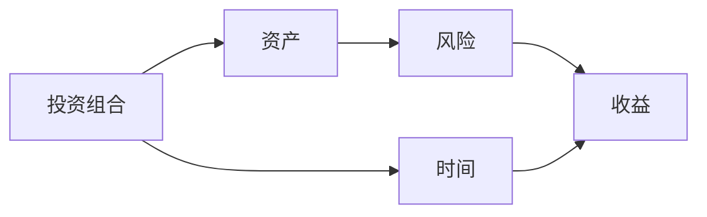

                 


---

# 罗伯特哈格斯特朗的长期增值策略

> 关键词：长期投资，资产配置，风险管理，复利效应，量化投资，MPT，均值-方差优化

> 摘要：  
本文深入探讨罗伯特哈格斯特朗的长期增值策略，从其核心概念、数学模型、算法实现到系统架构，逐一进行分析。通过具体案例和项目实战，揭示如何在实际投资中应用这些策略。文章内容涵盖背景介绍、核心概念与联系、算法原理、系统分析、项目实战以及最佳实践，旨在帮助读者全面理解并掌握长期增值策略的精髓。

---

## 第一部分: 长期增值策略的背景与核心概念

### 第1章: 长期增值策略的定义与背景

#### 1.1 长期增值的定义与核心要素
- **长期增值的定义**：指通过长期持有优质资产，利用复利效应实现财富稳步增长的投资策略。
- **核心要素**：
  - 资产质量：选择具备持续盈利能力和良好治理的企业。
  - 时间跨度：通常以数年至数十年为周期。
  - 风险管理：控制波动，避免重大损失。
- **与短期收益的对比**：短期收益波动大，依赖市场情绪；长期增值注重基本面，追求稳定增长。

#### 1.2 投资策略的基本概念
- **分类**：
  - 价值投资：寻找被市场低估的资产。
  - 成长投资：投资于具有高增长潜力的企业。
  - 投机投资：基于市场波动短期获利。
- **长期增值策略的适用场景**：
  - 投资者具备长期持有耐心。
  - 市场环境稳定，具备长期增长潜力。
- **与短期交易的差异**：
  - 交易频率：长期策略强调低频交易，短期策略高频操作。
  - 风险偏好：长期策略注重风险控制，短期策略容忍高波动。

#### 1.3 长期增值策略的背景与意义
- **当前金融市场环境分析**：
  - 经济周期波动加剧，市场不确定性增加。
  - 机构投资者占比提升，市场趋向理性化。
- **在投资中的重要性**：
  - 抵御通货膨胀，实现财富保值。
  - 利用复利效应，实现财富的指数级增长。
- **边界与外延**：
  - 边界：需考虑市场周期、政策变化等外部因素。
  - 外延：结合其他投资策略，如股息投资、杠杆策略。

### 第2章: 长期增值策略的核心概念与联系

#### 2.1 核心概念原理
- **资产配置与风险分散**：
  - 资产配置：将资金分配到不同资产类别（股票、债券、现金等）以降低风险。
  - 风险分散：通过多元化投资降低特定资产的风险。
- **时间价值与复利效应**：
  - 时间价值：货币的时间价值是复利的基础。
  - 复利效应：收益再投资产生的指数增长。
- **市场波动与长期趋势**：
  - 市场波动：短期波动不可预测，长期趋势可规划。
  - 长期趋势：基于经济基本面和企业盈利能力。

#### 2.2 核心概念属性对比表
| 对比维度 | 长期增值策略 | 短期交易策略 |
|----------|---------------|---------------|
| 目标     | 稳步增长      | 快速盈利      |
| 风险     | 较低          | 较高          |
| 时间跨度 | 数年至十年    | 数周至数月    |
| 操作频率 | 低            | 高            |

#### 2.3 实体关系图


---

## 第二部分: 长期增值策略的算法原理

### 第3章: 长期增值策略的算法实现

#### 3.1 现代投资组合理论（MPT）
- **马科维茨的有效前沿模型**：
  - 通过优化投资组合，使在特定风险水平下收益最大化，或在特定收益下风险最小化。
  - 有效前沿展示了最优投资组合的集合。
- **风险调整后的收益最大化**：
  - 在考虑风险的情况下，选择最优资产配置。
- **无风险利率与风险溢价**：
  - 无风险利率是投资组合的基准，风险溢价是投资者因承担风险而要求的额外收益。

#### 3.2 均值-方差优化模型
- **数学模型**：
  - 最小化方差（风险）：$$\text{Minimize } \sigma^2 \text{ subject to } \mu \geq \text{目标收益}$$
  - 约束条件：投资比例之和为1，收益不低于目标。
- **算法实现**：
  ```python
  import numpy as np
  from scipy.optimize import minimize

  def portfolio_optimization(returns):
      n = len(returns.columns)
      cov_matrix = returns.cov()
      weights = np.ones(n) / n
      res = minimize(
          lambda w: np.dot(w.T, np.dot(cov_matrix, w)),
          weights,
          constraints=[{'type': 'eq', 'fun': lambda w: np.sum(w) - 1}]
      )
      return res.x
  ```

#### 3.3 数学模型与公式
- **均值-方差优化公式**：
  $$\text{Minimize } \sigma^2 \text{ subject to } \mu \geq \text{目标收益}$$
  - 通过拉格朗日乘数法求解。

---

## 第三部分: 系统分析与架构设计

### 第4章: 投资系统的架构与实现

#### 4.1 问题场景介绍
- 投资者希望通过量化方法实现资产配置，优化投资组合。

#### 4.2 系统功能设计
- **用户输入**：输入资产列表、历史收益、风险偏好。
- **数据处理**：计算协方差矩阵，进行优化计算。
- **策略执行**：生成最优投资组合，提供可视化报告。

#### 4.3 系统架构设计


#### 4.4 接口设计与交互流程
- **接口设计**：API提供资产数据和用户偏好。
- **交互流程**：用户提交请求，系统返回优化结果。

---

## 第四部分: 项目实战与经验分享

### 第5章: 项目实战

#### 5.1 环境安装
- **Python环境**：安装Python 3.8+，安装Pip。
- **库安装**：`pip install numpy pandas scipy matplotlib`。

#### 5.2 核心代码实现
- **数据获取**：
  ```python
  import pandas as pd
  data = pd.read_csv('assets.csv')
  ```
- **优化计算**：
  ```python
  def portfolio_optimization(returns):
      n = len(returns.columns)
      cov_matrix = returns.cov()
      weights = np.ones(n) / n
      res = minimize(
          lambda w: np.dot(w.T, np.dot(cov_matrix, w)),
          weights,
          constraints=[{'type': 'eq', 'fun': lambda w: np.sum(w) - 1}]
      )
      return res.x
  ```
- **结果可视化**：
  ```python
  import matplotlib.pyplot as plt
  plt.bar(range(len(weights)), weights)
  plt.show()
  ```

#### 5.3 案例分析与经验总结
- **案例分析**：假设投资组合包含股票和债券，优化后的权重可能为60%股票，40%债券。
- **经验总结**：定期再平衡，关注市场变化，保持耐心。

---

## 第五部分: 最佳实践与小结

### 第6章: 最佳实践与总结

#### 6.1 小结
- 长期增值策略强调基本面分析和长期持有。
- 量化方法提供科学决策支持。

#### 6.2 注意事项
- 定期评估和调整投资组合。
- 保持耐心，避免频繁交易。

#### 6.3 未来趋势
- AI技术的应用将提升策略优化能力。
- 更多量化工具将被开发。

#### 6.4 拓展阅读
- 《投资学》：资产配置与组合管理的基础知识。
- 《Python for Data Analysis》：数据处理与可视化技巧。

---

## 作者

作者：AI天才研究院/AI Genius Institute & 禅与计算机程序设计艺术/Zen And The Art of Computer Programming

---

通过以上结构化和详细的内容，您可以撰写一篇符合要求的技术博客文章。

