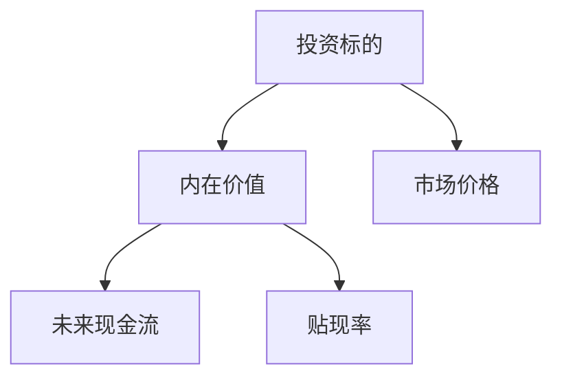
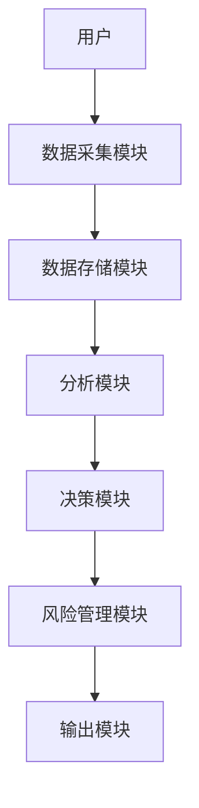

                 


# 罗杰·洛温斯坦的智慧型价值投资

## 关键词：价值投资，智慧型投资，内在价值，DCF模型，投资组合优化

## 摘要：罗杰·洛温斯坦的智慧型价值投资是一种结合深度分析和长期视角的投资方法，通过分析公司的基本面和市场趋势，寻找被低估的投资标的，实现长期稳定的收益。本文详细介绍了智慧型价值投资的核心概念、数学模型、系统架构、项目实战及最佳实践，帮助读者系统地理解和应用这一投资策略。

---

## 第一部分：智慧型价值投资的背景与核心概念

### 第1章：智慧型价值投资的起源与发展

#### 1.1 价值投资的起源与发展

价值投资是一种长期投资策略，起源于20世纪初，由本杰明·格雷厄姆和戴维·多德提出。格雷厄姆强调以低于内在价值的价格买入股票，通过长期持有实现收益。罗杰·洛温斯坦作为格雷厄姆的信徒，进一步发展了这一理论，提出了智慧型价值投资的概念。

#### 1.2 罗杰·洛温斯坦的贡献

罗杰·洛温斯坦在《罗杰·洛温斯坦的投资备忘录》中详细阐述了智慧型价值投资的策略。他强调了深入研究公司基本面、评估管理团队和行业趋势的重要性，提出了通过分析公司财务报表、竞争优势和市场地位来确定内在价值的方法。

#### 1.3 智慧型价值投资的核心思想

智慧型价值投资不仅仅是寻找低估的股票，更注重通过系统化的分析和判断，找到那些具备长期竞争优势、管理稳健且估值合理的公司。这种方法结合了基本面分析和市场趋势，注重长期价值的创造，而非短期价格波动。

### 第2章：智慧型价值投资的核心概念与联系

#### 2.1 核心概念原理

智慧型价值投资的核心在于识别公司的内在价值，即公司未来现金流的现值。这种价值与市场价格的差异提供了投资机会。内在价值的计算需要考虑公司的盈利能力、成长潜力、财务健康状况和行业地位等因素。

#### 2.2 核心概念对比表格

| 概念                | 价值投资               | 成长投资               |
|---------------------|-----------------------|-----------------------|
| 核心目标            | 寻找低估的价值          | 寻找高成长的公司        |
| 投资期限            | 长期持有               | 中长期持有             |
| 风险承受            | 较低，注重安全边际       | 较高，容忍波动           |

#### 2.3 实体关系图（ER图）



---

## 第二部分：智慧型价值投资的核心概念与分析方法

### 第3章：智慧型投资的数学模型与算法原理

#### 3.1 内在价值计算模型

##### 3.1.1 现金流贴现模型（DCF模型）

使用DCF模型计算公司的内在价值，涉及以下几个步骤：

1. **预测未来现金流**：基于公司的财务报表和行业趋势，预测未来5-10年的现金流。
2. **确定贴现率**：通常使用加权平均资本成本（WACC）作为贴现率。
3. **计算终值**：假设公司进入稳定增长阶段，计算终值。
4. **计算总价值**：将未来现金流贴现并加总，加上终值的现值，得到内在价值。

##### 3.1.2 投资组合优化模型

使用马科维茨的均值-方差模型优化投资组合，以实现收益与风险的最佳平衡。

1. **输入参数**：预期收益率、协方差矩阵。
2. **计算最优权重**：求解在给定风险水平下的最优组合。
3. **评估夏普比率**：衡量组合的超额收益。

#### 3.2 使用Python实现DCF模型

```python
def calculate_intrinsic_value(fcf, growth_rate, discount_rate):
    # 计算终值
    terminal_value = fcf * (1 + growth_rate) / (discount_rate - growth_rate)
    # 计算现值
    present_value = (fcf / (1 + discount_rate)) + (terminal_value / (1 + discount_rate))
    return present_value

# 示例数据
fcf = 100  # 自由现金流
growth_rate = 0.05  # 终身增长率
discount_rate = 0.10  # 贴现率

intrinsic_value = calculate_intrinsic_value(fcf, growth_rate, discount_rate)
print(f"内在价值：{intrinsic_value}")
```

---

## 第三部分：系统分析与架构设计方案

### 第4章：智慧型价值投资的系统架构

#### 4.1 系统功能设计

- **数据采集模块**：获取公司财务数据和市场数据。
- **分析模块**：计算内在价值、评估公司基本面。
- **决策模块**：基于分析结果生成投资建议。
- **风险管理模块**：监控投资组合的风险。

#### 4.2 系统架构设计



---

## 第四部分：项目实战

### 第5章：智慧型价值投资的基本应用

#### 5.1 环境安装与数据获取

安装必要的Python库，如pandas、numpy、scipy等，并通过Yahoo Finance获取股票数据。

#### 5.2 核心代码实现

```python
import pandas as pd
import numpy as np

# 示例数据：某公司的财务数据
data = {'Revenue': [100, 120, 130], 
        'Operating Income': [20, 25, 30],
        'Net Income': [15, 20, 25]}
df = pd.DataFrame(data)

# 计算自由现金流（FCF）
df['FCF'] = df['Net Income'] + df['Depreciation'] - df['Capital Expenditure']

# 使用DCF模型计算内在价值
def calculate_fcf_discounted_value(fcf, discount_rate):
    return fcf / discount_rate

# 示例计算
discount_rate = 0.10
intrinsic_value = calculate_fcf_discounted_value(df['FCF'].iloc[-1], discount_rate)
print(f"内在价值：{intrinsic_value}")
```

### 第6章：智慧型价值投资的高级策略

#### 6.1 投资组合优化

使用现代投资组合理论优化投资组合，降低风险并提高收益。

#### 6.2 风险管理

定期监控投资组合的波动性，使用夏普比率评估组合的超额收益。

#### 6.3 动态调整

根据市场变化和公司基本面调整投资组合，保持投资策略的有效性。

---

## 第五部分：最佳实践

### 第7章：智慧型价值投资的最佳实践

#### 7.1 经验总结

- 深入研究公司基本面，关注财务健康和管理团队。
- 保持长期视角，避免短期波动的干扰。
- 定期审视投资组合，及时调整以应对变化。

#### 7.2 注意事项

- 风险管理是投资成功的关键，合理控制杠杆和头寸。
- 避免过度依赖单一模型，结合定性和定量分析。
- 理解市场周期，耐心等待合适的机会。

#### 7.3 拓展阅读

- 《价值：/company秘密》——埃德瓦尔多·斯宾塞
- 《投资的智慧》——彼得·林奇

---

## 作者：AI天才研究院 & 禅与计算机程序设计艺术

这篇文章系统地介绍了罗杰·洛温斯坦的智慧型价值投资，从理论基础到实践应用，结合了数学模型、系统架构和实际案例，帮助读者深入理解这一投资策略。

