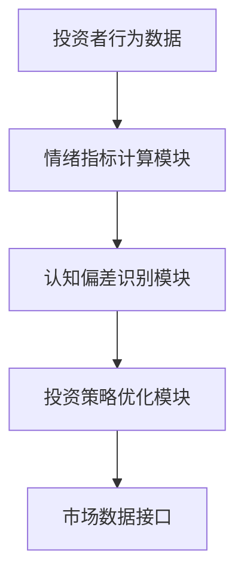

                 

# 罗杰·洛温斯坦的行为金融学与投资决策

> 关键词：行为金融学，投资决策，情绪周期，市场异象，认知偏差，有限理性

> 摘要：本文系统介绍了罗杰·洛温斯坦的行为金融学理论及其在投资决策中的应用。从行为金融学的起源与发展、投资者行为偏差、核心概念与框架、情绪与市场参与、数理模型与算法、系统设计与架构、项目实战与案例分析等方面展开，深入剖析了行为金融学的理论基础与实际应用。通过结合心理学、经济学、数学与计算机科学的多学科视角，本文旨在为投资者提供一个全面的行为金融学分析框架，帮助读者理解市场非理性行为背后的心理机制，并通过科学的方法进行投资决策优化。

---

## 第一部分: 行为金融学与投资决策的背景与基础

### 第1章: 行为金融学的起源与发展

#### 1.1 行为金融学的起源
行为金融学（Behavioral Finance）是研究投资者心理与行为偏差对金融市场影响的学科。传统金融学基于“理性人假设”，即投资者在决策时是理性的、追求效用最大化的。然而，现实中的投资者行为往往表现出非理性特征，如过度自信、从众心理等，这些偏差导致市场出现异象，如短期价格波动、资产价格泡沫等。

#### 1.2 行为金融学的核心观点
行为金融学认为，投资者的决策受到认知偏差、情绪波动和社会环境的影响。市场的价格波动与资产实际价值的偏离可以通过分析投资者行为来解释。行为金融学试图将心理学理论与金融市场研究相结合，揭示非理性行为对市场定价和投资决策的影响。

#### 1.3 行为金融学与心理学的交叉融合
行为金融学的理论基础来源于心理学中的认知心理学、行为心理学和社会心理学。研究者通过实验和观察，发现投资者在决策过程中表现出各种认知偏差，如 anchoring effect（锚定效应）、availability bias（可得性偏差）和 confirmation bias（确认偏差）。这些偏差影响投资者的判断和选择，从而影响市场价格。

---

### 第2章: 投资决策中的行为偏差

#### 2.1 心理偏差对投资决策的影响
心理偏差是投资者在决策过程中常见的非理性行为，主要包括以下几种：

1. **过度自信偏差**：投资者倾向于高估自己的判断能力，认为自己能够预测市场走势。
2. **沉没成本谬误**：投资者因过去的投资而继续投入，即使当前决策不再合理。
3. **羊群效应**：投资者因从众心理而跟随市场趋势，导致市场波动加剧。

#### 2.2 行为偏差与市场异象
行为偏差导致市场出现许多异象，如：

1. **价格波动**：短期价格波动往往超过基本面变化的幅度。
2. **资产泡沫**：投资者非理性行为导致资产价格偏离实际价值。
3. **市场情绪周期**：投资者情绪波动引发市场的周期性波动。

---

## 第二部分: 行为金融学的核心理论与模型

### 第3章: 有限理性与决策过程

#### 3.1 有限理性的概念与特征
有限理性（bounded rationality）是行为金融学的重要概念，指投资者在决策时受到信息处理能力、时间和资源的限制，无法完全理性地进行决策。

#### 3.2 决策过程中的认知偏差
认知偏差是投资者在信息处理过程中产生的系统性错误判断，主要包括：

1. **简化与启发式**：投资者通过简化问题或使用启发式方法来减少信息处理成本。
2. **锚定效应**：投资者在决策时过于依赖初始信息或参考点。
3. **可得性偏差**：投资者根据容易获取的信息做出判断，忽略其他重要信息。

---

### 第4章: 行为金融学中的情绪与市场参与

#### 4.1 情绪在投资决策中的作用
情绪是影响投资决策的重要因素，主要表现为：

1. **情绪周期**：市场情绪会随着时间和市场环境的变化而波动。
2. **情绪与市场参与度**：投资者情绪高涨时，市场参与度提高；情绪低落时，市场交易量减少。

#### 4.2 市场情绪的测量与分析
通过分析市场情绪指标，可以预测市场走势。常用的情绪指标包括：

1. **投资者情绪指数（IPI）**：基于市场参与者的行为数据构建的情绪指标。
2. **媒体情绪分析**：通过分析媒体对市场的报道，评估市场情绪。

---

### 第5章: 行为金融学的数理模型与算法

#### 5.1 行为金融学的数学模型
行为金融学的数学模型结合了心理学理论和金融市场数据，用于分析投资者行为对市场的影响。例如，基于情绪的资产定价模型可以表示为：

$$ P = V + \alpha \times E $$

其中，$P$ 是资产价格，$V$ 是资产的内在价值，$E$ 是投资者情绪指数，$\alpha$ 是情绪影响系数。

#### 5.2 基于行为金融学的投资策略
行为金融学支持以下投资策略：

1. **情绪驱动策略**：根据市场情绪波动进行交易。
2. **认知偏差修正策略**：通过识别和修正投资者的认知偏差来优化投资决策。

---

## 第三部分: 行为金融学的系统设计与架构

### 第6章: 行为金融学分析系统的功能设计

#### 6.1 系统功能模块
行为金融学分析系统主要包括以下几个功能模块：

1. **情绪指标计算模块**：计算投资者情绪指标。
2. **认知偏差识别模块**：识别投资者的认知偏差。
3. **投资策略优化模块**：基于行为分析优化投资策略。

#### 6.2 系统架构设计
行为金融学分析系统的架构设计如图所示：

---

### 第7章: 项目实战与案例分析

#### 7.1 项目背景与目标
本项目旨在通过行为金融学理论，构建一个基于情绪分析的投资决策支持系统。

#### 7.2 系统实现
1. **环境安装**：安装必要的开发工具和数据接口。
2. **情绪指标计算**：基于自然语言处理技术，计算投资者情绪指标。
3. **投资策略优化**：根据情绪指标优化投资策略。

#### 7.3 实际案例分析
通过分析某次市场波动，验证情绪指标对投资决策的影响。

---

## 第四部分: 总结与展望

### 第8章: 总结与展望

#### 8.1 总结
本文系统介绍了行为金融学的核心理论与实际应用，通过结合心理学、经济学、数学与计算机科学的多学科视角，为投资者提供了一个全面的行为金融学分析框架。

#### 8.2 展望
未来的研究可以进一步结合大数据技术，深入分析投资者行为对市场的影响，并开发更多基于行为金融学的投资工具。

---

作者：AI天才研究院 & 禅与计算机程序设计艺术

