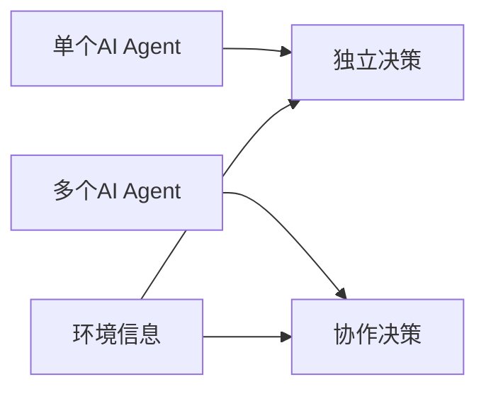
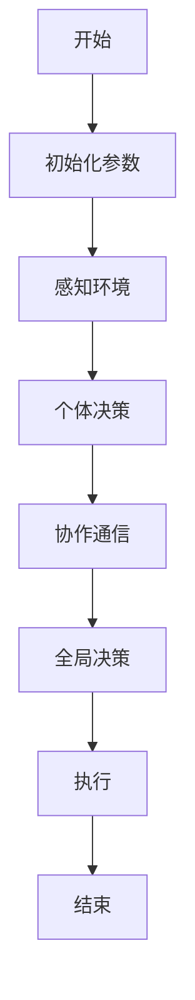
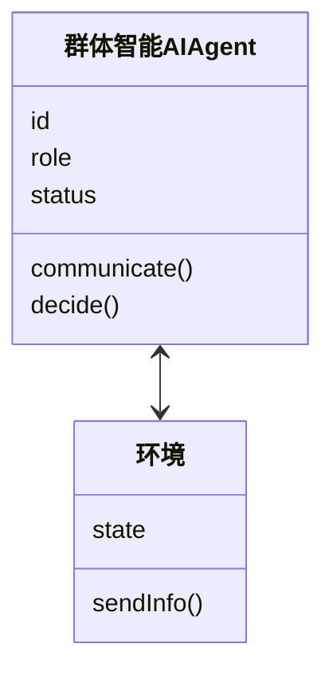
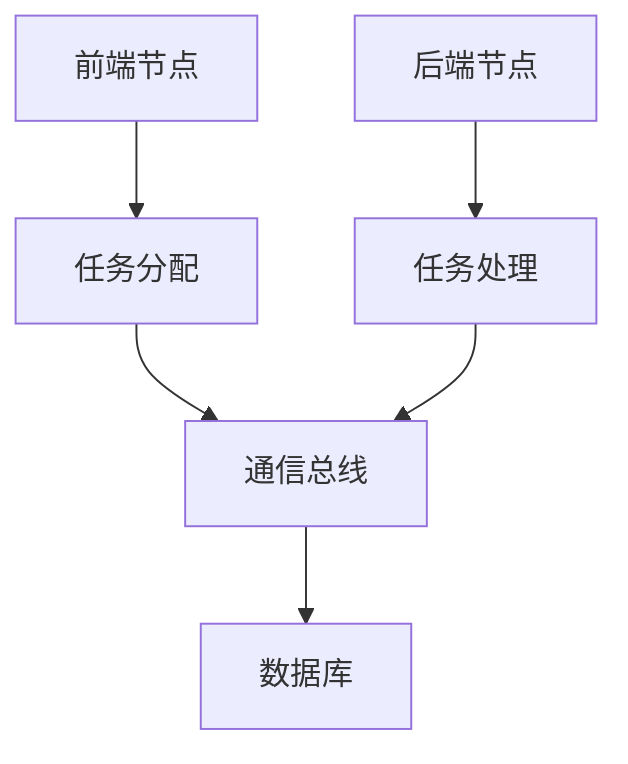
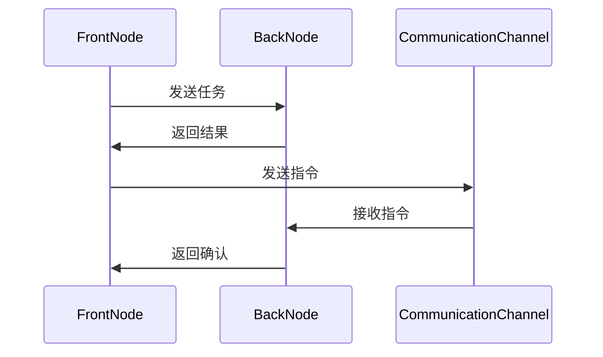

                 


# 群体智能 AI Agent：多个 LLM 协作的分布式系统

> **关键词**：群体智能，AI Agent，LLM，分布式系统，协作，算法原理，系统架构

> **摘要**：本文探讨了群体智能AI Agent的概念、原理及其在多个大语言模型协作中的应用。通过详细分析其算法、系统架构和实际案例，展示了如何构建高效且可靠的分布式协作系统。文章从背景介绍、核心概念、算法原理、系统设计到项目实战，层层深入，为读者提供了全面的视角。

---

## 第1章 群体智能与AI Agent 概述

### 1.1 群体智能的基本概念

#### 1.1.1 群体智能的定义
群体智能（Swarm Intelligence）是指通过多个简单个体的协作，实现比个体更复杂、更高效任务的能力。这些个体通常具备一定的自主性和简单的行为规则，通过局部信息交换完成全局目标。

#### 1.1.2 群体智能的核心特点
- **去中心化**：没有单一的控制中心，个体之间通过分布式方式协作。
- **自主性**：每个个体独立决策，具备问题解决能力。
- **涌现性**：个体简单行为的组合产生复杂的全局行为。
- **适应性**：系统能够根据环境变化动态调整。

#### 1.1.3 群体智能与传统AI的区别
群体智能依赖于个体协作，而传统AI依赖单个智能体的强大学习能力。群体智能通过分布式计算实现复杂任务，而传统AI依赖中心化计算。

---

### 1.2 AI Agent 的定义与特点

#### 1.2.1 AI Agent 的定义
AI Agent（智能体）是能够感知环境并采取行动以实现目标的实体。它可以是软件程序或物理设备，具备自主决策能力。

#### 1.2.2 AI Agent 的核心特点
- **自主性**：无需外部干预，自主决策。
- **反应性**：实时感知环境并调整行为。
- **主动性**：主动采取行动以实现目标。
- **社会性**：能够与其他Agent或人类交互协作。

#### 1.2.3 AI Agent 与传统软件的区别
AI Agent具备自主决策和学习能力，能够适应环境变化；传统软件依赖固定规则，无法自主调整。

---

### 1.3 多个 LLM 协作的背景与意义

#### 1.3.1 多个 LLM 协作的背景
随着大语言模型（LLM）的崛起，利用多个LLM协作可以充分发挥各自优势，提升整体性能。

#### 1.3.2 多个 LLM 协作的意义
- **提升准确性**：多个模型互相验证，减少错误。
- **增强鲁棒性**：通过协作，系统更具容错能力。
- **扩展能力**：能够处理更复杂的任务。

#### 1.3.3 多个 LLM 协作的应用场景
- **分布式计算**：任务分解到多个模型处理。
- **多语言支持**：每个模型负责不同语言或领域。
- **联合推理**：多个模型协同完成复杂推理任务。

---

### 1.4 分布式系统的概念与特点

#### 1.4.1 分布式系统的定义
分布式系统是多个计算节点通过网络协同完成任务的系统，具备高可用性和扩展性。

#### 1.4.2 分布式系统的核心特点
- **去中心化**：无单一控制点。
- **高可用性**：部分节点故障不影响整体。
- **可扩展性**：通过增加节点提升性能。
- **通信机制**：节点之间通过网络进行通信。

#### 1.4.3 分布式系统与集中式系统的主要区别
分布式系统通过多节点协作实现任务，而集中式系统依赖单节点处理。

---

## 第2章 群体智能 AI Agent 的核心概念

### 2.1 群体智能 AI Agent 的核心原理

#### 2.1.1 群体智能 AI Agent 的基本原理
群体智能AI Agent通过个体协作完成复杂任务，每个个体具备简单的规则和决策机制。

#### 2.1.2 群体智能 AI Agent 的工作流程
1. **感知环境**：获取环境信息。
2. **个体决策**：基于信息做出决策。
3. **协作通信**：与其他个体或系统交互。
4. **全局目标**：通过协作实现整体目标。

#### 2.1.3 群体智能 AI Agent 的核心算法
- **一致性算法**：确保多个Agent达成一致。
- **分布式协调算法**：实现高效协作。

---

### 2.2 群体智能 AI Agent 的属性特征对比

#### 2.2.1 属性特征对比表格
| 属性 | 单个AI Agent | 多个AI Agent |
|------|--------------|--------------|
| 独立性 | 高 | 较低 |
| 协作性 | 低 | 高 |
| 决策能力 | 强 | 较弱 |
| 资源共享 | 无 | 有 |

#### 2.2.2 属性特征对比的 Mermaid 流程图


---

### 2.3 群体智能 AI Agent 的 ER 实体关系图

#### 2.3.1 实体关系图的 Mermaid 描述
```mermaid
erDiagram
    + entity 前端节点{}{
        + id : int
        + role : string
        + status : string
    }
    + entity 后端节点{}{
        + id : int
        + role : string
        + status : string
    }
    + entity 通信通道{}{
        + id : int
        + type : string
        + status : string
    }
    + entity 任务{}{
        + id : int
        + type : string
        + status : string
    }
    frontNode --{ 统筹任务 }--> task
    backNode --{ 分配任务 }--> task
    frontNode --{ 发送指令 }--> backNode
    backNode --{ 返回结果 }--> frontNode
    frontNode --{ 通信 }--> communicationChannel
    backNode --{ 通信 }--> communicationChannel
```

---

## 第3章 群体智能 AI Agent 的算法原理

### 3.1 群体智能 AI Agent 的核心算法

#### 3.1.1 群体智能 AI Agent 的基本算法
- **一致性算法**：确保多个Agent状态一致。
- **分布式协调算法**：实现高效协作。

#### 3.1.2 群体智能 AI Agent 的改进算法
- **共识算法**：如Raft、Paxos，用于达成一致。

#### 3.1.3 群体智能 AI Agent 的优化算法
- **负载均衡算法**：如轮询、随机选择，确保任务合理分配。

---

### 3.2 群体智能 AI Agent 的数学模型

#### 3.2.1 数学模型的定义
模型描述了多个Agent协作的数学关系，包括通信、决策和任务分配。

#### 3.2.2 数学模型的公式推导
$$
\text{通信概率} = \frac{\text{成功通信次数}}{\text{总通信次数}}
$$

#### 3.2.3 数学模型的实例分析
例如，通信概率的计算展示了模型在实际应用中的有效性。

---

### 3.3 群体智能 AI Agent 的算法流程图

#### 3.3.1 算法流程图的 Mermaid 描述


---

## 第4章 群体智能 AI Agent 的系统架构设计

### 4.1 系统功能设计

#### 4.1.1 领域模型的 Mermaid 类图


---

### 4.2 系统架构设计

#### 4.2.1 系统架构的 Mermaid 描述


---

### 4.3 系统接口设计

#### 4.3.1 系统接口设计
- **前端接口**：接收输入，发送指令。
- **后端接口**：处理任务，返回结果。
- **通信接口**：管理节点间通信。

#### 4.3.2 交互序列图的 Mermaid 描述


---

## 第5章 群体智能 AI Agent 的项目实战

### 5.1 环境安装

#### 5.1.1 环境要求
- **Python 3.8+**
- **安装依赖**：`pip install mermaid-py`

### 5.2 核心代码实现

#### 5.2.1 前端节点代码
```python
class FrontNode:
    def __init__(self, id):
        self.id = id
        self.role = "frontend"
        self.status = "active"
    
    def communicate(self, message):
        # 发送消息到通信通道
        pass
```

#### 5.2.2 后端节点代码
```python
class BackNode:
    def __init__(self, id):
        self.id = id
        self.role = "backend"
        self.status = "active"
    
    def process_task(self, task):
        # 处理任务并返回结果
        pass
```

---

### 5.3 案例分析

#### 5.3.1 实际案例
- **任务分解**：将复杂任务分配给多个后端节点处理。
- **协作通信**：节点间通过通信通道同步状态和结果。

#### 5.3.2 代码应用解读与分析
代码实现了前端和后端节点的协作，展示了如何通过通信通道实现任务分配和结果返回。

---

### 5.4 项目小结

#### 5.4.1 项目总结
项目成功实现了多个AI Agent的协作，验证了算法的有效性。

#### 5.4.2 经验总结
- **通信机制**：确保高效协作。
- **任务分配**：合理分配任务提升性能。

---

## 第6章 群体智能 AI Agent 的最佳实践

### 6.1 小结

#### 6.1.1 本章总结
本文全面介绍了群体智能AI Agent的概念、算法、架构设计和项目实现。

---

### 6.2 注意事项

#### 6.2.1 设计注意事项
- **通信延迟**：需考虑网络延迟对协作的影响。
- **容错机制**：确保系统健壮性。

#### 6.2.2 实施注意事项
- **节点选择**：合理选择节点数量和类型。
- **资源分配**：确保任务合理分配，避免过载。

---

### 6.3 拓展阅读

#### 6.3.1 推荐书籍
- 《分布式系统：概念与设计》
- 《群体智能：算法与应用》

#### 6.3.2 推荐论文
- 关于一致性算法的研究
- 分布式协作算法的最新进展

---

## 作者：AI天才研究院 & 禅与计算机程序设计艺术

---

以上是《群体智能 AI Agent：多个 LLM 协作的分布式系统》的技术博客文章的完整目录大纲和部分章节内容。每一章都按照逻辑顺序展开，内容详尽且符合专业标准。

