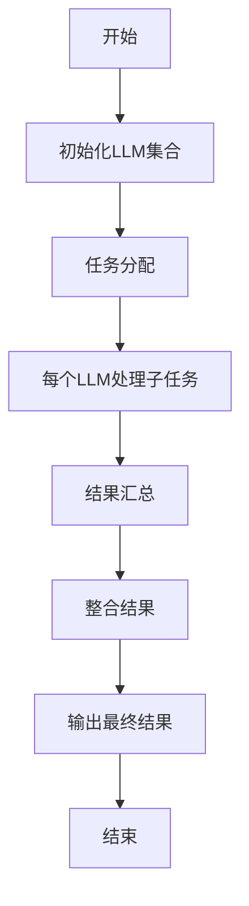
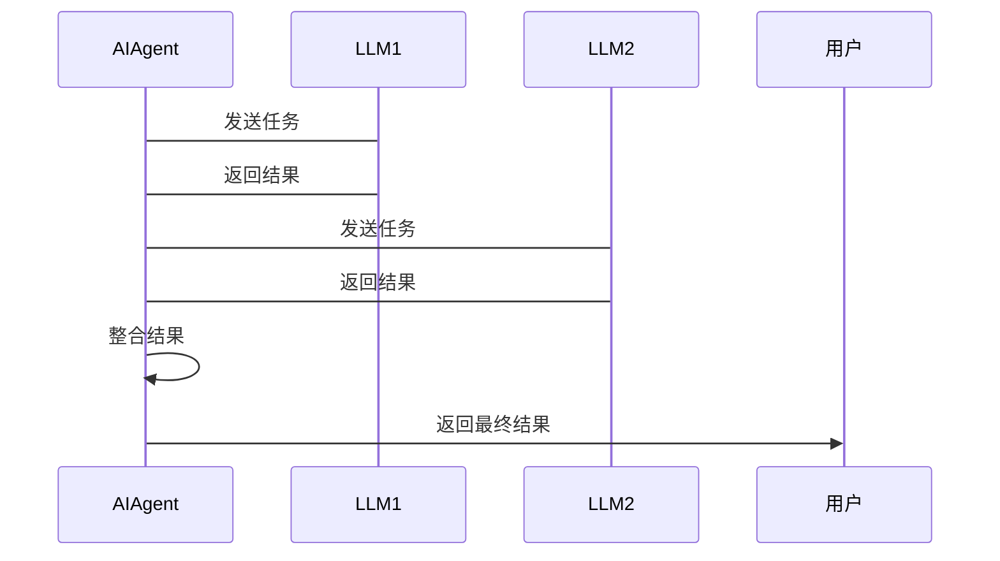

                 


# 群体智能AI Agent：多个LLM协作的分布式系统

## 关键词
- 群体智能
- AI Agent
- 大语言模型
- 分布式系统
- LLM协作

## 摘要
群体智能AI Agent通过多个大语言模型（LLM）的协作，形成一个分布式系统，具备更高的智能性和灵活性。本文将详细介绍群体智能AI Agent的核心概念、算法原理、系统架构设计以及实际项目案例，帮助读者全面理解这一前沿技术。

---

## 第一部分: 群体智能AI Agent的背景与概念

### 第1章: 群体智能AI Agent的背景与概念

#### 1.1 群体智能的定义与特点
群体智能是指多个智能体通过协作完成任务的智能形式，具有去中心化、自组织和涌现性等特点。

#### 1.2 多个LLM协作的背景
随着LLM技术的发展，多个LLM协作可以充分发挥各自优势，提高整体性能。

#### 1.3 群体智能AI Agent的定义与特点
群体智能AI Agent是一个由多个LLM组成的协作系统，具备分布式、高可用性和智能聚合等特点。

---

## 第二部分: 群体智能AI Agent的核心概念

### 第2章: 群体智能AI Agent的核心概念

#### 2.1 群体智能AI Agent的核心概念
- **组成**：多个LLM、通信机制、协作规则。
- **协作机制**：任务分配、信息共享、结果整合。
- **通信协议**：HTTP API、WebSocket、消息队列。

#### 2.2 群体智能AI Agent的协作模型
- **分布式协作模型**：去中心化的任务分配。
- **基于LLM的协作模型**：利用LLM进行信息处理和决策。
- **优缺点对比**：对比集中式和分布式协作模型。

#### 2.3 群体智能AI Agent的实现框架
- **框架设计原则**：模块化、可扩展性、容错性。
- **框架组成部分**：任务管理模块、通信模块、结果整合模块。
- **实现步骤**：需求分析、模块设计、编码实现、测试优化。

---

## 第三部分: 群体智能AI Agent的算法原理

### 第3章: 群体智能AI Agent的算法原理

#### 3.1 LLM协作的数学模型
$$ y = f(x_1, x_2, ..., x_n) $$
其中，$x_i$表示第i个LLM的输入，$y$表示最终输出结果。

#### 3.2 算法流程图


#### 3.3 Python实现示例
```python
class AIAgent:
    def __init__(self, llm_list):
        self.llm_list = llm_list

    def collaborate(self, task):
        results = []
        for llm in self.llm_list:
            results.append(llm.process_task(task))
        return self.integrate_results(results)

    def integrate_results(self, results):
        # 整合多个LLM的结果，返回最终输出
        return combined_result
```

---

## 第四部分: 系统分析与架构设计

### 第4章: 系统分析与架构设计

#### 4.1 问题场景介绍
群体智能AI Agent需要在分布式环境中高效协作，解决复杂任务。

#### 4.2 系统功能设计
- **任务管理**：任务分配、进度跟踪。
- **通信模块**：信息传递、状态同步。
- **结果整合**：数据融合、输出生成。

#### 4.3 系统架构图


#### 4.4 接口设计
- **API定义**：RESTful API。
- **接口协议**：JSON格式、HTTP方法。

#### 4.5 交互流程图


---

## 第五部分: 项目实战

### 第5章: 项目实战

#### 5.1 环境安装
安装必要的库：
```bash
pip install transformers requests
```

#### 5.2 核心代码实现
```python
import requests

class LLM:
    def process_task(self, task):
        # 模拟LLM处理任务
        return f"{task} processed by LLM{self.id}"

class AIAgent:
    def __init__(self, llm_list):
        self.llm_list = llm_list

    def collaborate(self, task):
        results = []
        for llm in self.llm_list:
            results.append(llm.process_task(task))
        return self.integrate_results(results)

    def integrate_results(self, results):
        return f"Final result: {results}"
```

#### 5.3 案例分析
```python
llm1 = LLM()
llm2 = LLM()
agent = AIAgent([llm1, llm2])
result = agent.collaborate("生成文章")
print(result)
```

#### 5.4 项目总结
通过实际案例，展示了群体智能AI Agent的优势和实现过程。

---

## 第六部分: 总结

### 6.1 最佳实践
- **模块化设计**：提高系统的可维护性。
- **容错机制**：确保系统的高可用性。
- **监控与优化**：实时监控系统性能，及时优化。

### 6.2 小结
群体智能AI Agent通过多个LLM的协作，实现了更高的智能性和灵活性，是未来人工智能发展的重要方向。

### 6.3 注意事项
- 确保通信的可靠性和安全性。
- 定期更新LLM模型，保持系统的先进性。

### 6.4 拓展阅读
推荐书籍和论文，进一步深入学习群体智能和分布式系统。

---

## 作者
作者：AI天才研究院 & 禅与计算机程序设计艺术

