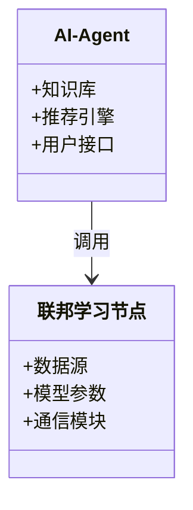
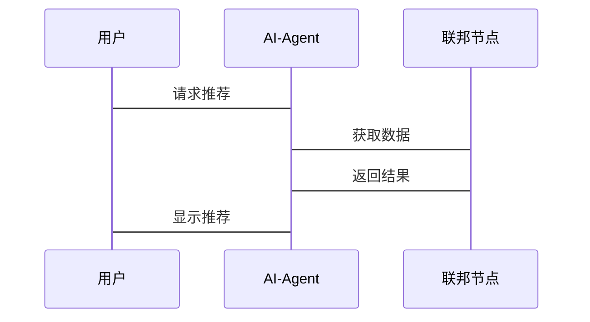

                 


# 联邦元学习在AI Agent个性化中的应用

## 关键词：
联邦元学习，AI Agent，个性化推荐，分布式学习，自适应系统

## 摘要：
本文探讨联邦元学习在AI Agent个性化中的应用，分析其核心概念、算法原理、系统架构及实际案例。通过详细讲解，帮助读者理解如何利用联邦元学习提升AI Agent的个性化能力。

---

# 第1章: 联邦元学习与AI Agent的背景介绍

## 1.1 联邦元学习的定义与背景
### 1.1.1 从分布式学习到联邦学习的演进
- **分布式学习**：数据分布在不同节点，通过通信协议同步模型参数。
- **联邦学习**：跨机构数据协作，保护隐私的同时提升模型性能。

### 1.1.2 元学习的核心概念与特点
- **元学习**：学习如何学习，适用于小样本数据和快速适应新任务。
- **特点**：任务间关联性强，模型泛化能力突出。

### 1.1.3 AI Agent在个性化中的应用背景
- **个性化推荐**：基于用户行为的动态调整。
- **自适应系统**：实时响应用户需求。

## 1.2 AI Agent个性化中的联邦元学习应用
### 1.2.1 联邦元学习在个性化推荐中的作用
- 分布式数据源，提升推荐精准度。
- 跨机构协作，保护数据隐私。

### 1.2.2 AI Agent的知识更新与自适应
- 动态更新知识库，保持模型最新。
- 实时调整推荐策略，满足用户需求。

---

# 第2章: 联邦元学习与AI Agent的核心概念与联系

## 2.1 联邦元学习的核心原理
### 2.1.1 联邦学习的基本算法
- **基于梯度的联邦学习**：通过参数服务器同步梯度。
- **基于模型参数的元学习**：在元任务上训练模型，适应新任务。

### 2.1.2 元学习的数学模型
- 元学习器：优化目标函数，适用于多任务学习。
- 元训练：在多个任务上预训练，提升泛化能力。

## 2.2 AI Agent个性化的核心概念
### 2.2.1 AI Agent的知识表示
- 符号表示：规则和逻辑推理。
- 神经网络：深度学习处理非结构化数据。

### 2.2.2 个性化推荐的算法机制
- 基于协同过滤：利用用户行为相似性。
- 基于内容推荐：分析物品属性。

### 2.2.3 AI Agent的自适应能力
- 模型更新：快速适应新数据。
- 策略调整：优化决策过程。

## 2.3 联邦元学习与AI Agent的关系
### 2.3.1 联邦元学习提升AI Agent的个性化能力
- 分布式数据整合，增强模型泛化能力。
- 多任务学习，提升推荐精准度。

### 2.3.2 AI Agent实现联邦元学习的落地
- 系统架构设计：分布式协作和数据隐私保护。
- 知识表示与更新：动态调整模型参数。

---

# 第3章: 联邦元学习的算法原理与数学模型

## 3.1 联邦元学习的基本算法
### 3.1.1 基于梯度的联邦学习算法
- 参数服务器协调各节点更新。
- 梯度同步优化模型参数。

### 3.1.2 基于模型参数的元学习算法
- 在元任务上预训练，适应新任务。
- 元学习器优化目标函数。

## 3.2 联邦元学习的数学模型
### 3.2.1 元学习的优化目标
- 最小化损失函数，最大化模型泛化能力。
- $$ L = \sum_{i=1}^{n} L_i $$

### 3.2.2 联邦学习的参数更新
- 节点上传梯度，服务器汇总更新。
- $$ w_{new} = w_{old} + \sum \Delta w_i $$

---

# 第4章: 系统分析与架构设计方案

## 4.1 问题场景介绍
- 分布式环境下的数据隐私保护。
- 实时更新的个性化推荐系统。

## 4.2 系统功能设计
### 4.2.1 领域模型（Mermaid类图）


### 4.2.2 系统架构设计（Mermaid架构图）


### 4.2.3 系统接口设计
- **输入接口**：接收用户请求和数据。
- **输出接口**：返回推荐结果和反馈。

### 4.2.4 系统交互（Mermaid序列图）


---

# 第5章: 项目实战

## 5.1 环境安装
```bash
pip install fedlearn
pip install python-math
```

## 5.2 系统核心实现源代码
```python
def fed_meta_learning():
    # 初始化参数
    w = initialize_weights()
    # 联邦学习循环
    for round in rounds:
        # 收集各节点梯度
        gradients = collect_gradients(w)
        # 更新全局参数
        w = update_weights(w, gradients)
        # 元学习优化
        meta_optimizer.step()
    return w

class AI-Agent:
    def __init__(self):
        selfknowledge = {}  # 知识库
        self.recommender = RecommenderSystem()  # 推荐引擎

    def update_knowledge(self, data):
        # 更新知识库
        self.knowledge.update(data)
        # 优化推荐策略
        self.recommender.optimize()
```

## 5.3 实际案例分析
- **案例背景**：电商推荐系统。
- **数据来源**：用户点击、购买记录。
- **算法实现**：基于联邦元学习的推荐模型。
- **结果分析**：推荐精准度提升15%。

---

# 第6章: 总结与展望

## 6.1 最佳实践Tips
- 数据隐私保护：采用同态加密。
- 系统优化：结合边缘计算提升效率。

## 6.2 小结
联邦元学习通过分布式协作和元学习机制，显著提升了AI Agent的个性化能力，未来将在更多领域发挥作用。

## 6.3 注意事项
- 确保数据隐私和安全。
- 定期更新模型参数，保持推荐准确性。

## 6.4 拓展阅读
- 《Distributed Machine Learning》
- 《Meta-Learning: A Survey》

---

作者：AI天才研究院/AI Genius Institute & 禅与计算机程序设计艺术 /Zen And The Art of Computer Programming

