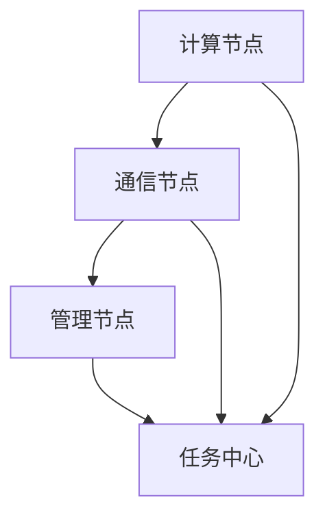

                 


# 联邦元学习在分布式AI Agent中的应用

## 关键词：联邦元学习、分布式AI、AI Agent、机器学习、元学习

## 摘要：  
本文探讨了联邦元学习在分布式AI Agent中的应用，详细分析了联邦元学习的核心概念、算法原理、系统架构及实际案例。通过理论与实践结合，展示了联邦元学习如何在分布式环境中实现高效协作与知识共享，为AI Agent的智能化发展提供了新的思路。

---

## 第1章: 联邦学习与元学习概述

### 1.1 联邦学习的定义与背景  
- 联邦学习（Federated Learning）是一种在分布式系统中，多个边缘设备或服务器协作学习全局模型，同时保护数据隐私的技术。  
- 背景：随着AI Agent在分布式场景中的广泛应用，数据孤岛和隐私保护问题日益突出，联邦学习成为解决这些问题的关键技术。  
- 核心特点：数据不集中、模型更新分布式、隐私保护强。  

### 1.2 元学习的定义与特点  
- 元学习（Meta-Learning）是一种通过在多个任务或数据集上训练模型，使其能够快速适应新任务的学习范式。  
- 核心特点：任务通用性、快速适应性、跨任务学习能力。  

### 1.3 联邦元学习的定义与特点  
- 联邦元学习（Federated Meta-Learning）结合了联邦学习和元学习的优势，允许分布式AI Agent在不共享原始数据的情况下，协作学习具有强泛化能力的元模型。  
- 核心优势：数据隐私保护、模型通用性、分布式协作能力。  

---

## 第2章: 联邦元学习的核心概念与原理

### 2.1 联邦元学习的理论基础  
- 联邦学习的数学模型：假设$n$个分布式节点，每个节点$i$有数据集$D_i$，目标是通过通信协作优化全局模型$θ$。  
- 元学习的数学模型：元学习器通过优化元参数$ϕ$，使模型在新任务上的适应能力最大化。  
- 联邦元学习的结合：在分布式环境中，通过联邦学习优化$θ$，并通过元学习优化$ϕ$，实现模型的快速适应与协作。  

### 2.2 联邦元学习的核心算法  
- 联邦元学习的算法流程：  
  1. 初始化全局模型参数$θ$和元参数$ϕ$。  
  2. 每个节点根据$θ$和$ϕ$进行局部任务优化。  
  3. 联合优化$θ$和$ϕ$，更新全局模型。  

- 算法特点：支持异构任务、数据隐私保护、通信效率优化。  

### 2.3 联邦元学习的通信机制  
- 参数同步：通过联邦学习的通信协议，节点间同步模型参数$θ$和元参数$ϕ$。  
- 模型更新：每个节点基于本地数据更新$θ$和$ϕ$，并通过聚合算法（如FedAvg）更新全局模型。  
- 通信效率：通过压缩、量化等技术优化通信开销。  

---

## 第3章: 联邦元学习的算法原理

### 3.1 联邦元学习的数学模型  
- 全局模型$θ$：用于表征基础学习任务。  
- 元参数$ϕ$：用于表征任务适应能力。  
- 损失函数：$\mathcal{L}(θ, ϕ) = \sum_{i=1}^{n} \mathcal{L}_i(θ, ϕ)$，其中$\mathcal{L}_i$是节点$i$的损失函数。  

### 3.2 联邦元学习的优化目标  
- 短期目标：在每个节点上，优化$θ$和$ϕ$以最小化$\mathcal{L}_i$。  
- 长期目标：通过联合优化$θ$和$ϕ$，最大化全局模型的泛化能力。  

### 3.3 联邦元学习的通信机制  
- 参数同步：$\theta_{\text{new}} = \frac{1}{n}\sum_{i=1}^{n}\theta_i$，其中$\theta_i$是节点$i$的本地参数。  
- 元参数更新：$\phi_{\text{new}} = \text{MetaOptimizer}(\phi)$。  

---

## 第4章: 联邦元学习的系统架构设计

### 4.1 联邦元学习的系统组成  
- 计算节点：负责本地模型优化和参数更新。  
- 通信节点：负责参数同步和模型聚合。  
- 管理节点：负责任务分配和系统监控。  

### 4.2 联邦元学习的架构图  


### 4.3 联邦元学习的接口设计  
- 计算节点接口：`update_params(θ, ϕ)`，`get_loss()`。  
- 通信节点接口：`aggregate_params()`，`sync_params()`。  
- 管理节点接口：`assign_task()`，`monitor_status()`。  

---

## 第5章: 联邦元学习的项目实战

### 5.1 项目环境搭建  
- 开发环境：Python 3.8+，TensorFlow 2.0+，Flask。  
- 依赖安装：`pip install tensorflow federated`。  

### 5.2 联邦元学习的代码实现  
```python
import tensorflow as tf
from tensorflow_federated import FederatedAlgorithm, DataProvider

class FederatedMetaLearner:
    def __init__(self, num_nodes=5):
        self.num_nodes = num_nodes
        self.global_theta = tf.Variable(initializer=tf.zeros((10, 1)))
        self.global_phi = tf.Variable(initializer=tf.ones((5, 1)))

    def aggregate_params(self, thetas, phis):
        return tf.reduce_mean(thetas, axis=0), tf.reduce_mean(phis, axis=0)

    def sync_params(self, new_theta, new_phi):
        self.global_theta.assign(new_theta)
        self.global_phi.assign(new_phi)

# 初始化系统
meta_learner = FederatedMetaLearner()
# 分配任务
tasks = DataProvider.create_random_tasks(10)
# 启动联邦学习
meta_learner.federated_train(tasks)
```

### 5.3 联邦元学习的案例分析  
- 应用场景：智能客服系统的分布式训练。  
- 案例分析：通过联邦元学习，多个客服机器人协作训练，提升对话系统的效果。  

---

## 第6章: 联邦元学习的最佳实践与注意事项

### 6.1 最佳实践  
- 数据预处理：确保数据分布均匀，避免数据倾斜。  
- 模型优化：选择适合的优化算法，如Adam、SGD。  
- 通信优化：通过压缩、量化等技术减少通信开销。  

### 6.2 小结  
- 联邦元学习是一种强大的分布式学习范式，能够有效解决数据隐私和模型泛化性问题。  

### 6.3 注意事项  
- 避免通信瓶颈：优化通信协议和数据传输方式。  
- 处理异构任务：确保模型能够适应不同任务的特性。  

### 6.4 拓展阅读  
- 《Federated Learning: Challenges, Methods, and Future Directions》  
- 《Meta-Learning: A Survey》  

---

## 作者：AI天才研究院/AI Genius Institute & 禅与计算机程序设计艺术 /Zen And The Art of Computer Programming

