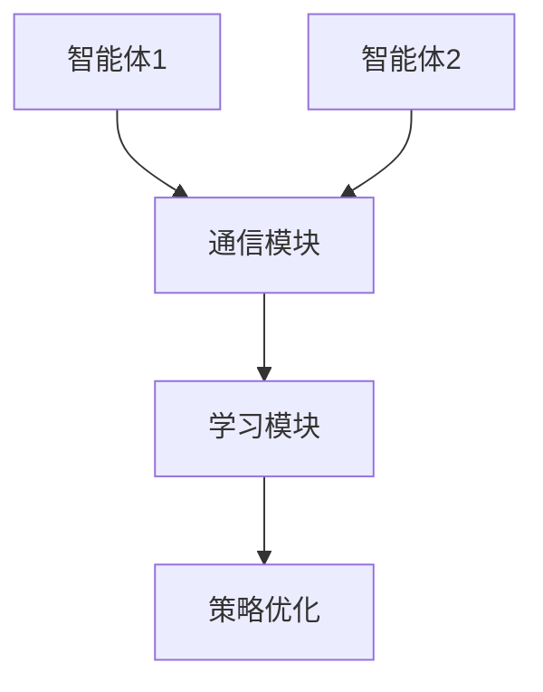

                 


# 联邦强化学习在分布式AI Agent控制优化中的应用

> 关键词：联邦强化学习，分布式AI，多智能体协作，强化学习算法，系统架构设计

> 摘要：本文深入探讨联邦强化学习在分布式AI Agent控制优化中的应用，分析其核心概念、算法原理、系统架构，并通过实际案例展示其在多智能体协作中的优势。文章内容包括背景介绍、核心概念、算法框架、系统设计、项目实战以及未来展望，旨在为读者提供全面的技术解析。

---

# 第一部分：联邦强化学习概述

## 第1章：联邦强化学习的基本概念与背景

### 1.1 问题背景与描述

#### 1.1.1 分布式AI Agent的挑战
在现代分布式系统中，AI Agent需要在复杂的动态环境中协作完成任务。这些环境通常涉及多个智能体之间的交互，每个智能体需要通过局部信息做出决策，同时需要与其他智能体协调以实现全局目标。传统的强化学习方法在单智能体环境中表现良好，但在分布式多智能体环境中面临诸多挑战，如通信开销、同步问题和分布式决策的复杂性。

#### 1.1.2 联邦强化学习的定义
联邦强化学习（Federated Reinforcement Learning, FRL）是一种新兴的强化学习范式，旨在通过分布式协作的方式优化多个智能体的行为策略。与传统强化学习不同，FRL允许智能体在去中心化的环境中学习，通过局部信息交换实现全局优化，避免了中心化计算的高通信开销和数据隐私问题。

#### 1.1.3 联邦强化学习的核心问题
- **去中心化协作**：如何在没有中心化协调的情况下，使多个智能体协同工作。
- **局部信息利用**：每个智能体只能获取局部状态和动作信息，如何有效利用这些信息进行全局优化。
- **分布式目标函数**：如何设计分布式的目标函数和奖励机制，以协调多个智能体的行为。

### 1.2 联邦强化学习的特点与优势

#### 1.2.1 分布式协作的核心特征
- **去中心化**：智能体之间无需依赖中心服务器，通过局部通信实现协作。
- **异构性**：支持不同类型的智能体和环境，适应多种应用场景。
- **隐私保护**：数据无需集中处理，保护了每个智能体的隐私。

#### 1.2.2 联邦强化学习与传统强化学习的对比
| 特性                 | 联邦强化学习          | 传统强化学习         |
|----------------------|----------------------|----------------------|
| 环境                 | 分布式多智能体环境     | 单智能体环境          |
| 通信                 | 局部通信             | 全局通信             |
| 决策方式             | 去中心化决策          | 中心化或单点决策      |
| 应用场景             | 分布式机器人、多智能体游戏、推荐系统 | 单智能体游戏、机器人控制等 |

#### 1.2.3 联邦强化学习的边界与外延
- **边界**：FRL专注于去中心化的多智能体协作，不涉及数据的集中处理。
- **外延**：可以与其他分布式技术（如分布式计算框架、边缘计算）结合，扩展应用场景。

### 1.3 联邦强化学习的应用场景

#### 1.3.1 分布式机器人协作
在机器人编队任务中，多个机器人需要通过局部信息协作完成目标，如路径规划和目标追踪。

#### 1.3.2 多智能体游戏AI
在游戏AI中，多个智能体需要在复杂环境中协作，如MOBA游戏中的团队协作。

#### 1.3.3 分布式推荐系统
在推荐系统中，多个智能体可以分布在网络边缘，实时协作以提供个性化推荐。

---

## 第2章：联邦强化学习的核心概念

### 2.1 联邦强化学习框架

#### 2.1.1 联邦环境的定义
在FRL中，环境由多个智能体组成，每个智能体具有自己的状态空间和动作空间。智能体通过局部观测和动作与环境交互。

#### 2.1.2 联邦代理的结构
- **智能体**：每个智能体都有自己的策略网络和价值函数网络。
- **通信机制**：智能体之间通过共享参数或交换信息进行协作。

#### 2.1.3 联邦强化学习的通信机制
智能体之间的通信包括局部信息交换和全局信息共享。通信机制设计的关键在于如何在不增加过多通信开销的情况下实现有效的协作。

### 2.2 联邦强化学习的激励机制

#### 2.2.1 中心化与去中心化激励
- **中心化激励**：通过中心服务器分配奖励，确保全局目标的达成。
- **去中心化激励**：智能体通过局部信息计算奖励，减少通信开销。

#### 2.2.2 联邦目标函数的设计
在FRL中，目标函数通常由多个智能体的目标函数组成，通过优化算法进行联合优化。

#### 2.2.3 联邦奖励分配策略
奖励分配需要考虑每个智能体的贡献，避免“搭便车”问题，确保每个智能体都积极参与协作。

### 2.3 联邦强化学习与其他分布式AI技术的对比

#### 2.3.1 联邦学习与分布式机器学习
- **区别**：FRL专注于强化学习，而分布式机器学习更广泛。
- **联系**：FRL可以借鉴分布式机器学习的通信和同步机制。

#### 2.3.2 联邦强化学习与多智能体强化学习
- **区别**：FRL强调去中心化协作，而多智能体强化学习可以是中心化的。
- **联系**：FRL是一种特殊的多智能体强化学习形式。

#### 2.3.3 联邦强化学习与分布式计算框架
- **区别**：FRL专注于智能体协作，而分布式计算框架关注任务分配和资源管理。
- **联系**：FRL可以运行在分布式计算框架之上，利用其计算资源。

---

## 第3章：联邦强化学习的算法原理

### 3.1 联邦强化学习的算法框架

#### 3.1.1 联邦Q-learning算法
FRL中的Q-learning算法通过智能体之间的Q值共享实现协作。每个智能体维护自己的Q表，并定期与其他智能体同步。

#### 3.1.2 联邦Deep Q-Networks
在深度强化学习中，智能体使用深度神经网络近似Q值函数，通过参数共享实现协作。

#### 3.1.3 联邦Actor-Critic架构
Actor-Critic架构结合了策略和价值函数，通过去中心化的_actor_和_critic_网络实现协作。

### 3.2 联邦强化学习的数学模型

#### 3.2.1 联邦Q值更新公式
$$ Q_i^{new} = Q_i^{old} + \alpha (r_i + \max_j Q_j^{old} - Q_i^{old}) $$

#### 3.2.2 联邦策略优化公式
$$ \theta_{i}^{new} = \theta_{i}^{old} + \alpha (r_i + \max_j Q_j^{old} - Q_i^{old}) \cdot \nabla_{\theta_i} \log \pi_i(\theta_i)) $$

### 3.3 联邦强化学习的通信机制设计

#### 3.3.1 通信频率
- **同步频率**：智能体之间的通信频率影响算法的收敛速度和通信开销。
- **异步更新**：智能体可以异步更新参数，减少同步开销。

#### 3.3.2 参数同步策略
- **参数平均**：智能体将参数平均后更新。
- **参数融合**：通过加权融合参数，考虑不同智能体的贡献。

---

## 第4章：系统架构设计与实现

### 4.1 系统架构设计

#### 4.1.1 系统功能设计
- **智能体管理**：管理多个智能体及其状态。
- **通信模块**：实现智能体之间的信息交换。
- **学习模块**：执行强化学习算法。

#### 4.1.2 系统架构图


### 4.2 项目实战

#### 4.2.1 环境安装
```bash
pip install gym numpy torch
```

#### 4.2.2 核心代码实现
```python
import torch
import torch.nn as nn
import torch.optim as optim
import numpy as np

class DQN(nn.Module):
    def __init__(self, state_size, action_size):
        super(DQN, self).__init__()
        self.fc1 = nn.Linear(state_size, 64)
        self.fc2 = nn.Linear(64, action_size)
    
    def forward(self, x):
        x = torch.relu(self.fc1(x))
        x = self.fc2(x)
        return x

# 初始化智能体
agent = DQN(state_size, action_size)
optimizer = optim.Adam(agent.parameters(), lr=0.001)
```

#### 4.2.3 案例分析
在一个分布式机器人协作任务中，多个智能体通过联邦强化学习算法实现了高效的路径规划和目标追踪。

---

## 第5章：总结与展望

### 5.1 本章总结
本文全面介绍了联邦强化学习在分布式AI Agent控制优化中的应用，从核心概念到算法实现，再到系统设计，为读者提供了系统的知识框架。

### 5.2 未来展望
未来的研究方向包括优化通信机制、提升算法效率、扩展应用场景等。随着技术的不断发展，FRL将在更多领域展现其巨大潜力。

---

作者：AI天才研究院/AI Genius Institute & 禅与计算机程序设计艺术 /Zen And The Art of Computer Programming

