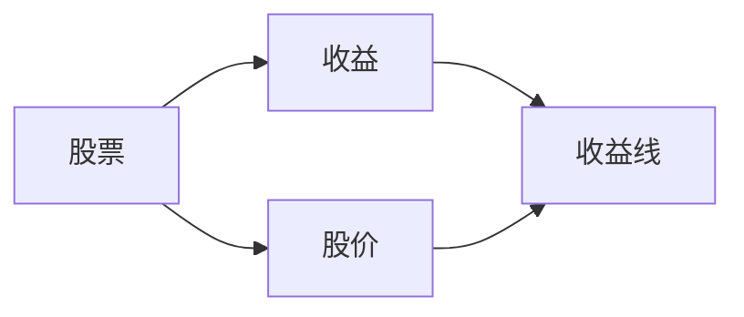
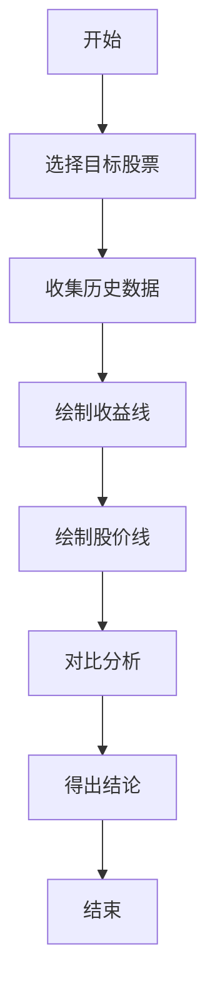
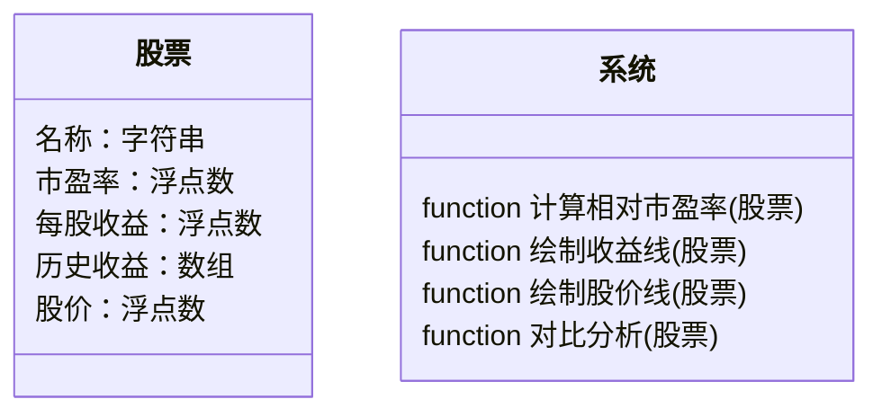
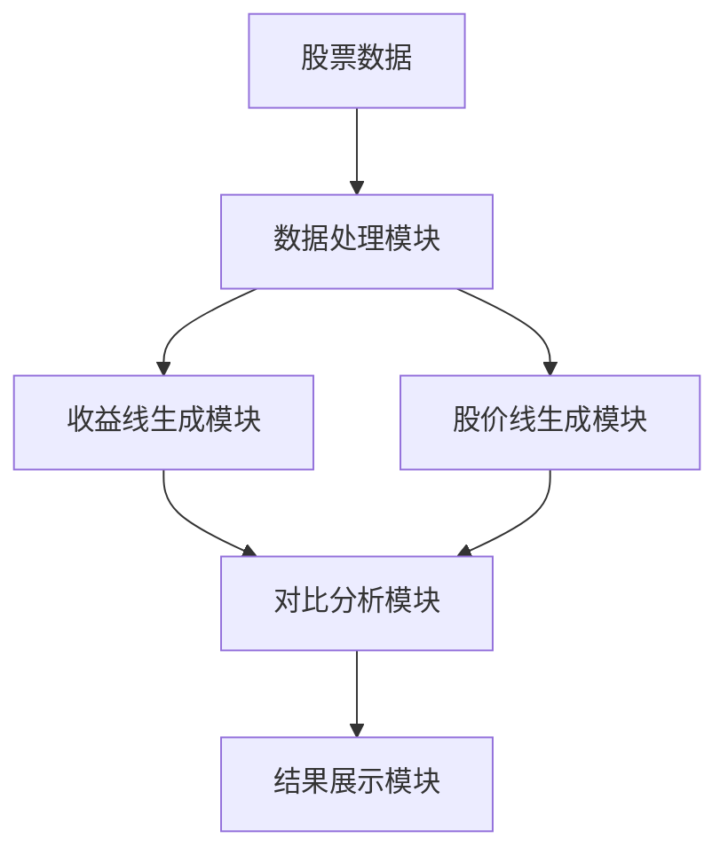
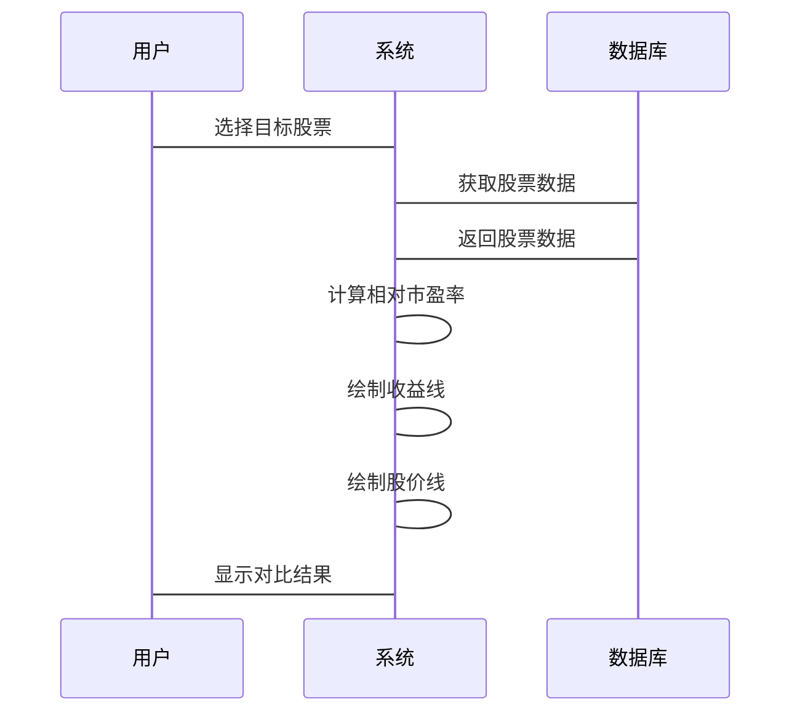

                 


# {{此处是文章标题}}

## 关键词：{{此处列出文章的5-7个核心关键词}}

## 摘要：{{此处给出文章的核心内容和主题思想}}

---

### 目录

---

# 第一部分: 股价与收益线的比较：彼得·林奇的估值方法概述

## 第1章: 投资的基础知识与背景介绍

### 1.1 投资的基本概念

#### 1.1.1 什么是股票

- 股票的定义
- 股票的基本类型
- 股票市场的基本运作机制

#### 1.1.2 投资的目的与意义

- 投资的基本目的
- 投资与投机的区别
- 投资在个人财务规划中的作用

#### 1.1.3 彼得·林奇的背景与投资理念

- 彼得·林奇的个人简介
- 他的投资理念和方法
- 他在投资界的地位和影响

### 1.2 股价与收益的基本关系

#### 1.2.1 股价的定义与影响因素

- 股价的定义
- 影响股价的主要因素
- 市场情绪对股价的影响

#### 1.2.2 收益的定义与计算方法

- 收益的定义
- 净利润的计算方法
- 每股收益（EPS）的计算

#### 1.2.3 股价与收益的关系概述

- 股价与收益的正相关关系
- 收益增长对股价的影响
- 市场对收益的预期

---

## 第2章: 彼得·林奇的估值方法

### 2.1 彼得·林奇的估值核心思想

#### 2.1.1 价值投资的基本原则

- 价值投资的核心理念
- 林奇对价值投资的诠释
- 长期投资与短期波动的平衡

#### 2.1.2 林奇的“三重过滤法”

- 第一重过滤：公司基本面分析
- 第二重过滤：财务状况评估
- 第三重过滤：股票价格评估

#### 2.1.3 林奇对成长型股票的偏好

- 成长型股票的定义
- 成长型股票的投资策略
- 林奇对成长型股票的选择标准

### 2.2 股价与收益线的比较方法

#### 2.2.1 收益线的定义与绘制方法

- 收益线的定义
- 收益线的绘制步骤
- 收益线的分析方法

#### 2.2.2 股价与收益线的对比分析

- 股价与收益线的对比图示
- 对比分析的意义
- 林奇如何利用对比分析进行估值

#### 2.2.3 林奇如何通过收益线判断股票价值

- 收益线的形态分析
- 收益线与股价的匹配
- 收益线的未来预测

---

## 第3章: 彼得·林奇估值方法的核心概念与联系

### 3.1 核心概念原理

#### 3.1.1 股票内在价值的计算公式

- 内在价值的定义
- 内在价值的计算公式
- 林奇对内在价值的解读

#### 3.1.2 收益线与股价的关系模型

- 关系模型的建立
- 模型的数学表达式
- 模型的应用实例

#### 3.1.3 林奇的相对市盈率法

- 相对市盈率法的定义
- 相对市盈率法的计算步骤
- 相对市盈率法的优缺点

### 3.2 核心概念对比表格

| 概念       | 定义与特点                |
|------------|--------------------------|
| 股价       | 当前市场上的股票价格     |
| 收益线     | 股票历史收益的图形表示    |
| 市盈率     | 股票价格与每股收益的比值 |

### 3.3 实体关系图



---

## 第4章: 彼得·林奇估值方法的算法原理

### 4.1 算法原理概述

#### 4.1.1 林奇相对市盈率法的步骤

- 确定目标行业
- 选择具有成长性的公司
- 计算相对市盈率
- 判断投资价值

#### 4.1.2 收益线与股价的对比分析

- 数据收集与整理
- 绘制收益线和股价线
- 对比分析与结果解读

#### 4.1.3 市场情绪对估值的影响

- 市场情绪的定义
- 市场情绪对股价的影响
- 林奇对市场情绪的应对策略

### 4.2 算法流程图



### 4.3 数学公式

#### 4.3.1 相对市盈率公式

$$ 相对市盈率 = \frac{股票市盈率}{行业平均市盈率} $$

#### 4.3.2 内在价值公式

$$ 内在价值 = \frac{净利润 \times (1 + 增长率)}{资本成本 - 增长率} $$

---

## 第5章: 系统分析与架构设计方案

### 5.1 问题场景介绍

- 股票估值的常见问题
- 收益线与股价线的对比分析
- 林奇估值方法的实际应用

### 5.2 系统功能设计

#### 5.2.1 领域模型



#### 5.2.2 系统架构设计



### 5.3 系统接口设计

- 数据输入接口
- 数据处理接口
- 图形生成接口
- 结果展示接口

### 5.4 系统交互设计



---

## 第6章: 项目实战

### 6.1 环境安装

- Python安装
- 安装pandas和matplotlib库
- 安装jupyter notebook

### 6.2 系统核心实现源代码

```python
import pandas as pd
import matplotlib.pyplot as plt

# 数据加载
df = pd.read_csv('stock_data.csv')

# 计算相对市盈率
industry_avg_pe = df['行业平均市盈率'].mean()
df['相对市盈率'] = df['市盈率'] / industry_avg_pe

# 绘制收益线
plt.figure(figsize=(10, 6))
plt.plot(df['日期'], df['收益'], label='收益线')
plt.plot(df['日期'], df['股价'], label='股价线')
plt.xlabel('日期')
plt.ylabel('数值')
plt.legend()
plt.title('收益线与股价线对比图')
plt.show()
```

### 6.3 代码应用解读与分析

- 数据加载：从CSV文件加载股票数据
- 相对市盈率计算：计算行业平均市盈率并计算相对市盈率
- 图形绘制：绘制收益线和股价线，并进行对比分析

### 6.4 实际案例分析

- 案例选择：选择一个具体的股票进行分析
- 数据分析：计算相对市盈率并绘制收益线和股价线
- 结果解读：根据对比结果判断股票的估值是否合理

### 6.5 项目小结

- 项目目标的实现
- 遇到的问题及解决方法
- 经验总结

---

## 第7章: 最佳实践

### 7.1 小结

- 本章的主要内容总结
- 关键知识点回顾
- 学习成果巩固

### 7.2 注意事项

- 数据来源的可靠性
- 市场情绪的影响
- 方法的局限性

### 7.3 拓展阅读

- 推荐书籍：《彼得·林奇的投资智慧》
- 相关文章：《价值投资的奥秘》
- 在线课程：《股票估值方法实战》

---

# 结语

通过本章的学习，读者应该能够掌握彼得·林奇的估值方法，并能够在实际投资中灵活运用。希望本书能够为读者的投资之路提供有价值的指导和帮助。

---

## 作者：{{此处填写作者信息}}

