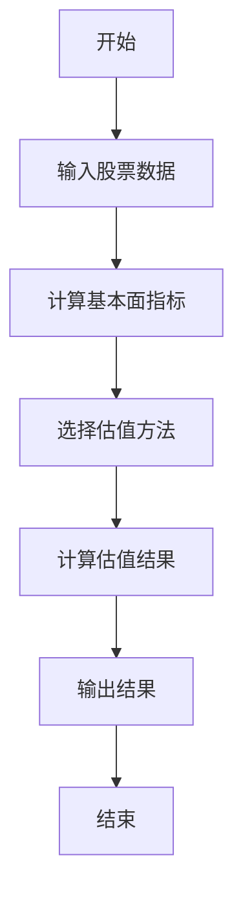

                 


# 股市估值在金融危机前后的变化特征

> 关键词：金融危机、股市估值、市盈率、市净率、现金流折现模型

> 摘要：本文分析了金融危机前后股市估值的变化特征，探讨了影响股市估值的核心因素，介绍了常用的股市估值方法，包括市盈率、市净率和现金流折现模型，并通过实际案例展示了这些方法在金融危机前后的应用。本文还提出了构建股市估值分析系统的方案，并对未来研究方向进行了展望。

---

## 第一部分：背景与基本概念

### 第1章：金融危机与股市估值的背景

#### 1.1 金融危机的定义与特征
- 金融危机的定义：金融危机是指金融体系中发生的重大波动或崩溃，通常表现为股市崩盘、银行破产、经济衰退等。
- 金融危机的主要特征：
  - 市场流动性枯竭
  - 投资者信心下降
  - 经济增长放缓或停滞
- 金融危机对股市的影响：
  - 股价大幅下跌
  - 市场波动性显著增加
  - 投资者恐慌性抛售

#### 1.2 股市估值的基本概念
- 股票估值的定义：股票估值是指对股票内在价值的估计，通常基于公司财务数据、市场环境和行业趋势等因素。
- 股市估值的核心要素：
  - 公司盈利能力
  - 行业地位
  - 宏观经济环境
  - 市场情绪
- 股市估值与市场波动的关系：
  - 市场波动会影响估值的准确性
  - 估值为投资者提供参考，但需结合市场环境动态调整

#### 1.3 金融危机前后股市估值的变化
- 金融危机前的股市估值特征：
  - 市盈率（P/E）普遍偏高
  - 市净率（P/B）接近或超过1
  - 投资者过度乐观，忽视风险
- 金融危机后的股市估值变化：
  - 市盈率和市净率显著下降
  - 投资者趋于保守，更关注公司基本面
  - 市场波动性降低，估值更加理性

### 第2章：股市估值的核心概念与联系

#### 2.1 金融市场的基本概念
- 资产定价理论：
  - 资产价格由其内在价值决定
  - 内在价值基于未来现金流的现值
- 市场参与者的角色：
  - 投资者：机构投资者和个人投资者
  - 交易中介：券商、交易所
  - 监管机构：证监会等
- 股市估值的核心要素：
  - 宏观经济因素（GDP、利率、通货膨胀）
  - 行业因素（行业周期、政策影响）
  - 公司基本面因素（收入、利润、资产负债）

#### 2.2 股市估值的关键因素
- 宏观经济因素：
  - 利率水平：低利率环境通常推高市盈率
  - 经济周期：经济衰退时估值可能被低估
- 行业因素：
  - 行业景气度：景气行业估值较高
  - 政策支持：政府政策影响行业估值
- 公司基本面因素：
  - 盈利能力：净利润增长率
  - 财务状况：资产负债率、现金流

#### 2.3 股市估值与金融危机的联系
- 金融危机对市场情绪的影响：
  - 投资者恐慌导致估值偏离基本面
  - 市场情绪波动影响短期估值
- 金融危机对市场流动性的影响：
  - 流动性枯竭导致估值下降
  - 流动性充裕时估值可能被高估
- 金融危机对市场定价机制的影响：
  - 价格发现机制失灵
  - 市场参与者行为变化影响估值

---

## 第二部分：算法原理与数学模型

### 第3章：股市估值的数学模型与算法原理

#### 3.1 股票估值的主要方法
- 市盈率（P/E）法：
  - 公式：P = E × PE
  - 解释：E为每股收益，PE为市盈率倍数
- 市净率（P/B）法：
  - 公式：P = B × PB
  - 解释：B为每股净资产，PB为市净率倍数
- 现金流折现法（DCF）：
  - 公式：V = ∑(CF_t / (1 + r)^t)
  - 解释：CF_t为第t年的现金流，r为折现率

#### 3.2 股票估值的数学模型
- 市盈率模型：
  $$ P = E \times PE $$
  - 例如：某公司每股收益为1元，市盈率为15倍，则股价为15元。
- 现金流折现模型：
  $$ V = \sum_{t=1}^{n} \frac{CF_t}{(1+r)^t} $$
  - 例如：假设某公司未来5年的现金流分别为100, 120, 130, 150, 180万元，折现率为10%，则现值为：
  $$ V = \frac{100}{1.1} + \frac{120}{1.1^2} + \frac{130}{1.1^3} + \frac{150}{1.1^4} + \frac{180}{1.1^5} $$

#### 3.3 股票估值算法的流程图


---

## 第三部分：系统分析与架构设计

### 第4章：股市估值分析系统的设计

#### 4.1 问题场景介绍
- 系统目标：构建一个能够分析金融危机前后股市估值变化的系统
- 项目介绍：通过数据采集、处理、分析和可视化，帮助投资者更好地理解股市估值的变化

#### 4.2 系统功能设计
- 数据采集模块：
  - 从股票交易所获取历史数据
  - 数据清洗和预处理
- 数据分析模块：
  - 计算市盈率、市净率等指标
  - 应用现金流折现模型进行估值
- 数据可视化模块：
  - 绘制股价走势图
  - 对比金融危机前后估值变化

#### 4.3 系统架构设计


---

## 第四部分：项目实战

### 第5章：金融危机前后股市估值的案例分析

#### 5.1 环境安装
- 数据获取工具：使用Yahoo Finance API或Excel
- 分析工具：Python（Pandas、Matplotlib）

#### 5.2 核心实现
- 数据采集：
  ```python
  import pandas as pd
  from pandas_datareader import data

  df = data.get_data_yahoo('AAPL', start='2007-01-01', end='2023-12-31')
  ```
- 数据分析：
  ```python
  df['PE'] = df['Close'] / df['Earnings per Share']
  df['PB'] = df['Close'] / df['Book Value per Share']
  ```
- 数据可视化：
  ```python
  import matplotlib.pyplot as plt

  plt.plot(df['PE'])
  plt.title('市盈率变化')
  plt.show()
  ```

#### 5.3 案例分析
- 以2008年金融危机为例：
  - 金融危机前（2007年）：市盈率偏高，市场过度乐观
  - 金融危机后（2009年）：市盈率下降，市场估值回归理性

---

## 第五部分：结论与展望

### 第6章：结论与未来研究方向

#### 6.1 研究总结
- 金融危机对股市估值的影响显著，主要表现为估值水平的下降和市场情绪的转变
- 常用的估值方法（如市盈率、市净率、现金流折现模型）在不同市场环境下表现各异

#### 6.2 未来研究方向
- 引入机器学习算法提升估值准确性
- 多因素模型在估值中的应用
- 大数据技术在股市估值中的潜力

---

## 作者信息

作者：AI天才研究院/AI Genius Institute & 禅与计算机程序设计艺术 /Zen And The Art of Computer Programming

---

这篇文章通过逐步分析金融危机前后股市估值的变化特征，结合理论与实践，为投资者和研究者提供了有价值的参考。

