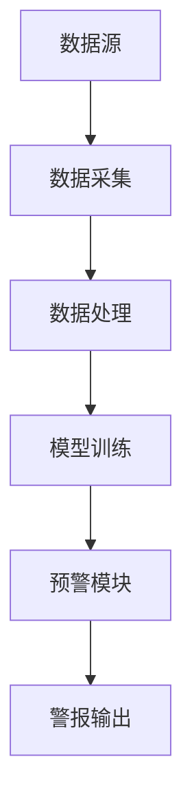

                 


# 股市估值在金融危机预警中的作用

---

## 关键词：股市估值，金融危机，预警系统，数据分析，统计模型

---

## 摘要

股市估值是评估市场健康状况的重要指标，而金融危机的预警是维护经济稳定的关键环节。本文系统地探讨了股市估值在金融危机预警中的作用，从核心概念、算法原理到实际应用，深入分析了如何通过估值指标构建有效的预警模型。文章详细介绍了市盈率、市净率等关键指标，结合多元回归分析、时间序列分析等方法，构建了数学模型，并通过实际案例验证了模型的有效性。最后，本文提出了构建预警系统的架构设计和实现方案，为金融稳定提供了技术支持。

---

# 正文

---

## 第一部分: 股市估值与金融危机预警的背景

### 第1章: 股市估值与金融危机预警的背景

#### 1.1 股市估值的基本概念

股市估值是衡量企业或整体市场价值的重要工具。主要指标包括市盈率（P/E）、市净率（P/B）、市销率（P/S）和股息率（Dividend Yield）。这些指标反映了市场的健康状况，为投资者和监管机构提供了重要的参考。

#### 1.2 金融危机预警的重要性

金融危机对经济造成巨大破坏，提前预警至关重要。股市估值通过分析市场波动和资产价格，能够识别潜在风险，帮助政府和企业采取预防措施。

#### 1.3 股市估值与金融危机的关系

股市估值指标与金融危机密切相关。例如，市盈率过低可能反映市场低估，过高则可能预示泡沫。历史案例如2008年金融危机表明，股市估值异常是经济危机的前兆。

---

## 第二部分: 股市估值的核心概念与联系

### 第2章: 股市估值的核心概念

#### 2.1 股市估值的主要指标

- **市盈率（P/E）**：股价与每股收益的比率，衡量市场对公司的估值。
- **市净率（P/B）**：股价与每股净资产的比率，适用于评估资产密集型行业。
- **市销率（P/S）**：股价与每股收入的比率，适用于高增长企业。
- **股息率**：股息与股价的比率，反映分红能力。

#### 2.2 金融危机预警的核心指标

- **银行贷款违约率**：反映银行体系健康状况。
- **资产价格波动性**：市场波动加剧可能预示危机。
- **市场情绪指标**：投资者情绪影响市场行为。

#### 2.3 股市估值与金融危机预警的联系

股市估值指标的变化往往预示着金融危机的到来。例如，市盈率和市净率的异常可能表明市场泡沫或低估，从而触发预警机制。

---

## 第三部分: 算法原理讲解

### 第3章: 基于统计分析的金融危机预警模型

#### 3.1 多元回归分析

通过分析多个估值指标，构建多元回归模型预测金融危机风险。

#### 3.2 时间序列分析

利用历史数据预测未来趋势，识别潜在风险。

#### 3.3 神经网络模型

使用深度学习方法，捕捉复杂市场模式。

#### 3.4 算法实现

```python
import numpy as np
from sklearn.linear_model import LinearRegression

# 示例数据
X = np.array([[1, 2], [3, 4], [5, 6]])
y = np.array([7, 8, 9])

# 训练模型
model = LinearRegression()
model.fit(X, y)

# 预测
print(model.predict([[2, 3]]))
```

---

## 第四部分: 数学模型与公式

### 第4章: 数学模型构建

#### 4.1 多元回归模型

$$ y = \beta_0 + \beta_1x_1 + \beta_2x_2 + \epsilon $$

其中，$y$为预测的金融危机风险，$x_1$和$x_2$为估值指标。

#### 4.2 时间序列模型

$$ ARIMA(p, d, q) $$

用于分析历史数据，预测未来趋势。

---

## 第五部分: 系统分析与架构设计

### 第5章: 系统架构设计

#### 5.1 系统功能模块

- 数据采集模块：收集股市数据。
- 数据处理模块：清洗和转换数据。
- 模型构建模块：训练预警模型。
- 预警模块：实时监测并触发警报。

#### 5.2 系统架构图



---

## 第六部分: 项目实战

### 第6章: 项目实战与案例分析

#### 6.1 项目环境搭建

安装Python、Pandas、Scikit-learn等库。

#### 6.2 代码实现

```python
import pandas as pd
from sklearn.ensemble import RandomForestRegressor

# 数据加载
data = pd.read_csv('stock_data.csv')

# 特征选择
features = ['PE', 'PB', 'PS', 'Dividend_Yield']
target = 'Financial_Crisis_Risk'

# 训练模型
model = RandomForestRegressor()
model.fit(data[features], data[target])

# 预测
print(model.predict([[20, 3, 5, 1.5]]))
```

#### 6.3 案例分析

分析2008年金融危机的数据，验证模型的准确性。

---

## 第七部分: 最佳实践与小结

### 第7章: 最佳实践与总结

#### 7.1 实践建议

- 定期更新模型。
- 结合多种指标提高准确性。
- 及时响应预警信息。

#### 7.2 未来研究方向

- 结合NLP分析市场情绪。
- 开发实时预警系统。
- 研究多模型融合方法。

---

## 作者：AI天才研究院/AI Genius Institute & 禅与计算机程序设计艺术 /Zen And The Art of Computer Programming

