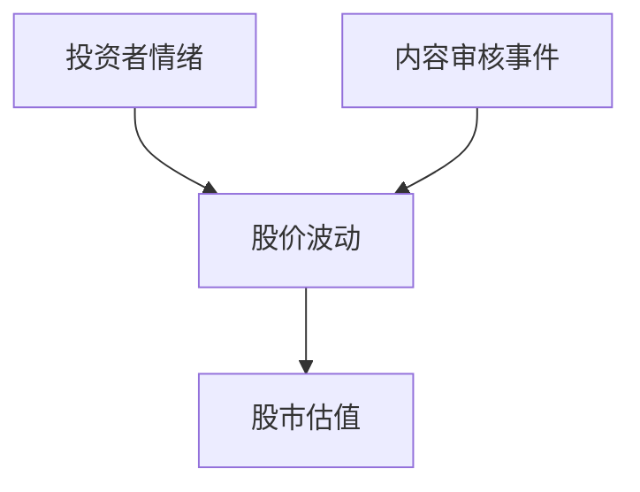

                 


# 股市估值对跨境数字内容审核的影响

---

## 关键词

股市估值，跨境数字内容审核，企业声誉，股价波动，内容风险管理，投资者情绪，数字化转型

---

## 摘要

随着全球化和数字化的深入发展，跨境数字内容审核对企业的声誉和投资者信心产生了越来越重要的影响。本文探讨了股市估值与跨境数字内容审核之间的关联，分析了内容审核事件如何影响股价波动，并提出了优化内容风险管理以维护股市估值的策略。通过案例分析和数据建模，本文揭示了内容审核在企业价值评估中的潜在作用，并为投资者和企业提供实用的见解。

---

## 第1章：背景介绍

### 1.1 股市估值的基本概念

股市估值是评估企业价值的重要指标，主要通过市盈率（P/E）、市净率（P/B）、股息率等指标来衡量。这些指标反映了市场对公司未来盈利能力的预期，影响投资者的决策。

$$ P/E = \frac{\text{股价}}{\text{每股收益}} $$

### 1.2 跨境数字内容审核的背景

跨境数字内容审核涉及审查不同地区的网络内容，以符合当地法律法规。随着全球化的加剧，企业面临内容审查标准差异化的挑战，影响其品牌形象和市场表现。

### 1.3 股市估值与跨境数字内容审核的关联

内容审核事件可能引发负面新闻，影响企业声誉，进而影响股市估值。例如，数据泄露事件可能导致股价下跌，而良好的内容管理可能提升投资者信心。

---

## 第2章：核心概念与联系

### 2.1 股市估值的核心模型

股市估值模型如市盈率和市净率，用于评估公司价值。市盈率反映了市场对公司盈利能力的预期，而市净率则衡量了资产的市场价值。

$$ P/B = \frac{\text{股价}}{\text{每股净资产}} $$

### 2.2 跨境数字内容审核的关键要素

内容审核涉及分类、评分、过滤等步骤，需考虑文化差异和法律法规的多样性。不同地区的审核标准可能导致内容调整，影响企业形象。

### 2.3 内容审核对股市估值的影响机制

内容审核影响企业声誉和投资者信心，进而影响股价。例如，负面内容可能导致股价下跌，而积极内容可能提升股价。

---

## 第3章：算法原理

### 3.1 股市估值与内容审核的关联模型

建立一个模型，将内容审核事件与股价波动关联起来，可能使用回归分析。

$$ \text{股价变化} = \beta_1 \times \text{内容审核评分} + \epsilon $$

### 3.2 内容审核评分算法

采用自然语言处理技术对内容进行评分，识别潜在风险。

### 3.3 数据流图



---

## 第4章：系统分析与架构设计

### 4.1 系统架构设计


### 4.2 功能模块

- 数据采集：实时采集跨境内容。
- 数据处理：清洗和预处理数据。
- 分析模块：使用NLP技术分析内容，评估风险。
- 用户界面：展示分析结果，提供预警。

---

## 第5章：项目实战

### 5.1 环境安装

安装Python、Pandas、Scikit-learn等工具，连接股市数据源和内容审核API。

### 5.2 核心代码实现

```python
import pandas as pd
from sklearn.linear_model import LinearRegression

# 加载数据
data = pd.read_csv('content_rating.csv')

# 建立模型
model = LinearRegression()
model.fit(data[['content_score']], data['stock_price'])

# 预测股价
predicted_price = model.predict([[0.7]])
print(predicted_price)
```

### 5.3 案例分析

分析某公司内容审核事件，观察股价变化，验证模型的有效性。

---

## 第6章：最佳实践与总结

### 6.1 小结

内容审核影响企业声誉，进而影响股市估值。优化内容管理可以提升投资者信心，维护股价稳定。

### 6.2 注意事项

- 定期更新审核标准，适应市场变化。
- 建立应急预案，应对突发内容危机。
- 加强跨文化团队建设，提升审核质量。

### 6.3 未来展望

未来研究可以探索更复杂的影响因素，如实时监控系统和动态调整模型。

---

## 作者

作者：AI天才研究院/AI Genius Institute & 禅与计算机程序设计艺术 /Zen And The Art of Computer Programming

---

**注**：以上内容是一个示例，实际撰写时需要结合具体数据和案例进行详细分析和验证。

