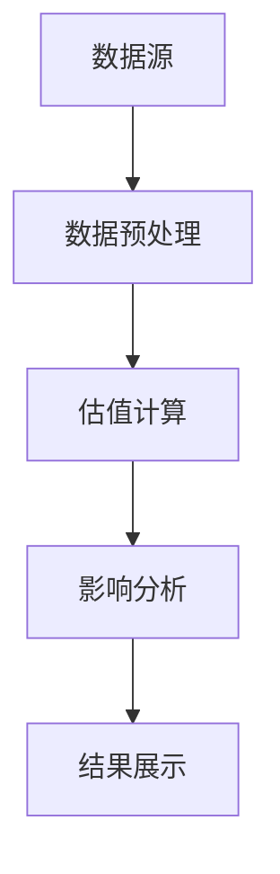

                 


# 股市估值差异对国际分工格局的影响

> 关键词：股市估值、国际分工、全球经济、产业链、比较优势

> 摘要：本文探讨股市估值差异如何影响国际分工格局，从背景、机制、影响到系统分析和项目实战，全面解析其对全球经济结构的深远影响。

---

## 第1章 股市估值差异与国际分工格局的背景介绍

### 1.1 股市估值差异的定义与特征

#### 1.1.1 股市估值的基本概念
股市估值是通过对企业未来现金流的折现来评估其市场价值的过程。主要方法包括市盈率（P/E）、市净率（P/B）等。

#### 1.1.2 估值差异的形成机制
- 市场结构差异：不同市场的流动性、信息透明度影响估值。
- 投资者行为：理性与非理性行为导致估值偏差。
- 宏观经济因素：利率、通货膨胀等影响估值。

#### 1.1.3 估值差异的度量方法
- 市盈率差异：比较不同公司的P/E比率。
- 市净率差异：比较P/B比率。
- 股价与账面价值比（ Tobin's Q）：衡量市场对公司价值的评估。

### 1.2 国际分工格局的构成与特征

#### 1.2.1 国际分工的基本概念
国际分工指各国在全球产业链中承担不同角色，如制造、研发、销售等。

#### 1.2.2 国际分工格局的演变历程
- 19世纪：英国的全球工厂模式。
- 20世纪：美国主导的跨国公司体系。
- 21世纪：新兴经济体崛起，分工格局多元化。

#### 1.2.3 当前国际分工格局的主要特点
- 产业链垂直化：不同国家专注于特定环节。
- 区域化：区域贸易协定增多，如欧盟、RCEP。
- 数字化：数字技术改变分工模式。

### 1.3 股市估值差异与国际分工格局的关系

#### 1.3.1 估值差异对分工格局的影响路径
- 企业竞争力：高估值企业可能投资更多，推动产业升级。
- 产业链布局：低估值可能导致企业收缩，影响分工。

#### 1.3.2 分工格局对估值差异的反向影响
- 产业集群效应：分工促进企业聚集，影响估值。
- 技术转移：分工推动技术扩散，改变估值因素。

#### 1.3.3 两者的互动机制分析
企业估值差异影响投资决策，进而影响分工格局；分工格局的变化反过来影响企业估值，形成动态反馈。

---

## 第2章 股市估值差异的形成机制分析

### 2.1 市场结构与估值差异

#### 2.1.1 市场结构对估值的影响
- 流动性：高流动性的市场通常给出较高估值。
- 信息透明度：透明市场减少估值偏差。

#### 2.1.2 不同市场环境下的估值差异
- 发达市场 vs. 新兴市场：新兴市场估值波动更大。
- 大盘股 vs. 小盘股：大盘股估值更稳定。

### 2.2 投资者行为与估值差异

#### 2.2.1 投资者心理与估值偏差
- 过度乐观：导致高估。
- 恐慌情绪：导致低估。

#### 2.2.2 信息不对称对估值的影响
- 信息优势者能获取超额收益，扩大估值差异。

### 2.3 宏观经济因素与估值差异

#### 2.3.1 经济周期对估值的影响
- 上行周期：高估值。
- 下行周期：低估值。

#### 2.3.2 货币政策与估值差异
- 低利率环境：推高估值。
- 收紧政策：压低估值。

---

## 第3章 股市估值差异对国际贸易的影响

### 3.1 估值差异与企业竞争力

#### 3.1.1 企业价值评估与竞争力的关系
- 高估值企业可能有更强的研发和市场拓展能力。

#### 3.1.2 估值差异对企业出口能力的影响
- 高估值企业可能有更多资源用于出口。

### 3.2 估值差异与全球产业链布局

#### 3.2.1 产业链分工的决定因素
- 成本、技术、政策等。

#### 3.2.2 估值差异对产业链重构的影响
- 企业可能根据估值差异调整生产环节。

### 3.3 估值差异与跨国公司战略调整

#### 3.3.1 跨国公司估值差异的应对策略
- 优化资产配置，分散风险。

#### 3.3.2 全球化背景下的企业估值挑战
- 全球化导致的跨国估值差异增加。

---

## 第4章 股市估值差异对国际比较优势的影响

### 4.1 比较优势理论与估值差异

#### 4.1.1 比较优势的基本概念
- 各国根据比较优势参与国际分工。

#### 4.1.2 估值差异对比较优势的影响
- 高估值可能削弱比较优势，低估值增强。

### 4.2 估值差异与产业转移

#### 4.2.1 产业转移的驱动因素
- 成本上升、政策变化等。

#### 4.2.2 估值差异对产业转移的促进作用
- 低估值国家吸引产业转移。

### 4.3 估值差异与贸易平衡

#### 4.3.1 贸易平衡的理论基础
- 自由贸易与保护主义。

#### 4.3.2 估值差异对贸易平衡的影响
- 高估值可能导致贸易逆差，低估值导致顺差。

---

## 第5章 股市估值差异对国际分工格局的系统性

### 5.1 数学模型构建

#### 5.1.1 股市估值差异模型
$$ V_i = \beta \times Earnings_i + \epsilon_i $$

其中，$V_i$为股票估值，$Earnings_i$为企业盈利，$\beta$为贝塔系数，$\epsilon_i$为误差项。

#### 5.1.2 分工格局影响模型
$$ D_i = \alpha + \gamma V_i + \delta X_i + \epsilon_i $$

其中，$D_i$为分工指数，$X_i$为控制变量。

### 5.2 系统架构设计

#### 5.2.1 系统功能模块
- 数据采集模块：收集股票数据和经济指标。
- 估值计算模块：计算各公司的估值差异。
- 影响分析模块：分析估值差异对分工的影响。

#### 5.2.2 系统架构图


### 5.3 项目实战

#### 5.3.1 环境安装
安装Python、pandas、numpy。

#### 5.3.2 核心代码实现
```python
import pandas as pd
import numpy as np

# 数据加载
data = pd.read_csv('stock_data.csv')

# 估值计算
data['PE'] = data['Price'] / data['Earnings']
mean_pe = data['PE'].mean()

# 分析影响
correlation = np.corrcoef(data['PE'], data['分工指数'])[0,1]
```

### 5.4 实际案例分析
分析某国因估值差异导致的产业转移案例，详细解读。

### 5.5 项目小结
总结项目成果，指出不足，并提出改进建议。

---

## 第6章 结论与展望

### 6.1 结论
股市估值差异显著影响国际分工格局，需综合考虑市场、行为和经济因素。

### 6.2 展望
未来研究可结合大数据和AI，深入分析复杂影响。

---

## 附录

### 附录A 数据来源与处理

### 附录B 参考文献

### 附录C 术语表

---

## 作者：AI天才研究院 & 禅与计算机程序设计艺术

