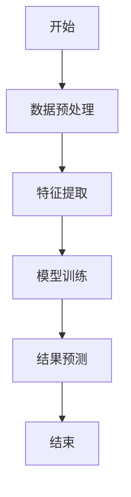
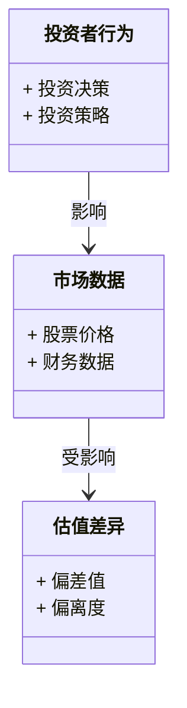

                 


# 股市估值差异对国际投资者行为的影响

## 关键词
股市估值，国际投资者行为，估值差异，投资决策，市场差异，投资者心理

## 摘要
股市估值是投资者决策的重要依据，但由于不同市场的差异，估值结果可能显著不同。本文探讨这些估值差异如何影响国际投资者的行为，分析其背后的驱动因素，如文化差异和市场结构，并通过数学模型和案例研究，展示如何理解和应对这些差异，优化投资策略。

---

# 第1章: 股市估值差异的背景与问题描述

## 1.1 股市估值的基本概念
### 1.1.1 估值的定义与作用
股市估值是指通过对公司财务数据和市场因素的分析，估算其股票的合理价格。它帮助投资者判断股票是否被高估或低估，从而做出买卖决策。

### 1.1.2 股市估值的核心要素
- **基本面分析**：包括收入、利润、市盈率（P/E）等。
- **市场情绪**：投资者情绪和市场趋势会影响估值。
- **宏观经济因素**：如利率、通货膨胀等。

### 1.1.3 估值差异的形成原因
- **市场流动性**：不同市场的流动性和交易量不同，影响估值。
- **制度差异**：不同国家的监管和税收政策不同，影响估值。
- **投资者结构**：机构投资者和散户比例不同，影响估值。

## 1.2 国际投资者行为的特点
### 1.2.1 国际投资者的定义与分类
国际投资者包括跨国公司、主权基金、对冲基金和个人投资者。他们的投资行为受到母国和目标国市场环境的影响。

### 1.2.2 不同市场环境下的投资者行为
- **成熟市场**：投资者更理性，注重基本面分析。
- **新兴市场**：投资者更情绪化，受市场情绪影响较大。

### 1.2.3 国际投资中的文化与制度差异
- **文化差异**：不同国家的投资者风险偏好不同。
- **制度差异**：税收、监管政策不同，影响投资行为。

## 1.3 估值差异对投资者行为的影响
### 1.3.1 估值差异的来源与表现
- **绝对估值差异**：股票的内在价值与市场价格的差异。
- **相对估值差异**：与同行业或市场指数相比的差异。

### 1.3.2 估值差异如何影响投资决策
- **买入信号**：当股票价格低于内在价值时，投资者可能买入。
- **卖出信号**：当股票价格远高于内在价值时，投资者可能卖出。

### 1.3.3 估值差异的度量与分析方法
- **市盈率（P/E）**：股价与每股收益的比率。
- **市净率（P/B）**：股价与每股净资产的比率。

---

# 第2章: 估值差异的核心概念与联系

## 2.1 核心概念的原理分析
### 2.1.1 股市估值的主要方法
- **绝对估值法**：基于公司未来现金流的现值计算。
- **相对估值法**：与同类公司或市场指数比较。

### 2.1.2 不同估值方法的优缺点对比
| 方法 | 优点 | 缺点 |
|------|------|------|
| 绝对估值法 | 精确，考虑未来现金流 | 需要准确预测现金流 |
| 相对估值法 | 简单，易于比较 | 受市场情绪影响 |

### 2.1.3 估值差异的多维度分析框架
- **市场因素**：如利率、通货膨胀。
- **公司因素**：如盈利能力、成长性。
- **投资者心理**：如风险偏好、情绪。

## 2.2 估值差异与投资者行为的关系
### 2.2.1 估值差异对投资者心理的影响
- **低估的股票**：吸引更多买入。
- **高估的股票**：导致卖出。

### 2.2.2 不同市场环境下的行为差异
- **成熟市场**：投资者更理性，注重长期价值。
- **新兴市场**：投资者更情绪化，注重短期趋势。

### 2.2.3 估值差异与投资策略的关联
- **价值投资**：寻找被低估的股票。
- **趋势投资**：跟随市场趋势。

## 2.3 估值差异的ER实体关系图
```mermaid
erDiagram
    投资者 <--- 投资行为 : 影响
    投资行为 --> 估值差异 : 受到影响
    估值差异 --> 市场环境 : 受市场影响
```

---

# 第3章: 估值差异的数学模型与算法原理

## 3.1 估值差异的度量方法
### 3.1.1 估值差异的量化指标
- **偏差值**：实际价格与理论价格的差值。
- **偏离度**：实际价格与理论价格的比率。

### 3.1.2 估值差异的统计分析方法
- **均值比较**：计算不同市场的平均估值差异。
- **标准差分析**：衡量估值差异的波动性。

### 3.1.3 基于回归分析的估值差异模型
$$ y = \beta_0 + \beta_1x_1 + \beta_2x_2 + \epsilon $$

其中：
- $y$：估值差异
- $x_1$：市场因素
- $x_2$：公司因素
- $\beta_0$：截距
- $\beta_1$、$\beta_2$：回归系数
- $\epsilon$：误差项

## 3.2 投资者行为预测的算法原理
### 3.2.1 基于机器学习的预测模型
- **逻辑回归**：预测投资者是否会买入或卖出。
- **随机森林**：基于特征的投票机制。

### 3.2.2 算法流程图


## 3.3 数学模型与公式
### 3.3.1 估值差异的回归模型
$$ y = \beta_0 + \beta_1x_1 + \beta_2x_2 + \epsilon $$

### 3.3.2 投资者行为

---

# 第4章: 系统分析与架构设计方案

## 4.1 问题场景介绍
国际投资者需要分析不同市场的估值差异，制定投资策略。

## 4.2 系统功能设计
- **数据采集**：收集各市场的股票数据。
- **估值计算**：使用不同方法计算股票估值。
- **差异分析**：比较不同市场的估值差异。
- **行为预测**：预测投资者行为。

### 4.2.1 领域模型


## 4.3 系统架构设计
### 4.3.1 系统架构图


## 4.4 系统接口设计
- **数据接口**：提供API获取市场数据。
- **预测接口**：提供API预测投资者行为。

## 4.5 系统交互
```mermaid
sequenceDiagram
    投资者 --> 数据采集模块 : 请求数据
    数据采集模块 --> 数据存储模块 : 存储数据
    投资者 --> 数据分析模块 : 分析数据
    数据分析模块 --> 投资者行为预测模块 : 预测行为
    投资者 <-- 投资者行为预测模块 : 返回预测结果
```

---

# 第5章: 项目实战

## 5.1 环境安装
- **数据获取**：使用Yahoo Finance API。
- **工具安装**：安装Python和相关库（如pandas、scikit-learn）。

## 5.2 核心实现源代码
```python
import pandas as pd
from sklearn.linear_model import LinearRegression

# 数据加载
data = pd.read_csv('market_data.csv')

# 特征选择
features = ['P/E', 'P/B']
target = 'Behavior'

# 模型训练
model = LinearRegression()
model.fit(data[features], data[target])

# 预测
predicted = model.predict(new_data[features])
```

## 5.3 实际案例分析
分析美国和新兴市场的估值差异，预测投资者行为。

## 5.4 项目小结
展示项目成果，总结经验教训。

---

# 第6章: 总结与展望

## 6.1 总结
- 估值差异影响投资者行为。
- 数学模型和系统架构有助于量化和分析。

## 6.2 未来展望
- 更复杂的模型，如深度学习。
- 更多市场的数据，提高模型的泛化能力。

---

# 作者
作者：AI天才研究院 & 禅与计算机程序设计艺术

