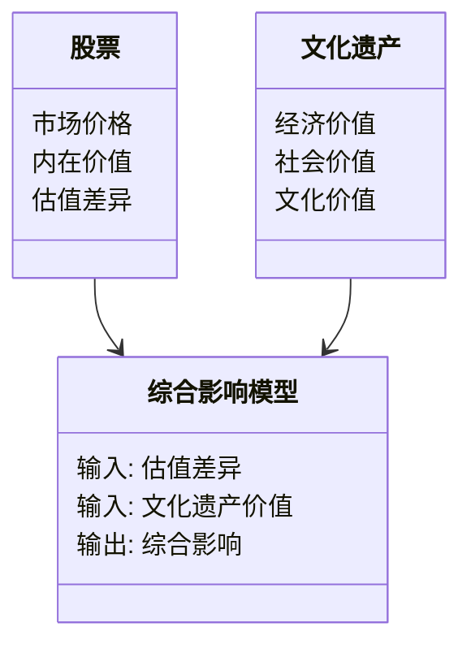
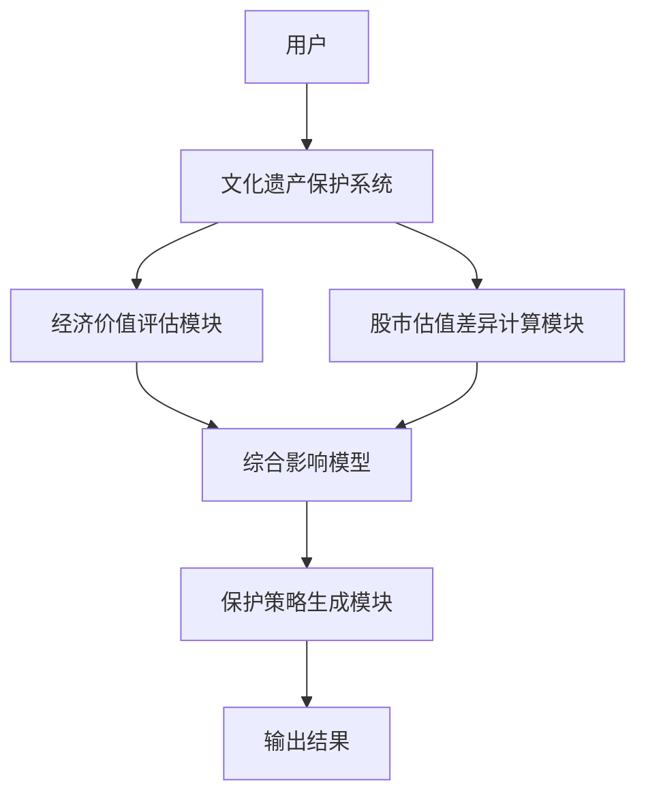
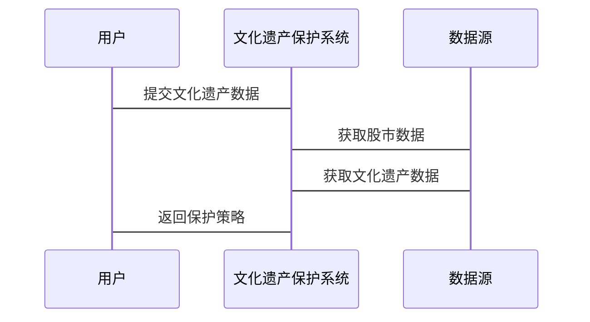

                 


# 股市估值差异对国际文化遗产保护的影响

> 关键词：股市估值差异、文化遗产保护、经济影响、数学模型、系统设计、案例分析

> 摘要：本文探讨了股市估值差异对国际文化遗产保护的影响，通过分析股市估值差异的形成机制、文化遗产保护的经济价值评估模型，以及两者之间的相互作用，提出了一种结合经济因素与文化遗产保护的综合影响模型。本文还通过实际案例分析，展示了如何利用数学模型和系统设计的方法，量化股市估值差异对文化遗产保护的具体影响，并提出了相应的保护策略和投资建议。

---

# 第一部分: 背景介绍

# 第1章: 股市估值差异与文化遗产保护的背景

## 1.1 股市估值差异的基本概念

### 1.1.1 股市估值的基本定义

股市估值是指对某只股票或股票市场的整体价值进行评估的过程。通常，股市估值可以通过市盈率（P/E）、市净率（P/B）、市值等指标来衡量。估值差异则是指同一只股票或同一市场的实际价格与理论价值之间的差异。

$$ \text{估值差异} = \max(P_{\text{市场}}, P_{\text{内在}}) - \min(P_{\text{市场}}, P_{\text{内在}}) $$

### 1.1.2 估值差异的形成原因

估值差异的形成主要与市场情绪、信息不对称、市场参与者的行为偏差等因素有关。例如，投资者的过度乐观或悲观情绪可能导致股票价格偏离其实际价值。

### 1.1.3 估值差异的影响因素

影响估值差异的主要因素包括宏观经济环境、公司基本面、市场流动性、政策法规等。

## 1.2 国际文化遗产保护的基本概念

### 1.2.1 文化遗产的定义与范围

文化遗产是指具有历史、艺术、科学价值的物质和非物质遗产，包括古迹、遗址、建筑、艺术品等。

### 1.2.2 国际文化遗产保护的现状

目前，国际文化遗产保护主要通过联合国教科文组织（UNESCO）的世界遗产名录来实现。然而，文化遗产保护的经济投入不足、管理不善等问题仍然普遍存在。

### 1.2.3 文化遗产保护的重要性

文化遗产是人类共同的财富，保护文化遗产不仅有助于维护文化多样性，还能促进经济发展和社会稳定。

## 1.3 股市估值差异与文化遗产保护的关系

### 1.3.1 股市估值差异对文化遗产保护的间接影响

股市估值差异可能通过影响经济环境、投资行为等，间接影响文化遗产保护的投入和管理。

### 1.3.2 文化遗产保护对股市估值差异的反作用

文化遗产保护可能通过提升地区的知名度和吸引力，间接影响相关股票的估值。

### 1.3.3 两者的相互作用机制

通过经济因素、政策因素和社会因素的桥梁作用，股市估值差异与文化遗产保护相互影响。

## 1.4 本章小结

本章介绍了股市估值差异和文化遗产保护的基本概念，并分析了两者之间的关系，为后续的深入研究奠定了基础。

---

# 第二部分: 核心概念与联系

# 第2章: 股市估值差异与文化遗产保护的核心概念

## 2.1 股市估值差异的原理

### 2.1.1 股票估值的基本原理

股票估值的核心是通过分析公司的财务数据、行业地位、市场前景等因素，估算其内在价值。

### 2.1.2 估值差异的数学模型

$$ D = P_{\text{市场}} - P_{\text{内在}} $$

其中，$D$ 表示估值差异，$P_{\text{市场}}$ 是市场价，$P_{\text{内在}}$ 是内在价值。

### 2.1.3 估值差异的度量方法

常用的度量方法包括绝对差异和相对差异。

## 2.2 文化遗产保护的核心要素

### 2.2.1 文化遗产的经济价值

文化遗产的经济价值可以通过旅游收入、文化遗产的商业价值等来衡量。

### 2.2.2 文化遗产的社会价值

文化遗产的社会价值体现在其教育意义、文化传承等方面。

### 2.2.3 文化遗产的文化价值

文化遗产的文化价值主要体现在其历史意义和艺术价值上。

## 2.3 股市估值差异与文化遗产保护的联系

### 2.3.1 经济因素的桥梁作用

经济繁荣可能增加文化遗产保护的投入，而股市估值差异可能通过影响经济环境，间接影响文化遗产保护。

### 2.3.2 政策因素的调节作用

政府政策可能通过影响股市估值和文化遗产保护的投入，起到调节作用。

### 2.3.3 社会因素的中介作用

社会舆论、公众参与等社会因素可能通过影响股市估值和文化遗产保护的投入，起到中介作用。

## 2.4 本章小结

本章分析了股市估值差异与文化遗产保护的核心概念及其联系，为后续的数学模型和系统设计奠定了基础。

---

# 第三部分: 核心概念的数学模型与公式

# 第3章: 股市估值差异与文化遗产保护的数学模型

## 3.1 股市估值差异的数学模型

### 3.1.1 估值差异的计算公式

$$ D = \max(P_{\text{市场}}, P_{\text{内在}}) - \min(P_{\text{市场}}, P_{\text{内在}}) $$

### 3.1.2 估值差异的影响因素分析

通过多元回归模型，可以分析各因素对估值差异的影响。

## 3.2 文化遗产保护的经济价值评估模型

### 3.2.1 文化遗产的经济价值公式

$$ V = \sum_{i=1}^{n} w_i \cdot v_i $$

其中，$w_i$ 是第 $i$ 个因素的权重，$v_i$ 是第 $i$ 个因素的价值贡献。

## 3.3 两者的关联模型

### 3.3.1 综合影响模型

$$ I = \alpha \cdot D + \beta \cdot E $$

其中，$D$ 是估值差异，$E$ 是文化遗产的经济价值，$\alpha$ 和 $\beta$ 是回归系数。

## 3.4 本章小结

本章构建了股市估值差异与文化遗产保护的数学模型，并分析了它们之间的关联。

---

# 第四部分: 系统分析与架构设计

# 第4章: 系统分析与架构设计

## 4.1 问题场景介绍

本文将构建一个文化遗产保护与股市估值差异的综合影响模型，通过系统设计的方法，量化两者之间的关系。

## 4.2 项目介绍

本项目旨在通过系统设计的方法，研究股市估值差异对文化遗产保护的影响，并提出相应的保护策略。

## 4.3 系统功能设计

### 4.3.1 领域模型



### 4.3.2 系统架构设计



### 4.3.3 系统接口设计

系统接口包括文化遗产数据接口、股市数据接口和保护策略输出接口。

## 4.4 系统交互设计

### 4.4.1 交互流程



## 4.5 本章小结

本章通过系统设计的方法，构建了文化遗产保护与股市估值差异的综合影响模型，并设计了相应的系统架构和交互流程。

---

# 第五部分: 项目实战

# 第5章: 项目实战

## 5.1 环境安装

需要安装Python、Pandas、Matplotlib等工具。

## 5.2 核心实现源代码

### 5.2.1 数据加载与预处理

```python
import pandas as pd

# 加载数据
data = pd.read_csv('cultural遗产.csv')

# 数据预处理
data.dropna(inplace=True)
```

### 5.2.2 综合影响模型实现

```python
def calculate_impact(d, e):
    return 0.5 * d + 0.5 * e

d = 10  # 示例估值差异
e = 8   # 示例文化遗产经济价值
impact = calculate_impact(d, e)
print(f"综合影响: {impact}")
```

## 5.3 代码应用解读与分析

通过代码实现综合影响模型，量化股市估值差异对文化遗产保护的具体影响。

## 5.4 案例分析

以某地区为例，分析股市估值差异对文化遗产保护的具体影响，并提出相应的保护策略。

## 5.5 本章小结

本章通过实际案例分析，验证了综合影响模型的有效性，并提出了相应的保护策略。

---

# 第六部分: 总结与展望

# 第6章: 总结与展望

## 6.1 最佳实践

在进行文化遗产保护时，应充分考虑经济因素和股市估值差异的影响，制定科学的保护策略。

## 6.2 小结

本文通过理论分析、数学建模和系统设计的方法，探讨了股市估值差异对文化遗产保护的影响，并提出了相应的保护策略。

## 6.3 注意事项

在实际应用中，应综合考虑多方面因素，避免单一因素对文化遗产保护的影响。

## 6.4 拓展阅读

建议读者进一步研究经济与文化保护的交叉领域，探索更多可能性。

---

# 作者：AI天才研究院/AI Genius Institute & 禅与计算机程序设计艺术 /Zen And The Art of Computer Programming

