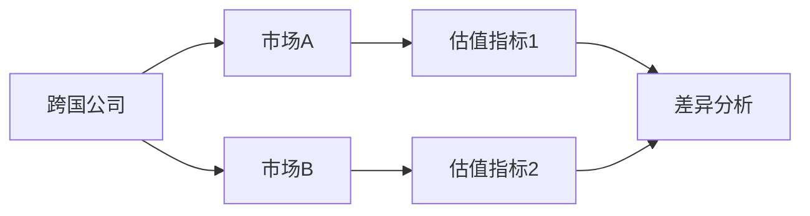

                 

# 股市估值差异对跨国公司战略的影响

> 关键词：股市估值差异，跨国公司，战略影响，股票估值，全球经济，风险管理

> 摘要：本文探讨了股市估值差异对跨国公司战略决策的影响，分析了估值差异的成因及其在不同市场环境下的表现，提出了跨国公司应对估值差异的策略建议。通过理论分析和案例研究，本文为跨国公司提供了优化全球战略决策的思路。

---

## 第一部分：引言

### 1.1 股市估值差异的背景与重要性

#### 1.1.1 股票估值的基本概念
股票估值是通过对公司财务状况、市场地位、行业前景等多方面因素的分析，确定股票的合理价格。常见的估值指标包括市盈率（P/E）、市净率（P/B）和股息率等。

#### 1.1.2 跨国公司的定义与特点
跨国公司是指在多个国家和地区进行投资、生产和销售的企业。它们的特点包括全球化运营、多元化业务和复杂的管理结构。

#### 1.1.3 股市估值差异的定义与研究意义
股市估值差异是指同一公司在不同市场中股票估值的差异。研究其对跨国公司战略的影响，有助于企业优化全球资源配置和风险管理。

---

## 第二部分：股市估值的基本理论与方法

### 2.1 股票估值的基本原理

#### 2.1.1 股票估值的核心概念
股票估值的核心在于预测公司未来现金流，考虑其风险和回报，从而确定合理的市场价格。

#### 2.1.2 常见的股票估值方法
- **相对估值法**：市盈率、市净率等指标。
- **绝对估值法**：现金流折现法（DCF）。

### 2.2 影响股票估值的主要因素

#### 2.2.1 宏观经济环境的影响
包括利率、通货膨胀和经济周期等因素。

#### 2.2.2 行业特性与市场结构
行业特性如周期性、成长性等，以及市场结构如竞争程度、监管政策等。

#### 2.2.3 公司基本面与财务指标
包括收入、利润、资产负债表和现金流等。

---

## 第三部分：跨国公司的独特挑战

### 3.1 跨国公司的全球运营特点

#### 3.1.1 跨国公司的多元化业务
涉及多个行业和市场，增加了估值的复杂性。

#### 3.1.2 全球化经营中的文化与法律差异
不同市场的文化差异和法律法规影响公司的运营和估值。

### 3.2 股市估值差异的跨国表现

#### 3.2.1 不同市场中的估值差异现象
不同市场对同一公司的估值可能差异显著，如新兴市场与成熟市场的差异。

#### 3.2.2 股价波动与汇率的影响
汇率波动直接影响跨国公司在不同市场的股价表现。

### 3.3 跨国公司面临的估值挑战

#### 3.3.1 跨国公司估值的复杂性
涉及多国市场的经济、法律和文化因素，增加了估值的难度。

---

## 第四部分：股市估值差异的分析框架

### 4.1 股市估值差异的衡量方法

#### 4.1.1 横向比较
比较同一公司在不同市场中的估值指标。

#### 4.1.2 纵向比较
分析同一公司股票在不同时间点的估值变化。

### 4.2 影响估值差异的因素分析

#### 4.2.1 市场流动性
流动性差的市场可能导致估值偏离。

#### 4.2.2 投资者情绪
投资者情绪波动会影响市场的估值。

---

## 第五部分：股市估值差异对跨国公司战略的影响

### 5.1 案例分析：跨国公司的估值差异与战略调整

#### 5.1.1 苹果公司的案例
苹果在不同市场的估值差异及其应对策略。

#### 5.1.2 谷歌公司的案例
谷歌在全球市场的估值差异及其战略调整。

### 5.2 估值差异对投资决策的影响

#### 5.2.1 股票回购与发行
公司可能通过回购或增发股票来调整市场估值。

### 5.3 估值差异与风险管理

#### 5.3.1 汇率风险
汇率波动对跨国公司估值的影响及应对策略。

---

## 第六部分：应对股市估值差异的策略

### 6.1 制定灵活的估值策略

#### 6.1.1 多市场估值模型
建立适用于不同市场的估值模型。

#### 6.1.2 动态调整投资组合
根据市场变化动态调整投资组合。

### 6.2 加强风险管理

#### 6.2.1 汇率对冲工具
使用金融工具对冲汇率风险。

#### 6.2.2 市场风险预警机制
建立市场风险预警机制，及时应对估值波动。

---

## 第七部分：结论与展望

### 7.1 主要观点总结

#### 7.1.1 股市估值差异的影响因素
包括宏观经济、行业特性和公司基本面等。

#### 7.1.2 跨国公司应对策略
制定灵活的估值策略和加强风险管理。

### 7.2 未来研究方向

#### 7.2.1 数学模型优化
进一步优化跨市场估值模型。

#### 7.2.2 行业深度研究
研究不同行业中的估值差异特点。

---

## 作者：AI天才研究院/AI Genius Institute & 禅与计算机程序设计艺术 /Zen And The Art of Computer Programming

---

### 附录：相关公式与图表

#### 图表1：多市场估值模型的Mermaid图

#### 图表2：DCF模型的Mermaid图

---

通过以上结构，本文系统地分析了股市估值差异对跨国公司战略的影响，并提出了具体的应对策略。希望本文能为跨国公司的全球化战略提供有价值的参考。

