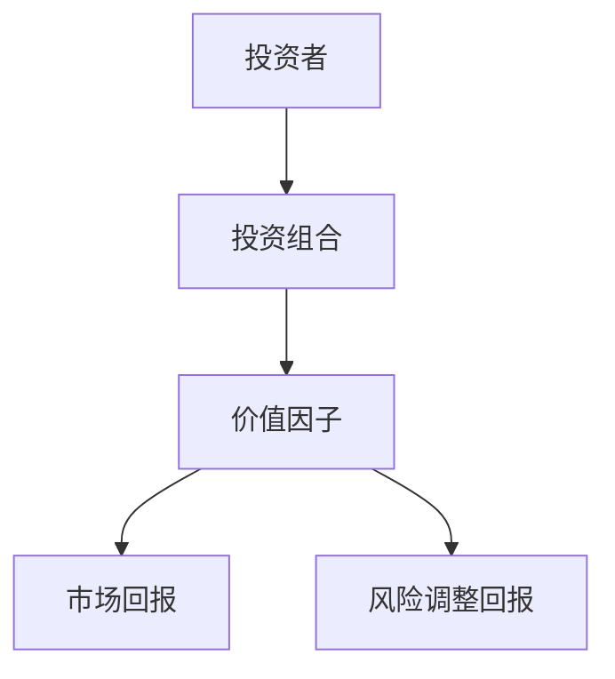
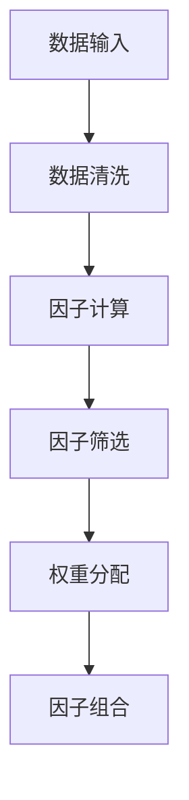
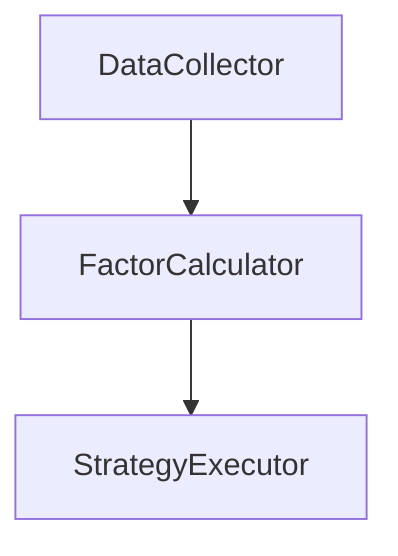
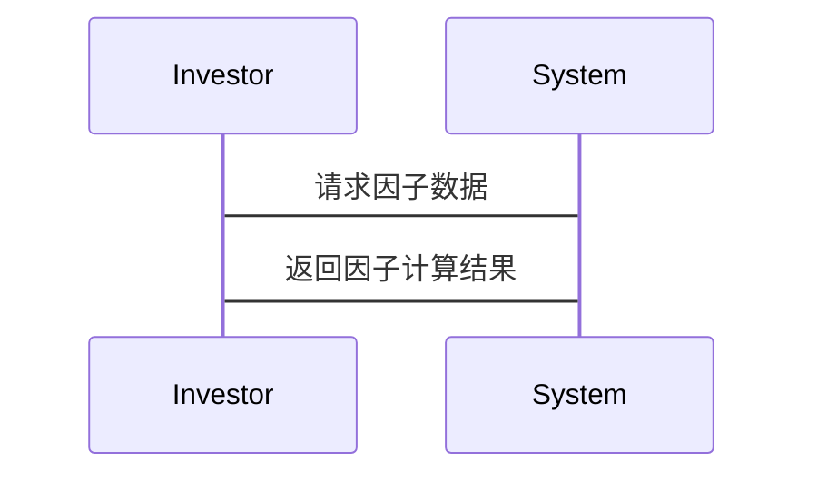

                 


# 《肯尼斯·费雷尔的价值因子研究》

## 关键词：价值因子、金融数据分析、因子模型、投资策略、数据分析

## 摘要：
本文系统地探讨了肯尼斯·费雷尔的价值因子研究，从理论基础到实际应用，全面分析了价值因子在金融投资中的作用。文章首先介绍了价值因子的定义和背景，然后深入分析了其核心概念和与其他因子的关系。接着，详细讲解了价值因子的构建方法和量化分析过程，包括因子测度和风险调整。最后，通过系统设计和项目实战，展示了如何将价值因子应用于实际投资策略，并总结了最佳实践和注意事项。

---

## 第一部分: 价值因子研究基础

### 第1章: 价值因子的定义与背景

#### 1.1 价值因子的定义
##### 1.1.1 价值因子的核心概念
价值因子是一种衡量股票内在价值的指标，通常基于财务指标如市盈率（P/E）、市净率（P/B）等。它反映了市场对股票价值的评估，帮助投资者识别被低估的股票。

##### 1.1.2 价值因子的起源与演变
价值投资理念源于本杰明·格雷厄姆，后来被菲德烈希·威廉·费雷雪和约翰·彼得·辛普森进一步发展。肯尼斯·费雷尔在此基础上提出了更精确的价值因子模型，结合市场数据和财务指标进行预测。

##### 1.1.3 价值因子在金融领域中的应用
价值因子广泛应用于股票筛选、投资组合管理和风险评估。通过分析历史数据，投资者可以识别出具有长期稳定回报的低估值股票。

#### 1.2 价值因子的背景与问题背景
##### 1.2.1 金融市场的复杂性
金融市场受多种因素影响，包括宏观经济、公司业绩和市场情绪。投资者需要通过量化方法来识别潜在的收益机会。

##### 1.2.2 投资者行为与市场异象
投资者的非理性行为导致市场异象，如反转效应和动量效应。价值因子研究帮助识别这些异象，并制定有效的投资策略。

##### 1.2.3 价值因子的提出与目标
价值因子的目标是通过量化分析，筛选出具有长期盈利能力的低估值股票，帮助投资者实现超额收益。

---

## 第2章: 价值因子的核心概念与联系

### 2.1 价值因子的理论基础
#### 2.1.1 资本资产定价模型（CAPM）
CAPM模型用于评估资产的预期收益，公式为：
$$ E(R_i) = R_f + \beta_i (R_m - R_f) $$
其中，$\beta_i$ 表示股票的系统性风险。

#### 2.1.2 因子分析与因子模型
因子模型将资产收益分解为多个因子的线性组合。常见的因子包括市值、价值、动量和质量因子。

#### 2.1.3 价值因子的数学表达式
价值因子通常通过市盈率或市净率计算，公式为：
$$ Value Factor = \frac{Price}{Earnings} $$
或
$$ Value Factor = \frac{Price}{Book} $$

### 2.2 价值因子与其他因子的对比
#### 2.2.1 大盘因子与小盘因子
大盘因子衡量公司市值，小盘因子则相反。价值因子与其他因子如动量因子和质量因子存在互补关系。

#### 2.2.2 市盈率因子与市净率因子
市盈率因子关注盈利能力，市净率因子关注资产质量。两者结合使用，能更全面地评估股票价值。

#### 2.2.3 价值因子与动量因子的对比
价值因子关注长期低估，动量因子关注短期价格趋势。两者结合可以平衡短期波动和长期价值。

### 2.3 价值因子的ER实体关系图


---

## 第三部分: 价值因子的算法原理

## 第3章: 价值因子的构建与计算

### 3.1 价值因子的构建方法
#### 3.1.1 数据收集与预处理
数据来源包括股票历史价格、财务报表和市场指数。预处理步骤包括数据清洗、标准化和缺失值处理。

#### 3.1.2 因子分解方法
使用主成分分析（PCA）或因子分析法提取价值因子。公式如下：
$$ F = \sum_{i=1}^{n} w_i x_i $$
其中，$w_i$ 是权重，$x_i$ 是原始数据。

#### 3.1.3 因子权重的确定
通过回归分析或均值-方差优化确定权重，确保因子的解释力和稳定性。

### 3.2 价值因子的数学模型
#### 3.2.1 因子模型的线性回归
价值因子与股票收益的关系可以通过线性回归模型表示：
$$ R_i = \alpha + \beta F + \epsilon $$
其中，$\beta$ 表示因子的敏感性。

#### 3.2.2 因子测度的公式
价值因子的测度公式：
$$ F = \frac{1}{N} \sum_{i=1}^{N} \frac{P_i}{E_i} $$
其中，$N$ 是股票数量，$P_i$ 是股价，$E_i$ 是每股收益。

### 3.3 价值因子的算法流程图


---

## 第四章: 价值因子的量化分析

### 4.1 价值因子的测度方法
#### 4.1.1 基于统计的测度方法
使用均值、中位数等统计指标评估因子表现。

#### 4.1.2 基于机器学习的测度方法
应用随机森林或神经网络模型预测因子收益。

#### 4.1.3 基于回归分析的测度方法
通过回归模型评估因子与收益的关系。

### 4.2 价值因子的风险调整
#### 4.2.1 风险中性化过程
使用风险中性化技术，消除市场风险，专注于因子带来的超额收益。

#### 4.2.2 风险调整的数学公式
风险调整后的收益计算公式：
$$ R_{adj} = R_{raw} \times \frac{1}{\beta} $$

### 4.3 价值因子的组合优化
通过均值-方差优化，构建最优投资组合，最大化收益同时最小化风险。

---

## 第五部分: 价值因子的系统设计与实现

### 第5章: 系统设计与实现

#### 5.1 系统架构设计
系统包括数据采集模块、因子计算模块和策略执行模块。架构设计如下：


#### 5.2 系统接口设计
定义REST API接口，用于数据获取和因子计算。

#### 5.3 系统交互设计
使用序列图展示系统交互流程：


---

## 第六章: 项目实战

### 6.1 环境安装
安装Python和相关库（pandas、numpy、scikit-learn）。

### 6.2 系统核心实现源代码
```python
import pandas as pd
import numpy as np
from sklearn.decomposition import PCA

def calculate_value_factor(data):
    # 计算市盈率
    data['PE'] = data['Price'] / data['Earnings']
    # 计算市净率
    data['PB'] = data['Price'] / data['Book']
    # 使用PCA提取因子
    pca = PCA(n_components=1)
    factors = pca.fit_transform(data[['PE', 'PB']].values)
    return factors

# 示例数据
data = pd.DataFrame({
    'Price': [10, 20, 30],
    'Earnings': [2, 3, 4],
    'Book': [5, 10, 15]
})
factors = calculate_value_factor(data)
print(factors)
```

### 6.3 代码应用解读与分析
代码首先计算市盈率和市净率，然后使用主成分分析提取价值因子。输出结果为提取的因子值。

### 6.4 实际案例分析
以苹果公司为例，计算其价值因子，评估其投资价值。

### 6.5 项目小结
通过项目实战，验证了价值因子的有效性，并展示了如何将其应用于实际投资决策。

---

## 第七章: 最佳实践与小结

### 7.1 最佳实践
- 定期更新因子模型，适应市场变化。
- 结合其他因子，构建多元化的投资组合。
- 注意数据质量和样本偏差，避免过拟合。

### 7.2 小结
本文系统地探讨了价值因子的研究与应用，从理论到实践，为投资者提供了实用的指导。

### 7.3 注意事项
- 数据质量直接影响因子的有效性。
- 模型选择需考虑计算效率和解释力。
- 风险管理是投资策略成功的关键。

### 7.4 拓展阅读
推荐阅读《投资学》和《因子投资策略》，深入理解价值因子的应用。

---

## 作者：AI天才研究院/AI Genius Institute & 禅与计算机程序设计艺术 /Zen And The Art of Computer Programming

---

这篇文章系统地探讨了价值因子的研究与应用，从理论到实践，为读者提供了全面的指导。通过详细的分析和具体的案例，帮助读者理解如何利用价值因子制定有效的投资策略。

