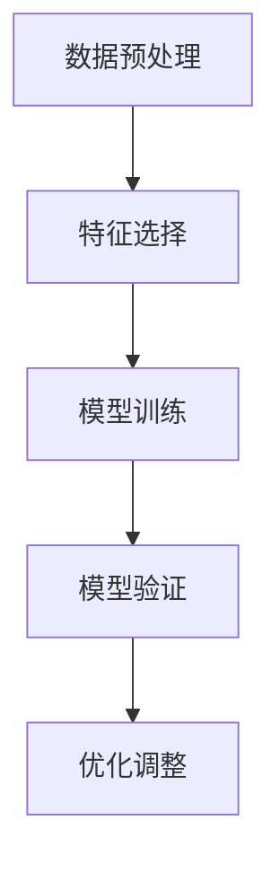
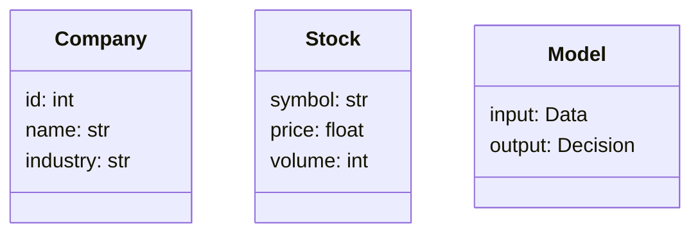
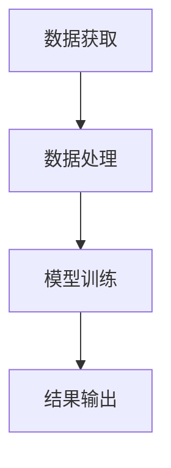
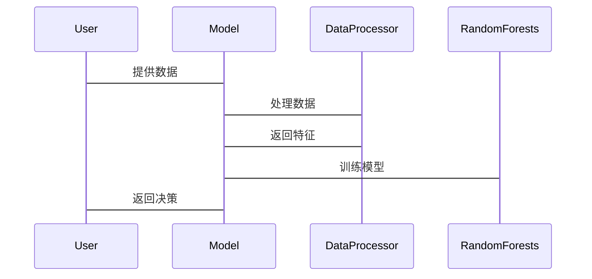

                 


# 肯尼斯·费雷尔的价值投资量化模型

**关键词**：价值投资、量化模型、肯尼斯·费雷尔、金融分析、投资策略

**摘要**：  
本文介绍肯尼斯·费雷尔的价值投资量化模型，探讨其核心概念、算法原理、数学模型以及实际应用。通过系统分析和项目实战，详细讲解模型的构建与优化，帮助读者理解如何将价值投资与量化分析相结合，实现高效的投资决策。

---

## 第1章 价值投资与量化模型的背景介绍

### 1.1 价值投资的核心概念  
价值投资是一种基于对公司内在价值的评估，寻找市场价低于内在价值的股票进行投资的策略。其核心在于寻找被市场低估的企业，长期持有以获得超额收益。  

#### 1.1.1 价值投资的定义与特点  
- **定义**：价值投资强调基本面分析，关注企业的盈利能力、财务状况和行业地位。  
- **特点**：注重长期投资、低估值、高安全边际。  

#### 1.1.2 肯尼斯·费雷尔的价值投资理论  
- 肯尼斯·费雷尔是价值投资的代表人物之一，主张通过深入分析企业的基本面，寻找具有持续竞争优势和良好管理的公司。  

#### 1.1.3 量化模型在价值投资中的作用  
- 量化模型通过数据驱动的方法，帮助投资者更精准地识别低估股票，优化投资组合。  

### 1.2 量化模型的背景与意义  
#### 1.2.1 量化投资的起源与发展  
量化投资起源于20世纪，随着计算机技术的发展，逐渐成为金融领域的重要方法。  

#### 1.2.2 量化模型在现代金融中的应用  
- 量化模型广泛应用于风险控制、资产配置和交易策略等领域。  

#### 1.2.3 费雷尔模型的独特性与创新点  
费雷尔模型结合了传统价值投资的深度分析与量化模型的高效性，是一种创新的投资工具。  

### 1.3 价值投资与量化模型的结合  
#### 1.3.1 传统价值投资的局限性  
- 传统价值投资依赖主观判断，耗时且难以量化。  

#### 1.3.2 量化模型如何弥补传统投资的不足  
- 量化模型通过数据和算法，提高投资决策的效率和准确性。  

#### 1.3.3 费雷尔模型的核心思想与方法  
费雷尔模型通过量化方法筛选低估股票，结合基本面分析，构建高效的投资组合。  

---

## 第2章 费雷尔量化模型的核心概念与联系

### 2.1 模型的核心概念  
#### 2.1.1 费雷尔模型的基本假设  
- 市场中存在被低估的股票，其价值将被市场逐步发现。  

#### 2.1.2 模型的输入变量与输出变量  
- **输入变量**：市盈率、市净率、股息率等。  
- **输出变量**：投资建议、风险评估。  

#### 2.1.3 模型的逻辑框架与流程  
1. 数据收集与预处理。  
2. 指标计算与筛选。  
3. 模型训练与优化。  
4. 结果分析与策略制定。  

### 2.2 核心概念的原理与联系  
#### 2.2.1 数据特征的提取与筛选  
- 通过统计分析和机器学习方法，提取与投资收益相关的特征。  

#### 2.2.2 模型的输入输出关系  
- 输入：财务指标、市场数据。  
- 输出：投资决策、风险评估。  

#### 2.2.3 模型的优化与调整  
- 通过回测和风险控制，优化模型的性能。  

### 2.3 模型的属性特征对比表格  
| 特性 | 描述 |  
|------|------|  
| 输入 | 财务指标、市场数据 |  
| 输出 | 投资决策、风险评估 |  
| 优点 | 高效、精准 |  
| 缺点 | 依赖数据质量 |  

### 2.4 ER实体关系图架构  
```mermaid
erd
  company.Company [id, name, industry]
  stock.Stock [symbol, price, volume]
  model.InputData [company_id, stock_id, metrics]
  model.OutputDecision [stock_id, decision, risk]
```

---

## 第3章 费雷尔量化模型的算法原理

### 3.1 算法原理概述  
#### 3.1.1 模型的输入数据处理  
- 数据清洗、特征工程。  

#### 3.1.2 模型的特征选择  
- 使用统计方法筛选重要特征。  

#### 3.1.3 模型的训练与优化  
- 采用机器学习算法，如随机森林、XGBoost。  

### 3.2 算法流程图  


### 3.3 算法的数学模型与公式  
#### 3.3.1 模型的数学表达式  
$$ \text{收益} = \sum ( \text{预测收益} - \text{实际收益} ) $$  

#### 3.3.2 模型的优化目标函数  
$$ \text{目标函数} = \min \sum (\text{预测} - \text{实际})^2 $$  

### 3.4 算法的Python实现  
```python
import pandas as pd
from sklearn.ensemble import RandomForestRegressor

# 数据预处理
data = pd.read_csv('data.csv')
X = data.drop('target', axis=1)
y = data['target']

# 特征选择
selected_features = X.columns

# 模型训练
model = RandomForestRegressor()
model.fit(X[selected_features], y)

# 模型验证
print(model.score(X[selected_features], y))
```

---

## 第4章 费雷尔量化模型的数学模型与公式

### 4.1 模型的收益计算  
$$ \text{收益} = \sum (\text{卖出价} - \text{买入价}) $$  

### 4.2 模型的风险控制  
$$ \text{风险} = \sqrt{ \frac{ \sum (\text{实际收益} - \text{预测收益})^2 }{n} } $$  

### 4.3 模型的组合优化  
$$ \text{优化目标} = \max \text{收益} - \lambda \times \text{风险} $$  

---

## 第5章 费雷尔量化模型的系统架构设计

### 5.1 系统功能设计  
#### 5.1.1 领域模型类图  


#### 5.1.2 系统架构图  


### 5.2 系统接口设计  
- 输入接口：接收公司和股票数据。  
- 输出接口：提供投资决策和风险评估。  

### 5.3 系统交互序列图  


---

## 第6章 费雷尔量化模型的项目实战

### 6.1 环境安装  
- 安装Python、Pandas、Scikit-learn等库。  

### 6.2 系统核心实现源代码  
```python
import pandas as pd
from sklearn.ensemble import RandomForestRegressor

# 数据读取
data = pd.read_csv('data.csv')

# 特征选择
X = data.drop('target', axis=1)
y = data['target']

# 模型训练
model = RandomForestRegressor()
model.fit(X, y)

# 预测与评估
print(model.predict(X))
print(model.score(X, y))
```

### 6.3 案例分析与结果解读  
- 通过实际案例分析，展示模型的应用效果。  

---

## 第7章 最佳实践、小结与注意事项

### 7.1 最佳实践  
- 数据质量是模型性能的关键。  
- 定期回测和优化模型。  

### 7.2 小结  
费雷尔量化模型通过结合价值投资与量化分析，提供了一种高效的投资工具。  

### 7.3 注意事项  
- 模型依赖历史数据，未来可能不适用。  
- 需要结合市场环境进行调整。  

---

## 作者  
作者：AI天才研究院 & 禅与计算机程序设计艺术

