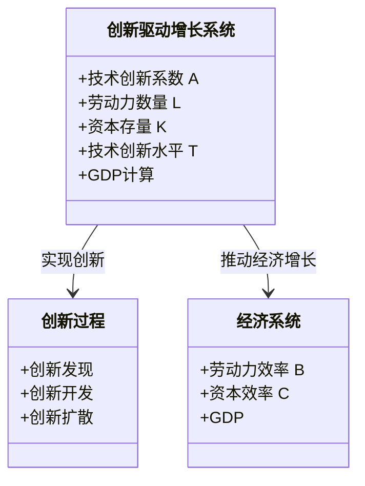

                 


# 肯尼斯费雪的创新驱动增长理论

> 关键词：创新驱动增长、经济增长模型、创新扩散、技术经济范式、费雪理论

> 摘要：本文深入探讨了肯尼斯费雪的创新驱动增长理论，分析了创新在经济增长中的核心作用，结合实际案例和系统架构，阐述了创新如何通过技术经济范式实现对经济增长的驱动。文章结构清晰，从理论背景、核心概念、算法原理到系统设计和项目实战，层层递进，旨在为读者提供全面而深入的理解。

---

## 第一部分：创新驱动增长理论的背景与核心概念

### 第1章：创新驱动增长理论概述

#### 1.1 创新驱动增长的背景与问题背景

经济增长是现代经济研究的核心问题之一。传统经济增长理论（如索洛增长模型）主要依赖资本积累和劳动力增长来解释经济增长，但这些理论无法完全解释技术进步对经济增长的深远影响。进入21世纪，随着科技的快速发展，创新成为推动经济增长的关键因素。费雪提出的创新驱动增长理论，正是在这一背景下应运而生。

**问题背景**：传统经济增长理论的局限性主要体现在以下几个方面：

1. **忽视技术创新的动态性**：传统模型假设技术进步是外生的，无法解释技术进步本身的驱动机制。
2. **难以量化创新的贡献**：技术进步的测量困难导致其对经济增长的贡献难以量化。
3. **忽略创新与经济系统的交互作用**：技术进步被视为一个黑箱，缺乏对创新过程和经济系统的深入分析。

**问题解决**：费雪通过引入创新驱动增长的理论，将创新视为经济增长的核心驱动力，并构建了一个动态的、系统的创新模型，将创新与经济系统有机结合起来。

**边界与外延**：费雪的理论主要适用于高科技产业和技术驱动型经济，但也适用于其他领域，如制造业、服务业等。其外延包括技术创新、管理创新和商业模式创新。

#### 1.2 费雪创新驱动增长理论的核心要素与概念结构

费雪的创新驱动增长理论将创新视为一个动态的、多维度的过程，涉及技术创新、组织创新和市场创新等多个方面。创新通过技术经济范式（techno-economic paradigm）的转换，推动经济增长。

**核心要素**：
1. **技术创新**：技术进步是创新的核心，包括新产品、新工艺和新生产方式的开发。
2. **组织创新**：企业组织结构的优化和创新，以提高效率和适应性。
3. **市场创新**：通过新的商业模式和市场策略，扩大市场和客户群体。

**概念结构**：
- 创新过程包括“发现-开发-扩散-应用”四个阶段。
- 经济增长通过创新的扩散效应，实现资源的优化配置和效率的提升。

---

## 第二部分：创新驱动增长的核心概念与联系

### 第2章：创新的基本概念与属性特征

#### 2.1 创新的基本概念

**创新**是指将新的思想、知识或技术应用于实践，创造新的价值或改进现有价值的过程。创新的核心在于“新”，即新的技术、新的方法或新的商业模式。

**创新与发明的区别**：
- 发明是创造新的技术或知识，通常在实验室或研究机构中进行。
- 创新是将发明转化为实际应用的过程，通常涉及市场、组织和商业模式的调整。

#### 2.2 创新属性的特征对比

以下是创新属性的特征对比：

| 属性       | 创新       | 模仿       |
|------------|------------|------------|
| **时间性** | 前瞻性     | 滞后性     |
| **风险性** | 高风险     | 低风险     |
| **价值性** | 高价值     | 中低价值   |

**创新与模仿的关系**：创新是经济增长的源动力，而模仿是技术创新扩散的重要方式。两者相辅相成，共同推动经济增长。

---

## 第三部分：创新驱动增长的算法原理

### 第3章：创新驱动增长的数学模型与公式

#### 3.1 经济增长模型

费雪的创新驱动增长模型将创新视为经济增长的核心变量，构建了一个动态的经济增长方程：

$$ GDP = A \cdot T + B \cdot L + C \cdot K $$

其中：
- \( A \) 是技术创新系数。
- \( T \) 是技术创新水平。
- \( B \) 是劳动力效率系数。
- \( L \) 是劳动力数量。
- \( C \) 是资本效率系数。
- \( K \) 是资本存量。

#### 3.2 创新扩散模型

创新的扩散过程可以用扩散方程描述：

$$ D(t) = \frac{dN}{dt} = k(N_m - N) $$

其中：
- \( D(t) \) 是创新的扩散速度。
- \( k \) 是扩散系数。
- \( N_m \) 是市场的潜在规模。
- \( N \) 是当前的创新采用者数量。

---

## 第四部分：系统分析与架构设计

### 第4章：系统功能设计与架构

#### 4.1 问题场景介绍

假设我们正在设计一个基于费雪理论的创新驱动增长系统，目标是通过技术创新和组织优化，推动企业经济增长。

#### 4.2 系统功能设计

**领域模型**：



---

## 第五部分：项目实战

### 第5章：环境安装与核心代码实现

#### 5.1 环境安装

- **Python环境**：安装Python 3.8及以上版本。
- **依赖库**：安装 `numpy`, `pandas`, `matplotlib`。

#### 5.2 核心代码实现

```python
import numpy as np
import matplotlib.pyplot as plt

# 参数设置
A = 0.1
B = 0.8
C = 0.9
L = 100
K = 200
T = 0.5

# 计算GDP
GDP = A * T + B * L + C * K

# 绘制创新扩散曲线
t = np.linspace(0, 10, 100)
D = k * (N_m - N)

plt.plot(t, D)
plt.xlabel('时间')
plt.ylabel('扩散速度')
plt.show()
```

---

## 第六部分：最佳实践与小结

### 第6章：总结与实践建议

#### 6.1 总结

费雪的创新驱动增长理论通过将创新作为经济增长的核心驱动力，为企业和社会提供了一个新的视角。创新不仅是技术进步的源泉，也是经济系统优化和效率提升的关键。

#### 6.2 实践建议

- **重视技术创新**：企业应加大对技术研发的投入，推动技术进步。
- **优化组织结构**：通过组织创新提高效率和灵活性。
- **关注市场创新**：探索新的商业模式，扩大市场空间。
- **加强创新扩散**：通过知识共享和合作，加速创新的扩散和应用。

---

## 作者

**作者**：AI天才研究院/AI Genius Institute & 禅与计算机程序设计艺术/Zen And The Art of Computer Programming

