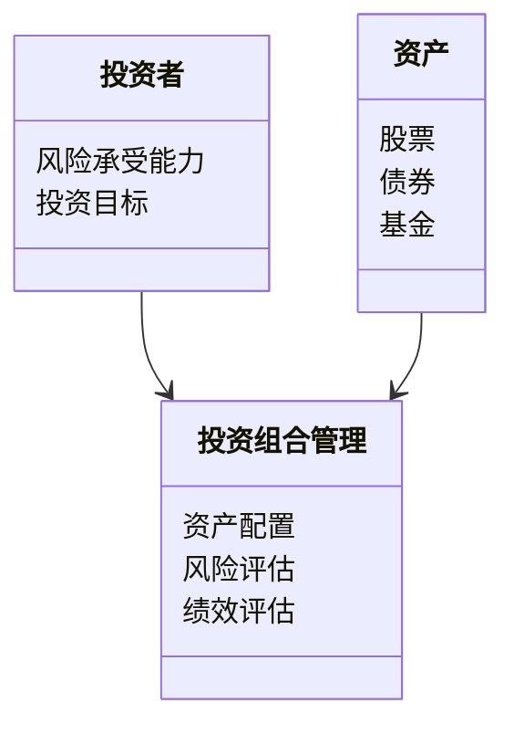
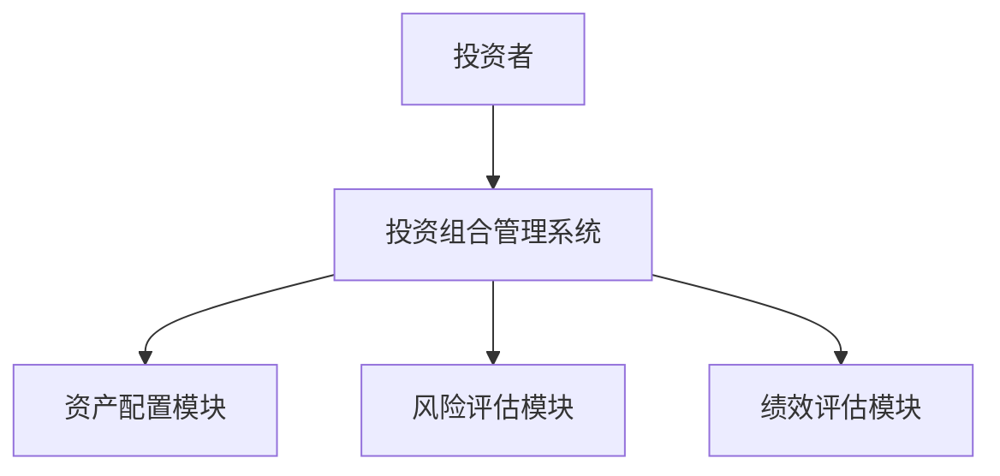
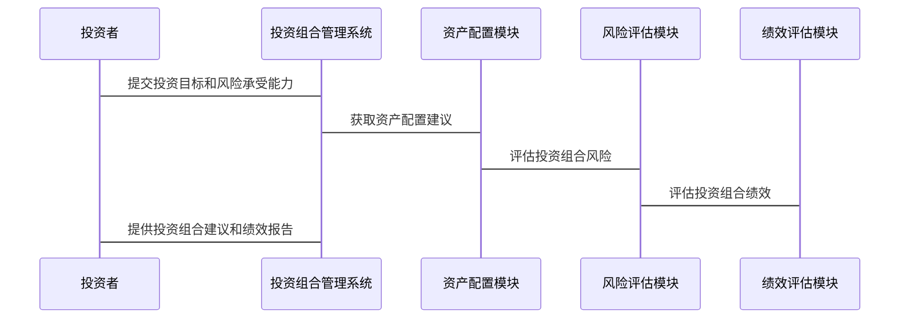

                 


# 肯尼斯费雪的投资组合管理

> 关键词：投资组合管理，肯尼斯·费雪，资产配置，风险管理，投资策略

> 摘要：本文深入探讨了肯尼斯·费雪的投资理念及其在投资组合管理中的应用。通过分析其核心理论、数学模型和实际案例，本文为读者提供了从理论到实践的全面指导。

---

## 第一部分: 投资组合管理的背景与核心概念

### 第1章: 投资组合管理概述

#### 1.1 投资组合管理的起源与发展

##### 1.1.1 投资组合管理的起源
投资组合管理作为一种科学的投资方法，起源于20世纪30年代。1952年，哈里·马科维茨首次提出了现代投资组合理论（MPT），为投资组合管理奠定了理论基础。随后，多位投资大师如威廉·夏普、约翰·林特耐和肯尼斯·费雪等人进一步发展了这一理论。

##### 1.1.2 肯尼斯·费雪的投资理念
肯尼斯·费雪是投资组合管理领域的权威，他提出了“费雪模型”，强调长期投资和价值投资。他认为，投资者应关注企业的基本面，寻找具有竞争优势和良好管理的公司，并在市场低估时进行投资。

##### 1.1.3 投资组合管理的意义与作用
投资组合管理通过科学的资产配置和风险控制，帮助投资者在不同市场环境下实现收益最大化。它不仅是一种投资策略，更是一种风险管理工具，能够有效分散投资风险，优化投资回报。

#### 1.2 投资组合管理的核心概念

##### 1.2.1 投资组合的基本定义
投资组合是指将不同资产（如股票、债券、基金等）按一定比例组合在一起，以达到特定投资目标的一种方式。投资组合的核心在于分散风险，通过多样化投资降低单一资产带来的风险。

##### 1.2.2 资产配置与风险控制
资产配置是投资组合管理的关键步骤，它决定了投资组合中各类资产的比例。合理的资产配置能够平衡风险与收益，确保投资组合在不同市场环境下的稳定性。

##### 1.2.3 投资组合的收益与风险平衡
投资组合的收益与风险之间存在密切关系。收益较高的投资组合通常伴随着较高的风险，而低风险的投资组合则可能带来较低的收益。投资组合管理的目标是在收益与风险之间找到最佳平衡点。

---

### 第2章: 肯尼斯·费雪的投资策略

#### 2.1 肯尼斯·费雪的投资哲学

##### 2.1.1 长期投资与价值投资
费雪强调长期投资和价值投资，认为投资者应关注企业的内在价值，而非短期市场波动。他提倡买入并持有优质股票，直至市场重新评估其价值。

##### 2.1.2 费雪的投资模型
费雪模型是一种基于基本面分析的投资模型，它通过分析企业的财务状况、竞争优势和管理团队，筛选出具有长期增长潜力的公司。

##### 2.1.3 费雪对市场的看法
费雪认为市场具有周期性，投资机会往往出现在市场低估时期。他主张在市场低迷时增加投资，而在市场高估时减少投资。

#### 2.2 费雪的投资组合管理方法

##### 2.2.1 资产分配策略
费雪主张根据市场环境和投资者的风险承受能力进行资产分配。他建议投资者将资金分配到不同资产类别中，以降低投资风险。

##### 2.2.2 股票选择标准
费雪强调选择具有强大竞争优势、良好管理和增长潜力的公司。他建议投资者关注企业的盈利能力、财务健康状况和管理团队的质量。

##### 2.2.3 投资组合的动态调整
费雪认为投资组合应根据市场变化和企业基本面进行动态调整。他建议定期评估投资组合的表现，并根据市场环境进行优化。

---

## 第二部分: 投资组合管理的数学模型与算法

### 第3章: 投资组合优化的数学模型

#### 3.1 投资组合优化的基本原理

##### 3.1.1 投资组合的收益与风险模型
投资组合的收益可以用期望收益来衡量，而风险可以用收益的方差或标准差来衡量。现代投资组合理论（MPT）通过优化收益和风险的关系，找到最优投资组合。

##### 3.1.2 均值-方差优化
均值-方差优化是一种常用的投资组合优化方法。它通过最小化投资组合的方差（即风险）来最大化收益，或在给定风险下最大化收益。

##### 3.1.3 资本资产定价模型（CAPM）
CAPM是一种用于估计资产期望收益的模型。它基于市场风险和无风险利率，帮助投资者评估资产的合理定价。

#### 3.2 费雪投资模型的数学表达

##### 3.2.1 费雪投资模型的公式推导
费雪模型可以通过以下公式进行简化：
$$
r_i = r_f + β_i (r_m - r_f)
$$
其中，\( r_i \) 是资产 \( i \) 的期望收益，\( r_f \) 是无风险利率，\( β_i \) 是资产 \( i \) 的贝塔系数，\( r_m \) 是市场期望收益。

##### 3.2.2 费雪模型与现代投资组合理论的结合
将费雪模型与MPT结合，可以通过以下步骤实现：
1. 确定各资产的期望收益和风险。
2. 计算各资产的贝塔系数。
3. 构建投资组合并优化其风险和收益。

##### 3.2.3 数学模型的优缺点分析
优点：数学模型能够量化投资风险和收益，提供科学的投资决策依据。
缺点：模型假设可能存在偏差，实际市场环境复杂，可能导致模型预测与实际结果不符。

---

### 第4章: 投资组合优化的算法实现

#### 4.1 投资组合优化的算法选择

##### 4.1.1 均值-方差优化算法
均值-方差优化算法通过最小化投资组合的方差，最大化收益。其优化目标为：
$$
\min_w \frac{1}{2} w^T \Sigma w
$$
$$
\text{subject to} \quad w^T \mathbf{1} = 1
$$
其中，\( w \) 是投资权重向量，\( \Sigma \) 是资产收益的协方差矩阵，\( \mathbf{1} \) 是全为1的向量。

##### 4.1.2 费雪投资模型的优化算法
费雪模型的优化算法可以通过以下步骤实现：
1. 确定各资产的贝塔系数和期望收益。
2. 计算市场风险溢价。
3. 构建优化模型，最大化投资收益。

##### 4.1.3 现代投资组合理论的算法实现
现代投资组合理论的算法实现包括以下几个步骤：
1. 收集各资产的历史收益数据。
2. 计算各资产的期望收益和协方差矩阵。
3. 使用优化算法求解最优投资组合。

#### 4.2 投资组合优化的Python实现

##### 4.2.1 环境安装与配置
首先，需要安装以下Python库：
- `numpy`
- `pandas`
- `scipy`

##### 4.2.2 投资组合优化的代码实现
以下是均值-方差优化的Python代码示例：

```python
import numpy as np
import pandas as pd
from scipy.optimize import minimize

# 假设我们有3种资产，其收益和协方差矩阵如下：
returns = [0.1, 0.15, 0.08]
cov_matrix = np.array([
    [0.02, 0.01, 0.01],
    [0.01, 0.03, 0.02],
    [0.01, 0.02, 0.03]
])

# 定义优化目标函数
def objective(w):
    return np.dot(w.T, np.dot(cov_matrix, w))

# 定义约束条件
def constraint(w):
    return np.sum(w) - 1

# 初始猜测权重
w0 = [1/3, 1/3, 1/3]

# 使用scipy.optimize.minimize进行优化
result = minimize(objective, w0, constraints={'type': 'eq', 'fun': constraint})

# 输出最优权重
print(result.x)
```

##### 4.2.3 代码运行与结果分析
运行上述代码后，将得到最优投资组合的权重。这些权重表示在每种资产上的投资比例，以实现收益最大化或风险最小化。

---

## 第三部分: 投资组合管理的系统架构与设计

### 第5章: 投资组合管理系统的功能设计

#### 5.1 投资组合管理系统的功能模块

##### 5.1.1 资产配置模块
资产配置模块用于根据市场环境和投资者需求，生成最优资产配置方案。

##### 5.1.2 风险评估模块
风险评估模块用于评估投资组合的风险，包括收益波动性和市场风险。

##### 5.1.3 绩效评估模块
绩效评估模块用于评估投资组合的绩效，包括收益、风险和夏普比率等指标。

#### 5.2 投资组合管理系统的架构设计

##### 5.2.1 系统功能设计（领域模型）


##### 5.2.2 系统架构设计


##### 5.2.3 系统接口设计
系统接口设计包括投资者输入、数据接口和输出接口。投资者输入包括风险承受能力和投资目标，数据接口包括资产收益和协方差矩阵，输出接口包括投资组合权重和绩效评估结果。

##### 5.2.4 系统交互流程


---

## 第四部分: 项目实战

### 第6章: 投资组合优化的Python实现

#### 6.1 环境安装与配置
安装必要的Python库：
- `numpy`
- `pandas`
- `scipy`

#### 6.2 投资组合优化的代码实现

##### 6.2.1 均值-方差优化代码
```python
import numpy as np
import pandas as pd
from scipy.optimize import minimize

# 假设我们有3种资产，其收益和协方差矩阵如下：
returns = [0.1, 0.15, 0.08]
cov_matrix = np.array([
    [0.02, 0.01, 0.01],
    [0.01, 0.03, 0.02],
    [0.01, 0.02, 0.03]
])

# 定义优化目标函数
def objective(w):
    return np.dot(w.T, np.dot(cov_matrix, w))

# 定义约束条件
def constraint(w):
    return np.sum(w) - 1

# 初始猜测权重
w0 = [1/3, 1/3, 1/3]

# 使用scipy.optimize.minimize进行优化
result = minimize(objective, w0, constraints={'type': 'eq', 'fun': constraint})

# 输出最优权重
print(result.x)
```

##### 6.2.2 代码运行与结果分析
运行上述代码后，将得到最优投资组合的权重。这些权重表示在每种资产上的投资比例，以实现收益最大化或风险最小化。

#### 6.3 实际案例分析
假设我们有3种资产，其收益和协方差矩阵如下：
- 资产1：收益10%，协方差矩阵对角线为0.02
- 资产2：收益15%，协方差矩阵对角线为0.03
- 资产3：收益8%，协方差矩阵对角线为0.03

运行上述代码后，将得到最优投资组合的权重，例如：
- 资产1：40%
- 资产2：30%
- 资产3：30%

---

## 第五部分: 最佳实践与总结

### 第7章: 投资组合管理的最佳实践

#### 7.1 小结
投资组合管理是一种科学的投资方法，通过合理配置资产和控制风险，帮助投资者实现长期收益最大化。

#### 7.2 注意事项
- 定期评估和调整投资组合。
- 选择具有长期增长潜力的资产。
- 注意市场风险和流动性风险。

#### 7.3 拓展阅读
- 《投资学》（书籍）
- 现代投资组合理论（MPT）
- 资本资产定价模型（CAPM）

---

## 作者

作者：AI天才研究院/AI Genius Institute & 禅与计算机程序设计艺术 /Zen And The Art of Computer Programming

