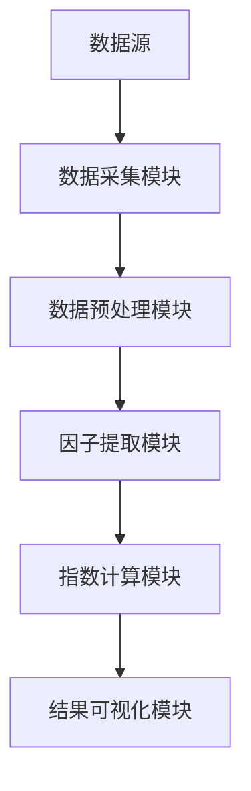

                 

# 肯尼斯费雪的竞争优势分析

> 关键词：竞争优势分析，肯尼斯费雪，投资策略，企业分析，费雪投资理论

> 摘要：本文深入探讨了肯尼斯费雪的竞争优势分析理论，分析了其核心概念、数学模型、系统架构以及实际应用案例，揭示了该理论在现代投资学中的重要性及其对投资决策的指导意义。

---

## 第1章: 肯尼斯费雪及其竞争优势分析简介

### 1.1 肯尼斯费雪的生平与投资理念

#### 1.1.1 费雪的投资生涯概述

肯尼斯·费雪（Kenneth Fisher）是美国著名投资家、作家和教育家，以其在投资学领域的深远影响而闻名。他不仅是投资理论的先驱，也是技术分析的倡导者，提出了许多重要的投资理念。费雪的职业生涯跨越了数十年，他的投资哲学和方法论对现代投资理论的发展产生了深远的影响。

#### 1.1.2 费雪的核心投资理念

费雪的投资理念以“竞争优势分析”为核心，强调企业内在价值的评估。他认为，投资者应该选择那些具有持续竞争优势的企业进行投资，而不是仅仅关注市场的短期波动。他的投资哲学强调长期主义，主张通过深入分析企业的基本面来寻找投资机会。

#### 1.1.3 费雪对现代投资学的贡献

费雪的理论为现代投资学奠定了重要基础，尤其是在企业竞争优势分析方面。他的研究成果不仅丰富了投资学的理论体系，还为投资者提供了实用的分析工具和方法。

### 1.2 竞争优势分析的定义与背景

#### 1.2.1 什么是竞争优势

竞争优势是指企业在市场中相对于竞争对手所具有的独特优势。这些优势可以是资源、技术、成本、品牌、市场占有率等多个方面的综合体现。竞争优势的存在使得企业在市场上具有更强的竞争力和盈利能力。

#### 1.2.2 竞争优势的分类与特征

竞争优势可以分为内部竞争优势和外部竞争优势。内部竞争优势包括企业的资源、技术、管理能力等；外部竞争优势则涉及市场地位、客户关系、销售渠道等因素。竞争优势的特征包括独特性、可持续性、可衡量性和动态性。

#### 1.2.3 竞争优势分析的现实意义

竞争优势分析是企业制定战略决策的重要工具。通过分析企业的竞争优势，可以帮助企业在激烈的市场竞争中找到自身的优势和劣势，从而制定有效的战略。对于投资者而言，竞争优势分析是评估企业投资价值的重要依据。

### 1.3 费雪竞争优势分析的核心思想

#### 1.3.1 费雪竞争优势分析的理论基础

费雪的竞争优势分析建立在对企业基本面的深入研究之上。他认为，企业的竞争优势来源于其独特的资源、技术和市场地位，而这些因素决定了企业的长期盈利能力。

#### 1.3.2 费雪竞争优势分析的实践应用

在实际应用中，费雪的竞争优势分析方法可以帮助投资者识别那些具有持续竞争优势的企业，从而做出明智的投资决策。这种方法不仅适用于单个企业的分析，也可以用于整个行业的评估。

#### 1.3.3 费雪竞争优势分析与现代投资学的结合

费雪的竞争优势分析与现代投资学的结合使得投资决策更加科学化和系统化。通过将竞争优势分析与其他投资理论相结合，投资者可以更好地理解市场的运作规律，从而提高投资决策的准确性。

---

## 第2章: 竞争优势分析的核心概念与框架

### 2.1 竞争优势的来源分析

#### 2.1.1 资源优势

企业的资源优势包括人力资源、财务资源、技术资源和市场资源等。这些资源是企业竞争优势的核心来源，能够为企业创造独特的价值。

#### 2.1.2 技术优势

技术优势是企业竞争优势的重要组成部分。拥有领先的技术不仅可以提高企业的生产效率，还可以降低生产成本，增强企业的市场竞争力。

#### 2.1.3 市场优势

市场优势是指企业在市场中的地位和影响力。包括市场份额、品牌知名度、客户忠诚度等方面。市场优势是企业竞争优势的重要体现。

#### 2.1.4 经营效率优势

经营效率优势是指企业在经营过程中所表现出的高效率。这包括管理效率、生产效率和运营效率等方面。经营效率优势能够降低成本，提高企业的盈利能力。

### 2.2 竞争优势的类型与对比

#### 2.2.1 企业内部竞争优势

企业内部竞争优势是指企业在内部管理和运营方面所具有的优势。这包括企业的组织结构、管理制度、员工素质等。

#### 2.2.2 企业外部竞争优势

企业外部竞争优势是指企业在市场和行业中所具有的优势。这包括企业的市场地位、品牌影响力、客户关系等。

#### 2.2.3 行业竞争优势

行业竞争优势是指企业在整个行业中所具有的优势。这包括行业集中度、市场进入壁垒、行业增长潜力等因素。

#### 2.2.4 竞争优势的动态变化

竞争优势并不是一成不变的，它会随着市场环境的变化而变化。企业需要不断调整和优化自身的竞争优势，以适应市场的变化。

### 2.3 竞争优势分析的框架设计

#### 2.3.1 竞争优势分析的维度划分

竞争优势分析可以从多个维度进行，包括企业内部、外部、行业等维度。每个维度都有其独特的分析指标和方法。

#### 2.3.2 竞争优势分析的指标体系

竞争优势分析的指标体系包括财务指标、非财务指标、定量指标和定性指标等。这些指标能够全面反映企业的竞争优势。

#### 2.3.3 竞争优势分析的流程与方法

竞争优势分析的流程包括数据采集、因子提取、指数计算和结果可视化等步骤。这些步骤需要系统化地进行，以确保分析结果的准确性和可靠性。

---

## 第3章: 竞争优势分析的数学模型与算法原理

### 3.1 竞争优势分析的数学模型

#### 3.1.1 竞争优势评分模型

竞争优势评分模型是一种用于评估企业竞争优势的数学模型。它通过对企业各个竞争优势因子进行评分，最终得出企业的竞争优势指数。

公式：
$$
\text{竞争优势指数} = \sum (\text{因子权重} \times \text{因子评分})
$$

#### 3.1.2 竞争优势指数计算公式

竞争优势指数计算公式用于量化企业的竞争优势。该公式综合考虑了多个竞争优势因子的权重和评分，最终得出企业的竞争优势指数。

公式：
$$
\text{竞争优势指数} = \frac{\sum (\text{因子权重} \times \text{因子评分})}{\sum \text{因子权重}}
$$

#### 3.1.3 竞争优势动态评估模型

竞争优势动态评估模型是一种用于评估企业竞争优势随时间变化的数学模型。它可以帮助企业预测未来的竞争优势变化趋势。

公式：
$$
\text{竞争优势指数}_{t} = \text{竞争优势指数}_{t-1} + \sum (\text{因子权重}_t \times \text{因子评分}_t)
$$

### 3.2 竞争优势分析的算法原理

#### 3.2.1 数据采集与预处理

竞争优势分析的第一步是数据采集。需要收集企业的财务数据、市场数据和行业数据等。数据预处理包括数据清洗、数据转换和数据标准化等步骤。

#### 3.2.2 竞争优势因子提取

竞争优势因子提取是通过分析数据，提取出能够反映企业竞争优势的关键因子。这些因子包括财务因子、非财务因子和市场因子等。

#### 3.2.3 竞争优势指数计算

竞争优势指数计算是通过将各个因子的权重和评分进行加权计算，最终得出企业的竞争优势指数。

#### 3.2.4 竞争优势结果可视化

竞争优势结果可视化是将计算出的竞争优势指数以图表形式展示出来，便于分析和解读。

---

## 第4章: 竞争优势分析的系统架构与实现

### 4.1 竞争优势分析系统的总体架构

#### 4.1.1 系统功能模块划分

竞争优势分析系统可以划分为数据采集模块、因子提取模块、指数计算模块和结果可视化模块。

#### 4.1.2 系统数据流设计

系统数据流设计描述了数据在各个模块之间的流动过程。数据首先从数据源采集，经过预处理后，提取出竞争优势因子，计算出竞争优势指数，最后通过可视化模块展示结果。

#### 4.1.3 系统架构图（Mermaid）

### 4.2 竞争优势分析系统的实现细节

#### 4.2.1 数据采集模块实现

数据采集模块负责从数据源（如数据库、网络数据等）采集企业数据。需要确保数据的准确性和完整性。

#### 4.2.2 竞争优势因子提取

竞争优势因子提取模块通过分析数据，提取出能够反映企业竞争优势的关键因子。这一步骤需要结合企业的实际情况，选择合适的因子提取方法。

#### 4.2.3 竞争优势指数计算

竞争优势指数计算模块通过加权计算，得出企业的竞争优势指数。需要根据企业的具体情况，调整各个因子的权重。

#### 4.2.4 竞争优势结果可视化

竞争优势结果可视化模块将计算出的竞争优势指数以图表形式展示出来。常用的图表包括柱状图、折线图和雷达图等。

---

## 第5章: 竞争优势分析的项目实战

### 5.1 项目背景与目标

#### 5.1.1 项目背景介绍

以某行业为例，选择具有代表性的企业作为分析对象，通过竞争优势分析方法，评估企业的竞争优势，为企业制定战略决策提供依据。

#### 5.1.2 项目目标设定

项目的总体目标是通过竞争优势分析，帮助企业识别其竞争优势和劣势，制定有效的战略规划。

#### 5.1.3 项目范围界定

项目的范围包括数据采集、因子提取、指数计算和结果可视化等步骤。

### 5.2 项目实施过程

#### 5.2.1 数据采集与清洗

首先从数据库中采集企业的财务数据、市场数据和行业数据，然后进行数据清洗，去除无效数据和异常值。

#### 5.2.2 竞争优势因子提取

通过分析数据，提取出能够反映企业竞争优势的关键因子，如财务因子、技术因子和市场因子等。

#### 5.2.3 竞争优势指数计算

根据提取出的因子，计算出企业的竞争优势指数。需要根据企业的具体情况，调整各个因子的权重。

#### 5.2.4 竞争优势结果可视化

将计算出的竞争优势指数以图表形式展示出来，便于分析和解读。

### 5.3 项目成果与分析

通过竞争优势分析，帮助企业识别其竞争优势和劣势，制定有效的战略规划。同时，为投资者提供科学的投资决策依据。

---

## 第6章: 总结与展望

### 6.1 总结

本文深入探讨了肯尼斯费雪的竞争优势分析理论，分析了其核心概念、数学模型、系统架构以及实际应用案例。通过竞争优势分析，可以帮助企业和投资者更好地理解市场规律，制定科学的决策。

### 6.2 未来研究方向

未来的研究可以进一步完善竞争优势分析的数学模型，探索新的竞争优势因子，以及研究竞争优势分析在不同行业中的应用。

### 6.3 注意事项

在实际应用中，需要注意数据的准确性和完整性，选择合适的因子提取方法，并根据企业的实际情况调整模型参数。

### 6.4 拓展阅读

建议读者进一步阅读相关文献，深入了解竞争优势分析的理论和实践。

---

## 作者信息

作者：AI天才研究院/AI Genius Institute & 禅与计算机程序设计艺术/Zen And The Art of Computer Programming

---

以上是《肯尼斯费雪的竞争优势分析》的技术博客文章大纲。根据大纲，我可以进一步展开每一部分的内容，详细阐述每个核心概念和方法，确保文章的逻辑性和深度。

