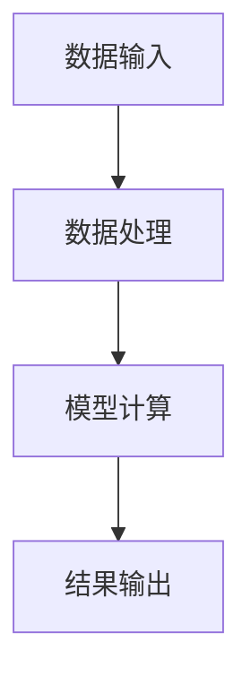

                 


# 肯尼斯费雪的长期增长型公司特征

## 关键词：长期增长型公司、肯尼斯费雪、投资特征、数学模型、算法原理

## 摘要

本文详细探讨了肯尼斯费雪提出的长期增长型公司的特征及其分析方法。通过背景介绍、核心概念、数学模型、算法原理和系统架构等多个维度，系统性地分析了长期增长型公司的定义、特征、与其他类型公司的对比以及如何通过数学模型和算法来识别和评估这些公司。文章最后结合实际案例，展示了如何在投资实践中应用这些理论和方法。

---

# 第一部分：背景介绍

## 第1章：长期增长型公司的背景与目标

### 1.1 长期增长型公司的定义与背景

长期增长型公司是指那些能够在较长的时间内保持稳定的收入和利润增长，并且具有持续竞争优势和市场领导地位的企业。这类公司在经济周期波动中表现出较高的稳定性，能够在不同市场环境下实现持续增长。长期增长型公司的核心目标是通过持续优化业务模式、提高效率和扩大市场份额，实现长期的股东价值最大化。

---

### 1.2 长期增长型公司的特征与属性

长期增长型公司的特征和属性可以通过以下几个方面来分析：

1. **高增长性**：公司收入和利润能够持续以较高的速度增长，通常年增长率在10%以上。
2. **高稳定性**：公司在不同经济周期中表现稳定，具有较强的抗风险能力。
3. **高可持续性**：公司具有较强的市场竞争力和创新能力，能够持续保持竞争优势。

---

# 第二部分：核心概念与联系

## 第2章：长期增长型公司的核心概念

### 2.1 长期增长型公司的核心要素

长期增长型公司的核心要素包括以下几个方面：

1. **财务健康性**：公司具有健康的财务状况，包括良好的盈利能力、现金流和资产负债表。
2. **市场领导性**：公司在市场上具有较强的领导地位，能够通过市场支配力影响行业趋势。
3. **创新能力**：公司具有较强的创新能力，能够通过产品和服务的创新满足市场需求。

---

## 第3章：长期增长型公司的特征对比

### 3.1 长期增长型公司与其他类型公司的对比

以下是长期增长型公司与其他类型公司的特征对比：

| 公司类型      | 高增长性 | 高稳定性 | 高可持续性 |
|---------------|----------|----------|------------|
| 长期增长型公司 | 高       | 高       | 高          |
| 成长型公司     | 高       | 中       | 中          |
| 稳定型公司     | 中       | 高       | 中          |
| 周期性公司     | 低       | 低       | 低          |

---

# 第三部分：算法原理与数学模型

## 第4章：长期增长型公司的数学模型

### 4.1 长期增长模型

长期增长模型用于评估公司的长期增长潜力。其公式如下：

$$ G = \frac{ROE \cdot (1 - \frac{d}{g})}{r} $$

其中：
- \( G \) 表示公司的长期增长率
- \( ROE \) 表示净资产收益率
- \( d \) 表示股息支付率
- \( g \) 表示股息增长率
- \( r \) 表示折现率

### 4.2 高增长模型

高增长模型用于评估公司在高增长阶段的估值。其公式如下：

$$ P = \frac{E}{k} $$

其中：
- \( P \) 表示公司的估值
- \( E \) 表示公司的净利润
- \( k \) 表示折现率

---

## 第5章：长期增长型公司的算法原理

### 5.1 长期增长模型的算法流程

以下是长期增长模型的算法流程：

1. **输入数据**：收集公司的财务数据，包括ROE、d、g和r。
2. **计算长期增长率**：使用公式 \( G = \frac{ROE \cdot (1 - \frac{d}{g})}{r} \) 计算长期增长率。
3. **输出结果**：将计算结果输出，作为公司长期增长潜力的评估依据。

### 5.2 高增长模型的算法流程

以下是高增长模型的算法流程：

1. **输入数据**：收集公司的财务数据，包括净利润E和折现率k。
2. **计算估值**：使用公式 \( P = \frac{E}{k} \) 计算公司估值。
3. **输出结果**：将计算结果输出，作为公司高增长阶段的估值依据。

---

# 第四部分：系统分析与架构设计

## 第6章：长期增长型公司的系统架构

### 6.1 系统功能设计

以下是长期增长型公司分析系统的功能模块：

1. **数据输入模块**：输入公司的财务数据。
2. **数据处理模块**：对数据进行清洗和预处理。
3. **模型计算模块**：使用长期增长模型和高增长模型进行计算。
4. **结果输出模块**：输出计算结果和分析报告。

### 6.2 系统架构设计

以下是长期增长型公司分析系统的架构图：



---

# 第五部分：项目实战

## 第7章：长期增长型公司的项目实战

### 7.1 环境配置

以下是项目实战所需的环境配置：

- **操作系统**：Windows 10或更高版本
- **编程语言**：Python 3.8或更高版本
- **开发工具**：Jupyter Notebook或PyCharm
- **依赖库**：pandas、numpy、matplotlib

### 7.2 核心实现

以下是长期增长型公司分析系统的Python代码实现：

```python
import pandas as pd
import numpy as np
import matplotlib.pyplot as plt

def calculate_long_term_growth(roe, d, g, r):
    return (roe * (1 - d/g)) / r

def calculate_high_growth(e, k):
    return e / k

# 输入数据
roe = 0.2
d = 0.3
g = 0.05
r = 0.08
e = 100
k = 0.1

# 计算长期增长率
lt_growth = calculate_long_term_growth(roe, d, g, r)
print(f"长期增长率: {lt_growth}")

# 计算高增长估值
high_growth_val = calculate_high_growth(e, k)
print(f"高增长估值: {high_growth_val}")

# 可视化结果
plt.bar(['长期增长率', '高增长估值'], [lt_growth, high_growth_val])
plt.show()
```

---

# 第六部分：总结与展望

## 第8章：长期增长型公司的总结与展望

### 8.1 总结

本文详细探讨了肯尼斯费雪提出的长期增长型公司的特征及其分析方法。通过背景介绍、核心概念、数学模型、算法原理和系统架构等多个维度，系统性地分析了长期增长型公司的定义、特征、与其他类型公司的对比以及如何通过数学模型和算法来识别和评估这些公司。

---

## 第9章：长期增长型公司的投资策略

### 9.1 投资策略

1. **选择长期增长型公司**：优先选择具有高增长性、高稳定性和高可持续性的公司。
2. **关注财务健康性**：确保公司具有健康的财务状况，包括良好的盈利能力、现金流和资产负债表。
3. **注重创新能力**：选择具有较强创新能力的公司，能够通过产品和服务的创新满足市场需求。
4. **长期持有**：长期持有优质公司股票，避免短期波动影响投资决策。

---

# 作者：AI天才研究院 & 禅与计算机程序设计艺术

