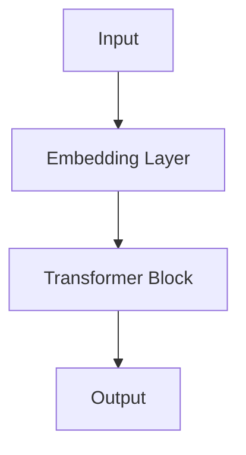
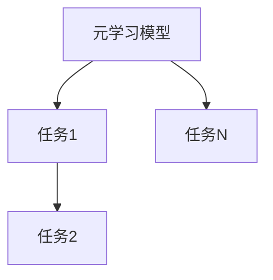
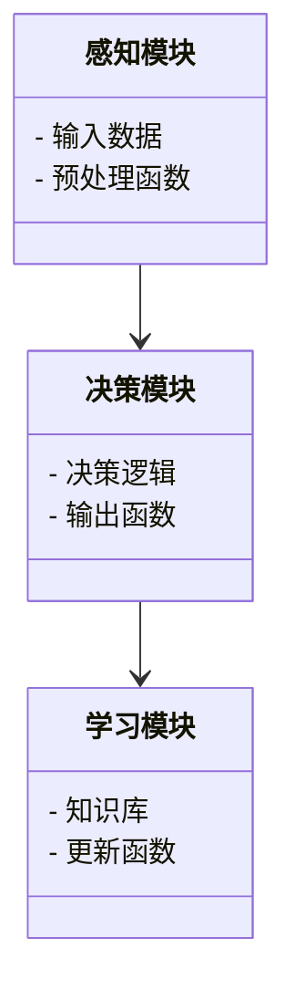
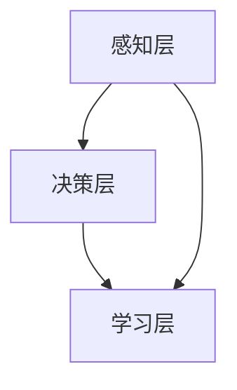
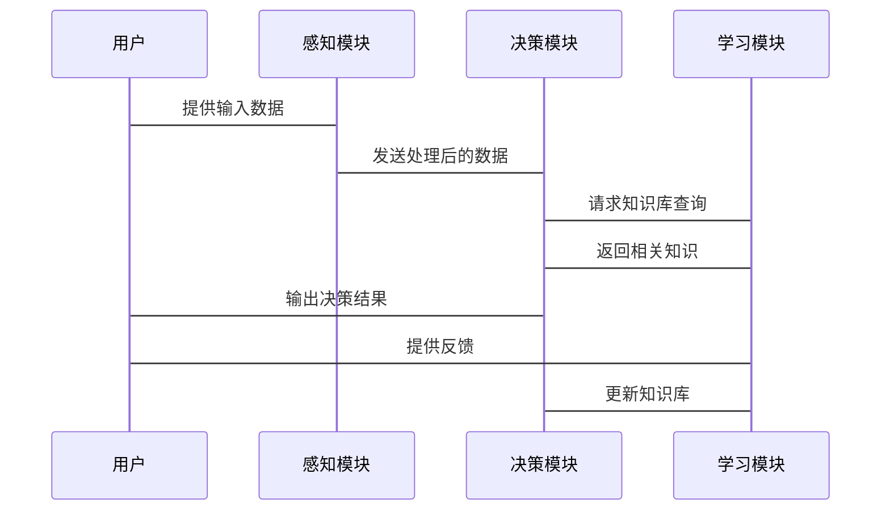

                 


# 自主学习AI Agent：LLM驱动的终身学习系统

**关键词**：自主学习AI Agent，LLM，终身学习，大语言模型，人工智能，机器学习

**摘要**：  
本文探讨了自主学习AI Agent的构建与应用，重点分析了LLM在终身学习系统中的核心作用。通过详细讲解LLM的原理、自主学习机制、系统架构设计以及实际项目实现，本文旨在为读者提供从理论到实践的全面指导，帮助他们理解如何利用LLM构建高效的自主学习系统。

---

## 第一部分：自主学习AI Agent概述

### 第1章：自主学习AI Agent的背景与概念

#### 1.1 自主学习AI Agent的定义与核心特征

自主学习AI Agent是一种能够通过与环境交互和自我学习来提升性能的智能体。其核心特征包括：

- **自主性**：无需外部干预，自主决策和行动。
- **适应性**：能根据新环境和数据调整行为。
- **持续学习能力**：通过经验不断优化知识库和决策模型。

**对比表：自主学习AI Agent与传统AI的区别**

| 特性                | 自主学习AI Agent         | 传统AI                |
|---------------------|--------------------------|-----------------------|
| 学习能力            | 具备自主学习能力         | 依赖预训练数据         |
| 环境适应性          | 能自适应新环境           | 需人工调整或更换模型   |
| 决策机制            | 基于实时反馈动态调整     | 基于固定规则或模型     |

#### 1.2 自主学习AI Agent的应用场景

- **教育领域**：作为个性化学习助手，根据学生反馈调整教学策略。
- **医疗领域**：辅助医生进行智能诊断，根据最新病例更新知识库。
- **金融领域**：提供智能投资建议，根据市场变化动态调整策略。

#### 1.3 自主学习AI Agent的重要性与挑战

- **重要性**：提升AI系统在动态环境中的适应性和决策能力。
- **挑战**：依赖大量数据和计算资源，确保数据隐私和安全。

---

## 第二部分：LLM驱动的自主学习机制

### 第2章：大语言模型（LLM）基础

#### 2.1 LLM的基本原理

- **转换器架构**：使用Transformer模型，通过自注意力机制捕捉上下文信息。
- **注意力机制**：通过权重分配，关注输入序列中重要的部分。
- **训练过程**：预训练和微调，利用大量文本数据优化模型参数。

**转换器架构Mermaid图**



#### 2.2 LLM的训练与优化

- **预训练策略**：利用无监督学习，通过自监督任务（如填空任务）优化模型。
- **微调方法**：在特定任务上进行有监督训练，调整模型参数以适应新任务。
- **模型压缩技术**：通过剪枝、量化等技术减少模型大小，提升计算效率。

#### 2.3 LLM在自主学习中的角色

- **知识表示**：将文本信息转化为向量表示，便于后续处理。
- **意图识别**：分析用户输入，识别其意图并生成响应。
- **决策推理**：基于上下文信息进行推理，做出最优决策。

---

### 第3章：元学习与自适应策略

#### 3.1 元学习的基本概念

元学习是一种通过学习如何学习的方法，使模型能够快速适应新任务。其关键在于：

- **快速适应新任务**：通过迁移学习，利用已有的知识快速调整模型参数。
- **知识迁移**：在不同任务之间共享知识，提升模型的泛化能力。

**元学习框架图**



#### 3.2 自适应学习策略

- **动态调整学习目标**：根据当前任务需求，实时调整学习目标。
- **实时反馈机制**：通过用户反馈或环境反馈，动态优化模型参数。
- **知识更新策略**：定期更新知识库，确保模型始终保持最新状态。

#### 3.3 基于LLM的自适应学习框架

- **知识表示与更新**：利用LLM将新知识转化为向量形式，更新知识库。
- **意图识别与调整**：根据用户反馈，调整意图识别策略，优化用户体验。
- **决策推理与优化**：基于更新后的知识库，优化决策推理过程，提升决策质量。

---

## 第三部分：系统架构与实现

### 第4章：系统架构设计

#### 4.1 系统功能设计

- **感知模块**：接收输入数据，进行预处理和特征提取。
- **决策模块**：基于感知结果，生成决策并输出。
- **学习模块**：根据反馈，更新知识库和模型参数。

**系统类图**



#### 4.2 系统架构设计

- **分层架构**：感知层、决策层和学习层，各层之间通过接口进行交互。
- **模块化设计**：各模块独立开发，便于维护和扩展。

**系统架构图**



#### 4.3 系统接口设计

- **输入接口**：接收用户输入或环境数据。
- **输出接口**：发送决策结果或反馈信息。
- **反馈接口**：接收用户反馈，用于模型优化。

#### 4.4 系统交互流程



---

## 第四部分：项目实战

### 第5章：项目实现

#### 5.1 环境搭建

- 安装必要的库：如TensorFlow、PyTorch、Hugging Face的Transformers库。
- 设置计算环境：推荐使用GPU加速训练。

#### 5.2 核心代码实现

```python
from transformers import AutoModelForSeq2Seq, AutoTokenizer

class LlamaAgent:
    def __init__(self, model_name):
        self.tokenizer = AutoTokenizer.from_pretrained(model_name)
        self.model = AutoModelForSeq2Seq.from_pretrained(model_name)
    
    def perceive(self, input_text):
        inputs = self.tokenizer.encode(input_text, return_tensors='np')
        outputs = self.model.generate(inputs, max_length=100)
        return self.tokenizer.decode(outputs[0], skip_special_tokens=True)
    
    def adapt(self, feedback):
        # 更新知识库，此处简化为调整模型参数
        # 实际应用中应实现更复杂的更新逻辑
        pass
```

#### 5.3 代码解读与分析

- **perceive函数**：接收输入文本，生成初步的感知结果。
- **adapt函数**：根据反馈更新模型参数，实现自适应学习。

#### 5.4 实际案例分析

- **教育场景**：学生提出问题，AI Agent根据反馈调整教学策略。
- **医疗场景**：分析病历，提供诊断建议并根据反馈更新知识库。

#### 5.5 项目小结

通过具体实现，展示了如何利用LLM构建自主学习AI Agent。实际案例验证了系统的有效性和适应性。

---

## 第五部分：挑战与未来方向

### 第6章：挑战与未来方向

#### 6.1 当前挑战

- **数据依赖性**：需要大量标注数据，获取难度大。
- **计算资源需求**：训练和推理需要高性能计算资源。

#### 6.2 未来方向

- **多模态学习**：结合视觉、听觉等多模态信息，提升学习效果。
- **人机协作**：增强人机互动，使AI Agent更自然地与人类协作。

---

## 结语

构建自主学习AI Agent是一项复杂但充满潜力的任务。通过结合LLM和终身学习机制，我们可以开发出更加智能和适应性的系统。尽管面临诸多挑战，但随着技术的进步，自主学习AI Agent必将在更多领域发挥重要作用。

---

**作者：AI天才研究院/AI Genius Institute & 禅与计算机程序设计艺术 /Zen And The Art of Computer Programming**

