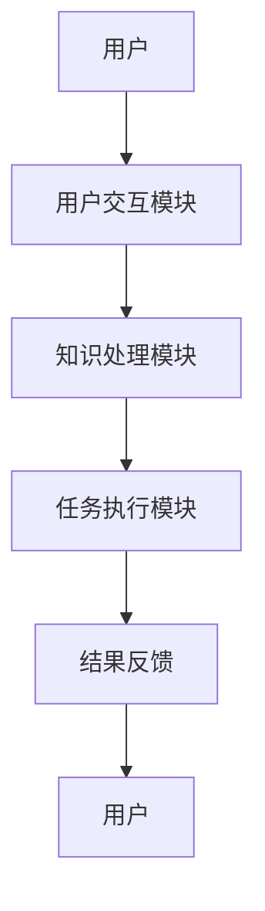

                 


# 自动化AI Agent开发平台：LLM辅助的智能系统构建

## 关键词：AI Agent, LLM, 自动化开发, 智能系统, 自然语言处理

## 摘要：  
随着人工智能技术的飞速发展，自动化AI Agent的开发正在成为构建智能系统的核心技术。本文将深入探讨如何利用大语言模型（LLM）辅助开发AI Agent，并提供从理论到实践的详细指导。通过分析AI Agent的核心概念、LLM的作用机制、系统架构设计以及实际项目案例，本文旨在为读者提供一个全面的视角，帮助他们理解并掌握基于LLM的AI Agent开发平台的构建方法。

---

## 第一部分：背景介绍

### 第1章：AI Agent概述

#### 1.1 AI Agent的基本概念
AI Agent（智能体）是指能够感知环境并采取行动以实现目标的实体。它可以是一个软件程序、机器人或任何能够自主决策的智能系统。AI Agent的核心在于其自主性、反应性和社会性。

- **自主性**：AI Agent能够在没有外部干预的情况下自主决策。
- **反应性**：AI Agent能够根据环境的变化实时调整行为。
- **社会性**：AI Agent能够与其他智能体或人类进行交互和协作。

AI Agent的应用场景广泛，包括智能助手、推荐系统、自动驾驶、智能客服等。

#### 1.2 LLM的定义与特点
大语言模型（LLM）是一种基于深度学习的自然语言处理模型，具有以下特点：
- **强大的上下文理解能力**：LLM能够处理长文本，并理解复杂的语义关系。
- **多任务通用性**：LLM可以应用于多种任务，如文本生成、问答、翻译等。
- **可扩展性**：LLM可以通过微调或提示工程技术适应不同的领域和任务。

#### 1.3 AI Agent与LLM的结合
AI Agent的核心任务是理解用户需求、执行任务并提供反馈。LLM作为AI Agent的“大脑”，负责处理自然语言输入、生成响应并指导系统的执行流程。

- **LLM作为知识库**：LLM可以作为AI Agent的知识存储和处理模块，帮助其理解用户意图并提供准确的信息。
- **对话系统设计**：LLM可以用于构建AI Agent的对话模块，使其能够进行自然的中文对话。
- **任务执行**：通过LLM的文本生成能力，AI Agent可以自动化地完成任务描述、信息检索等操作。

---

## 第二部分：AI Agent的核心理论

### 第2章：AI Agent的体系结构

#### 2.1 AI Agent的体系结构
AI Agent的体系结构通常包括以下几个模块：
- **知识表示与推理**：负责存储和处理知识，并通过推理得出结论。
- **行为规划与决策**：根据当前状态和目标，生成行动计划并选择最优动作。
- **人机交互界面**：与用户或其他系统进行交互。
- **系统集成与优化**：整合各个模块，优化整体性能。

#### 2.2 AI Agent的任务模型
AI Agent的任务模型描述了其如何理解和执行任务。主要包括以下几个方面：
- **任务分解**：将复杂任务分解为多个子任务。
- **状态空间与动作空间**：定义可能的状态和动作。
- **目标设定与评估**：设定目标并评估任务完成情况。

#### 2.3 AI Agent的决策机制
AI Agent的决策机制决定了其如何在复杂环境中做出最优选择。常见的决策机制包括：
- **基于规则的决策**：通过预定义的规则进行决策。
- **基于概率的决策**：利用概率模型进行预测和决策。
- **基于强化学习的决策**：通过强化学习算法优化决策策略。

---

## 第三部分：LLM在AI Agent中的应用

### 第3章：LLM作为AI Agent的知识库

#### 3.1 LLM的知识表示与检索
LLM可以通过自然语言处理技术帮助AI Agent理解和检索知识。例如：
- **文档解析与知识抽取**：从文本中提取关键信息并构建知识图谱。
- **知识图谱的构建与查询**：通过知识图谱进行高效的知识检索。

#### 3.2 LLM在对话系统中的应用
LLM可以显著提升AI Agent的对话能力：
- **对话生成**：通过LLM生成自然流畅的对话响应。
- **对话管理**：通过LLM理解上下文并管理对话流程。

---

## 第四部分：系统架构与设计

### 第4章：系统架构设计

#### 4.1 系统功能设计
AI Agent开发平台的功能模块包括：
- **用户交互模块**：处理用户输入并生成响应。
- **知识处理模块**：负责知识的存储、检索和生成。
- **任务执行模块**：根据用户需求执行具体任务。

#### 4.2 系统架构图
以下是AI Agent开发平台的系统架构图：



#### 4.3 接口设计
AI Agent开发平台需要设计清晰的接口：
- **输入接口**：接收用户输入或任务请求。
- **输出接口**：返回处理结果或执行反馈。

---

## 第五部分：项目实战

### 第5章：基于LLM的AI Agent开发

#### 5.1 环境安装
开发基于LLM的AI Agent需要以下环境：
- Python 3.8+
- PyTorch或TensorFlow
- Hugging Face Transformers库

#### 5.2 核心代码实现
以下是AI Agent的核心代码示例：

```python
from transformers import AutoTokenizer, AutoModelForCausalLM
import torch

class AIAssistant:
    def __init__(self, model_name="gpt2"):
        self.tokenizer = AutoTokenizer.from_pretrained(model_name)
        self.model = AutoModelForCausalLM.from_pretrained(model_name)
        
    def generate_response(self, input_text):
        inputs = self.tokenizer.encode(input_text, return_tensors="pt")
        outputs = self.model.generate(inputs, max_length=500, do_sample=True)
        response = self.tokenizer.decode(outputs[0], skip_special_tokens=True)
        return response
```

#### 5.3 案例分析
以智能客服为例，AI Agent可以通过LLM生成自然的中文对话，帮助用户解决问题。

---

## 第六部分：最佳实践与小结

### 第6章：最佳实践

#### 6.1 设计原则
- **模块化设计**：确保系统模块清晰，便于维护和扩展。
- **可扩展性**：预留接口，方便未来功能的扩展。
- **安全性**：确保数据安全和隐私保护。

#### 6.2 开发工具推荐
- **模型训练工具**：如Hugging Face、Google Colab。
- **可视化工具**：如TensorBoard、Graphviz。

#### 6.3 注意事项
- **性能优化**：通过并行计算和缓存技术提升系统性能。
- **错误处理**：设计完善的错误处理机制，确保系统健壮性。

---

## 结语

通过本文的详细讲解，读者可以全面了解如何利用LLM构建自动化AI Agent开发平台。从理论到实践，从系统架构到项目实现，本文为读者提供了完整的指导。希望本文能够帮助读者在智能系统开发领域取得更大的突破。

---

## 作者信息

作者：AI天才研究院/AI Genius Institute & 禅与计算机程序设计艺术 /Zen And The Art of Computer Programming

