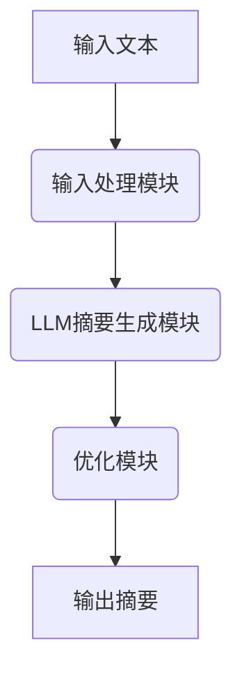

                 


# 自动文本摘要AI Agent：LLM驱动的关键信息提取

> 关键词：自动文本摘要，LLM，关键信息提取，大语言模型，文本摘要，AI Agent

> 摘要：本文探讨了利用大语言模型（LLM）驱动的自动文本摘要技术，分析了其核心概念、算法原理、系统架构，并通过实战案例展示其实现过程，最后总结了当前挑战与未来趋势。

## 引言

在信息爆炸的时代，自动文本摘要技术显得尤为重要。它能够帮助用户快速提取文本中的关键信息，节省阅读时间。本文将详细介绍基于LLM的自动文本摘要技术，从背景到实现，全面解析其原理与应用。

## 第一部分：自动文本摘要的背景与核心概念

### 第1章：自动文本摘要概述

#### 1.1 自动文本摘要的定义与背景

- **文本摘要的定义**：将长文本压缩为简洁总结的过程，保留核心信息。
- **背景与意义**：在信息过载的背景下，摘要技术帮助用户快速获取关键信息，提升阅读效率。
- **应用场景**：新闻、学术论文、社交媒体等多种场景。

#### 1.2 自动文本摘要的关键问题

- **核心挑战**：如何平衡信息压缩与保留，处理复杂语义。
- **问题建模**：将摘要任务转化为数学模型，明确输入输出。
- **边界与外延**：摘要长度、内容准确性的界定。

#### 1.3 核心要素

- **输入文本特征**：文本长度、领域特定性、上下文关联性。
- **输出摘要属性**：长度、准确性、可读性。
- **结构化描述**：主题、关键实体、事件序列。

### 第2章：LLM驱动的自动摘要

#### 2.1 LLM的基本原理

- **定义与特点**：大规模参数、预训练、自监督学习。
- **工作原理**：通过自注意力机制处理长文本，生成连贯摘要。
- **与传统NLP区别**：数据驱动、上下文感知、生成能力强。

#### 2.2 LLM在摘要中的应用

- **摘要方法**：直接生成式，基于抽取或生成。
- **训练优化**：利用大量数据微调，增强摘要效果。
- **优势**：捕捉上下文，处理复杂语义。

#### 2.3 系统架构设计

- **系统架构**：模块化设计，输入处理、摘要生成、优化。
- **输入处理**：预处理文本，提取关键信息。
- **生成模块**：LLM生成候选摘要。
- **优化模块**：质量评估，优化输出。

## 第二部分：基于LLM的自动文本摘要算法原理

### 第3章：基于LLM的文本摘要算法

#### 3.1 算法概述

- **基本思想**：利用LLM生成能力，通过模型参数优化。
- **主要步骤**：输入处理、模型推理、结果优化。
- **优缺点**：生成能力强，但准确性需优化。

#### 3.2 实现细节

- **模型输入输出**：输入文本，输出摘要。
- **训练过程**：监督学习，优化损失函数。
- **推理过程**：基于LLM生成摘要。

#### 3.3 优化策略

- **算法优化**：调整超参数，如学习率。
- **性能提升**：多任务学习，利用外部知识库。
- **可扩展性**：分布式训练，支持多语言。

### 第4章：数学模型

#### 4.1 建模

- **任务建模**：将摘要视为序列生成任务。
- **目标函数**：交叉熵损失函数。
- **约束条件**：摘要长度限制，主题保留。

#### 4.2 推导

- **模型参数**：权重矩阵、偏置项。
- **损失函数**：交叉熵损失，$$L = -\sum_{i=1}^{n} y_i \log p(y_i)$$。
- **优化算法**：梯度下降，Adam优化器。

#### 4.3 示例

- **公式展示**：$$L = \sum_{i=1}^{n} (y_i \log p(y_i) + (1-y_i)\log(1-p(y_i)))$$。
- **简化解释**：损失函数衡量生成与真实摘要的差异。

## 第三部分：系统分析与架构设计

### 第5章：系统架构设计

#### 5.1 功能模块

- **输入处理**：清洗、分段。
- **摘要生成**：调用LLM生成摘要。
- **优化模块**：质量评估，优化输出。

#### 5.2 架构图



#### 5.3 接口设计

- **API接口**：HTTP接口，接收文本，返回摘要。
- **交互流程**：用户请求，系统处理，返回结果。

## 第四部分：项目实战

### 第6章：项目实战

#### 6.1 环境安装

- **Python库**：使用Hugging Face库，安装`transformers`和`accelerate`。

#### 6.2 核心实现

```python
from transformers import AutoTokenizer, AutoModelForSeq2Seq
model_name = "facebook/bart-large-xsum"
tokenizer = AutoTokenizer.from_pretrained(model_name)
model = AutoModelForSeq2Seq.from_pretrained(model_name)
def generate_summary(text):
    inputs = tokenizer.encode("summarize: " + text, max_length=512, return_tensors="pt")
    outputs = model.generate(inputs.input_ids, max_length=150, num_beams=4, early_stopping=True)
    summary = tokenizer.decode(outputs[0], skip_special_tokens=True)
    return summary
```

#### 6.3 案例分析

- **案例输入**：长新闻文本。
- **生成摘要**：提取关键事件和时间。
- **优化输出**：确保摘要准确，语句通顺。

## 结论

基于LLM的自动文本摘要技术展现了强大的生成能力，但准确性仍需提升。未来，结合领域知识和多模态数据，摘要技术将更加智能化。

## 参考文献

（此处列出相关文献和资源）

---

作者：AI天才研究院/AI Genius Institute & 禅与计算机程序设计艺术 /Zen And The Art of Computer Programming

