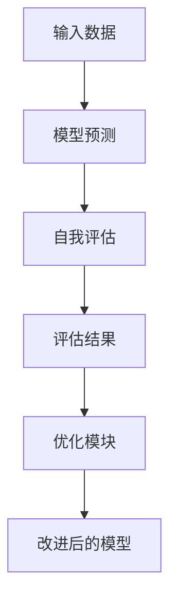
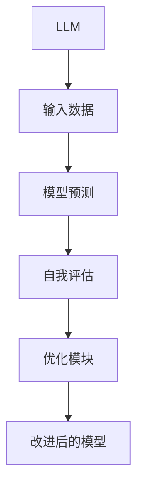
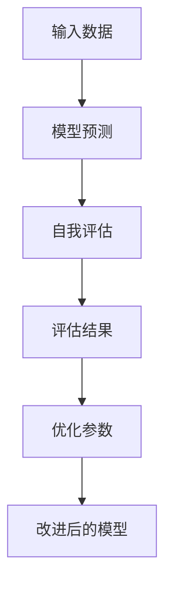
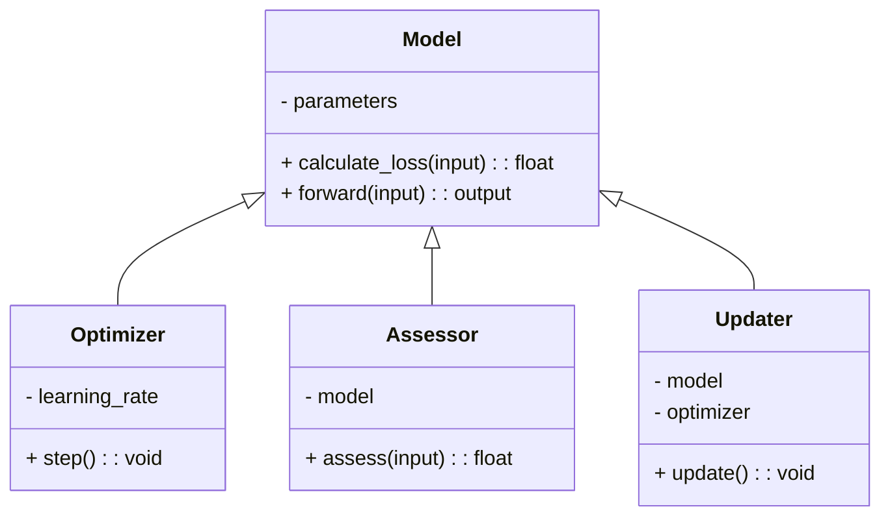
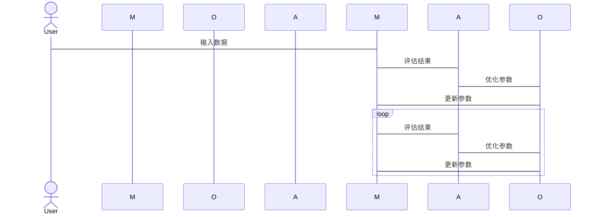

                 


# 自我改进型AI Agent：LLM的自我评估与优化

---

## 关键词：
自我改进型AI Agent, LLM, 自我评估, 优化算法, 系统架构

---

## 摘要：
本文深入探讨了自我改进型AI Agent的核心概念与实现方法，重点分析了基于大语言模型（LLM）的自我评估与优化机制。文章从问题背景出发，详细阐述了自我改进型AI Agent的算法原理、系统架构及实际应用场景，最后通过项目实战和最佳实践提供了具体的实现指导和优化建议。

---

# 第1章: 自我改进型AI Agent的背景与问题背景

## 1.1 问题背景

### 1.1.1 当前AI Agent的发展现状
随着人工智能技术的飞速发展，AI Agent（智能体）已经在各个领域展现出强大的应用潜力。传统的AI Agent依赖于外部数据和规则进行决策，但在动态变化的环境中，这种被动式的优化方式难以满足实时性和个性化的需求。

### 1.1.2 自我改进型AI Agent的提出动机
为了应对复杂多变的环境，AI Agent需要具备自我学习和优化的能力。自我改进型AI Agent的核心思想是通过内部评估机制不断优化自身的模型和策略，从而实现持续进化。

### 1.1.3 问题的边界与外延
自我改进型AI Agent的研究边界主要集中在LLM（大语言模型）的自我评估与优化机制上，而外延则包括多模态模型、强化学习等技术的结合应用。

---

## 1.2 问题描述

### 1.2.1 自我改进型AI Agent的核心目标
- 实现AI Agent的自我评估，发现性能瓶颈。
- 基于评估结果，优化模型参数或策略。

### 1.2.2 相关概念对比分析
| 概念 | 描述 |
|------|------|
| LLM | 基于Transformer的大型语言模型，具有强大的上下文理解和生成能力。 |
| 自我评估 | AI Agent通过内部机制评估自身的性能表现。 |
| 自我优化 | 基于评估结果，自动调整模型参数或策略。 |

### 1.2.3 核心问题的数学建模
AI Agent的自我评估与优化可以被建模为一个典型的元学习问题，目标函数为：
$$ \mathcal{L}(\theta) = \mathcal{E}(\theta) + \lambda \mathcal{R}(\theta) $$
其中，$\mathcal{E}(\theta)$是任务损失，$\mathcal{R}(\theta)$是正则化项，$\lambda$是调节系数。

---

## 1.3 问题解决

### 1.3.1 自我评估与优化的基本思路
通过构建元学习框架，AI Agent能够从多个任务中学习通用知识，并通过内部评估模块不断优化自身的表现。

### 1.3.2 相关技术的综述
- **元学习**：通过学习如何学习，提升模型的泛化能力。
- **自适应算法**：动态调整模型参数以适应环境变化。
- **反馈机制**：通过用户反馈或环境反馈进行自我改进。

### 1.3.3 当前研究的挑战与机遇
- **挑战**：如何设计高效的自我评估机制，避免过拟合。
- **机遇**：结合多模态数据和强化学习，提升AI Agent的智能水平。

---

## 1.4 核心概念结构与组成

### 1.4.1 自我改进型AI Agent的系统架构


### 1.4.2 核心要素的对比分析
| 组件 | 描述 |
|------|------|
| 输入数据 | 用于训练或推理的数据流。 |
| 模型预测 | 基于当前模型生成的输出。 |
| 自我评估 | 对模型预测结果的性能评估。 |
| 优化模块 | 基于评估结果调整模型参数。 |
| 改进后的模型 | 优化后的模型，用于后续推理。 |

---

# 第2章: 自我改进型AI Agent的核心概念与联系

## 2.1 核心概念原理

### 2.1.1 LLM的基本原理
大语言模型通过Transformer架构进行预训练，具备强大的上下文理解和生成能力。

### 2.1.2 自我评估机制的实现原理
AI Agent通过内部损失函数评估自身在特定任务上的表现。

### 2.1.3 自我优化算法的实现原理
基于评估结果，优化算法调整模型参数以提升性能。

---

## 2.2 核心概念属性特征对比

| 比较项 | LLM | 自我评估 | 自我优化 |
|--------|-----|----------|----------|
| 核心功能 | 生成和理解文本 | 评估模型性能 | 调整模型参数 |
| 输入 | 文本数据 | 模型输出 | 评估结果 |
| 输出 | 模型预测 | 评估分数 | 优化参数 |
| 应用场景 | NLP任务 | 性能监控 | 模型调优 |

---

## 2.3 实体关系图


---

# 第3章: 自我改进型AI Agent的算法原理

## 3.1 算法原理概述

### 3.1.1 元学习的基本概念
元学习是一种学习如何学习的方法，旨在通过少量数据快速适应新任务。

### 3.1.2 自我评估的算法框架
1. 输入数据经过模型生成预测结果。
2. 评估模块对预测结果进行评分。
3. 基于评估结果，优化模块调整模型参数。

### 3.1.3 自我优化的算法框架
1. 计算梯度，更新模型参数。
2. 重复评估和优化过程，直到达到收敛条件。

---

## 3.2 算法实现细节

### 3.2.1 元学习算法的实现步骤
```python
def meta_learning_algorithm(base_model, meta_model, tasks):
    for task in tasks:
        # 训练基模型
        base_opt = optim.Adam(base_model.parameters(), lr=1e-3)
        base_loss = base_model(task)
        base_opt.zero_grad()
        base_loss.backward()
        base_opt.step()
        
        # 训练元模型
        meta_opt = optim.Adam(meta_model.parameters(), lr=1e-3)
        meta_loss = meta_model(base_model)
        meta_opt.zero_grad()
        meta_loss.backward()
        meta_opt.step()
    return base_model, meta_model
```

### 3.2.2 自我评估模块的具体实现
```python
def self_assessment(model, input_data):
    model.eval()
    with torch.no_grad():
        outputs = model(input_data)
    loss = calculate_loss(outputs, input_data)
    return loss.item()
```

### 3.2.3 自我优化模块的具体实现
```python
def self_optimization(model, optimizer, assessment_loss):
    model.train()
    optimizer.zero_grad()
    loss = assessment_loss
    loss.backward()
    optimizer.step()
```

---

## 3.3 算法流程图


---

## 3.4 数学模型与公式

### 3.4.1 元学习的数学模型
$$ \mathcal{L}(\theta) = \mathcal{E}(\theta) + \lambda \mathcal{R}(\theta) $$

### 3.4.2 自我评估的数学模型
$$ f(x) = \text{argmin}_\theta \mathcal{L}(\theta) $$

---

# 第4章: 自我改进型AI Agent的系统架构

## 4.1 问题场景介绍
在动态变化的环境中，AI Agent需要具备实时自我评估和优化的能力，以应对各种任务需求。

---

## 4.2 系统功能设计

### 4.2.1 领域模型类图


---

## 4.3 系统架构设计

### 4.3.1 系统架构图


---

## 4.4 接口和交互序列图

### 4.4.1 接口设计


---

# 第5章: 项目实战

## 5.1 环境安装
```bash
pip install torch
pip install mermaid
```

---

## 5.2 核心代码实现

### 5.2.1 自我评估模块
```python
import torch

def self_assessment(model, input_data):
    model.eval()
    with torch.no_grad():
        outputs = model(input_data)
    loss = calculate_loss(outputs, input_data)
    return loss.item()
```

---

## 5.3 实际案例分析

### 5.3.1 案例分析
假设我们有一个文本分类任务，通过自我评估模块不断优化模型的分类准确率。

---

## 5.4 项目小结
通过实际项目，我们可以看到自我改进型AI Agent的强大能力，同时也发现了在实际应用中的一些挑战。

---

# 第6章: 最佳实践

## 6.1 小结
自我改进型AI Agent的核心在于构建高效的评估和优化机制。

---

## 6.2 注意事项
- 定期验证模型的评估机制，防止过拟合。
- 在实际应用中，结合具体任务需求进行参数调优。

---

## 6.3 拓展阅读
- "Meta-Learning for Everyone"：深入理解元学习的原理和应用。
- "Large Language Models: A Comprehensive Survey"：全面了解大语言模型的研究进展。

---

# 结语
自我改进型AI Agent代表了人工智能领域的一个重要研究方向，通过不断优化自身的模型和策略，AI Agent将具备更强的适应性和智能性，为未来的智能化社会奠定基础。

---

# 作者：AI天才研究院/AI Genius Institute & 禅与计算机程序设计艺术 /Zen And The Art of Computer Programming

