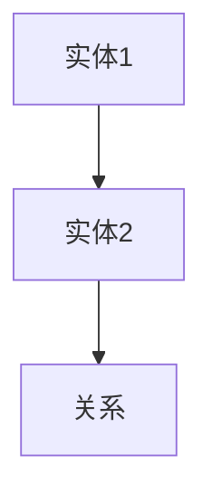
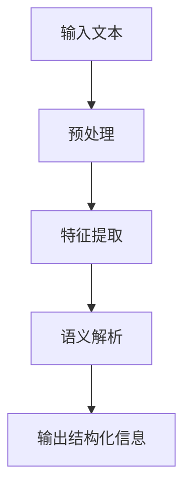
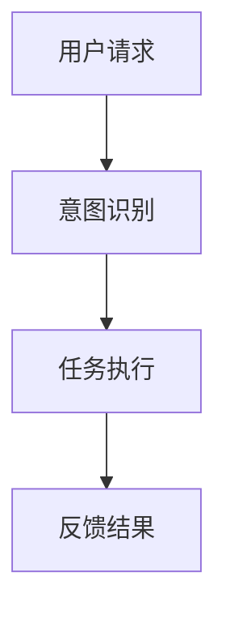
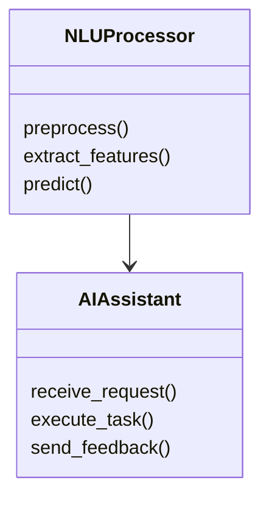
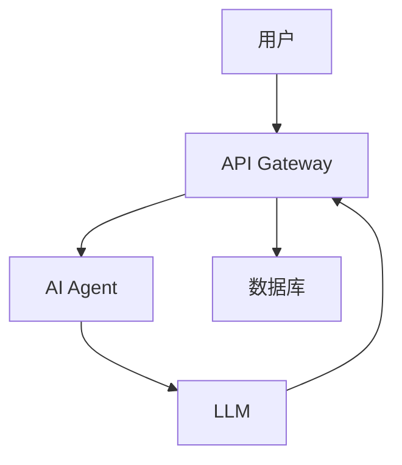
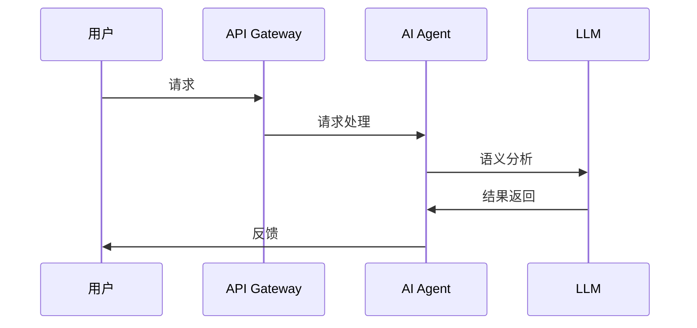

                 


# 自然语言理解增强AI Agent：深化LLM的语义分析

> 关键词：自然语言理解, AI Agent, 大语言模型, 语义分析, 实体关系图, 深度学习, 增强技术

> 摘要：本文探讨如何通过增强AI Agent来深化大语言模型（LLM）的语义分析能力，结合自然语言理解（NLU）技术，分析其核心概念、算法原理、数学模型及系统架构设计。通过实际案例展示如何在项目中实现增强AI Agent，进一步提升语义分析的准确性和实用性。

---

## 第1章: 自然语言理解与AI Agent的背景介绍

### 1.1 问题背景

#### 1.1.1 自然语言理解的发展历程
自然语言理解（NLU）是人工智能领域的重要分支，经历了从规则驱动到数据驱动的转变。早期基于语法分析的方法逐渐被深度学习模型取代，如词嵌入、序列模型和注意力机制等。

#### 1.1.2 AI Agent的定义与作用
AI Agent是一种智能体，能够感知环境并执行任务。它通过NLU技术理解用户意图，结合推理能力做出决策，实现人机交互。

#### 1.1.3 当前NLU技术的挑战与机遇
当前NLU面临语境理解不足、多语言支持弱等问题，但随着大语言模型的崛起，NLU技术迎来了更广泛的应用场景。

### 1.2 核心概念与问题描述

#### 1.2.1 自然语言理解的基本概念
NLU涉及文本预处理、特征提取和语义解析，目标是将自然语言转化为计算机可理解的结构。

#### 1.2.2 增强AI Agent的目标与任务
增强AI Agent旨在提升语义分析的准确性和效率，使其在复杂场景中表现更佳。

#### 1.2.3 语义分析的关键问题
包括意图识别、实体识别、情感分析等，需结合上下文和领域知识。

### 1.3 问题解决与边界

#### 1.3.1 增强AI Agent的核心技术
结合NLU和知识图谱，利用强化学习优化交互流程。

#### 1.3.2 语义分析的边界与外延
明确NLU的适用范围，避免超出模型能力的场景。

#### 1.3.3 核心概念的结构与要素
包括输入文本、处理逻辑、输出结果等。

---

## 第2章: 核心概念与联系

### 2.1 NLU与AI Agent的原理

#### 2.1.1 自然语言理解的原理
NLU通过预处理、特征提取和语义解析，将文本转化为结构化信息。

#### 2.1.2 AI Agent的工作机制
AI Agent接收输入，解析意图，执行任务并反馈结果。

#### 2.1.3 两者结合的逻辑关系
NLU为AI Agent提供理解能力，AI Agent通过NLU实现人机交互。

### 2.2 核心概念的属性对比

#### 2.2.1 NLU的属性特征
- 输入：文本
- 输出：结构化信息
- 方法：统计学习、深度学习

#### 2.2.2 AI Agent的属性特征
- 输入：用户请求
- 输出：任务执行结果
- 方法：意图识别、推理、执行

#### 2.2.3 对比分析表格

| 属性 | NLU | AI Agent |
|------|-----|----------|
| 输入 | 文本 | 用户请求 |
| 输出 | 结构化信息 | 任务结果 |
| 方法 | 统计/深度学习 | 意图识别/推理 |

### 2.3 ER实体关系图

#### 2.3.1 实体识别与关系抽取
识别文本中的实体（如人名、地名）并建立关系（如“在...工作”）。

#### 2.3.2 实体关系的构建
通过关系抽取算法，构建实体间的关系网络。

#### 2.3.3 ER图的Mermaid流程图



---

## 第3章: 算法原理与实现

### 3.1 算法原理

#### 3.1.1 基于LLM的NLU模型
利用大语言模型进行意图识别和实体抽取，通过微调提升模型性能。

#### 3.1.2 增强AI Agent的算法框架
结合NLU和知识图谱，优化模型推理过程。

#### 3.1.3 模型训练与优化
采用迁移学习和多任务学习，提升模型的泛化能力。

### 3.2 算法流程图

#### 3.2.1 NLU流程的Mermaid图



#### 3.2.2 AI Agent的交互流程图



#### 3.2.3 算法实现的代码框架

```python
def nlu_processor(text):
    # 预处理
    processed_text = preprocess(text)
    # 特征提取
    features = extract_features(processed_text)
    # 语义解析
    result = model.predict(features)
    return result
```

### 3.3 数学模型与公式

#### 3.3.1 概率分布模型

$$ P(\text{word}|z) = \text{softmax}(W_z \cdot \text{word}^T) $$

#### 3.3.2 模型训练公式

$$ \text{loss} = -\sum_{i=1}^n \log P(y_i|x_i) $$

#### 3.3.3 attention机制的公式

$$ \text{attention}(Q, K, V) = \text{softmax}(\frac{QK^T}{\sqrt{d}})V $$

---

## 第4章: 系统分析与架构设计

### 4.1 问题场景介绍

#### 4.1.1 语义分析的应用场景
包括客服系统、智能助手、舆情分析等。

#### 4.1.2 增强AI Agent的系统需求
支持多语言、高并发、实时响应。

#### 4.1.3 系统功能的分解
包括文本处理、意图识别、任务执行和反馈机制。

### 4.2 系统架构设计

#### 4.2.1 领域模型的Mermaid类图



#### 4.2.2 系统架构的Mermaid图



#### 4.2.3 接口设计与交互流程



---

## 第5章: 项目实战与案例分析

### 5.1 环境安装与配置

#### 5.1.1 开发环境的选择
推荐使用Python 3.8+，安装必要的库如TensorFlow、PyTorch。

#### 5.1.2 依赖库的安装
```bash
pip install numpy tensorflow transformers
```

#### 5.1.3 环境配置的注意事项
确保GPU支持和充足内存，配置虚拟环境避免版本冲突。

### 5.2 核心代码实现

#### 5.2.1 NLU模块的实现

```python
def preprocess(text):
    return text.lower().strip()

def extract_features(text):
    return embeddings_model.encode(text)

def predict_intent(features):
    return model.predict(features)
```

#### 5.2.2 AI Agent的交互逻辑

```python
def process_request(request):
    features = extract_features(preprocess(request))
    intent = predict_intent(features)
    execute_task(intent)
```

#### 5.2.3 代码示例与解读
展示如何调用API和处理反馈，确保代码简洁高效。

### 5.3 案例分析与应用

#### 5.3.1 实际案例的分析
分析一个客服系统的案例，展示如何通过增强AI Agent提升用户体验。

#### 5.3.2 代码的应用场景
说明如何将实现的代码应用于实际项目，包括参数调整和模型优化。

#### 5.3.3 案例的总结与反思
总结经验，反思不足，提出改进建议。

---

## 第6章: 最佳实践与小结

### 6.1 最佳实践

#### 6.1.1 

---

作者：AI天才研究院/AI Genius Institute & 禅与计算机程序设计艺术 /Zen And The Art of Computer Programming

