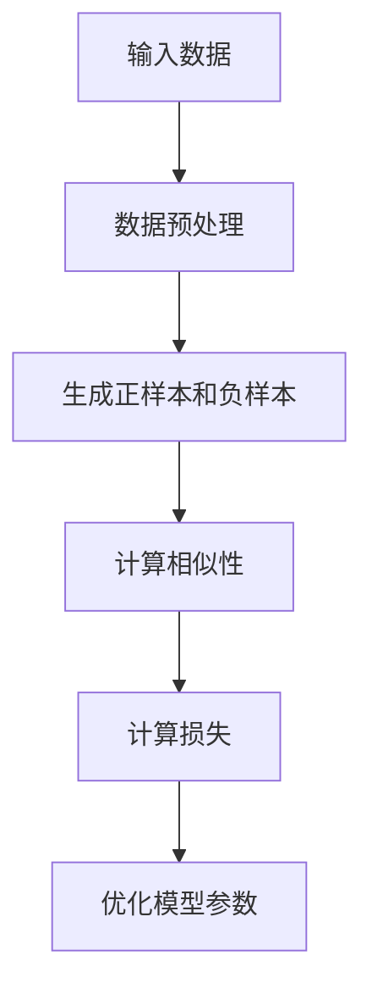
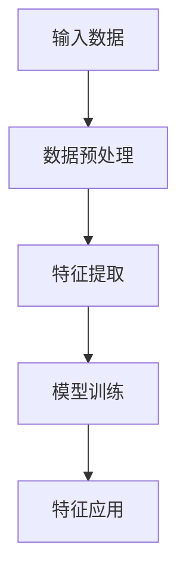

                 


---

# 自监督学习：减少AI Agent对标注数据的依赖

> 关键词：自监督学习, AI Agent, 数据标注, 无监督学习, 对比学习, 特征提取

> 摘要：自监督学习是一种通过利用未标注数据来训练模型的方法，能够显著减少AI Agent对标注数据的依赖。本文将详细探讨自监督学习的核心概念、算法原理、系统架构以及实际应用，帮助读者理解如何通过自监督学习提升AI Agent的性能和效率。

---

## 第一部分: 自监督学习概述

### 第1章: 自监督学习的背景与意义

#### 1.1 数据标注的挑战与痛点
在AI Agent的开发过程中，数据标注是一个耗时且昂贵的过程。高质量的标注数据通常需要专业人员进行人工标注，这使得许多AI项目受限于数据获取成本和时间。此外，标注数据的质量也直接影响模型的性能，如何高效利用未标注数据成为亟待解决的问题。

#### 1.2 自监督学习的核心价值
自监督学习通过利用未标注数据，通过预训练任务提取特征，从而减少对标注数据的依赖。这种方法不仅降低了数据获取成本，还能够提升模型的泛化能力。自监督学习的核心在于利用数据本身的结构信息，通过对比学习等技术，使模型能够从无标签数据中学习有用的特征表示。

#### 1.3 自监督学习在AI Agent中的应用前景
自监督学习可以广泛应用于AI Agent的多个方面，如图像识别、自然语言处理和语音识别等。通过自监督学习，AI Agent能够更高效地处理未标注数据，提升模型的鲁棒性和泛化能力。此外，自监督学习还能够结合强化学习和迁移学习，进一步提升AI Agent的智能水平。

### 第2章: 自监督学习的核心概念

#### 2.1 自监督学习的定义
自监督学习是一种无监督学习方法，通过设计预训练任务，利用未标注数据来学习数据的特征表示。自监督学习的核心在于将未标注数据转化为可监督的任务，从而利用监督学习的方法进行训练。

#### 2.2 自监督学习的特点
自监督学习具有以下特点：
- **无监督性**：不需要标注数据，仅利用未标注数据进行学习。
- **任务驱动性**：通过设计预训练任务，使模型能够从数据中学习有用的特征。
- **高效性**：通过预训练任务，可以快速提取数据特征，减少模型训练时间。

#### 2.3 自监督学习与监督学习的对比
自监督学习与监督学习的主要区别在于数据来源和任务设计。监督学习需要标注数据，并直接优化模型在标注任务上的性能；而自监督学习利用未标注数据，并通过预训练任务提取特征，从而减少对标注数据的依赖。

---

## 第二部分: 自监督学习的算法原理

### 第3章: 对比学习算法详解

#### 3.1 对比学习的数学模型
对比学习是一种自监督学习方法，通过最大化正样本对的相似性和最小化负样本对的相似性来学习数据的特征表示。其损失函数通常由两部分组成：正样本对的损失和负样本对的损失。

对比学习的损失函数可以表示为：
$$ L = -\log\left(\frac{e^{s(x_i, x_j)}}{e^{s(x_i, x_j)} + e^{s(x_i, x_k)}}\right) $$
其中，$s(x_i, x_j)$表示正样本对的相似性，$s(x_i, x_k)$表示负样本对的相似性。

#### 3.2 对比学习的算法流程
对比学习的算法流程包括以下步骤：
1. **数据预处理**：对未标注数据进行数据增强，生成正样本和负样本。
2. **预训练任务设计**：设计对比学习任务，如图像旋转或掩码预测。
3. **模型训练**：通过优化损失函数，训练模型提取数据特征。

#### 3.3 对比学习的代码实现
以下是一个对比学习的Python代码示例：

```python
import torch
import torch.nn as nn

class ContrastiveLoss(nn.Module):
    def __init__(self, temperature=1.0):
        super(ContrastiveLoss, self).__init__()
        self.temperature = temperature

    def forward(self, features, labels):
        # 正样本对
        positives = (features * (1 - (labels.unsqueeze(1) != labels.unsqueeze(0)))).sum()
        # 负样本对
        negatives = (features * (labels.unsqueeze(1) == labels.unsqueeze(0))).sum()
        # 计算损失
        loss = -torch.log(positives / (positives + negatives))
        return loss

# 示例数据
features = torch.randn(100, 128)
labels = torch.randint(0, 10, (100,))

# 初始化损失函数
contrastive_loss = ContrastiveLoss()

# 计算损失
loss = contrastive_loss(features, labels)
print(loss)
```

#### 3.4 对比学习的流程图
以下是一个对比学习的流程图：



---

### 第4章: 信息瓶颈理论

#### 4.1 信息瓶颈理论的定义
信息瓶颈理论是一种自监督学习方法，旨在通过优化模型在特征提取过程中保留尽可能多的有用信息，同时去除冗余信息。信息瓶颈理论的核心在于平衡特征的可区分性和鲁棒性。

#### 4.2 信息瓶颈理论的实现
信息瓶颈理论的实现可以通过以下步骤：
1. **特征提取**：提取数据的特征表示。
2. **信息量计算**：计算特征表示的信息量。
3. **瓶颈优化**：通过优化瓶颈参数，使特征表示在保留有用信息的同时，去除冗余信息。

#### 4.3 信息瓶颈理论的代码实现
以下是一个信息瓶颈理论的Python代码示例：

```python
import torch
import torch.nn as nn

class InformationBottleneck(nn.Module):
    def __init__(self, input_dim, bottleneck_dim):
        super(InformationBottleneck, self).__init__()
        self.encoder = nn.Linear(input_dim, bottleneck_dim)
        self.decoder = nn.Linear(bottleneck_dim, input_dim)

    def forward(self, x):
        z = self.encoder(x)
        x_recon = self.decoder(z)
        return x_recon, z

# 示例数据
input_dim = 128
bottleneck_dim = 64
features = torch.randn(100, input_dim)

# 初始化信息瓶颈模型
ib_model = InformationBottleneck(input_dim, bottleneck_dim)

# 前向传播
x_recon, z = ib_model(features)

# 计算重建损失
recon_loss = torch.mean((x_recon - features) ** 2)
print(recon_loss)
```

---

## 第三部分: 自监督学习的系统架构

### 第5章: 自监督学习在AI Agent中的系统架构

#### 5.1 系统功能设计
自监督学习在AI Agent中的系统架构包括以下功能模块：
- **数据预处理模块**：对未标注数据进行数据增强和预处理。
- **特征提取模块**：通过自监督学习算法提取数据特征。
- **模型训练模块**：对模型进行训练和优化。
- **特征应用模块**：将提取的特征应用于具体任务。

#### 5.2 系统架构设计
以下是一个自监督学习系统的架构图：



#### 5.3 系统接口设计
自监督学习系统的接口设计包括以下内容：
- **输入接口**：接收未标注数据和预训练任务参数。
- **输出接口**：输出训练好的模型和特征表示。

---

## 第四部分: 项目实战

### 第6章: 自监督学习的实际应用

#### 6.1 项目背景
在一个图像分类任务中，我们希望通过自监督学习减少对标注数据的依赖，提升模型的泛化能力。

#### 6.2 环境安装
安装所需的库：
```bash
pip install torch torchvision
```

#### 6.3 代码实现
以下是一个自监督学习的Python代码示例：

```python
import torch
import torch.nn as nn
import torch.optim as optim
from torchvision import datasets, transforms

# 数据预处理
transform = transforms.Compose([
    transforms.Resize(32),
    transforms.RandomCrop(32, padding=4),
    transforms.ToTensor(),
])

# 加载CIFAR-10数据集
train_dataset = datasets.CIFAR10(root='./data', train=True, download=True, transform=transform)
train_loader = torch.utils.data.DataLoader(train_dataset, batch_size=128, shuffle=True)

# 初始化对比学习模型
class ContrastiveModel(nn.Module):
    def __init__(self, embedding_dim=128):
        super(ContrastiveModel, self).__init__()
        self.encoder = nn.Sequential(
            nn.Conv2d(3, 64, kernel_size=3, padding=1),
            nn.ReLU(),
            nn.Conv2d(64, 128, kernel_size=3, padding=1),
            nn.ReLU()
        )
        self.bottleneck = nn.Linear(128 * 32 * 32, embedding_dim)

    def forward(self, x):
        features = self.encoder(x)
        features = features.view(features.size(0), -1)
        embeddings = self.bottleneck(features)
        return embeddings

# 初始化模型和优化器
model = ContrastiveModel()
optimizer = optim.Adam(model.parameters(), lr=1e-4)
contrastive_loss = ContrastiveLoss()

# 训练过程
for epoch in range(10):
    for batch_idx, (x, y) in enumerate(train_loader):
        # 前向传播
        embeddings = model(x)
        # 计算损失
        loss = contrastive_loss(embeddings, y)
        # 反向传播和优化
        optimizer.zero_grad()
        loss.backward()
        optimizer.step()

# 保存模型
torch.save(model.state_dict(), 'contrastive_model.pth')
```

#### 6.4 项目总结
通过自监督学习，我们能够有效地减少对标注数据的依赖，提升模型的泛化能力。对比学习算法在图像分类任务中表现出色，能够显著提高模型的性能。

---

## 第五部分: 总结与展望

### 第7章: 总结与展望

#### 7.1 自监督学习的优势
自监督学习通过利用未标注数据，显著减少数据获取成本，提升模型的泛化能力。

#### 7.2 自监督学习的挑战
自监督学习仍然面临一些挑战，如如何设计有效的预训练任务，如何处理数据分布偏移等。

#### 7.3 自监督学习的未来研究方向
未来的研究方向包括结合强化学习和迁移学习，探索更高效的自监督学习算法，进一步提升AI Agent的智能水平。

---

作者：AI天才研究院 & 禅与计算机程序设计艺术

