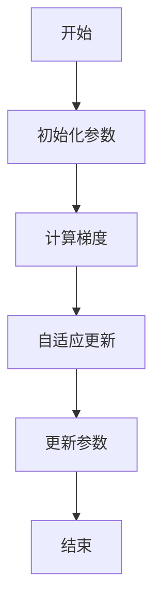

                 


# 自适应学习率在AI Agent训练中的应用

> **关键词**: 自适应学习率, AI Agent, 机器学习, 优化算法, 梯度下降, 参数更新

> **摘要**: 本文深入探讨了自适应学习率在AI Agent训练中的应用，从背景到实现，结合理论与实践，详细分析了其在提升模型训练效率和性能中的重要作用。

---

# 第1章: 自适应学习率的基本概念与背景

## 1.1 问题背景与描述

### 1.1.1 传统学习率的局限性

在传统的机器学习训练过程中，学习率（Learning Rate）是一个固定的超参数，决定了模型参数更新的步长。然而，固定学习率在实际应用中存在以下问题：

- **收敛速度慢**：在复杂的优化任务中，固定学习率可能导致模型在某些区域收敛速度过慢。
- **训练不稳定**：在不同特征维度上，参数更新的梯度大小差异较大，固定学习率可能导致某些参数更新过大或过小，导致训练不稳定。
- **难以处理非平稳任务**：在动态变化的环境中，固定学习率无法自适应调整，可能无法有效跟踪最优解。

### 1.1.2 AI Agent训练中的挑战

AI Agent的训练通常涉及多智能体协作、复杂环境交互等问题，这使得传统的固定学习率方法难以满足需求。具体挑战包括：

- **动态环境**：AI Agent需要在动态变化的环境中调整策略，固定学习率无法自适应调整。
- **多目标优化**：AI Agent通常需要在多个目标之间进行权衡，固定学习率难以平衡不同目标的优化速度。
- **复杂任务空间**：AI Agent的任务空间可能非常复杂，固定学习率难以适应不同任务的优化需求。

### 1.1.3 自适应学习率的必要性

为了解决上述问题，自适应学习率在AI Agent训练中的应用变得必要。自适应学习率能够根据训练过程中的梯度信息动态调整学习率，从而提高训练效率和模型性能。

---

## 1.2 问题解决与边界

### 1.2.1 自适应学习率的核心作用

自适应学习率通过动态调整学习率，能够在不同阶段自动适应梯度变化，从而：

- **加快收敛速度**：自适应学习率能够在梯度较大的区域采用较大的学习率，加快收敛速度。
- **提高训练稳定性**：通过动态调整学习率，避免参数更新过大或过小，提高训练稳定性。
- **适应复杂任务**：在多目标优化和复杂任务中，自适应学习率能够更好地平衡不同目标的优化。

### 1.2.2 问题的边界与外延

自适应学习率的应用并非万能的，其适用范围和边界包括：

- **适用场景**：适用于梯度变化较大、任务动态性较高的场景。
- **不适用场景**：在梯度变化平稳、任务静态的场景中，固定学习率可能更优。
- **实现复杂性**：自适应学习率的实现通常比固定学习率复杂，需要额外的计算和内存开销。

### 1.2.3 自适应学习率的实现方式

自适应学习率的实现方式多样，常见的包括：

- **自适应矩估计（Adam）**：结合动量和自适应学习率的思想，动态调整学习率。
- **自适应梯度方法（AdaGrad）**：根据梯度的平方和动态调整学习率。
- **自适应优化器（如Adadelta、RMSprop）**：通过不同的自适应策略调整学习率。

---

## 1.3 核心概念与核心要素

### 1.3.1 核心概念

自适应学习率的核心概念是动态调整学习率，以适应训练过程中的梯度变化和任务需求。其核心要素包括：

- **当前梯度**：用于计算当前参数更新的梯度信息。
- **历史梯度**：用于累积梯度信息，帮助调整学习率。
- **自适应策略**：根据当前和历史梯度信息，动态调整学习率。

### 1.3.2 核心要素对比

以下是自适应学习率与固定学习率的核心要素对比表：

| 对比维度       | 固定学习率                     | 自适应学习率                 |
|----------------|-------------------------------|-----------------------------|
| 学习率调整方式   | 固定不变                      | 动态调整                     |
| 梯度适应能力   | 无法适应梯度变化               | 能够适应梯度变化             |
| 训练效率       | 较低                          | 较高                         |
| 适用场景       | 梯度变化小、任务静态           | 梯度变化大、任务动态           |

---

## 1.4 ER实体关系图与流程图

### 1.4.1 ER实体关系图

以下是自适应学习率的ER实体关系图：

```mermaid
er
  actor(用户)
  adapter(自适应器)
  parameter(参数)
  relation(关联)
  用户 --> 关联 --> 参数
  自适应器 --> 关联 --> 参数
```

### 1.4.2 核心流程图

以下是自适应学习率的实现流程图：



---

## 总结

本章详细介绍了自适应学习率的基本概念、背景、问题解决方法及其核心要素。通过对比分析和流程图展示，读者可以清晰理解自适应学习率的核心思想和实现方式。

---

**作者：AI天才研究院/AI Genius Institute & 禅与计算机程序设计艺术 /Zen And The Art of Computer Programming**

