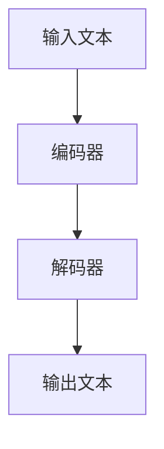
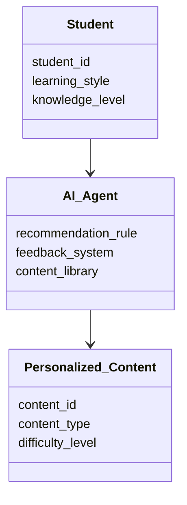
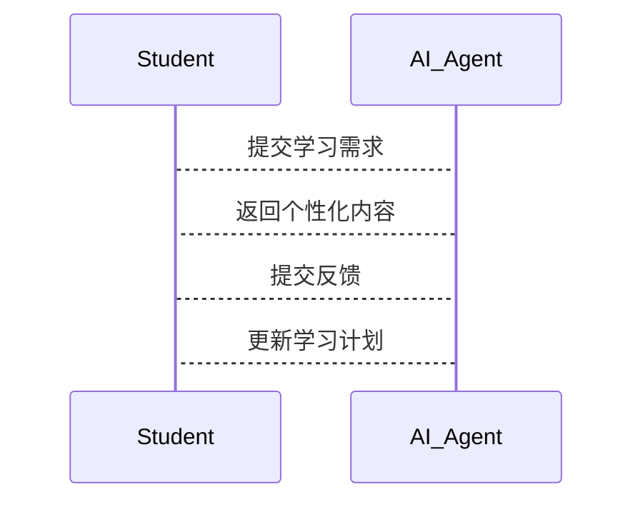

                 


---

# 自适应教育AI Agent：个性化LLM辅助学习系统

> **关键词**：自适应教育、AI Agent、LLM、个性化学习、教育技术

> **摘要**：随着人工智能和大语言模型技术的快速发展，个性化教育的需求日益增长。本文探讨如何利用AI Agent和大语言模型（LLM）构建自适应教育系统，通过分析系统背景、核心概念、算法原理、系统架构，并结合项目实战，提供一套实现个性化学习辅助的技术方案。

---

## 第1章: 自适应教育AI Agent的背景与问题描述

### 1.1 问题背景

#### 1.1.1 传统教育模式的局限性
传统教育模式通常采用统一的教学方式，难以满足学生的个性化学习需求。教师精力有限，难以关注到每个学生的个体差异，导致部分学生无法充分发挥潜力。

#### 1.1.2 AI技术在教育领域的应用趋势
随着AI技术的快速发展，教育领域逐渐引入智能化工具，如AI Agent和大语言模型（LLM），以实现个性化教学和学习辅助。

#### 1.1.3 自适应学习的需求与挑战
学生的学习能力和兴趣各不相同，自适应学习系统能够根据学生的特点提供个性化的学习方案，但其设计和实现面临技术与资源的双重挑战。

### 1.2 问题描述

#### 1.2.1 学生个性化学习需求的多样性
学生在学习进度、知识掌握程度和兴趣爱好上存在显著差异，需要个性化的学习路径。

#### 1.2.2 教师与教育资源分配的不均衡
教育资源分配不均，教师难以兼顾每个学生的需求，导致教学效果参差不齐。

#### 1.2.3 现有教育技术的不足
现有教育技术难以深度理解学生需求，且缺乏动态调整能力，无法真正实现个性化教学。

### 1.3 问题解决思路

#### 1.3.1 自适应教育的核心理念
通过AI技术实现个性化学习路径设计，动态调整教学内容和进度，满足学生的学习需求。

#### 1.3.2 AI Agent在教育中的角色定位
AI Agent作为教育系统的核心组件，负责分析学生数据、推荐学习资源和提供实时反馈。

#### 1.3.3 LLM在自适应学习中的应用潜力
利用LLM的强大语言处理能力，实现自然语言理解、个性化内容生成和动态反馈机制。

### 1.4 边界与外延

#### 1.4.1 自适应教育的适用范围
适用于K-12教育、高等教育和职业培训等领域，尤其适合个性化学习需求高的场景。

#### 1.4.2 AI Agent的边界条件
AI Agent仅作为辅助工具，不替代教师的人工干预和指导。

#### 1.4.3 与传统教育技术的区分
传统教育技术通常基于固定规则，而自适应教育系统基于动态数据和AI算法。

### 1.5 核心概念结构与组成

#### 1.5.1 自适应教育AI Agent的组成要素
- **学生建模模块**：分析学生的学习行为、知识水平和兴趣爱好。
- **内容推荐模块**：根据学生特点推荐个性化学习资源。
- **反馈评估模块**：实时反馈学习效果并调整学习计划。

#### 1.5.2 LLM在系统中的作用
- **自然语言处理**：理解学生的语言输入，生成个性化内容。
- **知识表示**：构建知识图谱，支持动态学习内容生成。

#### 1.5.3 系统的核心功能模块
- **学生建模**：收集和分析学生数据，构建个性化学习模型。
- **内容生成**：基于LLM生成适合学生的学习材料。
- **反馈机制**：实时评估学生的学习效果并提供反馈。

---

## 第2章: 自适应教育AI Agent的核心概念与联系

### 2.1 AI Agent的基本原理

#### 2.1.1 AI Agent的定义与分类
AI Agent是一种智能体，能够感知环境并采取行动以实现目标。在教育领域，AI Agent主要用于个性化学习支持和资源推荐。

#### 2.1.2 自适应教育AI Agent的特点
- **个性化**：根据学生特点提供定制化服务。
- **动态调整**：实时更新学习计划和资源推荐。
- **交互性**：支持自然语言交互，增强用户体验。

#### 2.1.3 AI Agent与教育的结合方式
通过API和用户交互界面，AI Agent整合到教育平台，提供实时辅助和学习建议。

### 2.2 LLM的基本原理

#### 2.2.1 LLM的定义与特点
大语言模型是一种基于深度学习的NLP模型，具备强大的文本理解和生成能力。

#### 2.2.2 LLM在教育中的应用场景
- **智能辅导**：通过对话交互解答学生疑问。
- **内容生成**：生成个性化学习材料和练习题。
- **学习评估**：分析学生的作业和测试结果。

#### 2.2.3 LLM与自适应学习的关系
LLM作为核心组件，支持自适应教育AI Agent实现个性化内容生成和动态反馈。

### 2.3 核心概念对比分析

#### 2.3.1 AI Agent与传统教育技术的对比

| **特性**       | **AI Agent**       | **传统教育技术**         |
|----------------|--------------------|--------------------------|
| 智能性         | 高度智能化         | 基于固定规则            |
| 个性化         | 强调个性化         | 较少关注个性化           |
| 动态调整       | 实时调整           | 静态或周期性调整          |

#### 2.3.2 LLM与其他NLP模型的对比
- **传统NLP模型**：基于规则或浅层学习，处理特定任务。
- **LLM**：基于深度学习，具备上下文理解和生成能力。

#### 2.3.3 自适应学习系统与其他教育技术的对比
- **传统在线学习平台**：基于固定课程结构，缺乏个性化。
- **自适应学习系统**：动态调整学习路径和内容，实现个性化学习。

### 2.4 实体关系图

```mermaid
erDiagram
    student --> has : student_id
    student --> has : learning_style
    student --> has : knowledge_level
    ai_agent --> has : recommendation_rule
    ai_agent --> has : feedback_system
    ai_agent --> has : content_library
    student --> uses : ai_agent
    ai_agent --> generates : personalized_content
    ai_agent --> provides : feedback
```

---

## 第3章: 自适应教育AI Agent的算法原理

### 3.1 LLM的训练过程

#### 3.1.1 神经网络结构
大语言模型通常基于Transformer架构，包含编码器和解码器。

#### 3.1.2 损失函数与优化算法
- **损失函数**：交叉熵损失。
- **优化算法**：Adam优化器。

#### 3.1.3 数据预处理与训练策略
- 数据清洗：去除噪声数据。
- 数据增强：扩展训练数据多样性。

### 3.2 推理机制

#### 3.2.1 解码过程
- 基于贪心算法或随机采样生成文本。

#### 3.2.2 注意力机制
- 计算输入序列中每个词的重要性，指导生成过程。

#### 3.2.3 模型调优与微调
- 基于特定任务数据进行微调，提升模型性能。

### 3.3 算法实现

#### 3.3.1 算法流程图



#### 3.3.2 Python代码实现
```python
import torch
import torch.nn as nn

class Transformer(nn.Module):
    def __init__(self, input_dim, hidden_dim):
        super(Transformer, self).__init__()
        self.encoder = nn.Embedding(input_dim, hidden_dim)
        self.decoder = nn.LSTM(hidden_dim, hidden_dim)
    
    def forward(self, input):
        encoded = self.encoder(input)
        output, _ = self.decoder(encoded)
        return output
```

#### 3.3.3 数学模型和公式
- **编码器**：将输入序列转换为嵌入向量。
- **解码器**：基于嵌入向量生成输出序列。
  $$ \text{输出} = \text{解码器}(\text{编码器}(输入)) $$

---

## 第4章: 自适应教育AI Agent的系统分析与架构设计

### 4.1 问题场景介绍
系统旨在解决学生个性化学习需求，通过AI Agent和LLM提供动态学习支持。

### 4.2 系统功能设计

#### 4.2.1 领域模型类图



### 4.3 系统架构设计

#### 4.3.1 分层架构


#### 4.3.2 接口设计
- **API接口**：RESTful API，提供学生数据查询、内容推荐和反馈评估功能。

#### 4.3.3 交互流程



---

## 第5章: 项目实战

### 5.1 环境安装

#### 5.1.1 安装Python和必要的库
```bash
pip install torch transformers
```

### 5.2 核心代码实现

#### 5.2.1 学生建模
```python
class StudentModel:
    def __init__(self, student_id):
        self.student_id = student_id
        self.learning_style = {}
        self.knowledge_level = {}
    
    def update_level(self, subject, level):
        self.knowledge_level[subject] = level
```

#### 5.2.2 内容推荐
```python
class ContentRecommender:
    def __init__(self, content_library):
        self.content_library = content_library
    
    def recommend(self, student):
        # 根据学生知识水平推荐内容
        recommended = []
        for subject, level in student.knowledge_level.items():
            if level < 0.7:
                recommended.append(content_library[subject])
        return recommended
```

### 5.3 案例分析

#### 5.3.1 学生A的学习情况
- 学生A在数学方面掌握较好，但在英语阅读理解上有困难。
- 系统推荐相关英语阅读练习，并提供实时反馈。

---

## 第6章: 最佳实践

### 6.1 小结
本文详细介绍了自适应教育AI Agent的实现方案，包括系统背景、核心概念、算法原理和项目实战。

### 6.2 注意事项
- 数据隐私保护至关重要。
- 系统需要持续优化和更新。

### 6.3 拓展阅读
推荐阅读《大语言模型与教育技术》和《自适应学习系统设计》。

---

**作者：AI天才研究院 & 禅与计算机程序设计艺术**

