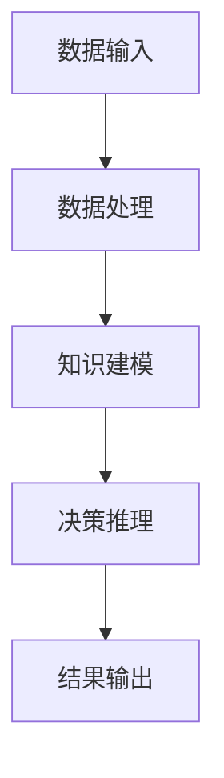

                 

# 《芒格的"mental models"在人工智能辅助决策中的应用》

> 关键词：芒格，mental models，人工智能，辅助决策，决策算法，系统架构，知识图谱

> 摘要：本文深入探讨了芒格的“mental models”理念在人工智能辅助决策中的应用。通过分析“mental models”的核心概念、算法原理、系统架构以及实际案例，本文为读者提供了从理论到实践的全面指导。我们结合了芒格的多模型思维与现代AI技术，展示了如何构建基于“mental models”的AI决策系统，并通过实际案例分析，验证了该系统的可行性和有效性。

---

## 第一章：芒格的"mental models"概述

### 1.1 芒格的"mental models"概念与背景

#### 1.1.1 芒格的生平与思想体系
查理·芒格是著名投资者巴菲特的合伙人，也是认知科学领域的思想家。他的“mental models”理念强调通过多学科的交叉思维来解决复杂问题。芒格认为，决策的质量取决于对多个模型的理解和应用。

#### 1.1.2 "mental models"的核心概念
“mental models”是指一组用于分析和解决问题的基本思维框架。这些模型涵盖概率论、逆向思维、反馈机制等领域，帮助决策者从多个角度理解问题。

#### 1.1.3 "mental models"在决策中的作用
通过“mental models”，决策者可以避免单一思维的局限性，从多个维度分析问题，从而做出更全面的决策。

### 1.2 "mental models"的核心要素

#### 1.2.1 知识模型的构建
知识模型是“mental models”的基础，包括对问题领域的基本概念、规则和关系的理解。

#### 1.2.2 模型的分类与特点
模型可以分为逻辑模型、统计模型、因果模型等。每种模型都有其独特的优势和适用场景。

#### 1.2.3 模型之间的关联与整合
通过将多个模型进行关联和整合，可以构建一个更全面的决策框架。

---

## 第二章：AI辅助决策的核心算法与模型

### 2.1 常见AI决策算法概述

#### 2.1.1 决策树算法
决策树是一种基于树状结构的分类方法，适用于解决二分类或多分类问题。

#### 2.1.2 贝叶斯网络
贝叶斯网络基于概率论，通过计算条件概率来预测结果。

#### 2.1.3 支持向量机
支持向量机通过构建超平面将数据分为不同类别，适用于非线性分类问题。

#### 2.1.4 强化学习算法
强化学习通过与环境的交互，逐步优化决策策略。

### 2.2 基于"mental models"的AI决策算法

#### 2.2.1 知识图谱构建
知识图谱是将多个模型整合在一起的结构化表示，用于表示实体之间的关系。

#### 2.2.2 基于模型的推理算法
通过模型之间的推理和关联，构建更复杂的决策逻辑。

#### 2.2.3 多模型融合决策
将多个模型的结果进行融合，以提高决策的准确性和鲁棒性。

---

## 第三章：基于"mental models"的AI决策系统设计

### 3.1 系统架构设计

#### 3.1.1 系统功能模块划分
- 数据采集模块：负责收集决策所需的数据。
- 知识建模模块：构建和管理知识图谱。
- 决策推理模块：基于模型进行推理和决策。
- 结果输出模块：将决策结果输出给用户。

#### 3.1.2 系统数据流设计
数据从输入模块进入系统，经过处理后，通过知识建模模块构建知识图谱，再通过决策推理模块生成决策结果，最后输出给用户。

#### 3.1.3 系统架构图

### 3.2 系统功能设计

#### 3.2.1 知识模型构建模块
负责构建和管理知识图谱，支持多种模型的组合与应用。

#### 3.2.2 决策推理模块
基于知识图谱进行推理，生成决策建议。

#### 3.2.3 决策结果输出模块
将决策结果以用户友好的形式输出。

---

## 第四章：实际案例分析与优化

### 4.1 案例背景与需求分析

#### 4.1.1 案例背景
以医疗诊断为例，分析如何利用“mental models”进行辅助决策。

#### 4.1.2 需求分析
通过构建医疗知识图谱，结合多种算法进行诊断推理。

### 4.2 系统实现与优化

#### 4.2.1 环境搭建与工具安装
安装必要的开发工具和库，如Python、TensorFlow、Neo4j等。

#### 4.2.2 核心功能实现
编写代码实现知识图谱构建、决策推理等功能。

#### 4.2.3 案例分析与优化
通过实际案例分析，验证系统的有效性和优化空间。

---

## 第五章：总结与展望

### 5.1 总结
通过本文的分析与实践，我们展示了如何将芒格的“mental models”理念应用于人工智能辅助决策系统中。

### 5.2 未来展望
未来，随着AI技术的发展，“mental models”在决策中的应用将更加广泛和深入。

---

## 作者：AI天才研究院/AI Genius Institute & 禅与计算机程序设计艺术 /Zen And The Art of Computer Programming

