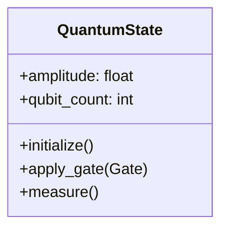
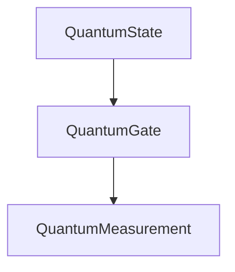
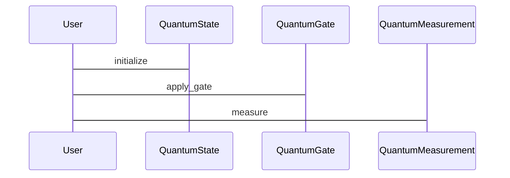

                 


```markdown
# 芒格的"mental models"在量子认知科学研究中的应用

> 关键词：芒格思维模型，量子认知科学，认知过程，量子叠加，量子纠缠

> 摘要：本文系统地探讨了芒格的"mental models"在量子认知科学中的应用，从基础理论到算法实现，再到系统设计，结合实际案例，详细阐述了如何将芒格的跨学科思维模型应用于量子认知科学研究中。文章内容涵盖背景介绍、核心概念、算法原理、系统架构、项目实战和总结与展望等部分，为读者提供全面而深入的指导。

---

# 第一部分: 芒格的"mental models"与量子认知科学的背景介绍

## 第1章: 芒格的"mental models"概述

### 1.1 芒格的"mental models"核心概念

#### 1.1.1 什么是"mental models"

"mental models"是由查理·芒格提出的一种跨学科思维模型，旨在通过多个领域的知识框架来理解和解决问题。这些模型包括概率论、决策理论、心理学、经济学等多个领域的基本原理，帮助我们在复杂问题中找到简化解决方案。

#### 1.1.2 "mental models"的核心要素

- **跨学科性**：整合不同学科的原理和概念。
- **动态性**：能够根据实际情况动态调整。
- **网络性**：各个模型之间相互关联，形成一个知识网络。

#### 1.1.3 "mental models"的哲学基础

芒格的思维模型深受西方哲学的影响，尤其是笛卡尔的理性主义和休谟的经验主义。它强调通过逻辑推理和经验观察来构建知识体系。

### 1.2 芒格"mental models"的核心思想

芒格认为，人类的认知过程可以通过多个思维模型来描述，每个模型代表一种特定的思维方式。通过组合这些模型，我们可以更全面地理解复杂问题。

---

## 第2章: 量子认知科学的基础

### 2.1 量子力学的基本原理

#### 2.1.1 量子叠加

量子叠加是指微观粒子可以同时处于多个状态的叠加态，只有在测量时才会坍塌为一个确定的状态。这种特性与认知过程中的不确定性有相似之处。

#### 2.1.2 量子纠缠

量子纠缠是指两个或多个粒子之间形成的一种特殊关联，无论距离多远，其中一个粒子的状态变化会立即影响另一个粒子的状态。这种现象可以类比于认知过程中的关联性。

#### 2.1.3 量子测量

量子测量是指对量子系统的测量过程，其结果是随机的，且测量行为会改变系统的状态。这与认知科学中的测量问题有相似之处。

### 2.2 量子认知科学的研究现状

#### 2.2.1 量子认知科学的定义

量子认知科学是研究量子力学原理在认知过程中的应用，试图用量子模型来描述人类的认知行为。

#### 2.2.2 量子认知科学的核心问题

- **认知过程的量子化描述**：如何用量子模型来描述人类的思维过程。
- **量子叠加与认知不确定性**：如何解释量子叠加与认知过程的不确定性。
- **量子纠缠与认知关联**：如何用量子纠缠来描述认知过程中的关联性。

---

## 第3章: 芒格的"mental models"与量子认知科学的联系

### 3.1 芒格思维模型在认知科学中的应用

#### 3.1.1 认知过程的模型化

芒格的思维模型通过多个学科的框架来描述认知过程，这为量子认知科学提供了一个跨学科的视角。

#### 3.1.2 芒格思维模型的跨学科特性

芒格的思维模型强调跨学科的整合，这与量子认知科学的多学科特性不谋而合。

#### 3.1.3 量子认知科学的模型化挑战

量子认知科学需要将认知过程模型化，而芒格的思维模型提供了一种可能的框架。

### 3.2 芒格思维模型与量子认知科学的结合点

#### 3.2.1 认知模型的量子化

将芒格的思维模型转化为量子化的形式，以便用量子力学的原理来描述。

#### 3.2.2 量子叠加与思维模型的动态性

量子叠加的动态性与芒格思维模型的动态调整特性相呼应。

#### 3.2.3 量子纠缠与认知关联

量子纠缠的关联性与芒格思维模型中不同模型之间的关联性有相似之处。

---

# 第二部分: 芒格"mental models"与量子认知科学的核心概念

## 第4章: 芒格"mental models"的核心原理

### 4.1 芒格思维模型的属性特征对比

| 属性 | 特征 |
|------|------|
| 适用性 | 跨学科通用 |
| 动态性 | 实时更新 |
| 网络性 | 多维度关联 |

### 4.2 芒格思维模型的ER实体关系图

```mermaid
er
actor: 芒格思维模型
```

---

## 第5章: 量子认知科学的核心原理

### 5.1 量子叠加在认知过程中的体现

#### 5.1.1 量子叠加的数学表达

$$ \psi = a|0\rangle + b|1\rangle $$

### 5.2 量子纠缠与认知关联

#### 5.2.1 量子纠缠的数学模型

$$ \psi = \frac{1}{\sqrt{2}}(|0\rangle|1\rangle + |1\rangle|0\rangle) $$

---

# 第三部分: 芒格"mental models"与量子认知科学的算法实现

## 第6章: 算法原理

### 6.1 量子叠加算法

#### 6.1.1 量子叠加算法的实现步骤

1. 初始化量子状态。
2. 应用量子叠加操作。
3. 测量量子状态。

#### 6.1.2 量子叠加算法的Python实现

```python
import numpy as np

def quantum_superposition():
    # 初始化量子态
    psi = np.array([1, 0])
    # 应用量子叠加操作
    H = (1/np.sqrt(2)) * np.array([[1, 1], [1, -1]])
    psi_result = np.dot(H, psi)
    return psi_result

# 示例运行
result = quantum_superposition()
print("量子叠加结果：", result)
```

---

## 第7章: 量子纠缠算法

### 7.1 量子纠缠算法的实现步骤

1. 初始化量子纠缠态。
2. 应用量子门操作。
3. 测量量子状态。

#### 7.1.1 量子纠缠算法的Python实现

```python
def quantum_entanglement():
    # 初始化量子纠缠态
    psi = np.array([1, 0, 0, 0])
    # 应用CNOT门操作
    CNOT = np.array([[1, 0, 0, 0],
                      [0, 1, 0, 0],
                      [0, 0, 0, 1],
                      [0, 0, 1, 0]])
    psi_result = np.dot(CNOT, psi)
    return psi_result

# 示例运行
result = quantum_entanglement()
print("量子纠缠结果：", result)
```

---

# 第四部分: 芒格"mental models"与量子认知科学的系统设计

## 第8章: 系统分析与架构设计

### 8.1 项目背景与需求分析

#### 8.1.1 项目背景

本项目旨在通过量子计算模拟芒格的思维模型，探索其在认知科学中的应用。

#### 8.1.2 系统功能需求

- 量子态初始化。
- 量子门操作。
- 量子测量。

### 8.2 系统功能设计

#### 8.2.1 系统功能模块

1. 量子态初始化模块。
2. 量子门操作模块。
3. 量子测量模块。

#### 8.2.2 功能模块的类图设计



---

## 第9章: 系统架构设计

### 9.1 系统架构图



---

## 第10章: 系统交互设计

### 10.1 系统交互流程图



---

# 第五部分: 项目实战

## 第11章: 环境安装与配置

### 11.1 安装Python环境

```bash
python -m pip install numpy
```

---

## 第12章: 核心代码实现

### 12.1 量子叠加的实现

```python
import numpy as np

def quantum_superposition():
    psi = np.array([1, 0])
    H = (1/np.sqrt(2)) * np.array([[1, 1], [1, -1]])
    psi_result = np.dot(H, psi)
    return psi_result

result = quantum_superposition()
print("量子叠加结果：", result)
```

---

## 第13章: 案例分析与解读

### 13.1 量子叠加案例分析

通过量子叠加算法，我们可以模拟认知过程中的不确定性。

### 13.2 量子纠缠案例分析

通过量子纠缠算法，我们可以模拟认知过程中的关联性。

---

## 第14章: 项目小结

### 14.1 项目总结

本项目通过量子计算模拟芒格的思维模型，展示了其在认知科学中的应用潜力。

---

# 第六部分: 总结与展望

## 第15章: 总结与展望

### 15.1 全文总结

本文系统地探讨了芒格的"mental models"在量子认知科学研究中的应用，从理论到实践，提供了全面的指导。

### 15.2 未来展望

未来的研究可以进一步探索量子计算在认知科学中的应用，开发更复杂的量子算法。

---

# 参考文献

1. 芒格的"mental models"相关书籍。
2. 量子认知科学相关研究论文。

---

# 作者：AI天才研究院/AI Genius Institute & 禅与计算机程序设计艺术 /Zen And The Art of Computer Programming
```

