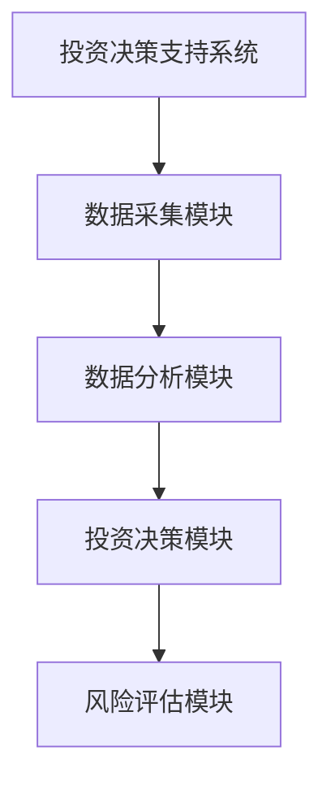
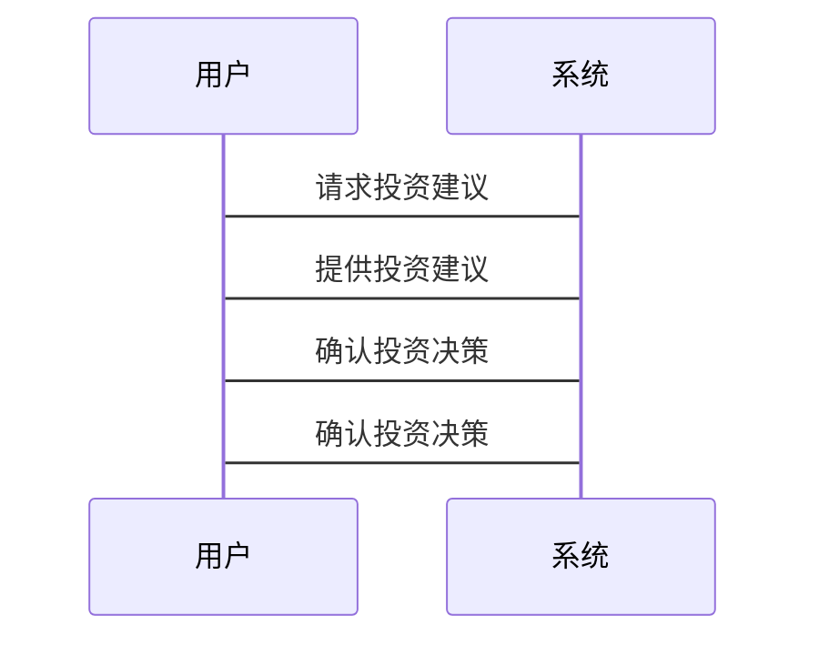

                 


# 芒格的"不做"清单：避免常见投资陷阱

> 关键词：芒格，投资陷阱，不做清单，价值投资，理性决策

> 摘要：本文基于芒格的投资理念，详细分析了常见投资陷阱，并提出了“不做”清单的概念，通过数学模型、系统架构设计和实际案例分析，帮助投资者避免低概率事件、非理性行为等常见陷阱，实现长期稳健的投资回报。

---

## 第一章：投资陷阱概述

### 1.1 投资陷阱的定义与分类

#### 1.1.1 投资陷阱的定义
投资陷阱是指在投资过程中，由于投资者的非理性行为、信息不对称、市场波动等多重因素影响，导致投资者做出错误决策，从而蒙受损失的现象。

#### 1.1.2 常见投资陷阱的分类
根据芒格的理论，投资陷阱可以分为以下几类：
- **低概率事件**：即“富贵险中求”，投资者容易被高概率的表象迷惑，忽略低概率但高风险的事件。
- **非理性行为**：如贪婪、恐惧、从众心理等。
- **过度自信**：投资者认为自己能够预测市场走势，从而做出错误决策。
- **短期波动干扰**：市场短期波动容易让投资者偏离长期投资目标。

#### 1.1.3 投资陷阱的危害与影响
投资陷阱可能导致投资者在短期内遭受重大损失，长期来看，还会破坏投资者的纪律性和信心。此外，频繁的错误决策会增加交易成本，影响投资组合的长期收益。

---

### 1.2 芒格的“不做”清单背景

#### 1.2.1 芒格投资理念的核心思想
芒格的价值投资理念强调“逆向思维”，即在别人贪婪时恐惧，在别人恐惧时贪婪。他主张通过研究企业的基本面，寻找具有长期竞争优势的企业进行投资。

#### 1.2.2 “不做”清单的提出动机
芒格发现，许多投资者因为情绪化、过度自信等原因，常常陷入投资陷阱。为了避免这种情况，他提出了“不做”清单，帮助投资者在决策时排除干扰因素。

#### 1.2.3 清单在投资决策中的作用
“不做”清单通过明确哪些行为是需要避免的，帮助投资者建立纪律性，避免情绪化决策，从而提高投资的成功率。

---

## 第二章：清单中的关键原则

### 2.1 避免低概率事件

#### 2.1.1 低概率事件的定义
低概率事件是指在短时间内发生的概率极低，但一旦发生，可能导致重大损失的事件。

#### 2.1.2 低概率事件对投资的影响
低概率事件虽然发生概率低，但一旦发生，往往会导致投资者的重大损失。例如，黑天鹅事件。

#### 2.1.3 如何识别和避免低概率事件
- **识别**：通过研究历史数据和市场趋势，识别潜在的低概率事件。
- **避免**：在投资决策中，优先考虑高概率、低风险的事件。

### 2.2 避免非理性行为

#### 2.2.1 非理性行为的常见表现
- 贪婪：在市场上涨时过度买入。
- 恐惧：在市场下跌时过度卖出。
- 从众心理：盲目跟随市场潮流。

#### 2.2.2 非理性行为对投资的影响
非理性行为会导致投资者做出错误决策，进而导致投资损失。

#### 2.2.3 理性决策的培养方法
- **学习**：通过学习投资知识，提高理性决策能力。
- **反思**：定期反思自己的投资行为，避免非理性决策。

### 2.3 避免过度自信

#### 2.3.1 过度自信的定义
过度自信是指投资者认为自己能够准确预测市场走势，从而做出过度自信的决策。

#### 2.3.2 过度自信对投资的影响
过度自信会导致投资者过度交易，忽略风险，从而导致投资损失。

#### 2.3.3 如何克服过度自信
- **谦逊**：认识到市场的不可预测性。
- **分散投资**：通过分散投资降低风险。

### 2.4 避免从众心理

#### 2.4.1 从众心理的定义
从众心理是指投资者盲目跟随市场潮流，忽视独立思考。

#### 2.4.2 从众心理对投资的影响
从众心理会导致投资者错失独立思考的机会，进而做出错误决策。

#### 2.4.3 如何独立思考
- **独立研究**：通过独立研究，做出理性决策。
- **避免跟随**：避免盲目跟随市场潮流。

### 2.5 避免短期波动干扰

#### 2.5.1 短期波动的定义
短期波动是指市场在短时间内出现的价格波动。

#### 2.5.2 短期波动对投资的影响
短期波动可能导致投资者偏离长期投资目标。

#### 2.5.3 如何长期坚持投资策略
- **制定计划**：制定长期投资计划，避免短期波动干扰。
- **坚持纪律**：坚持执行投资计划，避免情绪化决策。

---

## 第三章：投资决策中的数学模型与算法

### 3.1 理性决策模型

#### 3.1.1 理性决策模型的定义
理性决策模型是指基于逻辑和事实做出决策的模型。

#### 3.1.2 理性决策模型的数学表达式
$$ V = \sum_{i=1}^{n} w_i x_i $$
其中，\( V \) 表示投资价值，\( w_i \) 表示权重，\( x_i \) 表示指标值。

#### 3.1.3 理性决策模型的优缺点
- **优点**：逻辑清晰，结果客观。
- **缺点**：忽略市场情绪等主观因素。

### 3.2 行为偏差模型

#### 3.2.1 行为偏差模型的定义
行为偏差模型是指基于投资者行为偏差做出决策的模型。

#### 3.2.2 行为偏差模型的数学表达式
$$ B = \sum_{i=1}^{m} \epsilon_i $$
其中，\( B \) 表示行为偏差，\( \epsilon_i \) 表示偏差值。

#### 3.2.3 行为偏差模型的优缺点
- **优点**：考虑了投资者行为偏差。
- **缺点**：难以量化。

### 3.3 综合决策模型

#### 3.3.1 综合决策模型的定义
综合决策模型是指结合理性决策和行为偏差的模型。

#### 3.3.2 综合决策模型的数学表达式
$$ D = V + B $$
其中，\( D \) 表示综合决策，\( V \) 表示理性决策，\( B \) 表示行为偏差。

#### 3.3.3 综合决策模型的应用实例
通过综合决策模型，投资者可以在理性决策的基础上，考虑行为偏差，从而做出更科学的投资决策。

---

## 第四章：投资决策支持系统架构设计

### 4.1 系统功能模块

#### 4.1.1 数据采集模块
负责采集市场数据、公司基本面数据等。

#### 4.1.2 数据分析模块
对数据进行分析，识别投资机会和风险。

#### 4.1.3 投资决策模块
基于分析结果，做出投资决策。

#### 4.1.4 风险评估模块
评估投资决策的风险，制定风险管理策略。

### 4.2 系统架构图



### 4.3 系统交互序列图



---

## 第五章：项目实战

### 5.1 环境安装

#### 5.1.1 安装Python
```bash
python --version
```

#### 5.1.2 安装必要的库
```bash
pip install numpy pandas matplotlib
```

### 5.2 核心实现源代码

#### 5.2.1 数据采集代码
```python
import pandas as pd
import numpy as np

def collect_data():
    # 示例代码，实际需要根据需求修改
    data = pd.DataFrame({'price': np.random.randn(100), 'volume': np.random.randint(1, 100, 100)})
    return data

if __name__ == "__main__":
    collect_data()
```

#### 5.2.2 数据分析代码
```python
import matplotlib.pyplot as plt

def analyze_data(data):
    plt.plot(data['price'])
    plt.xlabel('Time')
    plt.ylabel('Price')
    plt.show()

if __name__ == "__main__":
    data = collect_data()
    analyze_data(data)
```

### 5.3 案例分析

#### 5.3.1 案例背景
假设我们有一个股票数据集，需要分析其价格走势。

#### 5.3.2 数据分析与可视化
通过数据分析代码，我们绘制了股票价格的走势图，识别出价格波动的规律。

#### 5.3.3 投资决策
基于分析结果，我们做出了买入或卖出的决策。

#### 5.3.4 风险评估
评估了投资决策的风险，并制定了风险管理策略。

### 5.4 项目小结

---

## 第六章：最佳实践与小结

### 6.1 最佳实践
- **定期复盘**：定期回顾投资决策，总结经验教训。
- **持续学习**：不断学习投资知识，提升投资能力。
- **保持纪律**：坚持执行投资计划，避免情绪化决策。

### 6.2 小结
芒格的“不做”清单为我们提供了一个避免投资陷阱的框架。通过理性决策、避免非理性行为、克服过度自信、独立思考和长期坚持，我们可以提高投资成功的概率。

### 6.3 注意事项
- **避免短期波动**：短期波动容易干扰投资决策，应保持长期视角。
- **分散投资**：通过分散投资降低风险。
- **独立思考**：避免从众心理，独立思考。

### 6.4 拓展阅读
- 查理·芒格的《巴菲特的普林斯顿评论》
- 《投资学原理》

---

作者：AI天才研究院/AI Genius Institute & 禅与计算机程序设计艺术 /Zen And The Art of Computer Programming

