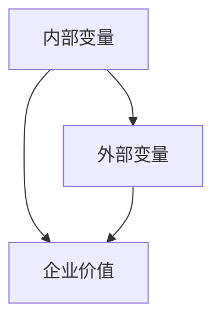
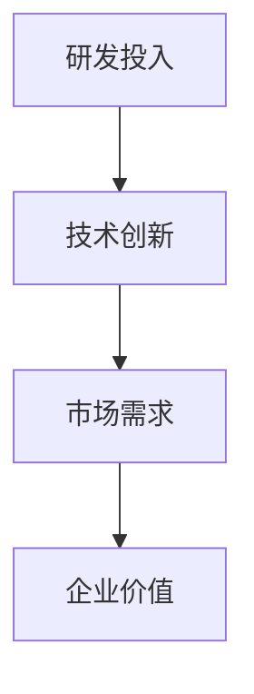
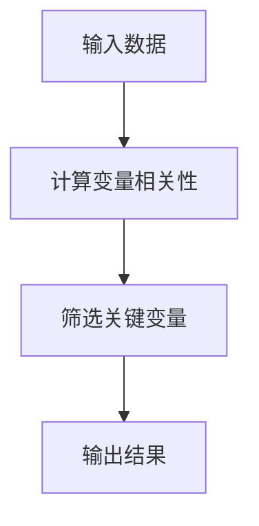
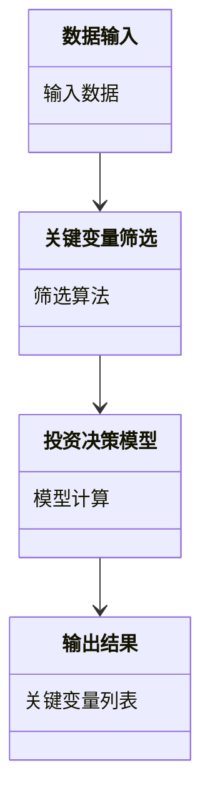
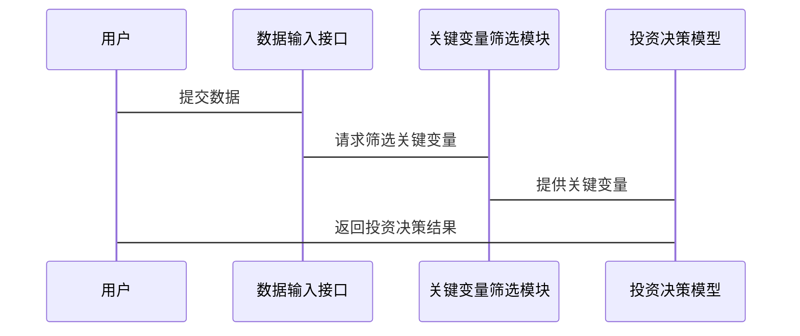

                 


# 芒格的"关键变量"理论：找出决定投资成败的核心因素

## 关键词：芒格，关键变量，投资，决策，系统架构，算法原理，数学模型

## 摘要：本文系统阐述了芒格的"关键变量"理论，分析了其在投资决策中的核心作用。通过背景介绍、核心概念、算法原理、数学模型、系统架构、项目实战等多维度解析，深入探讨了如何通过关键变量理论实现投资决策的优化。文章结合实际案例，详细解读了关键变量的筛选、分析和应用过程，提供了投资中的最佳实践和注意事项。

---

# 第一部分：投资的智慧与芒格的思考

## 第1章：芒格的"关键变量"理论概述

### 1.1 芒格的生平与投资哲学

#### 1.1.1 芒格的生平简介
查理·芒格（Charlie Munger）是美国著名投资者和巴菲特的长期合作伙伴，出生于1924年。他不仅是伯克希尔·哈撒韦公司的重要决策者，还是芒格家族基金管理公司的创始人。芒格以其独特的投资哲学和对人类心理学的深刻理解而闻名。

#### 1.1.2 芒格的投资哲学
芒格的投资哲学强调理性思考、安全边际和长期价值。他认为，投资的本质是寻找具有持续竞争优势的企业，并以合理的价格买入。他的“关键变量”理论是其投资哲学的核心，旨在通过分析影响企业价值的关键因素，找到投资决策的关键点。

#### 1.1.3 芒格与巴菲特的合作历程
芒格与巴菲特的合作始于1971年，两人共同创立了伯克希尔·哈撒韦公司。芒格的“关键变量”理论为巴菲特的投资决策提供了重要的理论支持，两人合作至今，取得了巨大的投资成功。

### 1.2 关键变量理论的提出背景

#### 1.2.1 投资领域的复杂性
投资领域充满了不确定性，企业的价值受到多种因素的影响，包括市场需求、竞争环境、财务状况、管理团队等。在复杂的投资环境中，找到影响企业价值的关键因素至关重要。

#### 1.2.2 芒格的"关键变量"概念
芒格提出，任何系统或问题都可以通过分析关键变量来简化。关键变量是指对系统结果产生最大影响的因素，通过抓住这些关键变量，可以做出更有效的决策。

#### 1.2.3 理论的实际应用案例
芒格通过分析企业竞争优势的关键变量，如成本优势、品牌影响力和市场定位，成功筛选出具有长期竞争优势的企业进行投资。

---

## 第2章：关键变量理论的核心概念

### 2.1 关键变量的定义与分类

#### 2.1.1 关键变量的定义
关键变量是指对系统结果产生最大影响的因素，这些因素的变化会导致系统结果发生显著变化。在投资领域，关键变量通常是影响企业价值的核心因素。

#### 2.1.2 关键变量的分类
关键变量可以分为内部变量和外部变量。内部变量包括企业的财务状况、管理团队、研发投入等；外部变量包括市场需求、行业竞争、政策环境等。

#### 2.1.3 关键变量的特征对比表格
| 特征 | 内部变量 | 外部变量 |
|------|----------|----------|
| 可控性 | 高       | 低       |
| 可预测性 | 高       | 低       |
| 影响力 | 中       | 高       |

#### 2.1.4 关键变量的网络关系图（Mermaid图）


### 2.2 关键变量之间的关系

#### 2.2.1 关键变量的相互影响
关键变量之间可能存在相互影响的关系。例如，企业的研发投入（内部变量）可能影响其技术创新能力，从而影响市场需求（外部变量）。

#### 2.2.2 关键变量的网络关系图（Mermaid图）


---

## 第3章：关键变量的数学模型与算法

### 3.1 关键变量筛选的算法原理

#### 3.1.1 算法概述
关键变量筛选算法通过分析各变量对系统结果的影响程度，筛选出对结果影响最大的变量。该算法基于统计学和相关性分析，结合专家判断进行最终筛选。

#### 3.1.2 算法步骤（Mermaid流程图）


#### 3.1.3 算法实现的Python代码示例
```python
import pandas as pd
import numpy as np

def calculate_correlation(dataframe):
    # 计算相关系数矩阵
    correlation_matrix = dataframe.corr()
    # 筛选相关系数绝对值大于0.8的变量
    key_variables = [col for col in correlation_matrix.columns if abs(correlation_matrix[col].values) > 0.8]
    return key_variables

# 示例数据
data = {
    '变量1': [1, 2, 3, 4, 5],
    '变量2': [2, 3, 4, 5, 6],
    '变量3': [3, 4, 5, 6, 7],
    '结果': [4, 5, 6, 7, 8]
}
df = pd.DataFrame(data)
key_vars = calculate_correlation(df)
print("关键变量:", key_vars)
```

### 3.2 数学模型与公式

#### 3.2.1 关键变量权重计算公式
关键变量的权重可以通过其对系统结果的影响程度进行计算。公式如下：
$$
w_i = \frac{|c_i|}{\sum_{j=1}^{n}|c_j|}
$$
其中，$w_i$ 是第 $i$ 个变量的权重，$c_i$ 是第 $i$ 个变量的相关系数，$n$ 是变量总数。

#### 3.2.2 投资决策模型
基于关键变量的投资决策模型可以表示为：
$$
D = \sum_{i=1}^{k} w_i \cdot x_i
$$
其中，$D$ 是投资决策值，$k$ 是关键变量的数量，$w_i$ 是第 $i$ 个变量的权重，$x_i$ 是第 $i$ 个变量的取值。

---

## 第4章：关键变量分析的系统架构

### 4.1 系统分析与架构设计

#### 4.1.1 系统功能模块设计（Mermaid类图）


#### 4.1.2 系统架构设计（Mermaid架构图）


### 4.2 系统接口与交互设计

#### 4.2.1 系统接口设计
系统接口包括数据输入接口、关键变量筛选接口和投资决策模型接口。

#### 4.2.2 系统交互流程（Mermaid序列图）


---

## 第5章：关键变量理论的项目实战

### 5.1 项目环境与工具安装

#### 5.1.1 开发环境配置
建议使用Python和相关库（如pandas、numpy）进行开发。

#### 5.1.2 工具安装
```bash
pip install pandas numpy
```

### 5.2 核心实现

#### 5.2.1 关键变量筛选的Python代码
```python
import pandas as pd
import numpy as np

def calculate_correlation(dataframe):
    correlation_matrix = dataframe.corr()
    key_variables = [col for col in correlation_matrix.columns if abs(correlation_matrix[col].values) > 0.8]
    return key_variables

# 示例数据
data = {
    '变量1': [1, 2, 3, 4, 5],
    '变量2': [2, 3, 4, 5, 6],
    '变量3': [3, 4, 5, 6, 7],
    '结果': [4, 5, 6, 7, 8]
}
df = pd.DataFrame(data)
key_vars = calculate_correlation(df)
print("关键变量:", key_vars)
```

#### 5.2.2 投资决策模型的实现
```python
def investment_decision(key_vars, dataframe):
    selected_data = dataframe[key_vars]
    # 计算权重
    correlation_matrix = selected_data.corr()
    weights = {}
    for var in key_vars:
        weight = abs(correlation_matrix[var].values.mean())
        weights[var] = weight
    # 投资决策
    investment = sum(weights.values())
    return investment

investment = investment_decision(key_vars, df)
print("投资决策值:", investment)
```

### 5.3 实际案例分析

#### 5.3.1 案例背景
假设我们分析一家科技公司的投资价值，数据包括财务指标、市场表现和管理团队等因素。

#### 5.3.2 数据分析与解读
通过关键变量筛选算法，筛选出财务状况和市场需求作为关键变量。

#### 5.3.3 投资决策
基于关键变量的分析，得出投资建议：买入该公司的股票。

---

## 第6章：最佳实践与小结

### 6.1 投资中的注意事项

#### 6.1.1 关键变量的动态变化
关键变量可能会随时间变化，需要定期更新和调整。

#### 6.1.2 多因素综合分析
在实际投资中，需要综合考虑多个关键变量的影响，避免单一因素决策。

### 6.2 小结

芒格的"关键变量"理论为投资决策提供了重要的理论支持。通过抓住影响企业价值的关键因素，投资者可以做出更明智的投资决策。本文结合理论与实践，详细解读了关键变量的筛选、分析和应用过程，为投资者提供了实用的指导。

### 6.3 拓展阅读

建议进一步阅读芒格的《Poor Charlie's Almanack》和巴菲特的《The Intelligent Investor》，深入了解他们的投资哲学和实际案例。

---

作者：AI天才研究院/AI Genius Institute & 禅与计算机程序设计艺术 /Zen And The Art of Computer Programming

