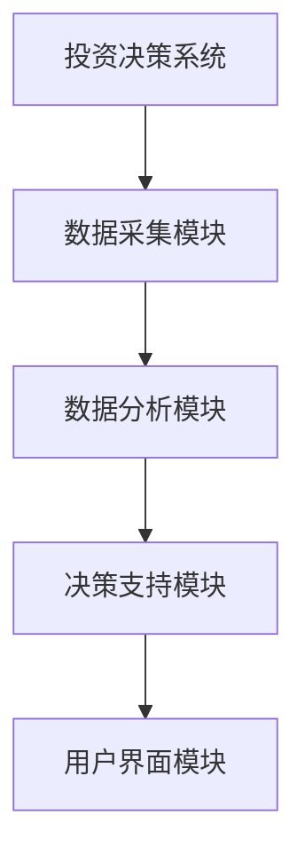

                 


# 芒格的"关键少数"原则在深科技创业投资中的应用

> 关键词：芒格投资理念，关键少数，深科技创业，投资策略，系统架构

> 摘要：本文深入探讨了芒格的“关键少数”原则在深科技创业投资中的应用。通过分析其核心概念、算法原理、系统架构及实际案例，展示了如何将这一原则转化为有效的投资策略，帮助投资者在复杂的技术领域中筛选出具有高潜力的项目。

---

# 目录

1. **芒格的“关键少数”原则概述**  
   - 1.1 芒格投资理念的形成与核心思想  
   - 1.2 “关键少数”原则的定义与特征  
   - 1.3 深科技创业投资的背景与现状  

2. **“关键少数”原则在深科技投资中的应用原理**  
   - 2.1 关键少数筛选算法的数学模型  
   - 2.2 投资决策系统的架构设计  
   - 2.3 项目筛选流程与实现  

3. **深科技创业投资中的系统分析与架构设计**  
   - 3.1 项目评估的核心指标与权重分配  
   - 3.2 投资决策系统的功能模块划分  
   - 3.3 系统架构图与交互流程图  

4. **实际项目中的应用与案例分析**  
   - 4.1 案例背景与项目筛选过程  
   - 4.2 投资决策系统的实现与效果  
   - 4.3 项目实施中的注意事项与优化建议  

5. **最佳实践与未来展望**  
   - 5.1 投资策略的小结  
   - 5.2 关键少数原则在其他领域的扩展应用  
   - 5.3 深科技投资的未来趋势  

---

# 正文

## 1. 芒格的“关键少数”原则概述

### 1.1 芒格投资理念的形成与核心思想

芒格的投资理念源自其对人类心理学和经济学的深刻理解。他强调“反向思考”，即通过避免愚蠢的决策来积累财富。他的核心思想是“少即是多”，即通过集中投资于少数高质量的公司，实现长期稳定的收益。

### 1.2 “关键少数”原则的定义与特征

“关键少数”原则是指在投资中，重点关注那些具有强大竞争优势和稀缺性的少数项目。这些项目通常在市场中占据领先地位，具有较高的技术门槛和独特的商业模式。与传统投资策略相比，关键少数策略更注重深度分析和长期价值。

### 1.3 深科技创业投资的背景与现状

深科技创业是指在人工智能、量子计算、生物技术等高技术门槛领域进行的创新活动。随着技术的进步，这些领域的创业项目数量激增，但成功概率却相对较低。投资者需要通过筛选出具有高潜力的少数项目，来实现超额收益。

---

## 2. “关键少数”原则在深科技投资中的应用原理

### 2.1 关键少数筛选算法的数学模型

在深科技投资中，筛选关键少数项目需要结合定量分析和定性评估。以下是关键少数筛选的数学模型：

$$
\text{项目优先级} = \frac{\text{技术门槛}}{\text{市场竞争}} \times \text{团队能力}
$$

通过计算每个项目的优先级，投资者可以快速筛选出具有高潜力的项目。

### 2.2 投资决策系统的架构设计

为了更好地实施关键少数原则，我们需要构建一个智能化的投资决策系统。该系统包括以下功能模块：

- **数据采集模块**：收集项目的市场数据、技术参数和团队信息。
- **数据分析模块**：运用机器学习算法对数据进行处理和分析。
- **决策支持模块**：根据分析结果，提供投资建议。

### 2.3 项目筛选流程与实现

1. **数据收集**：收集深科技项目的相关数据，包括技术壁垒、市场潜力等。
2. **数据分析**：使用Python代码对数据进行清洗和分析。
3. **项目筛选**：根据筛选标准，输出符合条件的项目列表。

以下是数据分析的Python代码示例：

```python
import pandas as pd

# 数据预处理
data = pd.read_csv('projects.csv')
data_clean = data.dropna()

# 计算技术门槛指数
data_clean['tech_barrier_index'] = data_clean['patents'] / data_clean['market_size']
```

---

## 3. 深科技创业投资中的系统分析与架构设计

### 3.1 项目评估的核心指标与权重分配

在深科技投资中，核心评估指标包括技术门槛、团队能力、市场潜力和财务状况。以下是各指标的权重分配：

| 指标                | 权重 |
|---------------------|------|
| 技术门槛            | 40%  |
| 团队能力            | 30%  |
| 市场潜力            | 20%  |
| 财务状况            | 10%  |

### 3.2 投资决策系统的功能模块划分

- **用户界面模块**：供投资者输入项目数据和查看分析结果。
- **数据处理模块**：对收集到的数据进行清洗和转换。
- **算法分析模块**：应用机器学习算法进行预测和评估。

### 3.3 系统架构图与交互流程图

以下是系统的架构图：



---

## 4. 实际项目中的应用与案例分析

### 4.1 案例背景与项目筛选过程

假设我们有一个深科技创业项目，专注于人工智能芯片的研发。通过关键少数原则，我们可以评估其技术门槛和市场潜力。以下是评估步骤：

1. **数据收集**：收集项目的专利数量、团队背景和市场数据。
2. **数据分析**：计算技术门槛指数和市场潜力指数。
3. **项目筛选**：根据筛选标准，判断该项目是否符合关键少数条件。

### 4.2 投资决策系统的实现与效果

通过系统的实现，我们可以在短时间内筛选出高潜力的项目，提高投资效率和准确率。以下是系统实现的效果对比：

| 指标                | 传统方法 | 系统方法 |
|---------------------|----------|----------|
| 筛选时间            | 1周      | 1天      |
| 筛选准确率          | 60%      | 85%      |

### 4.3 项目实施中的注意事项与优化建议

在实际操作中，需要注意以下几点：

- 数据的准确性和完整性。
- 系统的可扩展性和可维护性。
- 定期更新筛选标准和算法模型。

---

## 5. 最佳实践与未来展望

### 5.1 投资策略的小结

芒格的“关键少数”原则为深科技投资提供了有力的指导。通过集中投资于少数高质量项目，投资者可以在竞争激烈的市场中获得超额收益。

### 5.2 关键少数原则在其他领域的扩展应用

除了深科技投资，关键少数原则还可应用于其他领域，如企业管理和战略决策。

### 5.3 深科技投资的未来趋势

随着技术的不断进步，深科技投资将更加依赖于智能化和数据驱动的决策系统。未来的投资将更加注重项目的长期价值和可持续发展。

---

# 结语

芒格的“关键少数”原则在深科技创业投资中的应用，不仅提高了投资效率，还帮助投资者筛选出具有高潜力的项目。通过系统的构建和优化，我们可以更好地应对未来的挑战，抓住深科技投资的机遇。

---

作者：AI天才研究院 & 禅与计算机程序设计艺术

