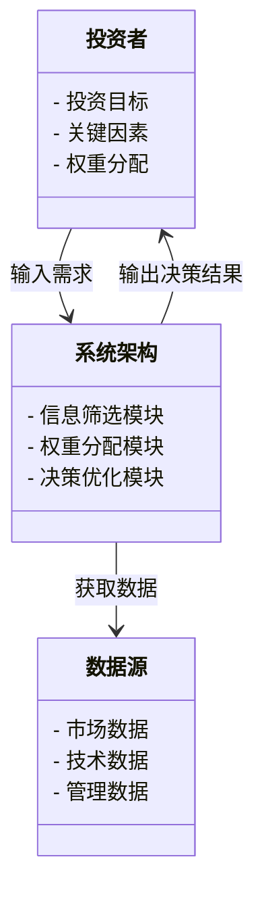
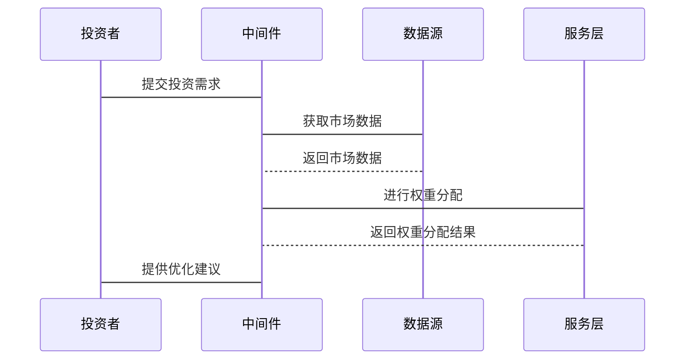

                 


# 芒格的"关键少数"原则在科技独角兽投资中的应用

> 关键词：芒格，关键少数，科技独角兽，投资，系统架构

> 摘要：本文详细探讨了芒格的“关键少数”原则在科技独角兽投资中的应用，从理论基础到实际操作，结合具体案例和系统架构设计，全面分析了如何利用这一原则优化投资决策，降低风险，提高投资回报。

---

## 第1章: 芒格的关键少数原则概述

### 1.1 芒格的关键少数原则

#### 1.1.1 关键少数原则的定义
芒格的“关键少数”原则，也称为“少数人原则”，是一种投资哲学，强调在决策过程中关注少数关键因素，而非被大量无关信息干扰。其核心在于通过筛选关键少数因素来优化决策质量。

$$ \text{关键少数原则} = \text{少数关键因素} \times \text{高权重权重} $$

#### 1.1.2 关键少数原则的核心要素
- **关键因素识别**：筛选出影响投资决策的核心因素。
- **权重分配**：对关键因素赋予更高的权重，降低次要因素的影响。
- **决策优化**：通过聚焦关键少数因素，提升决策效率和准确性。

#### 1.1.3 关键少数原则的哲学基础
芒格认为，投资决策的关键在于聚焦少数核心要素，而非追求全面性。这种哲学基于“少即是多”的理念，强调通过简化决策过程来提高决策质量。

### 1.2 科技独角兽的定义与特点

#### 1.2.1 科技独角兽的定义
科技独角兽是指在科技领域估值超过10亿美元的初创公司，通常具备高增长潜力和颠覆性创新能力。

#### 1.2.2 科技独角兽的核心特征
- **技术创新性**：具备革命性技术或商业模式。
- **高增长潜力**：年增长率通常超过30%。
- **稀缺性**：市场中罕见的高潜力企业。

#### 1.2.3 科技独角兽的市场地位与影响
科技独角兽通常在各自领域占据领先地位，能够对行业格局产生深远影响。

### 1.3 芒格的关键少数原则与科技独角兽投资的契合点

#### 1.3.1 关键少数原则在投资中的应用价值
- **简化决策过程**：通过聚焦关键因素，减少决策复杂性。
- **提高决策质量**：通过权重分配，优先考虑高影响因素。

#### 1.3.2 科技独角兽投资的特殊性与挑战
- **高风险高回报**：科技独角兽的投资风险较高，但潜在回报巨大。
- **信息不对称**：投资者需要具备深度行业知识和洞察力。

#### 1.3.3 本章小结
芒格的关键少数原则为科技独角兽投资提供了简洁有效的决策框架，帮助投资者在复杂市场中抓住高潜力机会。

---

## 第2章: 关键少数原则的理论基础与投资策略

### 2.1 关键少数原则的理论基础

#### 2.1.1 投资决策中的信息筛选与权重分配
在投资决策中，信息筛选是关键。通过权重分配，投资者可以将注意力集中在少数高影响因素上。

$$ \text{权重分配公式} = \frac{\text{因素的重要性}}{\sum \text{所有因素的重要性}} $$

#### 2.1.2 关键少数原则的数学模型与公式
以下是一个简化的关键少数原则数学模型：

$$ \text{关键因素} = \{x_1, x_2, ..., x_n\} $$
$$ \text{权重} = \{w_1, w_2, ..., w_n\} $$
$$ \text{最终评分} = \sum_{i=1}^{n} x_i \times w_i $$

#### 2.1.3 关键少数原则的逻辑框架
- **信息筛选**：识别影响投资决策的关键因素。
- **权重分配**：对关键因素赋予更高的权重。
- **决策优化**：通过聚焦关键因素，优化投资决策。

### 2.2 科技独角兽投资的核心要素分析

#### 2.2.1 技术创新的核心性
技术创新是科技独角兽的核心驱动力。投资者需要评估企业的技术创新能力及其在行业中的领先地位。

#### 2.2.2 市场潜力的评估标准
市场潜力包括市场规模、增长速度和竞争环境等因素。投资者需要评估企业的市场定位和潜在增长空间。

#### 2.2.3 管理团队的关键作用
管理团队的能力和经验对企业的成功至关重要。投资者需要评估团队的凝聚力、战略眼光和执行能力。

### 2.3 关键少数原则在投资策略中的应用

#### 2.3.1 投资决策的简化与聚焦
通过关键少数原则，投资者可以将注意力集中在少数关键因素上，简化决策过程。

#### 2.3.2 关键少数原则的权重分配
在权重分配中，技术创新、市场潜力和管理团队通常被视为高权重因素。

#### 2.3.3 投资组合的优化与风险控制
通过聚焦关键因素，投资者可以优化投资组合，降低风险，提高回报率。

---

## 第3章: 关键少数原则在科技独角兽投资中的具体应用

### 3.1 科技独角兽投资的关键要素识别

#### 3.1.1 技术创新的评估标准
- 技术的创新性
- 技术的商业化潜力
- 技术的壁垒高度

#### 3.1.2 市场需求的判断方法
- 市场规模
- 市场增长潜力
- 市场竞争格局

#### 3.1.3 管理团队的评估维度
- 团队的经验与能力
- 团队的凝聚力与协作能力
- 团队的愿景与战略

### 3.2 关键少数原则在投资决策中的实施步骤

#### 3.2.1 确定关键少数原则的应用范围
- 明确投资目标
- 确定关键因素
- 设定权重分配

#### 3.2.2 信息筛选与权重分配
- 筛选关键因素
- 赋予权重
- 计算最终评分

#### 3.2.3 投资决策的最终优化
- 根据评分结果优化决策
- 定期复评估
- 动态调整权重

### 3.3 实际案例分析

#### 3.3.1 某科技独角兽企业的投资分析
以某人工智能初创公司为例，分析其技术创新、市场潜力和管理团队等因素。

#### 3.3.2 关键少数原则在案例中的具体应用
通过关键少数原则，识别出技术创新和市场需求作为高权重因素，评估企业的投资价值。

#### 3.3.3 投资结果与经验总结
总结投资结果，分析关键少数原则在实际应用中的效果和经验教训。

---

## 第4章: 系统分析与架构设计方案

### 4.1 问题场景介绍
科技独角兽投资涉及复杂的信息筛选和权重分配过程，需要构建高效的系统架构来支持决策。

### 4.2 系统功能设计

#### 4.2.1 领域模型（Mermaid类图）


### 4.3 系统架构设计（Mermaid架构图）
```mermaid
archi
    客户端 --> 中间件
    中间件 --> 数据库
    中间件 --> API网关
    API网关 --> 服务层
    服务层 --> 存储层
```

### 4.4 系统接口设计
- **输入接口**：接收投资者的需求和数据源。
- **输出接口**：提供决策结果和优化建议。

### 4.5 系统交互（Mermaid序列图）


---

## 第5章: 项目实战

### 5.1 环境安装
- **工具安装**：安装Python、Jupyter Notebook、Mermaid等工具。
- **依赖安装**：安装必要的库，如Pandas、Matplotlib等。

### 5.2 核心代码实现

#### 5.2.1 数据预处理代码
```python
import pandas as pd

# 加载数据
data = pd.read_csv('unicorn_data.csv')

# 数据清洗
data = data.dropna()
```

#### 5.2.2 权重分配代码
```python
def calculate_weight(factors, weights):
    return sum(factors[i] * weights[i] for i in range(len(factors)))

# 示例权重分配
factors = [0.8, 0.6, 0.5]
weights = [0.3, 0.5, 0.2]
print(calculate_weight(factors, weights))
```

#### 5.2.3 投资决策优化代码
```python
def optimize_decision(data, weights):
    return data.dot(weights)

# 示例优化
data = pd.DataFrame({
    '技术创新': [0.8, 0.6, 0.5],
    '市场潜力': [0.7, 0.6, 0.4],
    '管理团队': [0.9, 0.8, 0.7]
})

weights = [0.3, 0.5, 0.2]
print(optimize_decision(data, weights))
```

### 5.3 案例分析
- **案例选择**：选择一家科技独角兽企业作为分析对象。
- **数据分析**：基于权重分配模型，分析企业的投资价值。
- **结果解读**：解读分析结果，提供投资建议。

### 5.4 项目总结
- **项目成果**：总结项目的实施成果。
- **经验总结**：总结项目中的经验和教训。
- **未来展望**：展望未来可能的应用和发展。

---

## 第6章: 最佳实践与总结

### 6.1 总结与回顾
- 本章总结了关键少数原则在科技独角兽投资中的应用，强调了其在简化决策和提高投资回报中的重要作用。

### 6.2 投资策略建议
- 建议投资者在实际操作中灵活应用关键少数原则，结合市场变化和企业实际情况进行动态调整。

### 6.3 未来展望
- 随着科技的发展，关键少数原则在投资中的应用将更加广泛和深入，尤其是在人工智能和大数据时代，其价值将更加凸显。

---

## 作者：AI天才研究院/AI Genius Institute & 禅与计算机程序设计艺术 /Zen And The Art of Computer Programming

